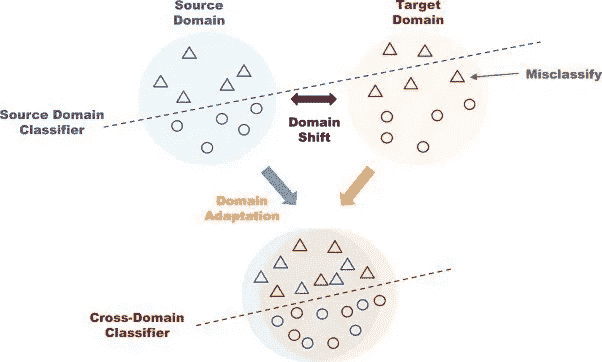

# 通过玩电子游戏预防死亡事故(第一部分)

> 原文：<https://medium.com/analytics-vidhya/preventing-fatalities-by-playing-video-games-part-1-4948d1da390e?source=collection_archive---------21----------------------->

又名用虚拟世界训练自动驾驶

自动驾驶汽车应该已经在这里了，但还没有到来，即使特斯拉(Tesla)的最新版本 FSD 测试版现在似乎非常接近成功。
在这一系列文章中，我们试图了解为什么**建立自动驾驶系统**和**如何使用“电子游戏”加快**这一进程**如此困难和耗时。**

eep 学习系统从例子中学习，即从输入/输出对中学习。在视觉系统的特定情况下，这些对由输入中的*图像和输出*中的*结构化数据表示。输入图像很容易生成，因为它们不亚于车载摄像机的帧。另一方面，参考输出数据(所谓的“地面实况”)的生成要昂贵得多，因为它必须手动完成。
例如，对于**“语义分割”**任务，每个图像的像素必须被分配到一个类别。换句话说，训练视频的每一帧必须用对应于特定像素类(行人、交通灯、树)的颜色手工着色。
当系统必须识别图像的对象或特征时，语义分割是特别必要的，这些对象或特征不具有先验确定的形状，或者从机载摄像机的角度来看不具有由透视变形引起的强烈变形。*

[ICNet 在 cityscapes 数据集上的演示视频](https://www.youtube.com/watch?v=qWl9idsCuLQ&ab_channel=HengshuangZhao)

训练一个人工智能系统来解决语义任务需要成千上万的这些标记帧来捕捉大量不同的情况。除此之外，对于任何单帧图像来说，标记过程可能需要**长达一个小时**，这使得收集必要的数据变得不切实际且成本高昂。

> 那么，为什么不用合成图像来加速这个过程呢？

## 可能吗？

来源:[知道你的热图](https://knowyourmeme.com/memes/well-yes-but-actually-no)

好消息是，我们可以使用物理模拟器来生成自动标记的逼真图像。坏消息是，不可能产生完美的图像，因此，在像素级别，颜色、反射和亮度可能会发生剧烈变化。
我们在这里展示一个真实图像和合成图像的例子:

顶部的图像来自一个真实的城市[数据集](https://www.researchgate.net/publication/319056828_Semantic_Video_CNNs_through_Representation_Warping)；底部的一个来自视频游戏 GTA 5 [数据集](https://download.visinf.tu-darmstadt.de/data/from_games/)。

## 为什么这应该是一个问题？

即使该系统在合成数据上工作良好，它也不会在真实道路上保持相同的性能；它缺乏泛化能力。

我们可以想象一个学生在准备考试的时候，在不理解指导他们的理论的情况下，通过“背诵”许多练习。在考试阶段，他不会解决稍微不同或从不同角度设置的问题:他将无法适应新的情况(新的领域)，因为他还没有获得概括的能力。
更专业地说，**域转移**是算法的训练数据集和部署时遇到的数据集之间的数据分布变化，**域适应**是管理这种情况的能力。

来源:[滚动轴承故障诊断的多层域自适应方法](https://www.sciencedirect.com/science/article/abs/pii/S0165168418303967)

## 如何理解模型运行得有多好？

一旦模型被训练成在从未见过的图像上自动再现标记过程，我们需要评估它。换句话说，我们需要一个指标来表明模型重新创建标签的能力。

语义分割任务最常用的度量是联合的交集(IoU)。这个想法是为了最大化预测和实际情况重叠的区域。

**并集上的交集** (IoU)

我邀请您阅读 Ekin Tiu 的[“评估您的语义细分模型的指标”，了解不同可用指标的更多详细信息。](https://towardsdatascience.com/metrics-to-evaluate-your-semantic-segmentation-model-6bcb99639aa2)

另一个很好的来源是杰瑞米·乔登的文章，我从这篇文章中得到了这张图片。

IoU 的值在 0 和 1 之间，其中 0 是最差的情况，完全没有重叠，而 1 是理想的分段。
对于自动驾驶任务，需要同时识别很多类别。因此，对于他们每个人，我们分别计算 IoU 分数，然后对所有班级的结果进行平均。全局获得的值称为**并集上的平均交集(MIoU)** 。

## 那么，我们做了什么？

现在我们有了描绘潜在解决方案的所有要素。我们尝试了两种基于**生成对抗网络(GANs)** 的不同方法。

**像素级调整:**这里，我们将真实图像的风格转移到合成图像上，减少像素级的差异(如颜色、饱和度、亮度……)。

**特征级自适应:**在这里，我们直接与模型一起工作，并且我们找到了一种直接用合成的和未标记的图像来训练它的方法。

详情请看我的下一篇文章: [**通过玩电子游戏预防死亡事故(第二部分)**](/@enrico.busto/preventing-fatalities-by-playing-video-games-part-2-4e525dcf02e6)