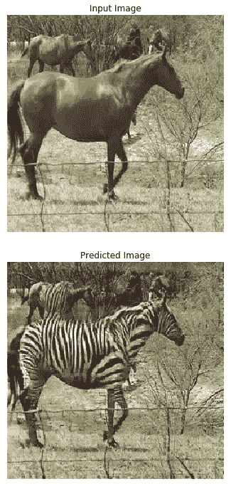
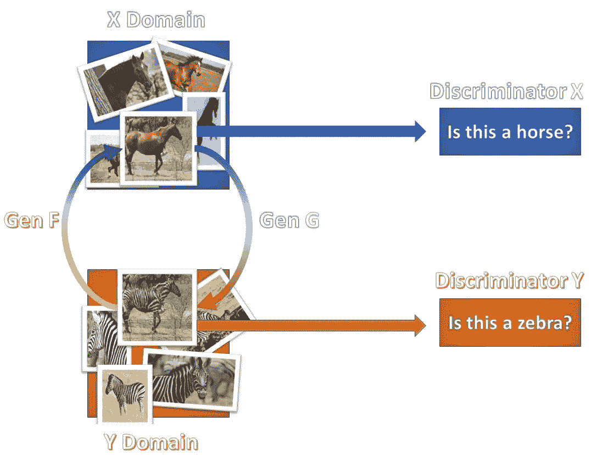
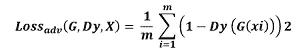
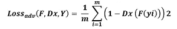
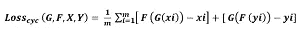
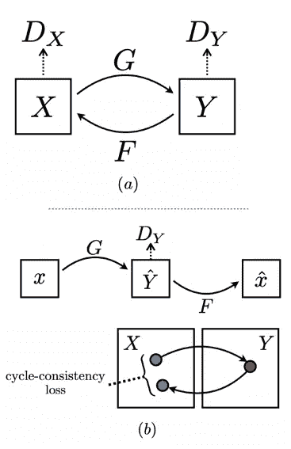
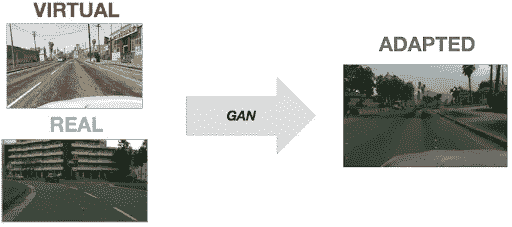
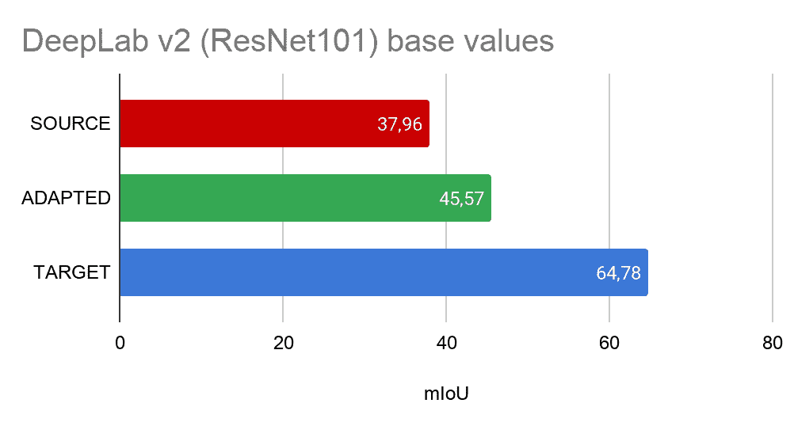

# 通过玩电子游戏预防死亡(第二部分)

> 原文：<https://medium.com/analytics-vidhya/preventing-fatalities-by-playing-video-games-part-2-4e525dcf02e6?source=collection_archive---------22----------------------->

又名用虚拟世界训练自动驾驶

在[之前的文章](/@enrico.busto/preventing-fatalities-by-playing-video-games-part-1-4948d1da390e)中，我提出了训练自动驾驶系统的一些挑战以及克服这些挑战的两种方法:**像素级自适应**和**特征级自适应**，这两种方法都基于生成对抗网络。本文将解释它们是如何工作的，并展示我们的实验结果。

# 像素级适应

第一种方法基于 GAN 的一种特殊架构，称为**循环 Gan** 。该模型可以从一组图像中捕获主要的风格特征，然后将它们应用于来自另一个领域的另一个图像集合。例如，您可以为模型提供两组图像。第一个包含马的照片，第二个包含斑马的照片。然后，您可以训练模型用斑马条纹给马的身体重新着色。

[来源:CycleGAN 教程](https://www.tensorflow.org/tutorials/generative/cyclegan)

该 cycle-gan 架构由 4 个子模块组成:**两个发生器和两个鉴别器**。训练过程分为两个迭代阶段:在第一阶段，我们训练鉴别器模型，在第二阶段，训练发生器模型。

*训练鉴别器模型，以识别所提供的图像是否来自在*上对其进行训练的图片集。我们训练两个鉴别器模型，分别用于两组照片中的每一组。

保持前面的斑马/马的例子，第一个鉴别器必须指示照片是否包含马。另一方面，另一个鉴别器，如果它包含斑马。鉴别器模型是一个简单的卷积神经网络(CNN)。

相反，*两个发生器的目标都是产生给定输入图像的新版本，该版本必须足够逼真以欺骗对手鉴别器*。发生器被实现为**可变自动编码器(VAE)** 。

现在我们已经定义了生成器架构，我们需要定义它的行为。我们有两个主要目标。*第一个是忽悠鉴别者*。为了达到这个结果，我们使用了一个称为**对抗性损失**的损失公式:

*复制对方领域的风格是不够的*。第二个生成器的目标是维护原始图像的内容。
当第一个生成器接收到一个图像输入并产生另一个图像作为输出时，这个新图像将被用作来自第二个生成器的输入，第二个生成器重新创建第一个生成器的原始输入。我们通过添加另一个称为**周期损耗**的损耗来获得这个结果。

[来源:循环一致对抗网络的温和介绍](https://towardsdatascience.com/a-gentle-introduction-to-cycle-consistent-adversarial-networks-6731c8424a87)

这种损失背后的直觉是，它迫使生成器创建一个足够真实的新图像来欺骗鉴别器，同时保留来自原始输入的足够信息，以允许第二个生成器重新创建初始输入。

## 第一次实验

我们已经创建了一个由真实图像和合成图像组成的新数据集。真实的图像来自 **Cityscapes 数据集**，而其他图像来自一款名为 **GTA V** 的视频游戏。
然后，我们使用循环 gan 将真实图像样式应用到合成图像中。

对于我们的实验，**我们在 GTA V 数据集**上训练了一个 DeepLab V2 模型，并且我们在 **Cityscape 测试集**上进行了测试。我们称这个实验为“源”，我们得到了 37，960 万的分数。

然后，我们在 GTA V 数据集的改编版本上重新训练了相同的网络，获得了 45.57% MIoU 的分数。我们称第二个测试为“适应”。

为了量化改进，我们进行了**最终测试**。我们已经直接用 cityscape 数据集对模型进行了重新训练，并在 cityscape 测试集上进行了测试。我们获得了 64.78%的结果。

*使用 Cycle-gan 进行域自适应，相对于仅使用来自原始域的数据，我们获得了大约 20%的分类性能提升。*

查看我的下一篇文章: [**【第三部分】**](/@enrico.busto/preventing-fatalities-by-playing-video-games-part-3-31761eeb2931)**看看我们从特征级适应实验中得到的结果**