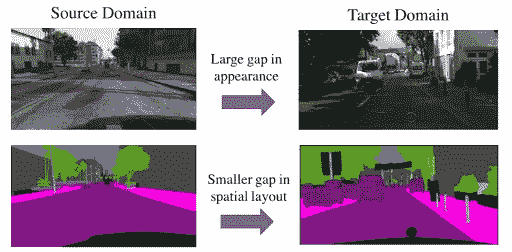
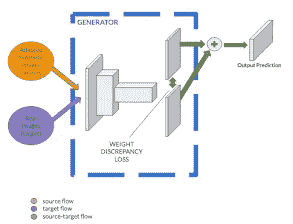
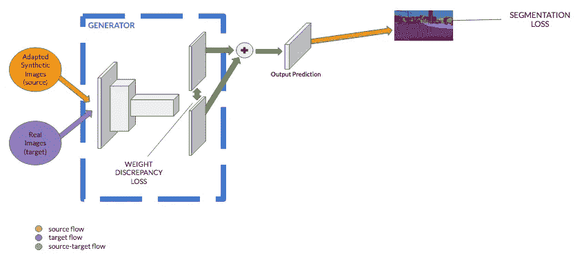
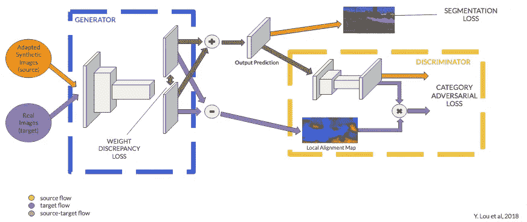
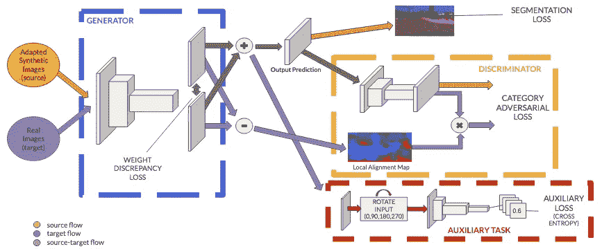
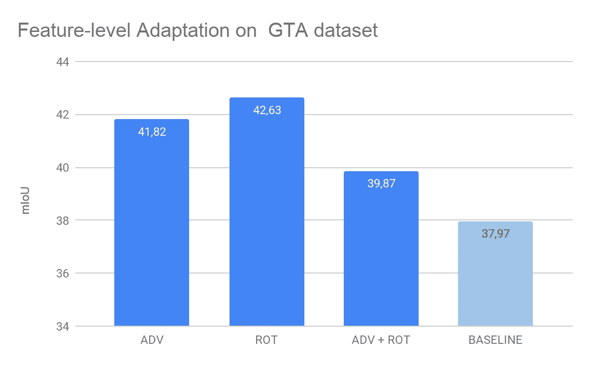
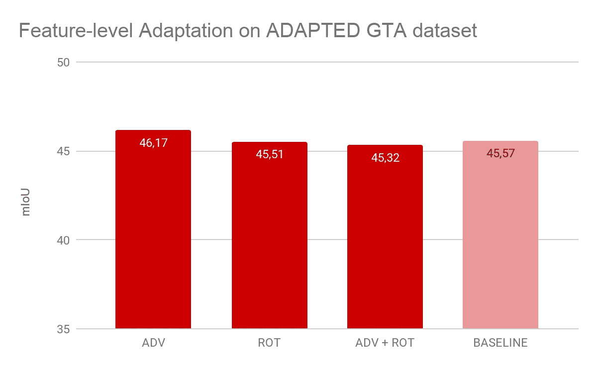

# 通过玩电子游戏预防死亡事故(第三部分)

> 原文：<https://medium.com/analytics-vidhya/preventing-fatalities-by-playing-video-games-part-3-31761eeb2931?source=collection_archive---------23----------------------->

又名用虚拟世界训练自动驾驶

本系列的前两篇文章提出了训练自动驾驶系统的一些挑战和首先要克服的方法:**像素级适应**。今天我们将看到第二种方法:**特征级适应**。

# 特征级适应

该方法基于添加基于分割模型欺骗用标记数据训练的鉴别器的能力的损失。*如果模型可以做到这一点，即使是以前从未见过的图像，它也学会了产生非常逼真的结果。*

而且，这种训练也有助于减少畴变。*我们不是在像素空间中工作，而是对各自的分割版本进行操作，以最小化两幅图像之间的差异。分割过程切断了许多细节，如亮度或颜色，只保留了语义信息。这允许我们*向鉴别器提供来自其他域的图像的分割版本*。*

[来源:学习调整结构化输出空间进行语义分割](http://Learning to Adapt Structured Output Space for Semantic Segmentation)

现在，让我们详细了解一下本实验中使用的网络架构:

该架构由一个分段网络(我们称之为生成器)和一个鉴别器组成。一个特征提取器和两个分类器组成了生成器。输入图像的分割由两个分类器的集成预测产生。我们使用这个预测来产生所有的三个模型损失。

## 分割损失

第一个是分割损失，并根据数据集中的地面实况标签进行计算。

## 类别对抗性损失

因为我们没有足够的标签来完全训练生成器，所以我们也使用未标记的图像。出于这个原因，我们可以根据鉴别者区分生成者的分段和真实分段的能力来计算类别对抗性损失。

*没有对所有预测像素统一计算对抗性损失*:我们希望惩罚预测最不确定的区域。这些区域显示在**本地分配图**中。

我们使用两个分类器预测来创建这个图:预测分歧越大，模型越不确定。

## 辅助损失

上述架构在文献中已经有，称为**类别级对抗性网络(氏族)**。

我们扩展了这个模型，增加了一个辅助网络来解决自我监督任务。

更准确地说，已经表明解决辅助任务，例如识别图像的方向，提高了学习模型的泛化能力。这项任务不需要手动注释:这是一种自我监督的方法。

缩放到平方分辨率后，分段的输出预测会随机旋转 90 度的倍数。辅助网络的任务是猜测印象中的旋转。所产生的误差被称为辅助损失，并且一旦向后传播，就提高了由编码器提取的特征的一般化，使得它们在空间中不变。

## 实验

我们假设**基线**是通过使用源数据集上的标准参数训练基本分割模型(DeepLab v2 ),在没有域适应技术的情况下，在城市景观的验证集上计算的 MIoU 的最佳值。

有了这个基线，我们得到的 **MIoU 为 37.97** 。

对于第一个实验，我们训练了原始的类别级对抗网络；换句话说，我们移除了自我监督模块。
**仅使用对抗性损失**，我们获得了 41.82 的 **MIoU。**

然后我们单独测试了**图像旋转方法**，我们得到了一个 42.63 的 **MIoU。**

最后，我们测试了**完整架构**，我们获得了 39.87 的 **MIoU。**

*从这个实验中，我们可以得出结论，即使所有的方法都克服了基线，自我监督的任务比对抗的方法更有效。*

## 最终实验

最后，我们将这两种方法结合起来:我们将最终的架构应用于适应了 Cycle-gan 的数据集。
我们使用像素级自适应方法获得的最佳结果作为基线，并重新创建三个实验。

## 结论

总之，我们的实验表明，对于我们实验中使用的数据集，像素级自适应技术比特征级自适应更有效和更有前途。

从这些技术的组合中，有可能获得类似于现有技术的结果

此外，已经表明，利用有限数量的真实标记数据，合成数据可以帮助语义分割网络的一般化。