# 日常幻想体育竞赛中的价格歧视(使用 Python)

> 原文：<https://medium.com/analytics-vidhya/price-discrimination-in-daily-fantasy-sports-contests-using-python-4ec8f6ec986c?source=collection_archive---------13----------------------->

即使在大封锁中，每日幻想体育(DFS)比赛比比皆是。从历史上看，在从资产中获取尽可能多的收入方面，游戏公司一直是一些最擅长的运营商。然而，提供 DFS 竞争游说的利润最大化组合并不总是一项简单的工作。事实上，标准的支付结构本身经常把钱留在桌面上，尽管有人可能会说这是必要的。

在本文中，我们将探索这些机制，以及如何改进它们。快速浏览一下 DraftKings 的网站，我们就可以看到一个晚上他们的使命召唤比赛列表。如果你不想浪费时间复习经济学，请随意向下滚动到标题为“DFS 竞赛中的**完美价格歧视** *”的部分。*

虽然有各种各样的 DFS 支付形式，但它们都使用相同的基本前提——收取比支付更多的资金。例如，我们可以在下面看到，DraftKings 提供了一个 50K 美元的无范围竞赛，与$10K 争夺第一名。我们还看到，这个池允许 5，882 名参与者进入，每人的入场费为 10 美元。这相当于筹集了 58 820 美元的资金，但我们也看到只支付了 50 000 美元。

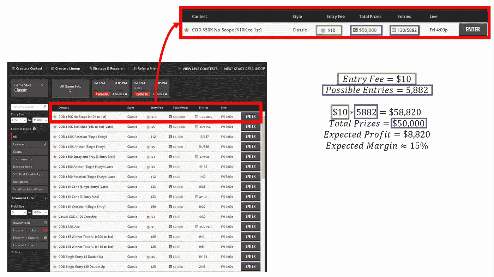

因此，只要这种竞争达到其预期容量，运营商(在这种情况下，DraftKings)就能保证其利润。虽然美国大多数 B2C 运营商不设定自己的赔率或管理自己的风险，但那些具有 DFS 功能的运营商通常会使用数据科学来优化竞赛的创建和分配。

不管使用的支付结构、所需的报名费或最大奖金池大小，所有 DFS 竞赛的一个共同因素是，每个参与者冒相同的风险进入奖金池，并向总奖金池贡献相同的金额。

看起来似乎没有任何选择，因为这将使计算支出变得非常困难。然而，撇开物流不谈，让我们首先考虑向日益庞大的客户群收取统一价格的经济影响。我们将首先考虑一个简化的例子，使用只有五(5)名参与者的 DFS 竞赛。然而，用一个类似的例子，快速的经济学课程将会有所帮助。

# **经济 101:供给&需求**

***警告:前方过度简化***

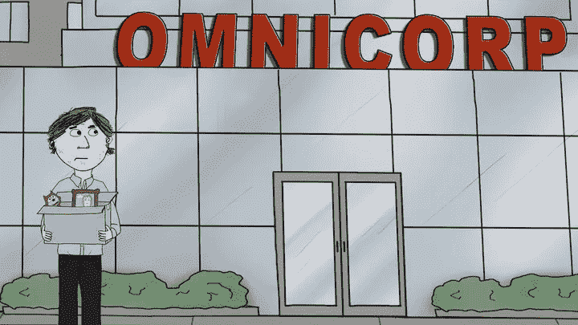

考虑一下 Omnicorp 生产的小配件的需求曲线，在一个只有一个买家 Tim 的市场中。

我们的需求曲线将首先绘制出 Tim 愿意在每个不同价格点购买的小部件数量。

如下图所示，每个小部件 25 美元，Tim 将只购买 1 件商品。然而，如果每个部件 20 美元，他会买 2 个，以此类推。*微观经济学主要研究购买者建立自己需求曲线的方式。*

*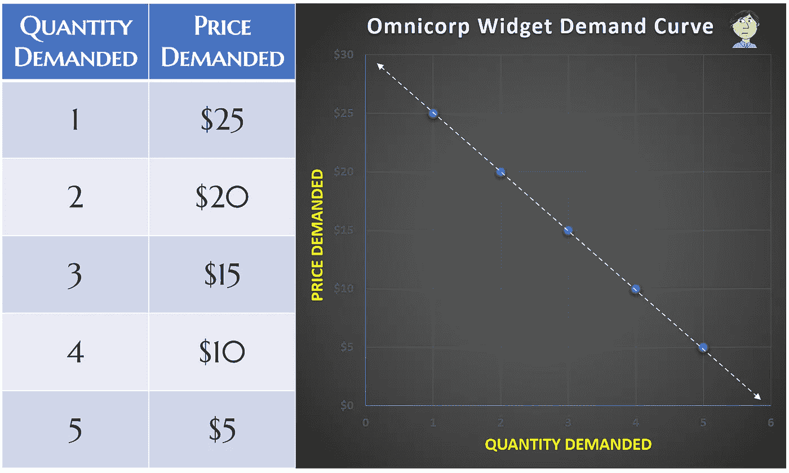*

*对于那些不熟悉经济学的人来说， ***需求曲线*** 只是一个图表，显示了购买服务或产品的意愿如何随着其价格的变化而变化。需求曲线几乎总是向下倾斜的，因为价格上涨往往导致需求量减少。在市场上只有一个购买者的情况下，曲线上的每个点代表购买者的 ***保留价格*，**他们愿意为每件商品支付的最高价格。*

> ****凡勃伦商品*** 是奢侈品和服务，对它们的需求实际上随着价格的上涨而增加，这通常是因为与过高的价格标签相关的可感知的排他性和地位。*

*通常，进入市场的供应商没有这种粒度级别的购买意向数据。然而，由于多种因素，竞争供应商可能会以不同的价格和数量供应小部件。 ***供给曲线*** 是一种产品的收费价格与卖家愿意生产的该产品数量之间关系的图形表示。它几乎总是向上倾斜的，因为更高的价格可以抵消更高的边际生产成本。*

*想象一下，也有 5 个价格点，该公司将提供不同数量的小部件。如果宏盟只能以 5 美元的价格出售小配件，那么他们花时间生产 1 美元可能也是值得的。然而，如果他们能以每件 25 美元的价格出售同样的产品，那他们花时间生产 5 件也是值得的。*

*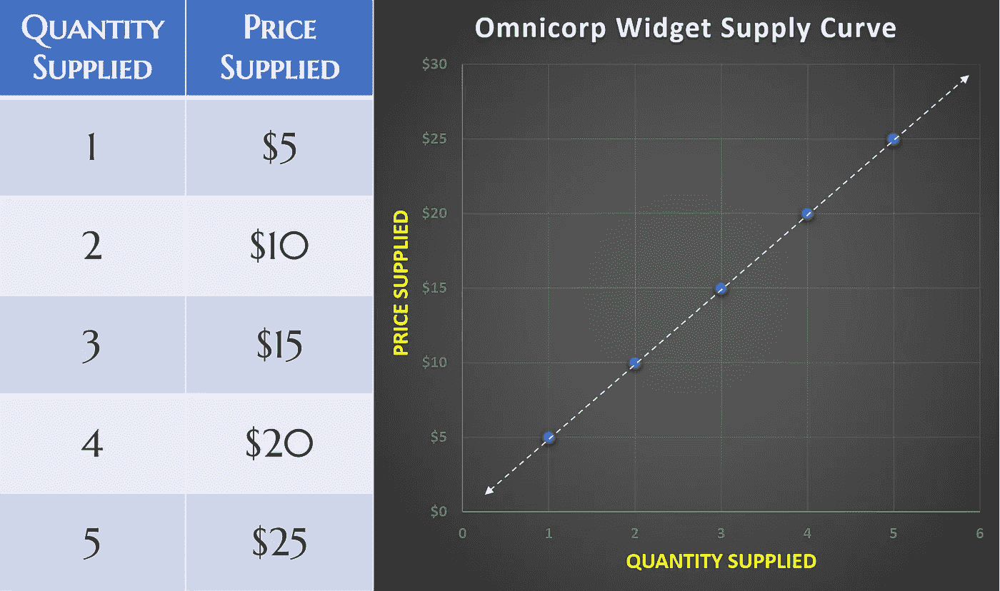*

*然后，我们可以在其单一购买者客户群中构建 Omincorp widgets 的供应/需求曲线:*

*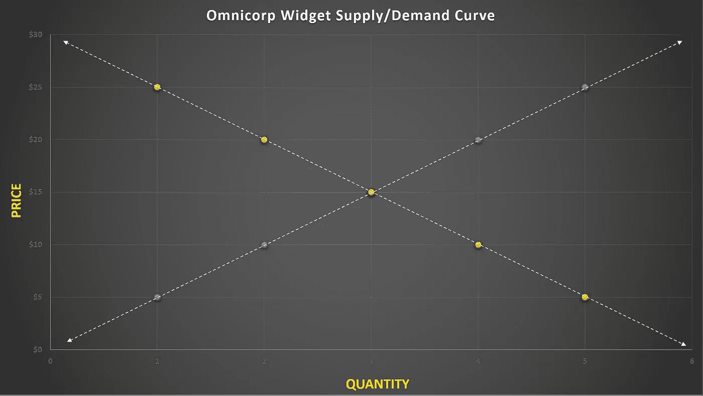*

*通常，标记会被移除，仅显示一个线形图:*

*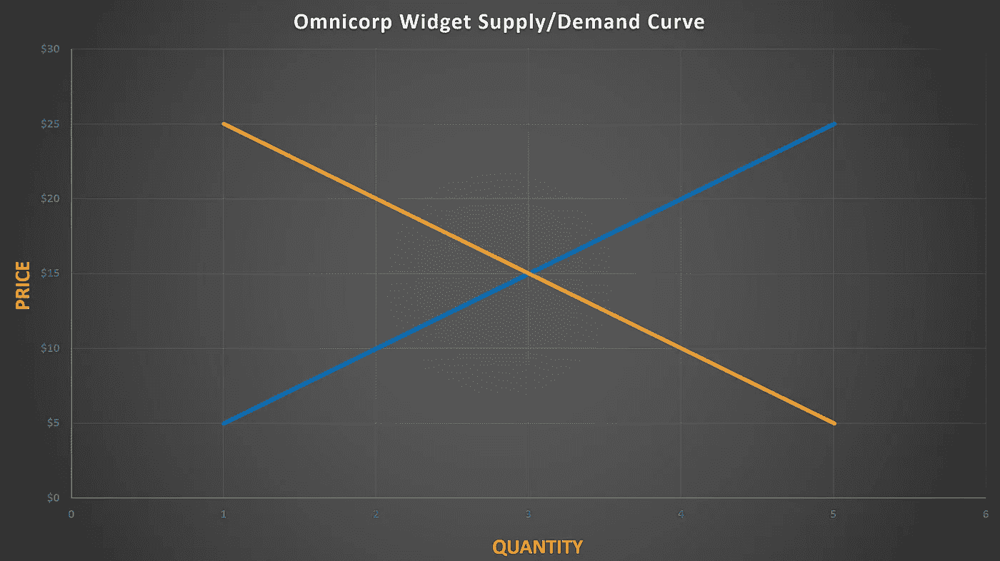*

*为了理解这个市场将如何陷入均衡，我们将从图表的最左侧开始，并进行迭代分析。*

*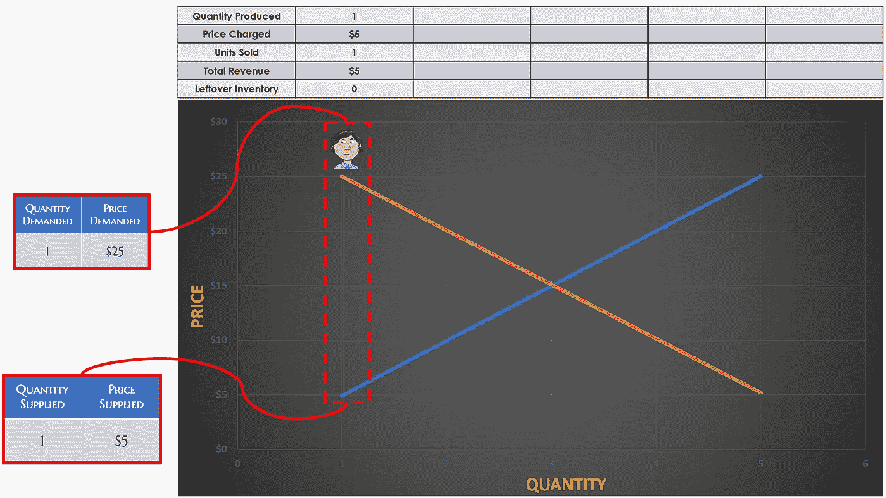*

*首先，我们观察到如果收取的价格是 25 美元，Tim 愿意购买 1 个小部件。然后，我们查看我们的供应曲线，以揭示如果 Omnicorp 供应 1 个小部件，他们将收取多少费用，在本例中是 5 美元。因此，蒂姆将花 5 美元购买一个小部件，剩下的 20 美元他可以随意使用。*

*现在，我们向右移动，评估下一个案例…*

*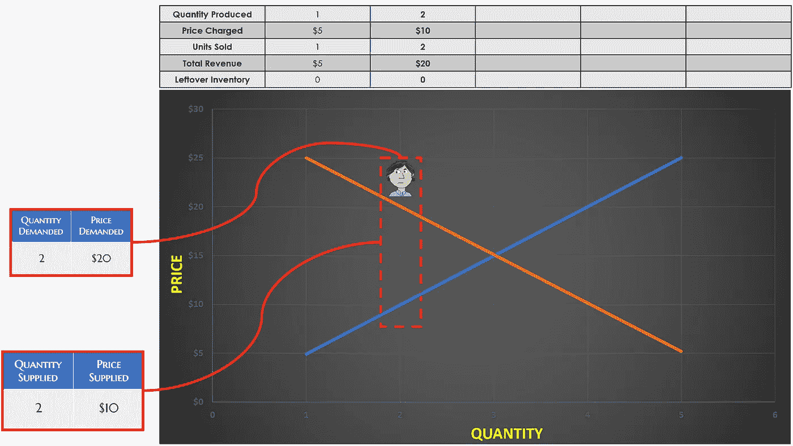*

*Tim 愿意支付 20 美元购买 2 个小配件。如果宏盟提供 2 个部件，那么每个部件的价格是 10 美元。因此，这两个单位将以 10 美元出售，产生 2 * 10 美元= 20 美元的收入。*

*我们继续向右移动…*

*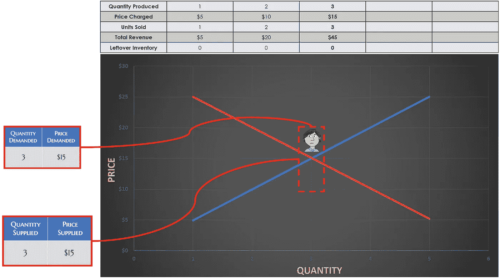*

*每件产品 15 美元，Tim 愿意买 3 件，Omnicorp 愿意卖 3 件。因此，将创造 45 美元的收入，并且不会有剩余库存。*

*然而，当我们再次移动时，我们注意到一个问题…*

*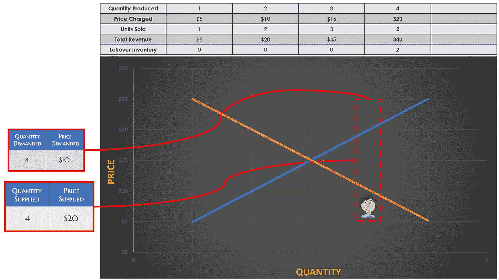*

*Tim 愿意以每个部件 10 美元的价格购买 4 个部件。然而，如果 Omnicorp 生产 4 个小部件，他们将需要收取每个 20 美元的价格。我们记得(从我们的需求曲线可以看出),在 20 美元的价格下，Tim 只愿意购买 2 台。因此，他会这样做，将产生 40 美元的收入，但 Omnicorp 将有 2 个剩余的小部件未售出，想必生产成本非零。*

*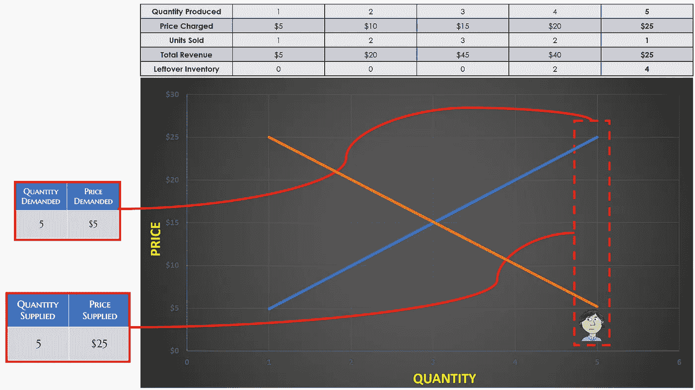*

*正如我们稍后将阐明的那样，没有必要考虑进一步向右移动，但是我们可以在上面看到那会是什么样子。Tim 愿意以每件 5 美元的价格购买 5 个小部件，但是 Omnicorp 只愿意以 25 美元的价格提供这些小部件。因此，只有 1 个将被出售，产生 25 美元的收入，其他 4 个将是剩余库存。*

*一般来说，市场会不断增加某种商品或服务的产量，直到需求量与供给量相等。事实上，市场通常被定义为供求达到平衡的机制。绝非巧合的是，这也是我们的供给/需求曲线上的一点，在这一点上，与生产一个额外单位相关的边际收益变为负值。因此，在我们的假设中，Omnicorp 将生产 3 个小部件，Tim 将以 3 * 15 美元= 5 美元的总价购买它们。*

## *边际效用*

*根据边际效用递减 定律 ***，消费者倾向于从他们的购买中获得满足感，这表明消费的第一个单位通常比随后的单位具有更大的效用。至少，很容易看出，一个人拥有 1 个小部件并购买了另一个，他的供应量会增加 100%，而一个人拥有 100 个小部件并购买了另一个，他的供应量只会增加 1%。****

*消费一个额外单位的产品或服务所产生的增量效用称为 ***边际效用*** 。*

*从技术上讲，有三种边际效用:*

*   ***正边际效用**—购买一件物品的额外版本令人满意(例如，喝两罐同样的汽水)*
*   ***负边际效用** —购买一种物品的额外版本不令人满意(例如，在一个给药周期内服用两剂相同的处方药)*
*   ***零边际效用** —获得一个项目的额外版本既不会令人满意，也不会令人不满意(例如，阅读同一份报纸的两个版本)*

> ****边际效用*** 的概念是经济学家在 19 世纪首次提出的，他们试图解释市场定价的涌现属性和经济现实。然而，这导致了一个被称为“水和钻石的悖论”的难题，最早是由亚当·斯密在 ***《国富论》中提出的。史密斯注意到水的边际成本很低，尽管它有很高的边际效用，因为它是维持生命所必需的。另一方面，钻石的边际成本非常高，尽管它们的边际效用似乎至少必然低于水。在 ***稀缺性*** 的概念进入争论之前，这让许多伟大的思想家感到困惑，他们曾希望通过边际效用和边际成本的关系来评估所有的定价现象。****

## *边际成本与边际收入*

*经济学家们还经常谈到*边际收益，即多生产一个单位所获得的增量美元价值，以及*边际成本，即多生产一个单位所支付的增量美元价值。***

***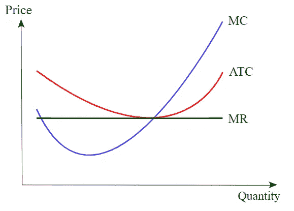***

***显示边际成本(MC)、平均总成本(ATC)和边际收益(MR)的标准成本曲线***

***一般来说，在供应方面，生产者会继续创造和销售，直到销售一个额外单位的边际收益被满足，然后被生产该单位的边际成本超过。***

***同样，在购买决策方面，消费者将继续购买单位的商品或服务，直到消费一个额外单位所产生的边际效用得到满足，然后被购买该单位的边际成本超过。***

## ***消费者盈余***

***正如我们在[关于彩池体育博彩](/@lloyddanzig/the-economics-of-parimutuel-sports-betting-367cb5ee1be1)的对话中所讨论的，客户经常以低于他们愿意支付的最高价格购买商品和服务，也就是他们的保留价格。***

******消费者剩余*** 是衡量在各种市场配置中这种情况发生的确切幅度。它通常被认为代表了客户满意度的水平。从图形上看，它显示为向下倾斜的需求曲线和垂直于 y 轴的水平线之间的区域，该水平线表示市场出清价格。***

**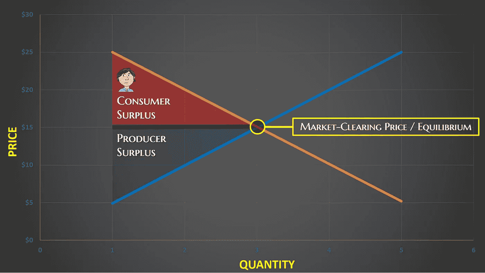**

**在表格中，我们可以列出 Tim 购买的第一、第二和第三个小工具的保留价格，然后将其与每一个小工具的支付价格进行比较，以获取差额并得出消费者剩余。**

**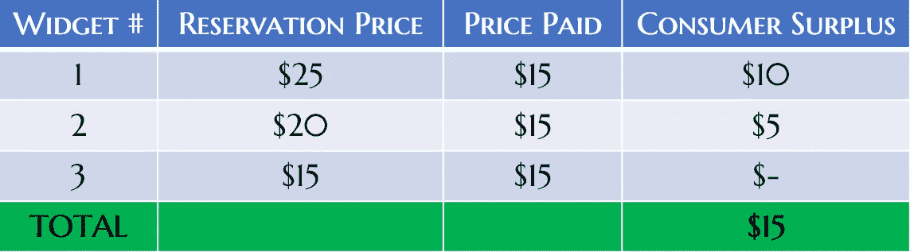**

## **价格歧视**

**我们很快开始注意到，消费者剩余也正是生产者未能捕捉到的上升空间。正如我们在[彩注体育博彩文章](/@lloyddanzig/the-economics-of-parimutuel-sports-betting-367cb5ee1be1)中所讨论的，供应商正越来越多地试图实施 ***价格歧视*** 的做法，根据供应商对每个消费者的保留价格的指示，对相同的商品或服务向不同的消费者收取不同的价格。**

**例如，Ticketmaster 已经开始使用“动态票价”来根据供求关系实时更新票价。此外，虽然在单一购买者的小部件市场中通常不可能存在价格歧视，但我们现在将进入我们讨论的核心:**DFS 竞赛中的完美价格歧视。****

# ****DFS 竞赛中的完全价格歧视****

**因此，总结一下我们已经讨论过的经济概念，以便为接下来的对话铺平道路:**

*   **需求曲线是通过比较获得单位商品或服务的边际成本和从这些单位中得到的边际效用来构建的。**
*   **供给曲线是通过比较生产单位商品或服务的边际成本和销售这些单位商品或服务的边际收益来构建的。**
*   **这两条曲线，以及它们所基于的原则，相互作用决定了市场清算的价格和数量，在这个价格和数量上，所有各方都将处于均衡状态。**
*   **消费者愿意支付的价格与市场价格之间的差距被称为*消费者剩余，代表了供应商未能捕捉到的其他优势。***
*   ***价格歧视是指试图向每位消费者收取他们愿意支付的最高价格，即他们对任何数量的商品或服务的保留价格***

****

**我们可以从本文的开头重新看一下这张图，它显示了支持 DraftKings 提供的一个使命召唤 DFS 竞赛的基本汇总数学。我们记得所有这类竞赛的共同点是所有参与者支付相同的报名费。**

****然而，正如供应商对小部件收取单一价格会以消费者剩余的形式在桌面上留下一些上升空间一样，DFS 运营商也会错过消费者剩余的上升空间，消费者剩余定义为每个参与者愿意承担的超出参赛费用的金额。****

## **DFS 示例**

**为了说明这个问题的一个可能的解决方案，我们将想象我们正在举办我们自己的 DFS 竞赛，有 5 个不同的参与者，每个人都愿意下不同的赌注。**

**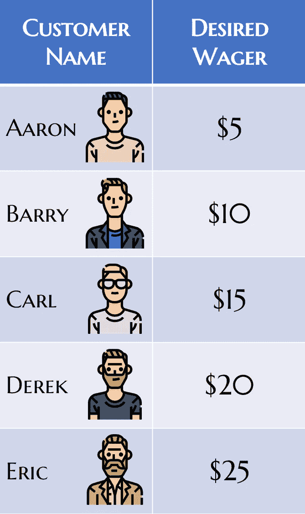**

**首先，我们来解决什么样的统一价格会使收益最大化的问题。我们记得，给定市场内的需求曲线被定义为在给定价格下将要购买的单位数量。在这种情况下，被购买的单元是 DFS 竞赛的参赛作品，价格是费用。**

**因此，上表中的“所需赌注”列相当于上例中的“所需价格”列。为了填写在任何特定价格下的需求数量，我们将简单地计算等于或大于该价格的期望赌注的数量。这应该具有直观的意义，因为愿意下 25 美元赌注的人通常也愿意下 5 美元赌注，尽管反过来并不总是成立。**

**这样，我们可以像以前一样创建一条需求曲线:**

**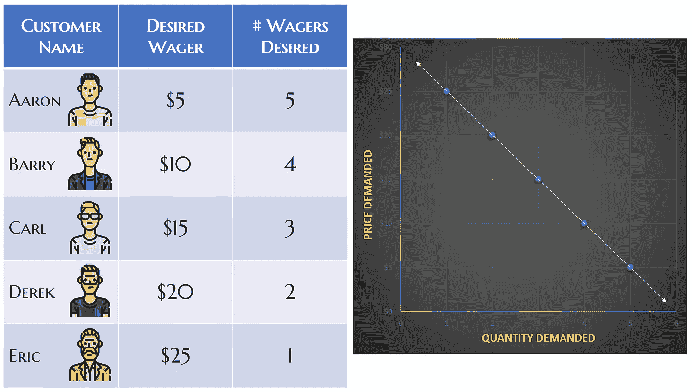**

**在选择如何为这场比赛定价时，一个显而易见的选择是收取允许最大数量的用户参加比赛的价格。特别是对于 dau 和 mau 是关键 KPI 的初创公司，这通常是考虑的重要部分。但是，在这个练习中，我们将简单地尝试最大化总收入。**

**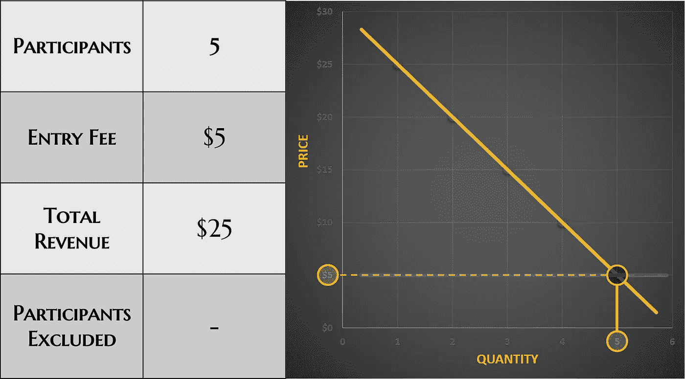**

**报名费为 5 美元，所有 5 名参与者都将参加比赛，我们将收集 5*$5 = $25 美元。**

**我们还可以逐步上调入场费，看看将其设置为与任何其他玩家的期望赌注相等是否会增加盈利能力。**

**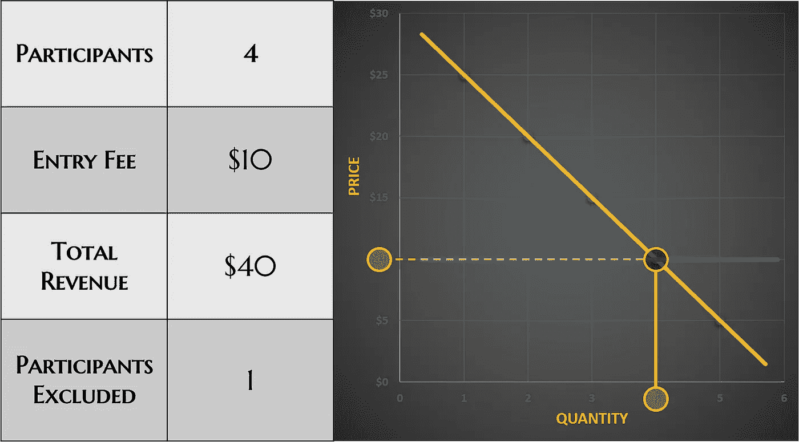**

**将报名费迅速提高到 10 美元显示了这种做法的有用性。我们现在可以向每个人收取两倍于 5 美元价位时的费用，尽管我们会失去一个客户，亚伦，他不希望承担超过 5 美元的风险。也许现在我们可以用更低的入场费把 Aaron 送到一个不同的泳池，但是让我们假设我们没有这个奢侈。**

**我们将继续提升需求曲线…**

**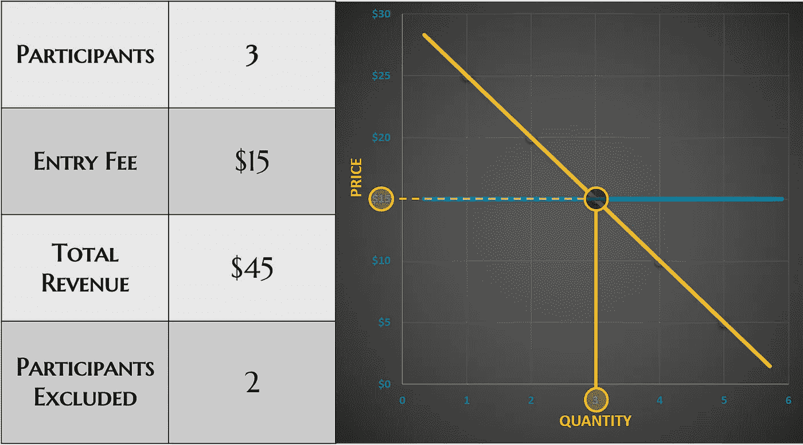**

**通过 15 美元的入场费，我们可以从 3 个客户那里获得总计 45 美元的收入，但 2 个参与者将被排除在外。**

**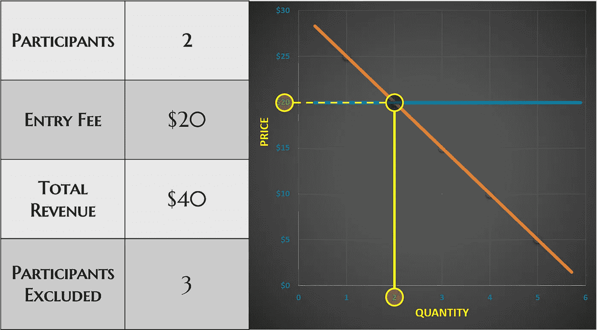**

**在 20 美元的价位，有两个自愿参与者——Derek，他的期望赌注是 20 美元，Eric，他的期望赌注是 25 美元。因此，将收取 40 美元的收入，并排除 3 名参与者。由于 ***边际收益*** 与需求曲线的这种上移相关联是负的，我们知道我们已经走得很远了。**

**因此，为了实现收入最大化，我们将举办一场具有以下特征的比赛:**

*   **入场费:15 美元**
*   **参与者:3 人**
*   **收入:45 美元**
*   **排除的参与者:2**
*   **消费者剩余:？？？**

**你可能已经注意到，这些数字是经过设计的，与我们的 Tim-Omnicorp 假设相同。因此，人们可能会认为消费者剩余也等于 15 美元。**

****

**现在重要的是进行实际观察。我们一直在谈论消费者剩余，这是供应商未能捕捉到的好处。通常情况下，这并不包括那些放弃购买的消费者。一般来说，这是有意义的，因为消费者不会花 5 美元在一个小部件上，而是会把钱投资或花在替代产品上。**

> **P 大米需求弹性，通常简称为 ***弹性*** ，是一种产品或服务的需求量随着价格上涨而变化的程度。**

## **DFS 竞赛细微差别**

**然而，在 DFS 竞赛的情况下，客户资金通常被存放在网站上。我们还假设没有其他可用的竞争。虽然通常情况下不会这样，但作为一家 DFS 运营商，运营额外的竞赛对我们来说是有成本的。不仅有与一般运营相关的成本，而且有保证支出的竞赛不能填满可能导致运营商不得不使用他们自己的资金来弥补差额。总奖池超出收取的参赛费的确切金额称为 ***叠加*** 。**

**为此，我们将把 Aaron 希望下注的 5 美元和 Barry 希望下注的 10 美元视为我们未能通过将入场费设置为 15 美元(下面用绿色标出)来捕捉的优势。**

**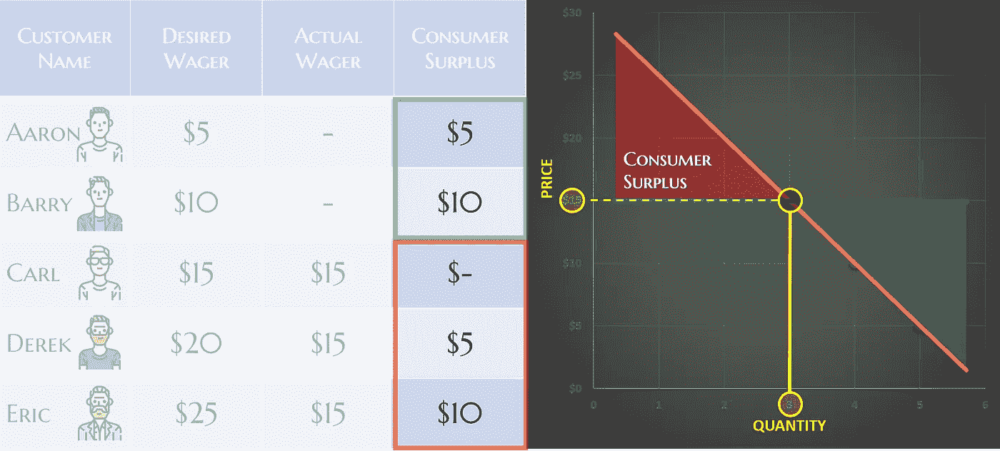**

**根据这个公式，我们已经收取了 45 美元的入场费，但还剩下 30 美元的上涨空间。30 美元+45 美元= 75 美元是有道理的，这也是每个参与者最大期望赌注的总和。**

# **编码课**

**如果计算机擅长一件事，那就是…计算。为了尝试完美的价格歧视，并允许 DFS 竞赛中的每个参与者下注他们喜欢的任何金额，我们将从扑克游戏处理边锅的方式中借鉴灵感。然而，这将需要比我们想要跟踪的更多的计算，所以我们将使用一些非常基本的 Python 代码来加速。**

**如果您不熟悉基本的编码原则，以及数组等数据结构的基础知识，这可能有点难以理解。然而，这项工作的互动性质应该是有益的。**

**为了让人们跟随并自己尝试一些代码，我们将使用 Google 合作实验室。任何人都可以在这里查看代码，但是需要登录才能复制笔记本，然后运行/编辑它。**

## **第一步**

**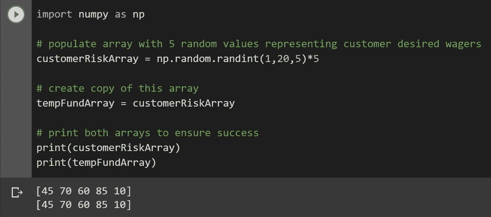**

**首先，我们需要导入 NumPy 库，因为我们希望使用它的一些功能，特别是生成随机整数。我们还将假设数组中的第一个元素对应于第一名参与者的期望赌注，数组的第二个元素对应于第二名参与者的期望赌注，等等。**

**我们将在这里使用一些随机性，而不是前面提到的五个特定参与者。具体来说，我们将创建一个名为*customeriskarray*的数组，并用随机整数填充它。NumPy 提供了一个函数 *random.randint()* ，它将根据我们传递给它的参数生成随机整数。在我们的例子中，我们在调用*customeriskarray = NP . random . randint(****1，20，5*** *)*5* 时传递了三个参数**

**这指示机器根据以下规格生成数值:**

*   **下限= 1**
*   **上限= 20**
*   **要生成的整数个数= 5**

**在填充数组后乘以 5 将导致范围缩放为 1，下限为 5，上限为 100。此外，每个数字必然是 5 的倍数，这为我们提供了一个很好的整数。**

**我们也可以使用*customeriskarray = NP . random . randint(****1，100，5*** *)，*但是这些数字可能不够完整，也不容易从心理上进行检查。**

**当然，要在生产中使用这样的脚本，我们需要从用户那里获取输入，并且能够动态地适应任何规模的比赛。**

**我们将需要在整个计算过程中引用这个数组，但是也希望以服务于我们最终目标的方式来操作它。因此，我们将创建一个名为 *tempFundArray 的相同副本。***

**最后，我们将打印两个数组，以确保它们都包含 5 到 100 之间的 5 个整数，并且彼此相同。**

## **第二步**

**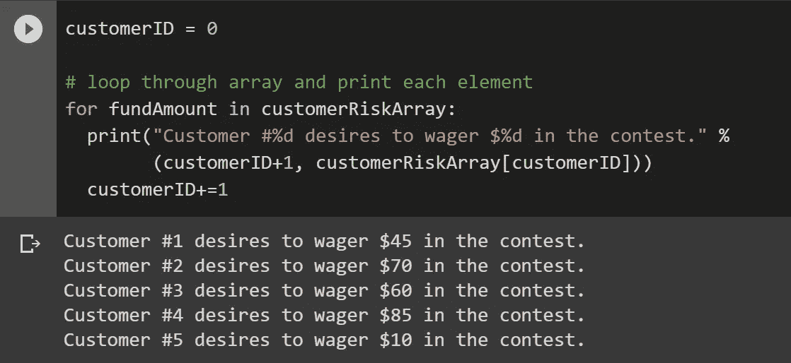**

**我们现在将快速练习在 Python 中使用 *for 循环*，并再次验证我们的数组是否被正确填充。**

## **第三步**

**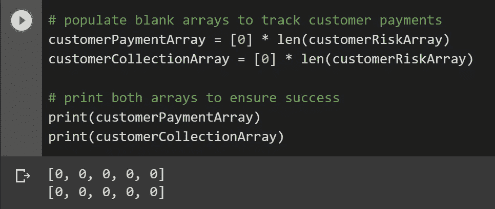**

**我们将需要跟踪客户之间的“支付”，借用一个叫做 ***复式记账*** 的会计概念。**

**本质上，我们将在我们的 5 人比赛池中运行每场 2 人比赛，做一些计算，只有在结束时，资金才会真正转移到获胜者。支付的使用更多的是指未实现的收益或损失，因为它只是暂时发生在纸面上。**

**我们可以对任意数组使用 *len(array_name)* ， *array_name* ，以便返回它包含的元素个数。然后，我们可以在两个新数组中填入这么多的 0，并打印每个 0 以确保成功。**

## **第四步**

**现在到了有趣的部分，我们需要进一步逐行分析。**

**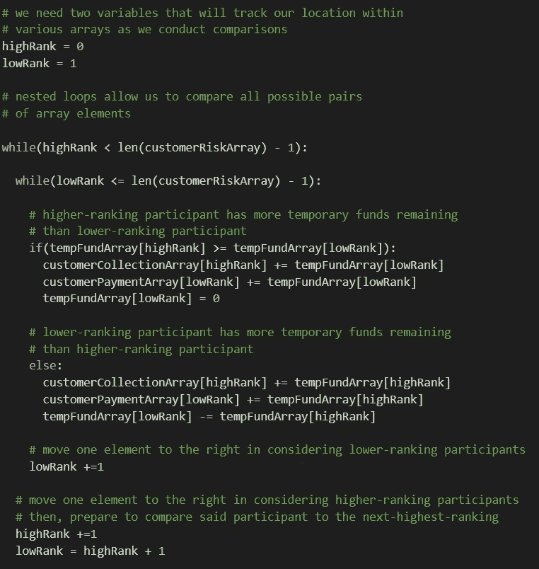**

## **步骤 4a**

**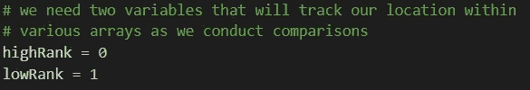**

**任何有编码背景的人都可能记得使用嵌套循环对数组中的元素进行比较和排序的方式。由于 Python 中的数组从 0 开始，我们已经声明数组的第一个元素包含比赛结束时排名最高的参与者的期望赌注，我们将设置 *highRank = 0* ，这样我们的第一次比较从第一名参与者开始。我们将设置 *lowRank = 1* ，以便从第二名参与者开始比较。同样，这些值只代表我们试图比较信息的数组中的索引或位置。因此，当我们增加和减少这两个值时，我们只是在数组中移动，比较不同的信息集。**

## **步骤 4b**

**虽然在 Java 中， *for()* 循环可能是标准的做法，但是 Python 的版本更类似于 *forEach()* 循环，所以 *while()* 将更有用。也是因为我们使用了一个 *while()* 循环，所以我们在循环声明之前和之外声明并设置了索引。**

**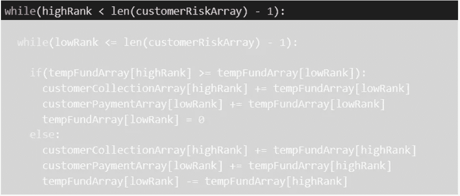**

**我们的 *highRank* 变量旨在始终跟踪与参与者相关的信息，当以面对面的方式比较两个参与者时，该参与者在最终排名中排名更高。在 5 名参与者的竞赛中，这意味着它指向与第一、第二、第三和第四名参与者相关的数组元素。它不可能指向第 5 名参与者，因为没有排名较低的条目可以比较。**

**因此，我们知道，我们希望能够访问任何给定数组的第一个元素，现在我们看到，我们将永远不会访问任何给定数组的倒数第二个元素以外的元素。我们已经将 *highRank* = 0，并希望确保一旦它指向倒数第二个数组元素，我们就停止递增它。**

**有人可能认为我们可以只使用数组的长度来完成这个任务。如果数组有 5 个元素，它的长度将是 5。所以，只要 *highRank* 指向 5 之前的某个元素，就永远不会指向最后一个元素。**

**然而，因为数组索引从 0 开始，所以我们必须减去 1，并让我们的循环运行*while(high rank<len(customeriskarray)-1)。***

## **步骤 4c**

**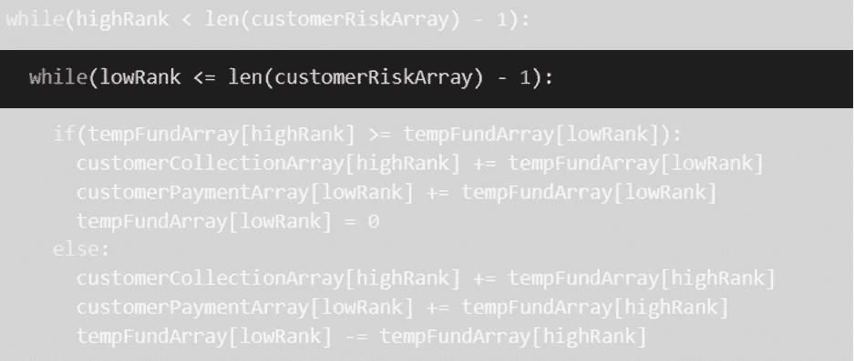**

**在我们开始将指针移动到与表现最好的元素相关的数组元素之前，让我们遍历我们的内部循环，这将把指针移动到与表现较差的元素相关的元素。**

**我们使用类似的逻辑来设置循环条件。现在，当此代码在第一个循环中运行时，它将比较第一名参与者与第二名参与者的信息，以及第一名参与者与所有其他参与者的信息，然后重置并开始比较，其中第二名参与者是排名较高的执行者。**

## **步骤 4d**

**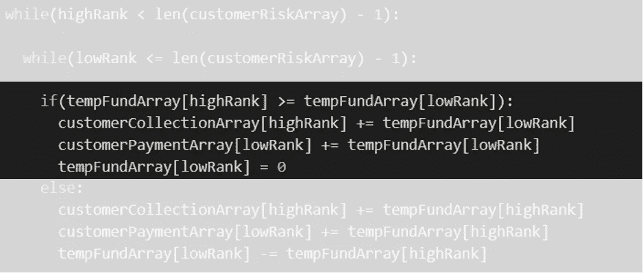**

**我们现在进入两个条件计算指令集之一，这取决于我们在这个过程中的位置。我们可以看到正在进行的比较是*if(tempFundArray[high rank]>= tempFundArray[low rank]):***

**我们记得 *tempFundArray* 只是*customers karray*的一个副本，其中保存了每个参与者的期望赌注列表。因此，在第一次循环中，如果位于索引 0 的 *tempFundArray* 中的值大于位于索引 1 的值，则该条件为真。**

**换句话说，如果第一名参与者希望比第二名参与者下更多的注，则为真。我们可以概括这一点来描述将重复进行的比较。然而， *tempFundArray* 将在我们的代码运行过程中被改变，因此英文描述将不会完全成立。**

**我们看到，如果条件成立，将执行三个操作:**

1.  ***customerCollectionArray[high rank]+= tempFundArray[low rank]***
2.  ***客户支付数组[低秩] +=临时数组[低秩]***
3.  ***tempFundArray[low rank]= 0***

**可以翻译如下:**

1.  **在引用较高等级参与者的位置处跟踪集合的数组将被递增应用于具有较低等级的参与者的临时数组的位置中剩余的量。**
2.  **在引用较低等级参与者的位置处，跟踪支付的数组将增加临时数组的位置中剩余的量，该临时数组适用于具有较低*等级的参与者。***
3.  ***应用于具有较低等级的参与者的位置处的临时数组将被设置为 0。***

## ***步骤 4e***

***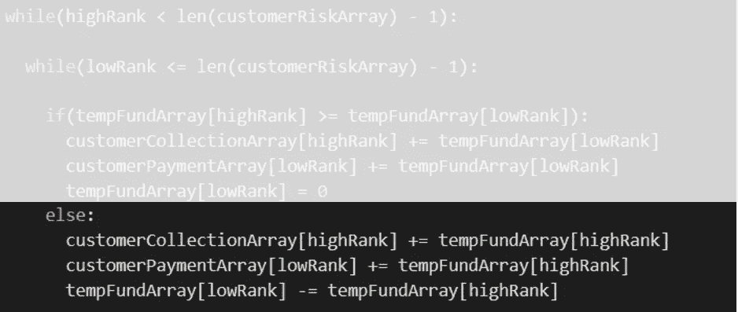***

***如果条件失败，这意味着具有较低等级的参与者实际上比具有较高等级的参与者在 *tempFundArray* 中具有更大的剩余值。***

**在这种情况下，我们会看到发生以下三种操作:**

1.  ***customerCollectionArray[high rank]+= tempFundArray[high rank]***
2.  ***customerPaymentArray[low rank]+= tempFundArray[high rank]***
3.  ***tempFundArray[low rank]-= tempFundArray[high rank]***

**可以翻译如下:**

1.  **跟踪集合的数组，在引用较高等级参与者的位置，将增加临时数组的位置中剩余的数量，该数量应用于具有较高 等级的 ***参与者。*****
2.  **在引用较低等级参与者的位置处，跟踪支付的数组将增加临时数组的位置中剩余的量，该临时数组应用于具有较高*等级的参与者。***
3.  ***应用于具有较低等级的参与者的位置处的临时数组将被递减应用于具有较高等级的参与者的位置处包含的量。***

## ***步骤 4f***

***我们使用较大的屏幕截图只是为了回忆我们在笔记本这一部分的位置。***

***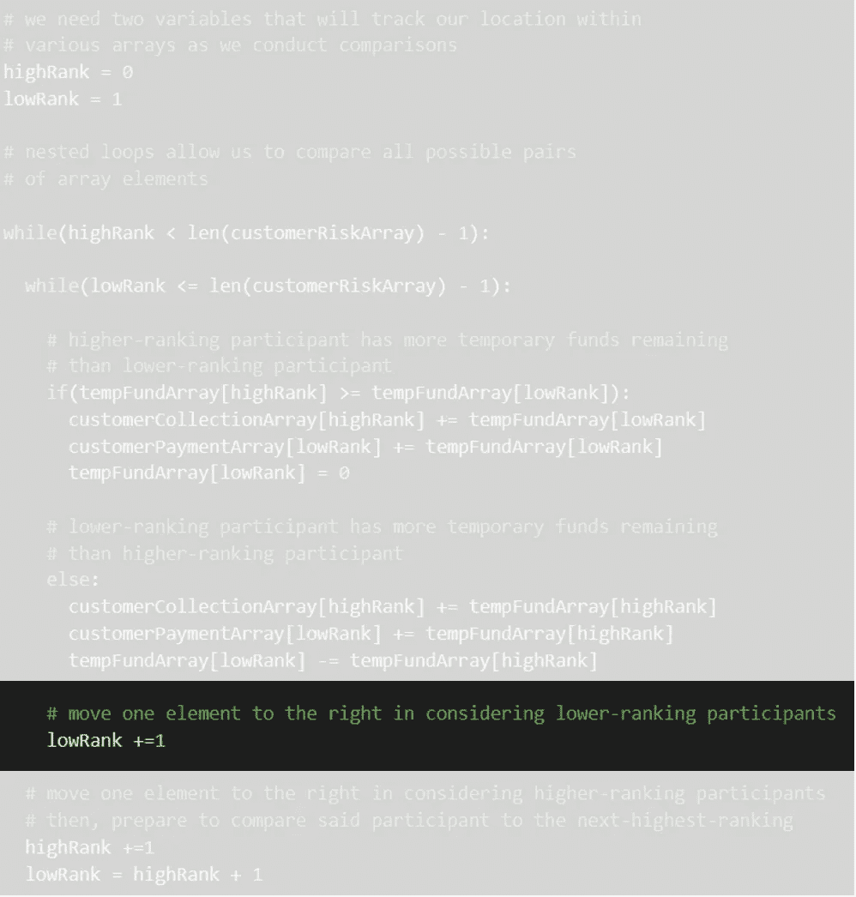***

***在第一次运行这段代码时，我们将会比较第一个数组元素和第二个数组元素。我们知道要将第一名的元素与第三名、第四名和第五名的元素进行比较。为此，我们递增 *lowRank* ，然后返回测试内部 *while()* 循环条件。***

**那个条件要求*低秩<= len(customeriskarray)-1*。我们知道 *lowRank* 被初始化为等于 1，现在已经增加到 2。我们也知道这个数组有 5 个元素长。因此，我们正在测试*2 ≤( 5–1)。*这将评估为真，内部循环将再次运行。**

**一旦这个条件失败，循环将退出，并到达我们的最后一组增量器。**

## **步骤 4g**

**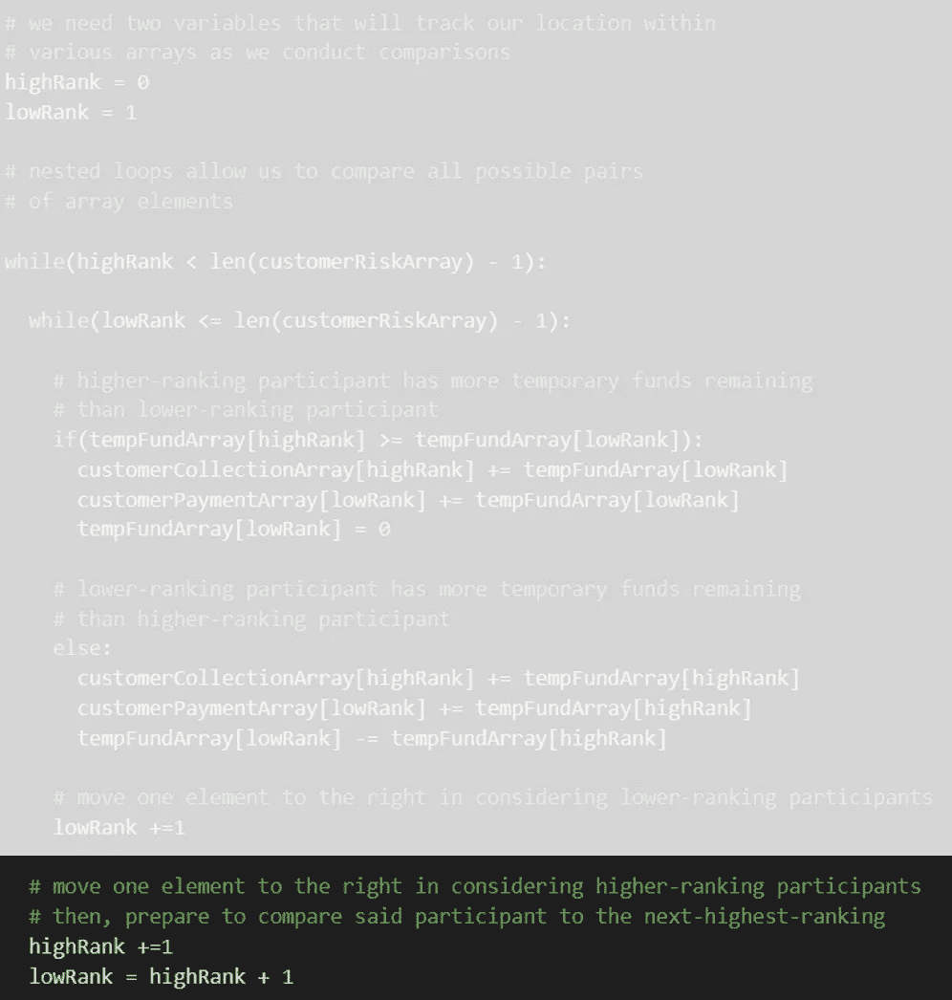**

**一旦我们对排名第一的参与者进行了这些比较，我们还需要将排名第二的参与者作为排名较高的参与者进行比较。此外，我们需要重置低排名*和高排名*现在指向的地方的右边的一个元素。**

****第五步****

**最后一步，我们将使用两个 *for()* 循环来遍历集合和支付数组，这样我们就可以打印出代码提供的支付指令，然后进行完整性检查。**

**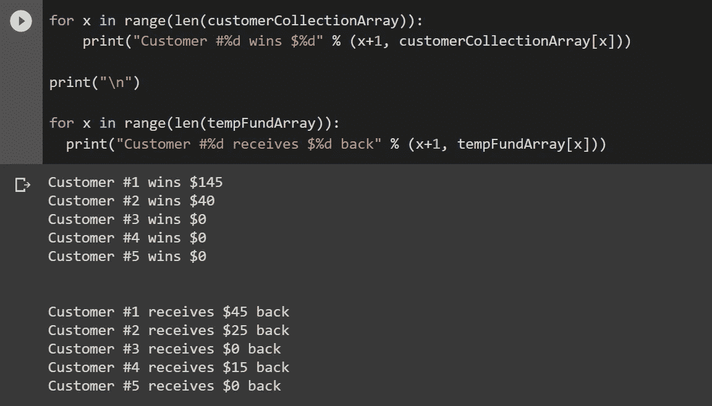**

## **优化和重构**

**认为上面的经验是初级的读者可能也已经注意到，这段代码远不是最佳的。相反，有许多重构的方法会带来好处。当然，有 Python 函数和库可以帮助我们清理这些代码，使其更加优雅。但是，它将满足本练习的目的。**

## **“等等，我糊涂了。”**

**那些认为所讨论的一切都非常直观的人可以跳过这一节，但是对于那些不完全理解这里发生了什么的人来说，让我们进入我们的代码，一行一行地浏览整个运行时体验。**

# **代码审查**

**当我们第一次开始操作我们的输入时，我们有两个相同的，但不是不变的数组副本，包含每个客户的期望风险金额。**

**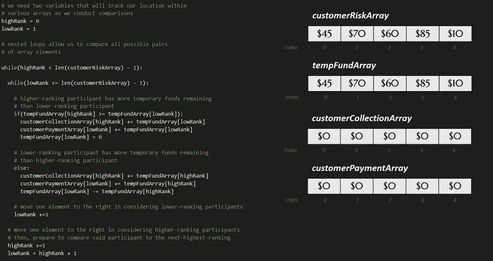**

**下图乍一看似乎令人望而生畏，但实际上非常简单。每个图表都将由后面的文字描述。因为数组索引经常从 0 开始，所以我们将“第 0”个元素称为索引 0 处最左边的元素，依此类推。**

**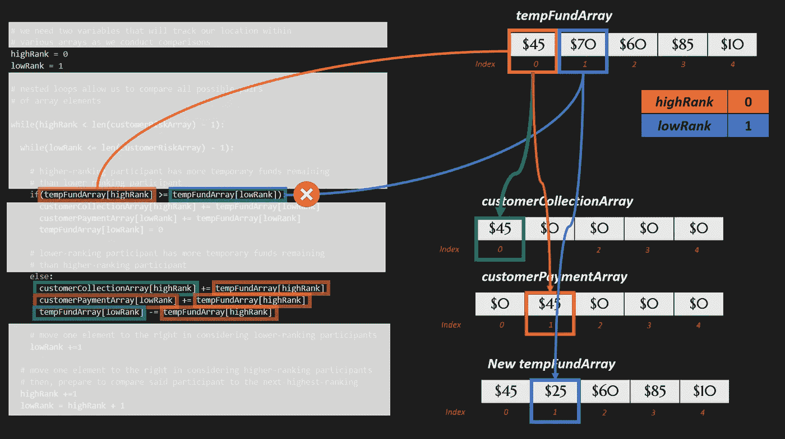**

**在上图中，我们进入 while 循环，首先比较数组第 0 个元素的值和数组第 1 个元素的值。因为$45 不大于$70，所以 *if()* 条件不成立，我们进入 *else()* 条件。**

**因为第一个客户只想冒 45 美元的风险，这是他们能从任何其他客户那里收取的最大金额。因此，集合数组的第 0 个元素将增加 45 美元(绿色)，付款的第 1 个元素将减少 45 美元(红色)。最后，我们将原始 *tempFundArray* 中的第 1 个元素记入借方，我们将继续引用它(蓝色)。**

**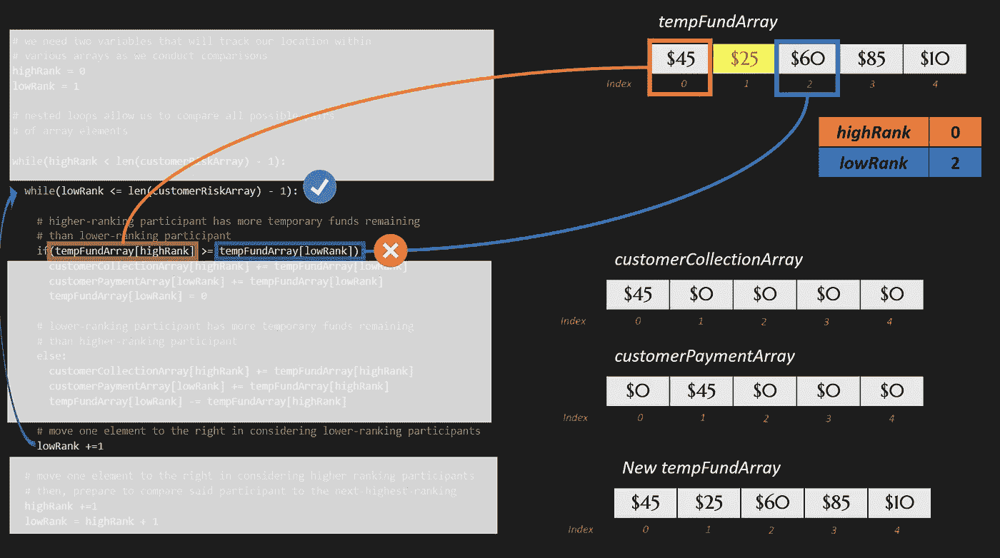**

**因为我们现在想要比较第 0 个元素中的值和第 2 个元素中的值，所以我们将把 *lowRank* 增加 1(蓝色箭头)。因为这个值仍然满足我们的 *while()* 条件，我们继续和以前一样的过程。**

**同样，我们比较元素值，发现不满足 *if()* 条件。**

**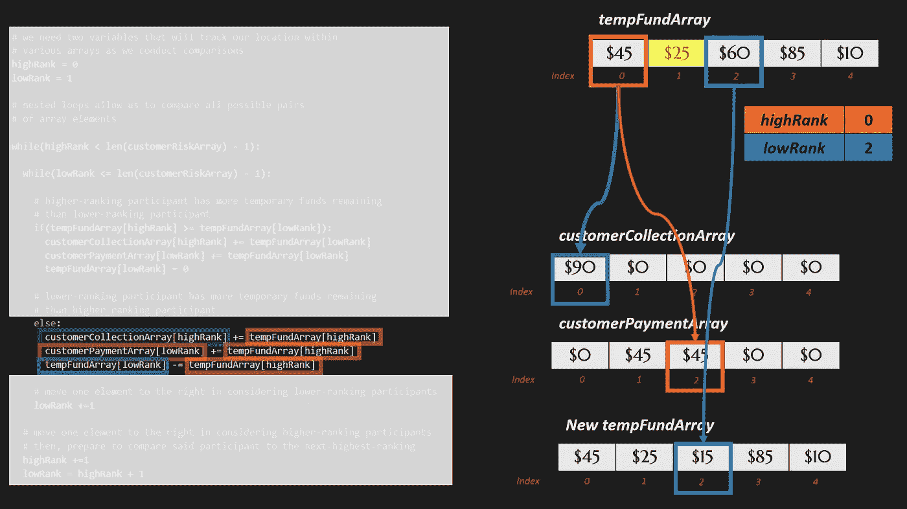**

**同样，我们执行跟踪第一位客户(由第 0 个元素表示)从第三位客户(由第 2 个元素表示)收集资金所需的操作。**

**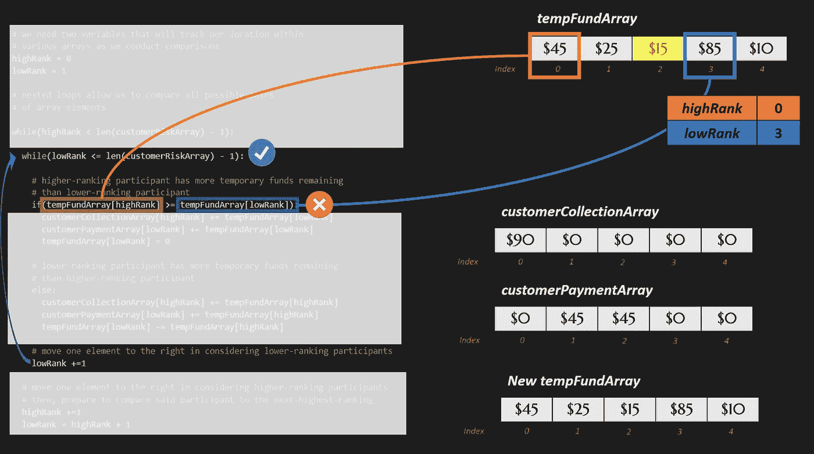**

**现在，我们已经将第一名客户的期望风险金额与第二名和第三名客户的期望风险金额进行了比较。我们需要继续到数组的末尾，第 5 个客户由数组中的第 4 个元素表示。**

**我们将 *lowRank* 增加 1，并测试我们的 *while()* 条件，该条件得到满足。由数组中的第 3 个元素表示的第 4 位客户也希望比第 1 位客户冒更大的风险，因此 *if()* 条件不成立。**

**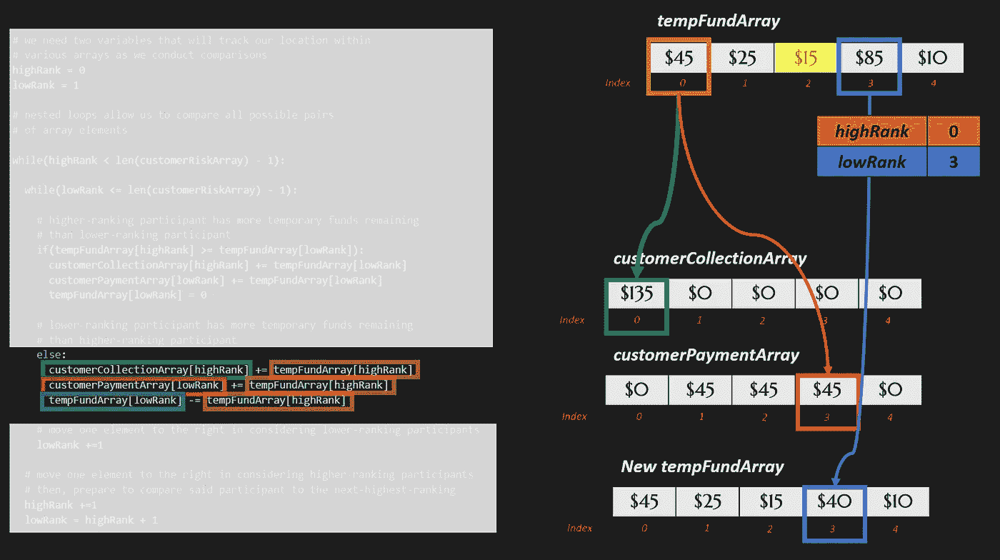**

**我们已经连续做了三次同样的事情，第三次的情况如上图所示。就像我们将第一名客户期望的风险金额与第二名和第三名客户进行比较时一样，我们让第一名客户从第四名客户(绿色)处收取他们的风险金额。付款数组反映第四名客户的借方(红色)，并且更新 *tempFundArray* (蓝色)。**

**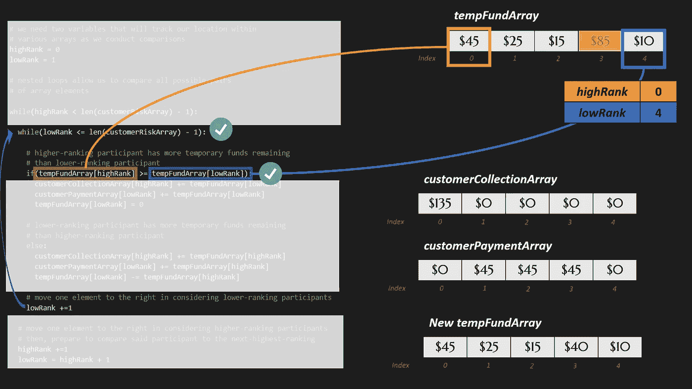**

**最后，当比较第 0 个元素处的第 1 名客户和第 4 个元素处的第 5 名客户时，我们的 *if()* 条件将被满足，因为第 5 名客户寻求下注如此之少。**

**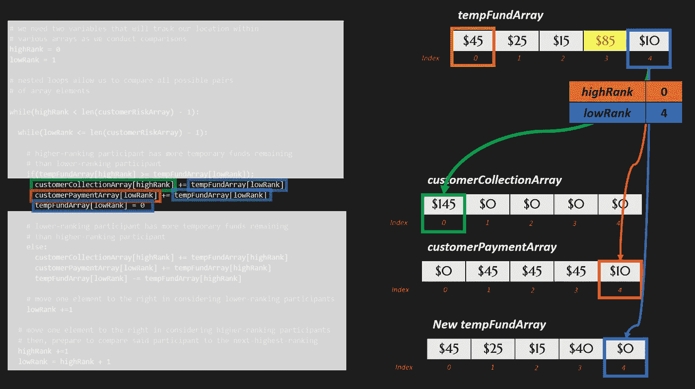**

**这个过程与前一个没有太大的不同。具有较高等级的客户现在试图比具有较低等级的客户下更多的**。这样，他们将只能收集排名较低的客户试图下注的金额。****

**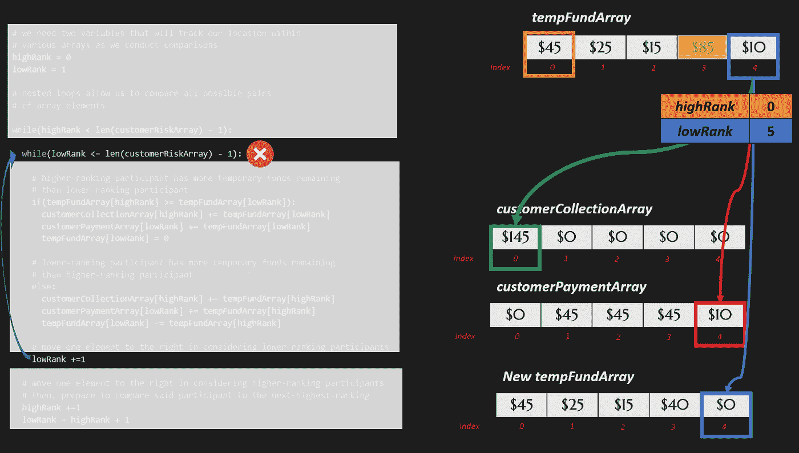**

**这一次，我们将低等级的*增加到 5。然而，我们的数组只有 5 的长度，这意味着测试条件 *5 ≤ 4* 将评估为假。***

*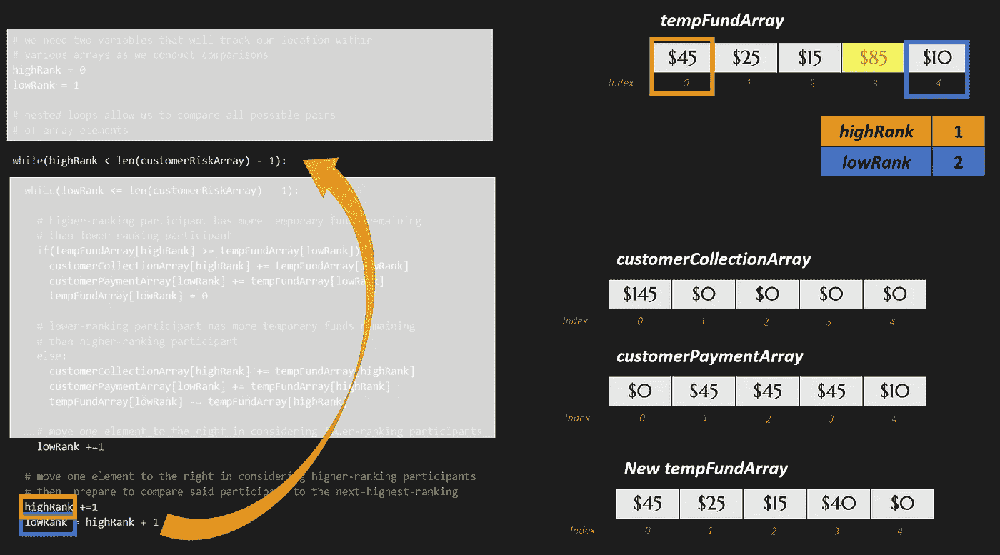*

*虽然我们的内部 *while()* 条件失败，但在检查外部 *while()* 循环条件之前，我们仍然会对 *highRank* 和 *lowRank* 进行调整，然后再次启动。*

*我们现在将第二名客户(在第一个元素中表示)与第三名客户(在第二个元素中表示)进行比较。同样，我们将沿数组向下迭代，将排名第二的客户与排名第四和第五的参与者进行比较。此时，内部的 *while()* 条件将失败，我们将再次开始比较第 3 位客户(在第 2 个元素中表示)和第 4 位客户(在第 3 个元素中表示)。*

*这将持续下去，直到我们比较了五个客户集合中的所有两个客户的组合。具体来说，这将是: **5C2 = 10 个组合**。*

# *结论*

*最终，当试图通过实行价格歧视来最大化利润时，会有许多复杂的因素。对于许多商品，即使知道每个消费者的保留价格，也没有可行的方法做到这一点。*

*涉及具有显著不同技能水平的参与者的竞赛也试图在子群体中实现某种程度的均等。*

*尽管如此，在非常特殊的情况下，生产商可以通过考虑替代的定价结构，从经济上获益，也可以为最终用户提供巨大的价值。DFS 是否代表了这样一个机会，这是留给读者考虑的问题。*