# 基于 A/B 测试的定价优化

> 原文：<https://medium.com/analytics-vidhya/pricing-optimization-with-a-b-test-e720efe62b0?source=collection_archive---------4----------------------->

从广义上讲，A/B 测试是一种比较两个数据集的方法，这两个数据集被随机分配到某个治疗组(治疗组)或无治疗组(对照组)。由于结果容易获得，它在网页设计、市场营销甚至价格优化方面都有应用。这篇文章主要关注价格优化的 A/B 测试，最终目标是增加收入。

网络空间中的 A/B 测试的主要目标是当网站在设计、网站上可用的产品或产品和服务的定价方面发生变化时，观察用户的行为模式。对于许多可通过互联网获得的产品和服务，有时很难确定合适的价格点来增加收入，同时保持收益率。下面是一个定价优化问题的样本数据集。

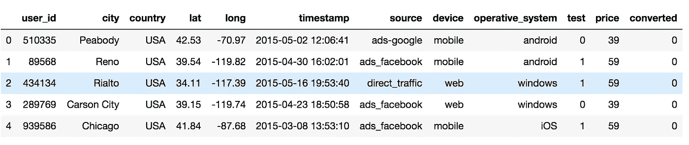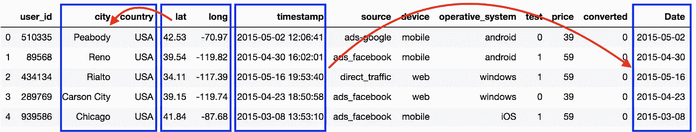

在此示例中，相同的产品以两种不同的价格列出。39 美元是对照组的原价，59 美元是治疗组的新价。这个问题的主要目的是增加收入，即使是以转换率为代价。上表中显示了一些用户信息。由于我们只有两个月的测试数据，我没有使用时间戳，而是将它们转换为 mm-dd-yyyy 格式。这使得汇总和观察每日数据的转换率变得更加容易。

日均转化率显示，对照组的转化率高于试验组。然而，就在试验结束时，治疗组的转化率增加了。

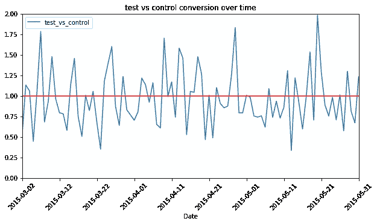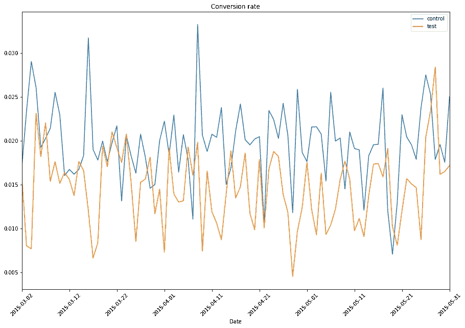

总的来说，试验/治疗组的转化率低于对照组。由于定价优化的目标是增加收入，因此转换率可能会略有下降。

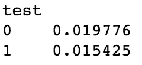

为了比较试验组和对照组，我们必须首先检查这两组是否是真正随机的。两组之间的比较将有助于理解测试/治疗对给定指标(收益率)的影响。因此，试验组和对照组之间的任何分布差异都应考虑在内。例如，治疗可能不适用于某些城市的用户，或者与其他设备/操作系统相比，某些特定设备/操作系统可能是治疗的目标。

以下可视化/绘图将有助于确定变量(如源、操作系统、设备)的分布是否有任何变化。这些特定变量的分布没有显著差异。

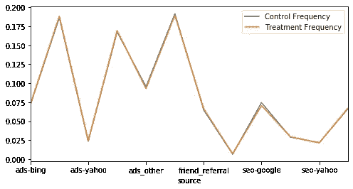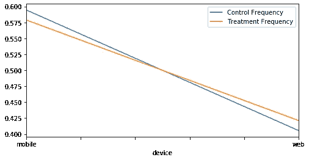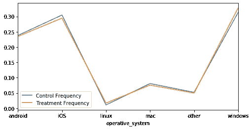

进行 A/B 测试的 w.r.t .城市分布显示，对于来自红框中代表的城市的一些用户，治疗组和测试组在一些城市的分布不均匀。虽然这些结果可能看起来很重要，但分布不匹配的城市的总百分比约为可用总数据的 0.027%。

为了能够检测测试和控制之间的分离模式，可以使用决策树。训练集由与上述相同的数据组成，标签为 0 或 1，代表测试组或对照组。如果存在可以检测到的重要模式，决策树可视化将会指出这一点。

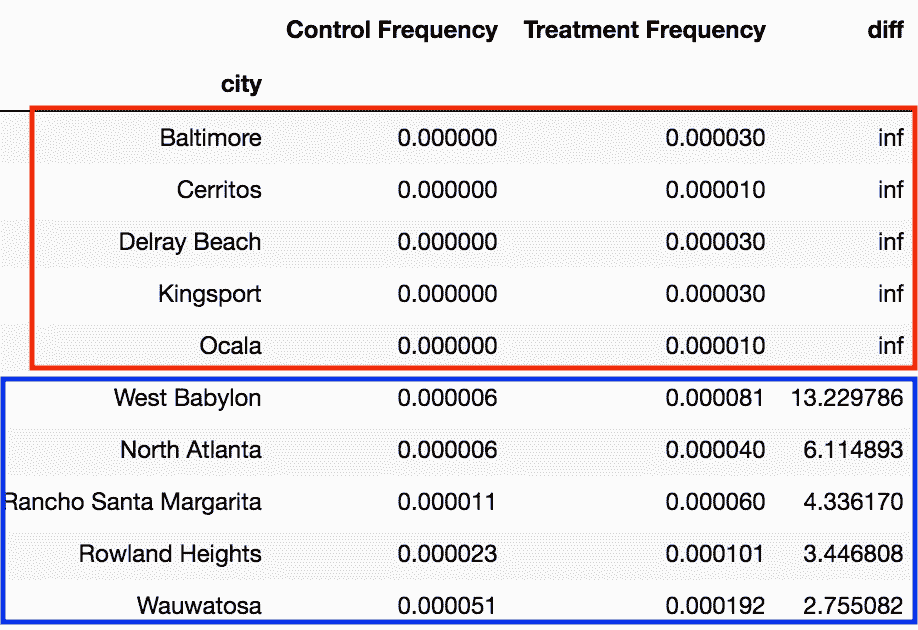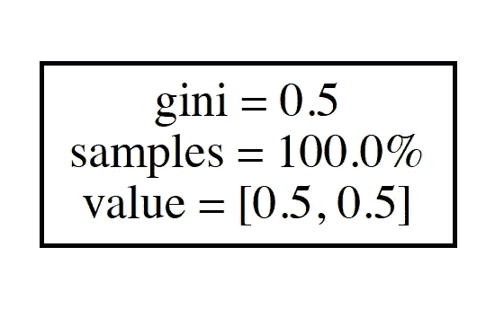

对于这个特殊的问题，结果如下。这意味着测试和控制数据集是完全随机的。

每组的预期收入是各组的价格乘以平均转换率。这为对照组的客户提供了 0.77 美元的期望值，为治疗组的客户提供了 0.91 美元的期望值。

下一步本质上是假设检验。无效假设是测试组和对照组之间没有显著差异，因此价格的变化没有影响。

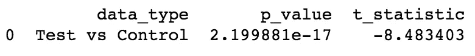

由于 p 值非常低，测试组和对照组之间转化率的任何可观察到的差异都不太可能纯粹是由于偶然。因此，可以拒绝零假设。这实质上意味着，当价格增加时，转换率肯定会降低，但与此同时，测试组的每个客户的平均收入率会提高。这意味着 A/B 测试是成功的，为了增加收入，产品可以以 59 美元而不是 39 美元出售。

然而，有一点需要注意的是，当以不同的价格展示相同的产品时，通过 A/B 测试的价格优化可能会变得棘手。如果测试管理不当，同一个用户最终可能会看到网站显示不同的价格点。这可能会导致一些负面影响。因此，确保以不同价格提供的产品彼此略有不同是很重要的。