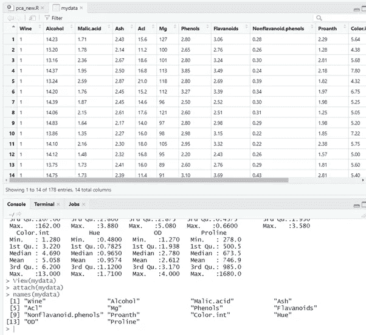

# 主成分分析-寻找主成分，主成分的方差和标准差计算。(使用 RStudio)(葡萄酒数据集)

> 原文：<https://medium.com/analytics-vidhya/principal-component-analysis-finding-principal-components-variance-and-standard-deviation-a5c12f887d05?source=collection_archive---------5----------------------->

## 程序和数据集的链接如下

pic Credit:-[think sprout Infotech](https://thinksproutinfotech.com/)

# 主要成分是什么？

主成分是数据中的基础结构。它们是差异最大的方向，也是数据最分散的方向。数据有多个主成分，每个主成分代表数据的不同方差。它们是按照时间顺序排列的。第一台 PC 将捕获最多的差异，即关于数据的最多信息，随后是第二台、第三台等等。

# **什么是主成分分析？**

主成分分析或 PCA 是机器学习中使用的最简单和最基本的技术之一。这是最古老的降维技术之一，因此，对它的理解对于任何有抱负的数据科学家或分析师都是至关重要的。对 R 中 PCA 的深入理解不仅有助于你实现有效的降维，而且有助于你为开发和理解其他先进的现代技术打下基础。

# PCA 旨在实现两个主要目标:

## 1.降维

现实生活中的数据有几个从大量资源中生成的特征。然而，我们的机器学习算法还不足以高效地处理高维数据。一次提供几个特征，几乎总是导致糟糕的结果，因为模型不能完全掌握和学习这样的量。这被称为“维数灾难”,它导致所实现的模型的结果不令人满意。R 中的主成分分析通过将 n 维投影到 n-x 维(其中 x 是正数)来帮助解决这个问题，尽可能地保留方差。换句话说，R 中的 PCA 通过将特征转换成较少数量的自身投影来减少特征的数量。

## 2.形象化

我们的可视化系统局限于二维空间，这使得我们无法对数据集中的高维特征形成视觉概念。R 中的 PCA 通过将 n 维投影到 2-D 环境解决了这个问题，实现了声音可视化。这些可视化有时揭示了大量的数据。例如，新的特征投影可以在 2-D 空间中形成集群，这在更高维度中是不可感知的。

# **使用葡萄酒数据集进行主成分分析的程序-**

## 步骤 1:加载所需的数据集。

我们可以在上面的代码中看到如何将数据集导入 RStudio。在成功导入数据集之后，attach()函数用于附加数据集的属性，以便可以在程序中递归地使用它们，而无需显式地提及数据集。下图显示了上述代码的输出。

## 步骤 2:绑定数据集中的列名。

输入:

“cbind”用于获取一系列向量、矩阵或数据帧参数，并分别通过 *c* 列或 *r* ows 进行组合。这些是通用函数，带有用于其他 R 类的方法。

输出:

## 步骤 3:在矩阵上应用主成分

输入:

princomp 对给定的数字数据矩阵执行主成分分析，并将结果作为 princomp 类的对象返回。

输出:

## 步骤 4:在图表上显示分析

输入:

Scree 图是一个简单的线段图，显示了每个 PC 所解释或表示的数据中总方差的分数。PCs 是有序的，因此根据定义，按照对总方差贡献的递减顺序分配一个数字标签。具有最大分数贡献的 PC 标有首选项文件中的标签名称。当横座标从左到右阅读时，这样的图通常可以显示总方差的明显分离违反，其中“最重要”的成分停止，而“最不重要”的成分开始。分离点通常被称为“肘部”。

一个*主成分分析双标图*(或简称 *PCA 双标图*)是一个二维图表，表示一个表格的行和列之间的关系。在 Q 中，可以使用 [Maps](https://wiki.q-researchsoftware.com/wiki/Maps) 对话框创建 PCA 双标图，该对话框在 Excel 或 PowerPoint 中生成双标图，或者通过选择**Create>Dimension Reduction>Principal Components Analysis 双标图**，该对话框使用 r。

输出:

点击[此处](https://github.com/kshitijved/Principal-Component-Analysis)下载程序和数据集…