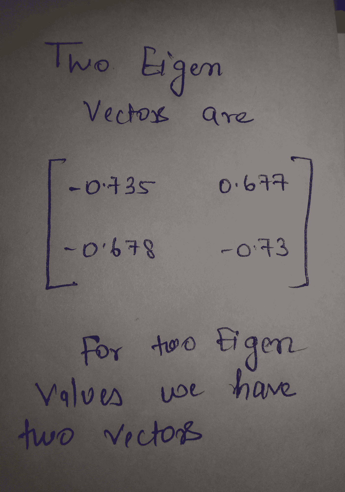

# 主成分分析降维

> 原文：<https://medium.com/analytics-vidhya/principal-component-analysis-for-dimensionality-reduction-432e718beed?source=collection_archive---------22----------------------->

机器学习是数据在行业中被视为福音的领域。在机器学习中，拥有过多的数据有时也会导致糟糕的结果。在某种程度上，数据中包含更多的要素(维度)会降低模型的质量。这个术语在数据科学中被称为**维度诅咒**。

# 什么是降维？

随着数据行业和互联网用户的增长，每天都会产生大量的数据。跨国公司有兴趣收集越来越多的用户数据，以改善他们的用户体验，更好地了解他们。我们可以说，大多数公司现在正在成为一种数据驱动的公司，以成为他们行业中的佼佼者。为此，他们不断收集每天都在大量增加的数据。

人们普遍认为，并非所有的数据都对训练人工智能模型有用。通过对结果没有显著影响的可视化，在开始阶段消除了许多不重要的维度。

并且使用降维技术进一步降维。

# 为什么？

1.  维度越少，训练时间越少。
2.  它会考虑多重共线性因素并移除冗余要素。
3.  易于可视化低维数据。

两种重要的和最新的降维技术是 PCA(主成分分析)和 TSNE (T 分布随机邻居嵌入)。在这篇博客中，我将涵盖 PCA 的所有理论概念。

> 很简单。所以屏住呼吸，让我们开始吧📖

# 主成分分析

它是一种无监督的线性变换技术，主要用于特征提取和降维。**无监督**因为它在没有任何监督的情况下，即靠自己发现模式和规律。

主成分分析的基础是标准的统计运算。主要是均值、协方差、特征向量、特征值。

因此，在开始理解和计算之前，让我们将我们要做的事情分成几个部分:

1.  标准化 *d* 维数据集，并获得每个维度的平均值。
2.  计算协方差矩阵。
3.  从协方差矩阵评估特征值。
4.  从特征值计算特征向量。
5.  选择与 *k* 个最大特征值对应的 *k* 个特征向量，其中 *k* 是您想要减少数据集的维数(k ≤ d)。
6.  选定特征向量的主分量或投影矩阵。
7.  使用投影矩阵变换 *d* 维输入数据集，以获得新的 *k* 维数据集。

> 只有这么多了😎

我将用一个随机的二维例子来解释这一切，您可以进一步将这个例子应用于任何多维数据集以降低维数。

所以让我们开始吧，伙计们…📑

举例来说，让我们看看这个简单的二维数据，它有两列 X 和 y。

二维简单数据集。

因此，我们的第一步也是最基本的一步是计算每列的平均值，如上图所示，mean_X = 1.81，mean_Y = 1.91。

有两种选择，要么您可以先标准化数据，要么只从平均值开始，它将在协方差矩阵计算中保持平衡

协方差矩阵公式

c 是我们需要计算的主要协方差矩阵。注意:因为我们有两列，所以它的维数是 2 x 2。如果我们有更多的列，它会相应增加。

对于完整的协方差矩阵，我们需要计算不同组合的协方差。其公式如上所示，即 Cov。

示例→

我们如何计算特定组合的协方差的一个小例子。

像这样，我们将计算我们的完整协方差矩阵，最终矩阵看起来像这样→

最终协方差矩阵

现在我们已经完成了计算主成分的一半任务。现在我们需要计算特征向量。为此我们使用公式。

> C — λ I = 0

其中 C 是我们计算的协方差矩阵，I 是单位矩阵。λ会给出我们的特征值。

使用以下公式获得的两个特征值

使用给定的公式将形成一个矩阵，在计算矩阵的行列式后，我们将得到λ中的二次方程。这样，我们可以计算两个特征值。

在这之后，重要的一步是从这些特征值计算特征向量。

现在我们将把不同的特征值放到前面的方程中来计算不同的特征向量。像这样。

计算特征向量

对于 1 个特征值，我们将得到如上所述的两个方程，用它们我们可以计算一个特定的特征向量。像这样，对于这个例子，我们可以计算两个特征值的两个特征向量。那么相同的特征向量以矩阵形式显示在下面。

获得最终特征向量

# 我们是否降低了维度🤔

显然不是！！直到现在。

到目前为止，我们只计算了特征向量。首先，我们需要计算我们的主成分来降低维数。

那么如何计算主成分呢？

为此，我们首先需要关注特征值。较大的特征值更重要，因此关于该特定特征值的向量将比另一个更重要。

我们只取了两个维度。但是以一种概括的方式，我们可以说，为了将维数减少到 k，我们将只取前 k 个重要的特征向量。它将计算我们的主成分。我们将留下剩下的一个。

有了主成分之后怎么办？

有了 k 个特征向量，我们就得到了我们的主分量或者所谓的投影矩阵。现在只需利用投影矩阵变换 *d* 维输入数据集 ***X*** 即可获得新的 *k* 维特征子空间。

我们已经用主成分分析完成了降维。

现在在哪里？

因为现在你已经学会了使用主成分分析进行降维。现在我会建议你把你的手弄脏一点，然后编写这个代码。我将在下一篇博文中讨论代码。

你还必须知道降维的 TSNE 算法。因为 PCA 我认为算法有点老。但是 TSNE 是最新的，也是使用率最高的。我会在以后的博客中介绍 TSNE 的概念。

在那之前，祝你学习愉快，保持安全！！

如果你喜欢，请鼓掌👏👏。

**也请看看我以前的博文。**

## [Yolo 物体探测变得容易](/analytics-vidhya/yolo-object-detection-made-easy-7b17cc3e782f?source=your_stories_page---------------------------)

## [P 值，T 检验，卡方检验，ANOVA，什么时候用哪种策略？](/@2017167/p-value-t-test-chi-square-test-anova-when-to-use-which-strategy-32907734aa0e?source=your_stories_page---------------------------)

## [了解数据科学的假设检验](/@2017167/understanding-hypothesis-testing-for-data-science-df952bbc1ef9?source=your_stories_page---------------------------)