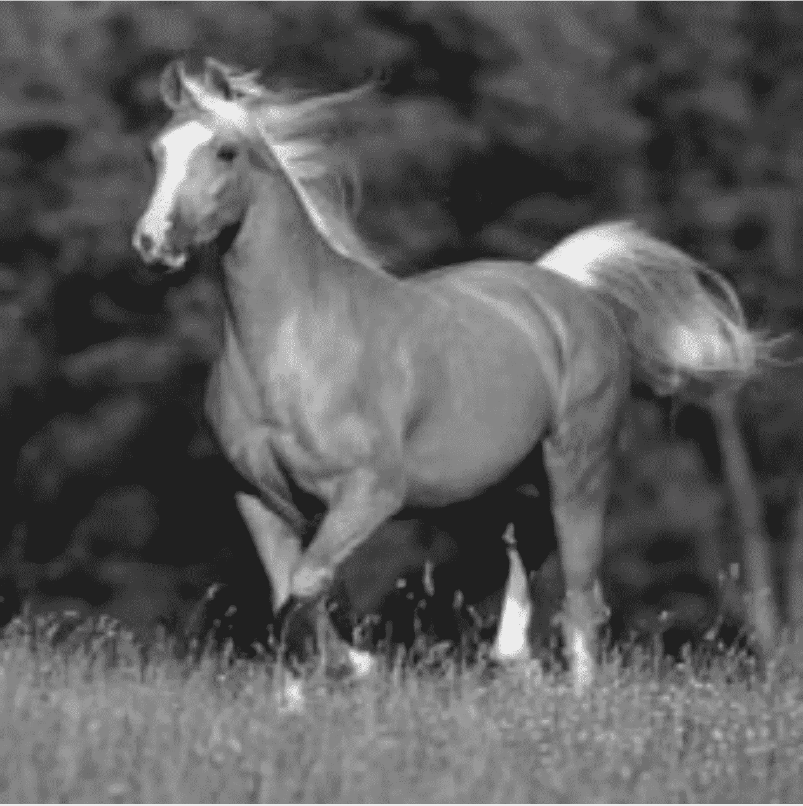
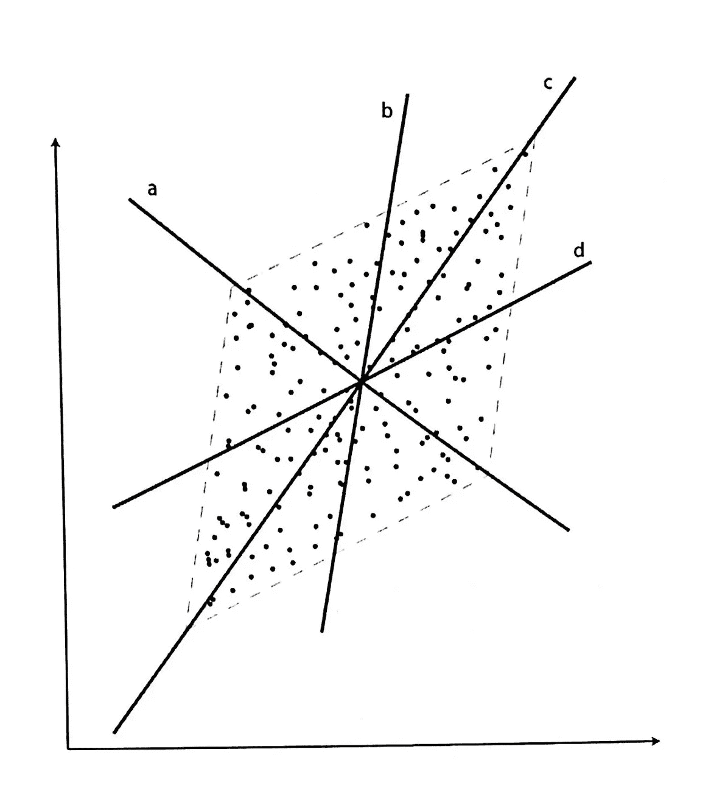
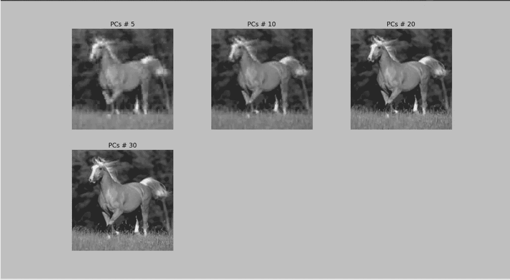

# 图像的主成分分析

> 原文：<https://medium.com/analytics-vidhya/principal-component-analysis-of-an-image-7e62105b2fa2?source=collection_archive---------8----------------------->

**简介**

主成分分析是一种流行的线性降维技术。现实世界中的数据是非常高维的，所以我们使用降维方法将数据降低到 2 维。本文的目的是利用主成分分析对图像进行压缩。

高维数据是稀疏的，不能对数据应用适当的统计方法。图像尺寸为 200×200 像素。

**主成分分析**

主成分分析是一种无监督的算法，其中我们没有标签。它寻找独立的正交投影。第一个主成分是数据中最大方差的方向，依此类推。主成分是线性不相关的。例如:在上面的散点图中，第一个主成分是 **c** ，它在最大方差的方向上，这意味着数据的扩散，并且将给出关于数据的最大信息。第二个主成分是 **a** ，它与 **c** 正交，与第一个主成分相比，它给出的数据信息较少，依此类推。高维数据中的数据将被投影到这两个主成分上，这两个主成分将以最小的信息损失处于二维中。

**方法**

1.  加载图像
2.  将图像分成 400 个 10 乘 10 的像素块，这样第一个块包含第 1-10 行、第 1-10 列的像素，第二个块包含第 1-10 行、第 11-20 列的像素，依此类推。每个块包含 100 个像素值，可以认为是一个 100 维的输入向量，总共有 400 个这样的 100 维输入向量。
3.  计算该数据集的第一个 PCA 分量(400 个项目，100 个特征)，并将每个输入向量投影到该分量上，结果是每个输入向量一个标量值。
4.  将标量值投影回来作为原始要素的重构，结果是每个输入向量有一个 100 维的向量。画出结果图:对于每个像素块，画出近似值，而不是原始像素值。
5.  对 2 个组件、5 个、10 个、20 个和 30 个 PCA 组件执行相同的程序。

**结果**

从上面的结果我们可以看到，我们从 5 个主要成分开始，随着我们的进一步发展，图像的质量得到了改善。有了 30 个主成分，我们就能得到相当好的图像。我们能够从第一主成分得到的信息量是 89%,这真的很好

**结论**

我们能够通过仅取 30 个主成分来压缩图像，并且与原始图像相比，我们得到了非常好的结果。我已经把代码和图像文件一起上传到了我的 github 账户上。您可以尝试增加主成分，看看它如何提高图像的质量。

github:[https://github . com/mustu fain/DimensionalityReduction/tree/master/B3](https://github.com/Mustufain/DimensionalityReduction/tree/master/B3)

欢迎建议，谢谢:)

# 发布者

*最初发表于*[T5【https://www.linkedin.com】](https://www.linkedin.com/pulse/principal-component-analysis-image-mustufain-abbas/)*。*