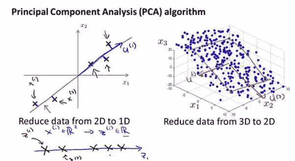
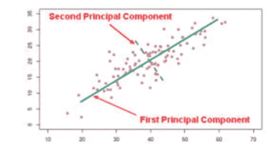

# 主成分分析

> 原文：<https://medium.com/analytics-vidhya/principal-component-analysis-pca-8a0fcba2e30c?source=collection_archive---------1----------------------->

主成分分析(PCA)是一种降维过程，它允许将给定数据集中的变量数量减少到可用于数据分析的更小的变量集。主成分分析可以正式定义为一种统计过程，用于将一组相关变量映射为一组较小的线性不相关变量，同时尽可能保留原始数据集中的方差。

减少的变量集试图保留原始数据集中存在的最大方差。这在机器学习中非常有用，因为训练所需的数据量与建模中使用的变量数量有关。移除的变量是那些本质上相似或者可以从其他未移除的变量中推导出来的变量，因此它们不会给数据集增加新的值。

在一个简单的例子中，给定三个维度的测量值，即杯子的体积、杯子中的茶的体积和可以装满茶的体积，PCA 可以将它们简化为一个变量，该变量包括随着茶水平的变化而变化的信息。

# **PCA 的应用:**

# 1.量化金融

假设我们被要求建立一个股票表现的预测模型。为了精确建模，我们将考虑与股票表现相关的所有测量维度。

这些变量可以包括不同类别的财务比率、劳动力市场、住房变量、情绪测量、GDP 测量、通货膨胀、失业率以及收盘价、开盘价、日内高点、日内低点、alpha、beta 和个股基本面。

某大股票经纪公司提供的用于选股的变量快速分析，提供了 30 多个变量供分析。

有些变量可能是相互关联的，有些甚至可能没有为分析增加任何额外的信息。即使对懂金融的人来说，直观地评估所有变量之间的相关性可能也不明显。

PCA 可以应用于这些大的变量集，并提取代表原始数据中接近全部方差的备选变量的精简集。较小的集合可以用来评估股票表现的不同模型。

使用简化的主成分的性能模型然后可以用于规划容量需求、性能瓶颈检测和性能预测。

# 2.神经系统科学

# **3。图像压缩**

图像压缩是使用降维技术的 PCA 的常见应用。

# **4。数据可视化**

包含大量变量的数据集通常有一个较小的变量子集，这些变量可以捕获变量所代表的大部分方差。

理解 PCA 应用的一种方式是整理出在不同子空间中表示数据的变量子集，同时保留原始数据集的大部分方差。

# **用于计算 PCA 的术语:**

使用线性代数导出主分量的简单解决方案是基于协方差矩阵。可以使用奇异值分解(SVD)方法导出 PCA 的一般版本。

## **协方差矩阵:**

计算变量之间的相对关系可以通过使用协方差计算来完成。如果变量之间没有关系，那么协方差将为 0，如果变量之间相关性很高，那么协方差值在正相关时接近 1，在负相关时接近-1。

## **对角矩阵:**

如果一个矩阵的所有元素都为 0，除了

对角线元素。*对角矩阵*沿不同坐标轴缩放数据。特征值的*对角矩阵*给出了沿不同主分量轴的数据方差(它们的标度)的度量。

## **特征向量:**

特征向量是这样一个向量，当它应用于一个方阵 M 时，将只改变矩阵的标量部分，而保持方向不变。

## **对称矩阵:**

对称矩阵具有转置矩阵等于原始矩阵的性质。

## **奇异值分解(SVD):**

在线性代数中，奇异值分解(SVD)是实矩阵或复矩阵的因式分解，其通过极坐标分解的扩展将标准方阵的特征分解推广到任何 m×n 矩阵。

奇异值分解的数学应用包括计算伪逆、矩阵近似，以及确定矩阵的秩、值域和零空间。SVD 在科学、工程和统计的所有领域都非常有用，例如信号处理、数据的最小二乘拟合和过程控制。

# **计算主成分分析:**

## **数据特征**

主成分可以表示为观察度量的线性方程。有一种处理变量关系非线性的研究叫做核 PCA。我们关注线性 PCA。

使用 PCA 导出的主成分说明了原始数据集在具有较少数量变量的计算 PC 的方差中的总体方差。

有一个隐含的假设，即均值和方差描述了被观察变量的整个分布。这些可以用方差来描述的零均值分布只在高斯或正态分布中成立。

观察变量中的大方差将对计算的主成分的总体方差贡献最大。如果变量的观察值具有非常不同的范围，那么数据需要被标准化/缩放。当对主成分计算应用相关性分析时。

## **数据预处理:**

考虑距离和时间这两个测量变量的例子。如果距离以厘米为单位，时间以小时为单位，那么合成的主分量就偏向距离轴。

然而，如果距离以公里为单位，时间以秒为单位，那么计算出的主分量将偏向时间轴，而不是距离。

为了克服由于变量值的缩放而导致的倾斜问题，通过标准化进行特征缩放，作为对数据的预处理步骤。标准化也称为 z 均值归一化，将数据转换为均值 0 和标准差 1。

## **选择主成分:**

通过计算协方差矩阵并对结果矩阵执行 SVD 来计算主分量。

通常，您希望捕获的方差误差小于 0.01 /1%，并且选择的分量使主分量捕获数据集中 99%的原始方差。

通过简单地计算总方差的比例，可以容易地计算出误差。

# **PCA 的缺点:**

**自变量变得更难解释:**

对数据集实施 PCA 后，原始要素将变成主成分。主成分是原始特征的线性组合。主要成分不像原始特征那样可读和可解释。

**PCA 前必须进行数据标准化:**

您必须在实现 PCA 之前标准化您的数据，否则 PCA 将无法找到最佳的主成分。

例如，如果一个特征集有以千克、光年或百万为单位表示的数据，那么在训练集中，方差规模是巨大的。如果对这样的特征集应用 PCA，那么具有高方差的特征的合成负载也将很大。因此，主成分将偏向于具有高方差的特征，导致错误的结果。

此外，为了标准化，在可以应用 PCA 之前，需要将所有的分类特征转换成数字特征。

PCA 受到比例的影响，因此在应用 PCA 之前，需要对数据中的要素进行比例缩放。使用 **Scikit Learn** 中的 **StandardScaler** 将数据集特征标准化为单位尺度(均值= 0，标准差= 1)，这是许多机器学习算法实现最佳性能的要求。

**信息丢失:**

尽管主成分试图覆盖数据集中各要素之间的最大差异，但如果我们不仔细选择主成分的数量，与原始要素列表相比，它可能会丢失一些信息。

**过度拟合:**

当特征的数量很大并且没有足够的数据时，会发生模型构造过拟合。为了减少特征的数量，有时在假设减少的特征数量将避免过度拟合的情况下使用 PCA。

使用 PCA 来避免过度拟合会导致不好的结果。使用正则化技术和更好的数据集可以更好地解决过拟合问题。

**模型生成:**

PCA 用于生成主成分(PCs)作为降维集。计算降维数据，然后使用逻辑回归来训练模型，以对系统建模。

使用 PCs 来构建模型会在预测新输入数据时产生较大误差。

一种替代方法是从数据中提取原始因子。公因子分析是一种识别原始变量组合的方法，它可以使观察变量的方差最大化。

这不同于使原始变量的总方差最大化的 PCA。这些也被称为潜在因素或隐藏变量，封装了观察变量的组合方差。

当相关矩阵不仅在对角线上而且在矩阵的其他部分都具有高值时，这种计算因子的方法是有用的。潜在因素在建模中往往比个人计算机表现得更好。

基于原始变量的建模应该是首选，只有当尺寸比例出现问题时，才应该考虑基于 PCs 的模型生成。

**模式解读:**

主成分负荷代表变量的相关因子。我们可以根据负载的大小和符号来推断变量是正相关还是负相关。

然而，我们不能过度解释加载大小和方向，因为主成分 1 中低加载值的变量可能在其他主成分中具有较高的值。

当试图解释模型时，使用公共因子(CF)分析将提供更好的解释。