# 主成分分析(PCA) —详细解释

> 原文：<https://medium.com/analytics-vidhya/principal-component-analysis-pca-detailed-explanation-using-python-dff5fff8c5af?source=collection_archive---------13----------------------->

# 简介:

主成分分析是基本的降维技术，它帮助我们降低数据集的维数并排除不需要的特征。当数据集有数百维时，主成分分析很重要，我们可以用它来提取包含更多信息的特征。由于我们不能可视化超过 3 个维度，我们可以使用 PCA 来减少维度以可视化数据。

在这个博客中，我们将涵盖以下主题-

1.  PCA 基础。
2.  高级数学。
3.  使用 Python 实现。

**什么是主成分？**

主成分分析是一种数学工具，有助于将数据集的维度/相关变量/特征从大量变量减少到不相关的变量。在这个过程中，被丢弃的特征是那些不能充分解释数据的特征，而保留了那些更能解释数据的特征，因此被称为主成分。

## **主成分分析如何降维？**

让我们看一些 PCA 如何决定保留哪些特征的例子，

**例 1-** 假设 2D 数据集 X 有两个特征(F1，F2)，我们想把它变成 1D。

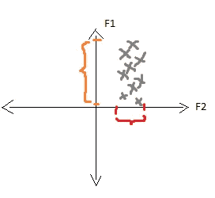

在上图中,“x”代表 2D 图中绘制的数据点。F1、F2 是数据集(X)中的要素。橙色选择显示 F1 上数据点的分布。红色选择显示 F2 上数据点的分布。

我们可以观察到 F1 上的数据点的分布/方差大于 F2 上的数据点的分布/方差，这意味着 F1 比 F2 更多地解释了数据集 X。

我们的任务是使给定的数据集成为 1D，因此我们可以排除的特征是 F2，因为它具有关于数据集的较少信息。

**示例 2 —** 假设数据集(X)有 2 个特征(F1，F2)，我们必须将给定数据集的维数减少到 1D。

数据点的分布如下图所示:

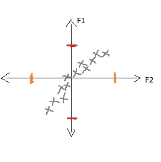

在上图中，x '代表数据点绘制在 2D 图中。F1、F2 是数据集(X)中的要素。

在本例中，两个特征上的数据分布完全相同。这里，PCA 找到新的方向 F2 ’,在该方向上数据点具有更大的分布，如下图所示。

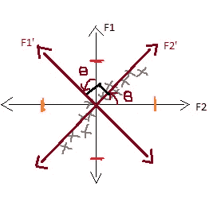

现在 F2’比 F1’具有更大的价差/方差。F1’从 f1 偏移ѳ角(θ), F2’从 F2 偏移相同的ѳ角(θ)。

因为我们有具有较小分布的 F1’和具有较大分布的 F2’，所以我们可以排除 F1’并将所有数据点投影到 F2’上，并使用 F2’来可视化 1D 的数据。

由上面的例子我们可以说，
1。我们旋转轴来寻找方差最大的 F2’。
2。放弃 F1。

## **PCA 的数学表示-**

我们不需要 F2 '作为一个整体，方向足以在它上面绘制和投影所有的数据点。所以我们称 F2 '为 u1，它是沿着 F2 '方向的单位向量。

因此，u1 是这样一个方向，如果我们在这个方向上投影每个点，扩散/方差将是最大的，它的长度是 1，即

||u1|| = 1

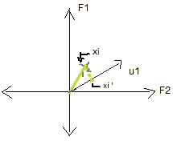

在上图中，我们绘制了一个称为 xi 的数据点，并将其投影到我们新发现的方向 u1 上，称为 xi。

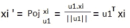

因为单位向量 u1 (||u1||)的长度是 1，我们只取 u1.xi 的点积的表示，现在对于每个点 xi，我们可以用 u1 计算 xi。

如果我们将 I 从 1 到 n 变化的 xi 的平均值作为 x̄，并将其乘以 u1 转置，我们将得到 Xi 的平均向量“作为 x̄”,如下所示

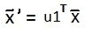

**Q1** —找到 u1，使得 xi 投影到 u1 上的点的方差最大，即

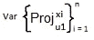

根据定义，xi 的投影可以写成如下:

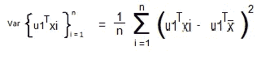

我们的数据集 x 是[列标准化](https://www.youtube.com/watch?time_continue=7&v=Mg5ixxRmnA0) d，即 x 的平均向量(x̄)将为零。所以我们的等式会变成

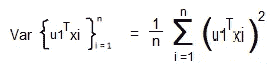

**PCA 的替代公式——距离最小化**

与前面的问题不同，在距离最小化中，PCA 找到所有投影点的距离都较小的 u1。

当我们在特定方向上获得最大方差时，相同方向是所有数据点之间距离最小的方向。

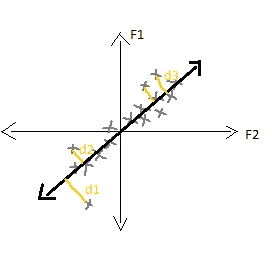

di =点的距离。

**Q2-** 找出使距离平方和最小的 u1。

我们画一个点，试着找出它离 u1 的距离。在下图中，我们把 xi 作为一个点。

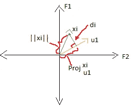

在这里，图表形成直角三角形，使用毕达哥拉斯定理，我们可以计算每个点的距离 di。

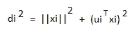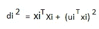

现在使用这个数据，我们可以找到 u1，在 u1 上所有点的平方距离的和是最小的。

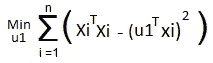

我们已经把 di 平方的值放到上面的公式里了。

## 查找 u1

现在，我们将找到上述两个优化问题的解决方案，这意味着我们将尝试找到方向 u1，

1.让我们取一个数据集 X，它是 n×d 矩阵，列是标准化的。

2.计算 X 的[协方差矩阵](https://www.youtube.com/watch?time_continue=732&v=1HLLmFmy3Uw)称之为 S，将为 d×d 矩阵。

3.求 S 的特征值，它们是λ1，λ2，λ3，…，λd

让我们假设λ1 >= λ2 >= λ3 >=…，> = λd

这意味着λ1 是最大特征值。

计算特征值和向量非常简单，因为在 python 中，Numpy 库中有一个函数 eigen 可以给出特征值。

4.对于每个特征值都有相应的特征向量，计算特征向量 v1，v2，v3，…，vd。

特征向量有一个很好的性质，每对特征向量都是相互垂直的。

5.最大的特征向量是 u1，

u1 = v1

## **观察结果**

1.V1 是具有最大传播的向量，V2 对应于第二大传播方向，以此类推。

2.λi/总和(λI)表示通过选择 Vi 向量，我们将保留多少百分比的信息/分布。

## 使用主成分分析的实时降维示例:

我们将从 Kaggle.com 获得 MNIST 数据集，并尝试在 2D 将其可视化。

关于 MNIST-这是手写数字图像的数据集。每张图片的尺寸都是 28 x 28。我们在这个数据集中有 4200 个数据点，从中将实现 15000 个数据点。我们将使用名为 sklearn 的 python 库将 MNIST 数据集的维数从 784 维减少到 2 维。

要在 MNIST 上应用 PCA，Python 代码如下所示:

```
#First read the csv(comma separated file) containing MNIST dataset. *import pandas as pd
import numpy as np**# save the labels to a Pandas series 
targetd0 = pd.read_csv(‘./mnist_train.csv’)
l = d0['label']**# Drop the label feature
d = d0.drop("label",axis=1)*
```

这个数据集中的标签是写在图像中的实际数字。对于每个数据点，已经给出了标签。

```
*# Pick first 15K data-points to work on for time-efficiency.
labels = l.head(15000)
data = d.head(15000)*
```

我们从总数 42000 点中抽取了 15000 点，并存储在可变数据中。

```
from sklearn.preprocessing import StandardScalerstandardized_data = StandardScaler().fit_transform(data)#find the co-variance matrix which is : A^T * A
sample_data = standardized_data#matrix multiplication using numpy
covar_matrix = np.matmul(sample_data.T , sample_data)#finding the top two eigen-values and corresponding eigen-vectors
#for projecting onto a 2-Dim space.
from scipy.linalg import eigh#the parameter ‘eigvals’ is defined (low value to high value)
#eigh function will return the eigen values in ascending order
#this code generates only the top 2 (782 and 783) eigenvalues.
values, vectors = eigh(covar_matrix, eigvals=(782,783))#projecting the original data sample on the plane
#formed by two principal eigen vectors by vector-vector #multiplication.
import matplotlib.pyplot as plt
new_coordinates = np.matmul(vectors, sample_data.T)print(“ resultanat new data points’ shape “, vectors.shape, “*”, sample_data.T.shape,” = “, new_coordinates.shape)#appending label to the 2d projected data
new_coordinates = np.vstack((new_coordinates, labels)).T#creating a new data frame for plotting the labeled points.
dataframe = pd.DataFrame(data=new_coordinates, columns=(“1st_principal”, “2nd_principal”, “label”))print(dataframe.head())#plotting the 2d data points with seaborn
import seaborn as sn
sn.FacetGrid(dataframe, hue=”label”, size=6).map(plt.scatter, ‘1st_principal’, ‘2nd_principal’).add_legend()plt.show()
```

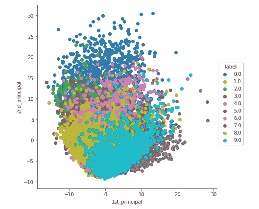

在上面的例子中，我们通过计算所有需要的项，如协方差、特征值、特征向量等来计算 PCA。因此，为了绕过所有这些步骤，我们在 python 中有一个名为 sklearn 库，我们现在将学习它。

## 使用 sklearn 实现 PCA:

```
#initializing PCA
from sklearn import decomposition
pca = decomposition.PCA()#set number of parameter as 2
pca.n_components = 2
pca_data = pca.fit_transform(sample_data)#pca_reduced will contain the 2-d projects of simple data
print(“shape of pca_reduced.shape = “, pca_data.shape)#attaching the label for each 2-d data point
pca_data = np.vstack((pca_data.T, labels)).T#creating a new data from which help us in plotting the result data
pca_df = pd.DataFrame(data=pca_data, columns=(“1st_principal”, “2nd_principal”, “label”))sn.FacetGrid(pca_df, hue=”label”, size=6).map(plt.scatter, ‘1st_principal’, ‘2nd_principal’).add_legend()
plt.show()
```

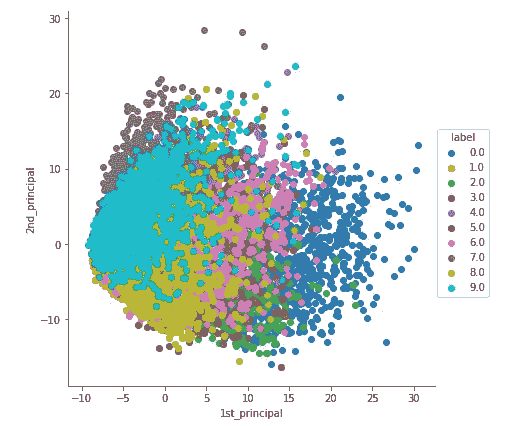

sklearn 是一个非常有用的 python 库，它将我们上面的所有步骤简化为一行。在 sklearn 中，有一个称为分解的模块，它具有 PCA 功能，只需对给定的数据集应用 PCA，而不需要像以前的代码那样单独计算任何特征值和特征向量。因此，我们在上面创建了一个新的变量来存储 PCA。使用该变量，我们将维数减少到 2，特征值、特征向量、协方差的所有计算将在单个函数*fit _ transform(sample _ data)*中进行，然后我们将检查数据的形状，最后我们将把它放入 dataframe 并绘制出来。上图显示了我们的 PCA 的输出，和之前的一样，只是旋转了 90 度。

## PCA 的局限性-

1.  它不适用于循环数据传播，因为它丢失了大量信息。
2.  对于不同象限中分离良好的群集，它也可能丢失大量信息。
3.  如果数据像正弦波，那么 PCA 也会丢失数据。

## 确认-

感谢[应用人工智能课程](https://www.appliedaicourse.com/course/applied-ai-course-online/)和团队传授理念。

# 参考文献-

1.  [https://www . applied ai course . com/course/applied-ai-course-online](https://www.appliedaicourse.com/course/applied-ai-course-online/)
2.  [https://www.kaggle.com/](https://www.kaggle.com/)