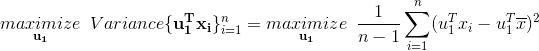

# 主成分分析(PCA) —深入研究

> 原文：<https://medium.com/analytics-vidhya/principal-component-analysis-pca-dive-deep-411db0f9ee10?source=collection_archive---------4----------------------->

## 降维的基本术语和直觉。

[兔子](https://pngtree.com/rabbit%E6%8D%B7_8236194?type=2)**T3[桃树](https://pngtree.com/freebackground/creative-hand-painted-lamp-business-vector-banner-material_270245.html)上的照片**

这篇文章的目的是让读者感受到降维技术**主成分分析**背后的几何和数学直觉。所以，我们继续吧。

此商品的物流如下:

1.  *协方差矩阵，*
2.  *几何解释，*
3.  *目标函数、约束优化问题和*
4.  *优化问题的解决方案*。

首先，让我们熟悉一些基本术语，

[**方差**](https://en.wikipedia.org/wiki/Variance) **:** 方差是一个数据集展开程度的度量。它在数学上被定义为一个[随机变量](https://www.statisticshowto.datasciencecentral.com/random-variable/) (X)的平均值的方差的平均值。

[**协方差**](https://en.wikipedia.org/wiki/Covariance) **:** 协方差是两个随机变量之间关系的度量。该指标评估变量一起变化的程度。

**负的 CoVar-随着 X 增加 Y 减少|零-无关系|正的 CoVar-随着 X 增加 Y 增加**

> ***1。协方差矩阵(C) :*** *以矩阵的形式表示给定数据集(X)的维度之间的协方差。*

例如，考虑一个三维数据集(X ),那么它的协方差矩阵(C)是，

**这里，n(=4) — #个数据点和 d(=3) — #维度。**

这里，沿对角线的协方差表示每个维度的方差。
当 C(i，j) = C(j，I)时，协方差矩阵(C)是对称的。
我们可以把协方差矩阵写成矩阵符号如下，

如果像[列标准化](https://en.wikipedia.org/wiki/Feature_scaling#Standardization_(Z-score_Normalization))这样的标准形式应用于数据集，那么所有维度的平均值和方差将为 0 和 1。因此，我们可以将协方差矩阵写成:

> ***主成分分析:***

现实世界的数据太杂乱，高度多维，我们执行数据分析，对这些数据进行绘图，以找到其中隐藏的模式，并使用这些模式来训练机器学习模型。但是随着维数的增加，可视化和计算的难度也在增加。

因此，我们需要以某种方式减少#维，以便最大限度地保留信息。我们可以想到的一些方法是，
*删除不必要/多余的维度，
*只包含最重要的维度。

主成分分析(PCA)就是这样一种最简单的降维技术，它保留了沿称为主轴的每个正交维度的最大方差/扩散。
常用于使数据在低维空间中易于探索和可视化。

这些新的正交维度基于方差和它们一起排列，即更重要的主轴首先是具有最大方差/扩展的主轴。

> ***2。几何解释:*** *这里我们来通过一个几何解释来说明维度是如何减少的。*

**情况— 1:一个轴上的方差大于其他轴上的方差。** 让我们考虑一个具有两个维度/特征的数据集(X)，比如一个人的身高和体重，

**n — #个数据点，具有 d — 2 维。**

当我们绘制该数据集的散点图时，我们可以观察到 F1(2–8)的方差大于 F2(4–6)。

数据的散点图

**维数减少的数据集**

因此，我们可以跳过 F2，仅将特征 F1 包括在我们的数据集中，保留具有最大信息的方向。

**情况— 2:沿所有轴的方差相等。** 让我们考虑一个数据集，它在两个轴上都有相等的方差，

沿所有维度的方差( **F1，F2** )几乎相同。
所以，现在我们确实找到了新的维度( **F1 '，F2'** )，即向量，使得方差沿着其中一个最大化，如上图所示，使用轴旋转技术。

1.  将数据点 X(i)的[投影](https://en.wikipedia.org/wiki/Vector_projection)到**Fi’**上，得到 **Fi** 维空间在**Fi’**维空间的对应坐标，
2.  沿**F1’**的方差大于沿**F2’**的方差，
3.  我们可以跳过**F2’**，只包含**F1’**。

—此处**F1’**为第一主轴，**F2’**为第二主轴。

既然我们已经获得了不同维空间中的最大方差轴，我们可以跳过该空间中方差较小的维，并在相同的维中操作。

> ***3。目标函数:*** *既然我们已经看到了 PCA 的几何解释，现在我们来看看它的数学视角。*

考虑前面的几何解释的例子，从上面的
图(a)我们可以看到沿着**F1’**的扩散是最大的，我们只需要最大扩散的那个方向。
所以，我们需要沿着那个方向找一个单位向量(**u1**),
即大小为 **||u1||=1** 。

让原始数据集成为，

从上图(b)中我们可以看到 **x'(i)** 是 **x(i)** 在 **u1** 上的投影。

现在低维空间中的新投影数据集是，

**目标:**最后我们要找到**‘u1’**使得 **x(i)** 在单位向量( **u1** )上的投影方差最大，

> 在进行主成分分析之前最好要小心，我们应该始终归一化我们的数据，因为如果我们使用不同尺度的数据(这里的特征),我们将得到误导性的主成分。
> 典型的标准化形式是 [**列标准化**](https://en.wikipedia.org/wiki/Feature_scaling#Standardization_(Z-score_Normalization)) **。为了简单起见，我假设我们已经标准化了数据。**

由于我们已经对数据集( **D** )特征应用了列标准化，因此每个特征的平均向量值将为零。

因此，用于寻找最大扩展主成分的数学目标函数( **ui 的**)可以写成:

我们可以用矩阵符号写上面的优化问题，使用我们在开始时学过的
协方差矩阵( **C** ),

上述类型的问题被称为[约束优化](https://en.wikipedia.org/wiki/Constrained_optimization#General_form)问题，其中每个主成分( **ui** )的约束是单位向量。

由于分量彼此正交，任何两个分量之间的[点积](https://en.wikipedia.org/wiki/Dot_product#Properties)为零。

> ***4。求解约束优化问题:***

既然我们已经讨论了优化函数的数学目标，现在我们将讨论它的求解部分。

我们可以用我们老的友好技术[拉格朗日乘子](https://en.wikipedia.org/wiki/Lagrange_multiplier)来解决这个约束优化问题，并把它变成拉格朗日形式，

上面的方程( **1** )是[特征值&特征向量](https://en.wikipedia.org/wiki/Eigenvalues_and_eigenvectors)的定义，其中**‘u1’**是特征向量，**‘λ’**是**‘C’**对应的特征值，即**‘X’的协方差矩阵。** 同样，我们可以求出协方差矩阵**‘C’**(**d**)的其他特征向量( **ui** )和特征值( **λi** )。因此，主成分分析得出特征值和特征向量。

**属性:**

现在，选择#维，使得在其他维空间中捕获最大方差是执行 PCA 的关键。这可以通过我们在求解优化问题时得到的特征值( **λi** )来实现。
从这个特征值我们可以生成累积方差比率为，

**方差比**告诉我们不同#分量在新维度空间中保留的信息百分比。

用不同的#维数和相应的方差比为 MNIST 数据集绘图。

—这是通过解决我们在上一节中看到的约束优化问题获得的不同#维的典型 PCA 累积方差比图。
—我们可以根据新维度空间中要保留的最大或所需信息量来选择# dimensions。

一旦我们选择了#维，我们现在可以将原始数据集( **D** )点投影到这些顶部#特征向量上，并获得具有减少的维的新数据集(**D’**)。

通常，PCA 用于在低维空间( **2D** )中可视化高维数据(**和**)，以便我们了解数据点在高维空间中是如何分布的。

> ***局限性:***

1.  **线性** : PCA 假设主成分是原始特征的线性组合。如果这个假设不成立，那么它会给我们误导性的结果。
2.  **较大的方差意味着更多的结构:** PCA 通过将方差作为特定维度重要性的度量，试图保留数据的全局结构而不是局部结构。如下图' **A** '所示，当数据没有适当展开时，有时可能会导致一些信息丢失。

来源:[主成分分析教程](https://arxiv.org/pdf/1404.1100.pdf)

红色箭头表示主轴，它没有按照假设获取完整的方差。

3.**正交性:** PCA 也是假设主成分互相正交。从上面的图' **B** ' 可以看出，由于主轴是正交的，所以有一些信息丢失。

由于 PCA 是一种相当古老的技术，当上述假设失败时，有相当多的工作在改进它。根据不同的用例，我们可能想要使用[中的一种更高级的技术](https://www.analyticsvidhya.com/blog/2018/08/dimensionality-reduction-techniques-python/)。

> ***结论* :**

**主成分分析** ( **PCA** ) 是一种 ***无监督*** 技术，用于预处理和降低高维数据的维度，同时保留原始数据集固有的原始结构和关系，以便机器学习模型仍然可以从中学习并用于做出准确的预测。

非常好看的直观解释，也是我最喜欢的，可以去翻翻，
[**主成分分析** ( **PCA** )](http://setosa.io/ev/principal-component-analysis/) 。

这使我们结束了关于基本降维技术背后的直觉的讨论，**主成分分析** ( **PCA** )。
如果你发现帖子中有什么错误或者有什么补充的话就在评论里讨论吧:P **。**

参考资料:
【1】[https://www.appliedaicourse.com](https://www.appliedaicourse.com)
【2】[https://en.wikipedia.org/wiki/Principal_component_analysis](https://en.wikipedia.org/wiki/Principal_component_analysis)
【3】[https://www.statisticshowto.datasciencecentral.com/](https://www.statisticshowto.datasciencecentral.com/)
【4】[http://setosa.io/ev/eigenvectors-and-eigenvalues/](http://setosa.io/ev/eigenvectors-and-eigenvalues/)
【5】[https://arxiv.org/pdf/1404.1100.pdf](https://arxiv.org/pdf/1404.1100.pdf?utm_campaign=buffer&utm_content=bufferb37df&utm_medium=social&utm_source=facebook.com)

*你也可以在**[***LinkedIn***](https://www.linkedin.com/in/sanjayulsha/)**和*[***GitHub***](https://github.com/sanjay235)*上找到并与我联系。***

> *****看看我以前的文章:*** *给他们看一下，非常感谢你的反馈。***

**[1][**【sketch 2 color anime 翻译使用生成对抗网络(GANs)**](/p/sketch-to-color-anime-translation-using-generative-adversarial-networks-gans-8f4f69594aeb?source=email-df6131035697--writer.postDistributed&sk=15df1b03e8ffc60eaa82bb34114c242a) **。** 【2】关于 [**随机梯度下降**](https://sanjay235.github.io/StochasticGradientDescent) **的一种数学直觉。****