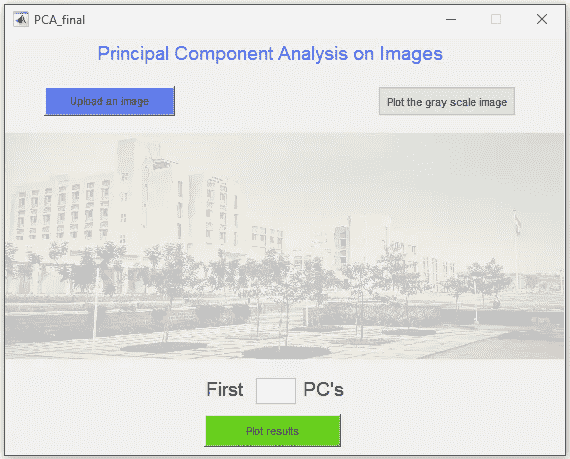
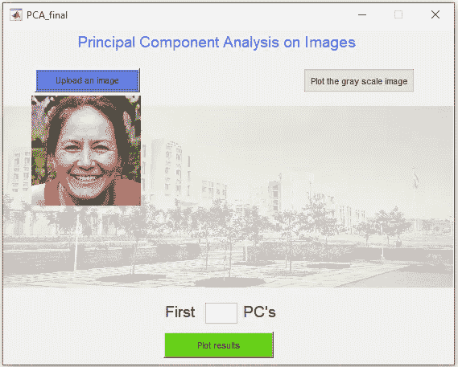
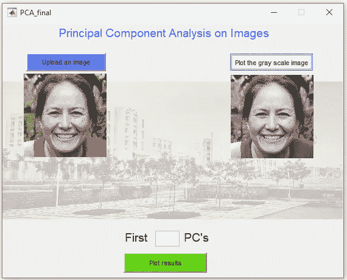
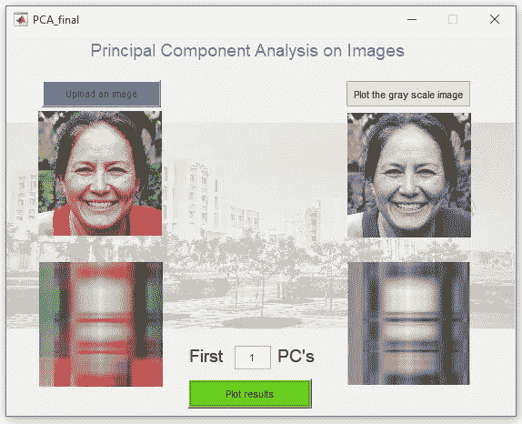
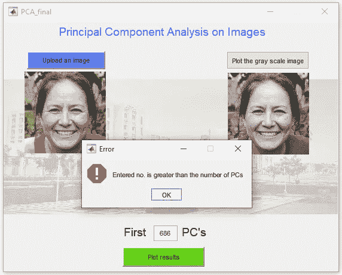
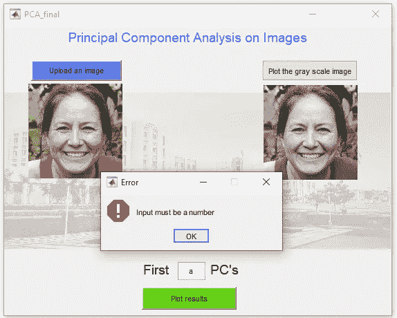
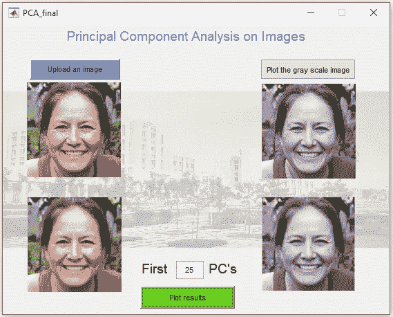
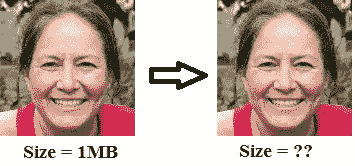
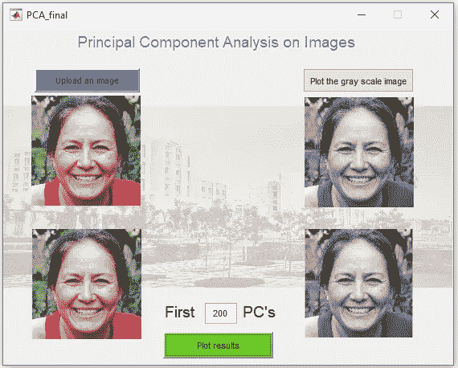

# MATLAB 图形用户界面中图像的主成分分析

> 原文：<https://medium.com/analytics-vidhya/principal-component-analysis-pca-on-images-in-matlab-a-graphical-user-interface-gui-3d4999ddd0d0?source=collection_archive---------3----------------------->

MATLAB 中 PCA 的图形用户界面

在本文中，我们将首先讨论 PCA 的基础知识，以及如何在 MATLAB 中使用 PCA。之后，我们将尝试回答 PCA 中的一个基本问题。你可以从[我的 MATLAB 库](https://in.mathworks.com/matlabcentral/profile/authors/5569287-abhilash-singh)下载 [MATLAB 代码](https://in.mathworks.com/matlabcentral/fileexchange/73246-principal-component-analysis-pca-on-images-in-matlab-gui?s_tid=prof_contriblnk)。

## 更新(2022 年 4 月 16 日):

我在 PCA 上传了一段视频。想从零开始学 PCA 请过一遍。 [**别忘了订阅我的频道**](https://www.youtube.com/channel/UC3YYrAOSNRXvG8Tud3XepYA) **。**

> 问问题。什么是 PCA？

> PCA 是一种数学过程，它将大量可能相关的变量转换成较小数量的不相关变量，称为主成分(PC)。
> 第一台电脑的数据可变性最高，后续组件的可变性低于前一台电脑。

> 问问题。如何在 MATLAB 中使用 PCA？

> [ **系数**，**得分**，**潜伏**，~，**解释**= PCA(**X**)
> 
> **X** :输入 **n x p** 尺寸数据。行( **n** )应该是观察值，列( **p** )应该是变量。 **X** 应该以零为中心，
> 
> 即**X**=**X**—mean(**X**)*{这样做是为了将所有数据放在同一尺度上}*
> 
> **coeff** :这是一个 **p x p** 矩阵，其中每一列都是一个主分量。第一列解释了最大的差异。
> **分数**:转换到 PC 空间的数据' **X** '。
> 即**X**=**score * coeff**将是重建的数据。
> **潜在**:各 PC 解释的方差
> **:各 PC 解释的总方差的百分比。**
> 
> ****解释=(潜在/总(潜在))* 100****
> 
> **它用于决定保留多少台 PC。**

****第一步。上传图像****

**点击“上传图像按钮”上传任何图像。可接受的图像格式为 png、jpg、jpeg、img 和 tif。**

****

****上传图像****

****第二步。灰度图像的绘制****

**然后点击“绘制灰度图像”按钮**

****

****绘制灰度图像****

****第三步。输入电脑的数量****

**之后，输入您想要检索图像(彩色和灰度)的 PC 的编号。例如，输入 1**

****

****使用第一台电脑重建图像。原图有 685 张。****

**当您输入的数字大于该特定图像的电脑数量时，将弹出一条错误消息/对话框。**

****

**此外，当输入的不是数字时，将弹出一条错误消息。**

****

**增加电脑的数量。假设是 25 年**

****

****使用前 25 台电脑重建图像****

**最后，让我们回答一个关于 PCA 的基本问题。**

> **问问题。PCA 能像图像尺寸缩小器一样工作吗？**

****

****图像(左)是原始图像，图像(右)是使用前 200 个主成分(PCs)重建的图像。原图有 685 张。****

****

**重建的彩色图像的大小为 449 KB。(参见 c_reconstructed.png 文件)**

> **这个问题的答案是肯定的，它作为一个图像减速器。**

## **主成分分析的应用**

1.  **[您可以使用 PCA 进行特性选择和优化。](https://www.researchgate.net/publication/354751895_Machine_Learning_to_Estimate_Surface_Roughness_from_Satellite_Images)**
2.  **[在无监督分类的情况下，如果我们在应用无监督算法之前应用 PCA，那么分类精度显著增加。你可以查看我们的出版物，其中我们已经预先应用了 PCA 来清楚地区分荒地和植被地。](https://www.researchgate.net/publication/342946797_Estimation_of_Soil_Moisture_Applying_Modified_Dubois_Model_to_Sentinel-1_A_Regional_Study_from_Central_India)**

**如果您有任何建议(或者您想给应用程序部分添加一些东西)或者对这个 GUI 有任何问题，您可以写信给我( [**我的网页**](https://www.abhilashsingh.net/?source=PCA_medium) 获取更多更新**