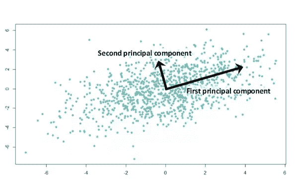
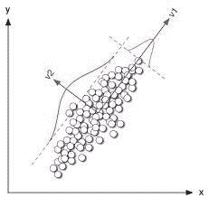
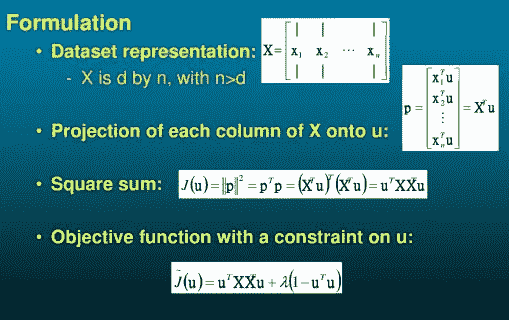
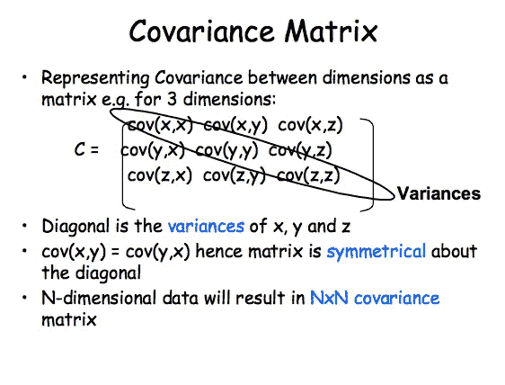
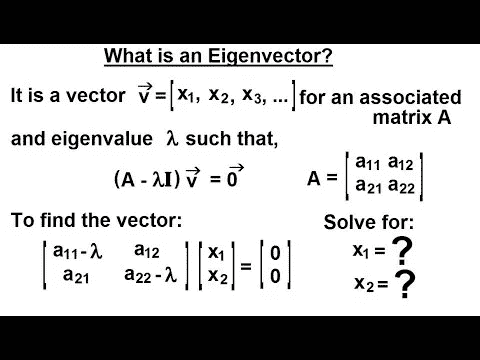
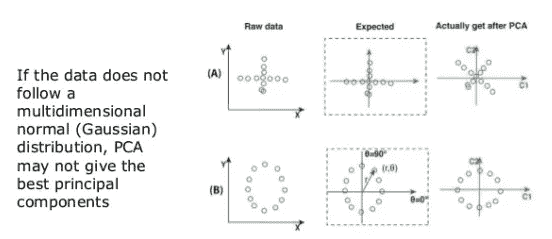
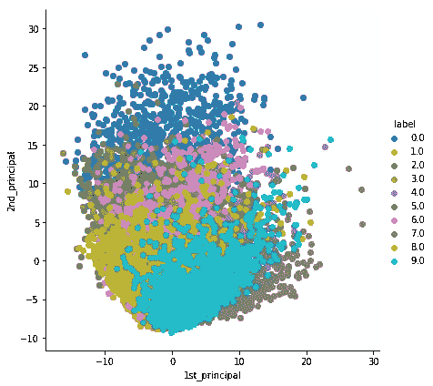
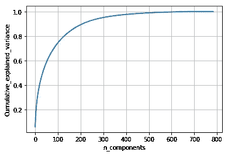

# MNIST 数据集上的主成分分析(PCA)及其代码

> 原文：<https://medium.com/analytics-vidhya/principal-component-analysis-pca-with-code-on-mnist-dataset-da7de0d07c22?source=collection_archive---------0----------------------->



主成分分析被扩展用于高维数据可视化的降维。我们做降维，将高维数据集转换成 n 维数据，其中 n <d. we="" usually="" set="" the="" threshold="" at="" d="">3。</d.>

数据在一个轴上的分布非常大，但在另一个轴上的分布(方差)相对较小。传播只不过是方差或具有高信息，所以一般来说，**我们可以说高传播具有高信息。**因此，我们可以跳过差异较小的维度，因为为了获得可视化效果，数据必须是列标准化的，因此信息较少。

## 二维到一维



我们想找到 v1 变量方差最大的方向。为了做到这一点，在平面上旋转 x 轴。这里 v1 具有最大方差，v2 具有最小方差，因此 v1 具有关于数据集的更多信息。因此最终具有(x，y)变量的 2-D 数据集可以被转换成 v1 方向上的 1-D 变量。

## 数学符号

任务:找到 u1，使得 x(i)的投影和的方差最大。



## **特征值和特征向量**

我们会找到协方差矩阵



对于每个特征值，都有对应的特征向量。每一对特征向量都是相互垂直的。我们将按降序排列特征值。向量 V1 对应的最大特征值具有最大方差，意味着数据集的最大信息。同样，方差随着特征值的减小而减小。

将变量 f1 向 V1 方向投影，得到高方差向量。



## PCA 的局限性:



如果投影波形变形后，数据遵循某种波形结构。

# 带代码的 MNIST 数据集上的主成分分析

这里有详细的代码:[https://github.com/ranasingh-gkp/PCA-TSNE-on-MNIST-dataset](https://github.com/ranasingh-gkp/PCA-TSNE-on-MNIST-dataset)

**1 —数据预处理**

在应用 PCA 之前，必须将每个变量的均值转换为 0，标准差转换为 1。

```
# Data-preprocessing: Standardizing the data
#[https://scikit-learn.org/stable/modules/generated/sklearn.preprocessing.StandardScaler.html](https://scikit-learn.org/stable/modules/generated/sklearn.preprocessing.StandardScaler.html)**from sklearn.preprocessing import StandardScaler
standardized_data = StandardScaler().fit_transform(data)
print(standardized_data.shape)**
```

**2 —计算协方差矩阵**

```
#find the co-variance matrix which is : A^T * A
**sample_data = standardized_data**
# matrix multiplication using numpy
**covar_matrix = np.matmul(sample_data.T , sample_data)**
print ( “The shape of variance matrix = “, covar_matrix.shape)
```

**3 —计算特征值和特征向量**

```
# finding the top two eigen-values and corresponding eigen-vectors 
# for projecting onto a 2-Dim space.
#[https://docs.scipy.org/doc/scipy-0.14.0/reference/generated/scipy.linalg.eigh.html](https://docs.scipy.org/doc/scipy-0.14.0/reference/generated/scipy.linalg.eigh.html)**from scipy.linalg import eigh**# the parameter ‘eigvals’ is defined (low value to heigh value) 
# eigh function will return the eigen values **in asending order**
# this code generates only the top 2 **(782 and 783)(index)** eigenvalues.
**values, vectors = eigh(covar_matrix, eigvals=(782,783))****print(“Shape of eigen vectors = “,vectors.shape)**
# converting the eigen vectors into (2,d) shape for easyness of further computations
**vectors = vectors.T****print(“Updated shape of eigen vectors = “,vectors.shape)**
# here the vectors[1] represent the eigen vector corresponding 1st principal eigen vector
# here the vectors[0] represent the eigen vector corresponding 2nd principal eigen vector
```

通过向量-向量乘法将原始数据样本投影到由两个主特征向量形成的平面上。

```
import matplotlib.pyplot as plt
**new_coordinates = np.matmul(vectors, sample_data.T)**
```

将标注附加到 2d 投影数据(垂直堆栈)并创建新的数据框以绘制标注点。

```
import pandas as pd**new_coordinates = np.vstack((new_coordinates, labels)).T**
**dataframe = pd.DataFrame(data=new_coordinates, columns=(“1st_principal”, “2nd_principal”, “label”))
print(dataframe.head())**
```

(0，1，2，3，4 是 Xi，其他是主轴)

**4 —绘图**

```
# plotting the 2d data points with seaborn
import seaborn as sn
sn.FacetGrid(dataframe, hue=”label”, size=6).map(plt.scatter, ‘1st_principal’, ‘2nd_principal’).add_legend()
plt.show()
```



类别之间有很多重叠，这意味着 PCA 不太适合高维数据集。很少几个阶层可以分开，但大多数都是混合的。 **PCA 主要用于降维**，**不用于可视化**。为了可视化高维数据，我们主要使用 T-SNE(【https://github.com/ranasingh-gkp/PCA-TSNE-on-MNIST-dataset】和)

## 5 —用于降维的主成分分析

```
# initializing the pca
**from sklearn import decomposition
pca = decomposition.PCA()**# PCA for dimensionality redcution (non-visualization)
**pca.n_components = 784
pca_data = pca.fit_transform(sample_data)****percentage_var_explained = pca.explained_variance_ / np.sum(pca.explained_variance_);
cum_var_explained = np.cumsum(percentage_var_explained)**
```

测绘

```
# Plot the PCA spectrum
plt.figure(1, figsize=(6, 4))
plt.clf()
plt.plot(cum_var_explained, linewidth=2)
plt.axis(‘tight’)
plt.grid()
plt.xlabel(‘n_components’)
plt.ylabel(‘Cumulative_explained_variance’)
plt.show()
```



这里我们画出了分量方差的累积和。这里 300 个成分解释了几乎 90%的差异。所以我们可以根据要求的方差来降维。

=================谢谢===============

**参考:**

谷歌图片

[https://colah.github.io/posts/2014-10-Visualizing-MNIST/](https://colah.github.io/posts/2014-10-Visualizing-MNIST/)