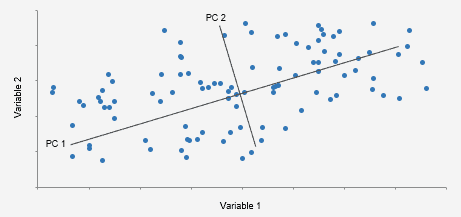

# 主成分分析:理论

> 原文：<https://medium.com/analytics-vidhya/principal-component-analysis-theory-bc87ef8c31af?source=collection_archive---------13----------------------->

主成分分析(PCA)是一种特征提取方法，用于识别数据中的模式，并以突出其相似性和差异的方式来表达数据。PCA 的主要优点之一是，一旦在数据中发现这些模式，就可以压缩数据(即可以减少维数)，而不会丢失太多信息。该方法还解决了变量之间的相关性问题。

如果你想知道这种流行算法背后的数学原理，那就来吧！！！

只需遵循以下步骤:

希望这篇文章对你有用。评论你对这篇文章的看法。谢谢大家！