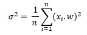
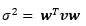
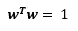
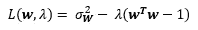
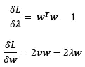
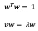
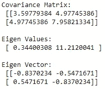
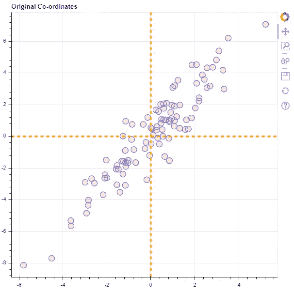
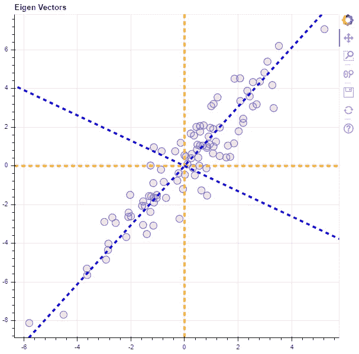
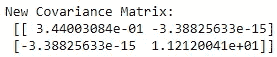

# 主成分分析:这里的变量太多了…

> 原文：<https://medium.com/analytics-vidhya/principal-component-analysis-too-many-variables-here-73dddec6b53d?source=collection_archive---------8----------------------->

我们生活在一个多维的世界里(三维空间，时间和++)！重要的业务变量，如收入、客户保持率、运营成本等。往往取决于各种其他变量，如广告预算、市场规模、客户人口统计、经济状况等等！企业可以控制这些变量中的一些，以优化他们想要的结果，还有一些是企业必然要处理的自然/经济的一部分。可以改变以改善结果的变量被称为*自变量*，历史上用“ ***X*** ”(单个变量的向量 **x1、x2、x3、**…等)表示。并且，结果变量，或者感兴趣的变量称为*因变量*，通常用“ ***Y*** ”表示。

好的统计分析可以帮助我们更好地理解 ***X*** 和 ***Y*** 之间的关系，并赋能最优决策，即如何在 ***X*** 空间中移动来改进我们的 ***Y*** 。在现实世界的利益场景中，独立变量空间***【X】***通常由许多变量组成，这使得分析它们变得复杂。此外，自变量经常是相关的，这使得确定单个自变量对因变量的影响更加困难。

## 方差是信息(它使变量成为“变量” *)*

主成分分析假设将所有数据(所有自变量， ***X*** )视为一条连续的信息，用数据中的方差来表示。为了分析这些信息对因变量 ***Y*** 的影响，我们需要量化这些信息。出于这个目的，正交坐标表示是最合适的，因为笛卡尔坐标系统有许多成熟的分析技术。假设原始数据已经在笛卡尔坐标系中表示，寻找数据的新表示只需要我们找到原始数据的适当变换。

此外，主成分分析试图找到最佳的性价比，即新的转换变量应该捕获数据中的大部分信息(方差！)用最少的变量，这有助于减少要分析的变量数量和它们之间的相互关联。

此外，主成分分析是一种线性技术，因此转换可以用矩阵形式表示，而且 PCA 不缩放数据，这将无缘无故地改变数据中的方差。因此，更具体地说，PCA 变换仅由旋转矩阵确定。

> PCA 变换原始独立数据以最少数量的变换变量最大化方差。变换只是旋转。

# 算术地

等等什么！？但是，如何用最少的变量使方差最大化，我们如何事先知道变量的数量。此外，如果我们只进行坐标旋转，所有变量之间的总方差将保持不变，因此如何定义该问题不是一个简单的优化问题。因此，我们试图为新坐标系顺序地找到单位矢量:

设 ***X*** 为(n *x* p)矩阵，n 个观测值和 p 个变量。正如，我们只旋转新矢量(w)应当是一个单位矢量。因此，转换到新的基向量系统的所有数据点的方差可以表示为:

w 是新的单位向量| xi 是第 I 个 X 向量的值

这里中项实质上是 ***X、*** 的协方差矩阵，我们用 ***v*** 来表示:

为了最大化这个方程中的方差，我们可以使用拉格朗日乘数。遵守约束 ***w*** 成为单位矢量:

单位向量约束

拉格朗日优化函数

对上述方程进行偏导数，我们得到:

为了获得最佳解，我们将导数设为零，从而得到:

这里，第一个方程本质上是我们的约束。而第二个等式表明 ***w*** 是协方差矩阵 ***v*** 的特征向量，特征值为λ *。*另外，协方差矩阵的其他特征向量表示要变换到的其他向量。所有的特征向量 a 合起来就是数据的主成分，而特征值就是相应特征向量所解释的数据中总方差的比例。

对于 p 维空间对共方差矩阵进行特征分解我们会得到 p-特征向量，它解释了数据中的所有方差(没有那么多的降维，嗯！).这并不奇怪，因为储存在 p 维空间的信息只能在 p 维空间中被完整地捕捉到(不总是，但大部分是，耶！).然而，主成分在几个变量中积累了最大的方差，允许我们在不损失太多总信息(方差)的情况下显著减少维数。

最后，原始数据点的值可以作为主成分向量(协方差矩阵的特征向量)的投影来获得。

# 代码化(希望是一个字！)

在这个例子中，我将使用 Python (Numpy)。为了绘图，我将使用散景。

现在，数据在新坐标系(以特征向量为基础)上的表示可以简单地通过原始数据与特征向量的矩阵乘法来获得。

数据中的总方差是协方差矩阵的对角元素之和。

*   原始矩阵:3.59779384+7.95821334 =**11.55600718**
*   已转换:0.344003084+11.2120041 =**11.55600718**
*   特征值之和:0.34400308+11.212004 =**11.55600718**

因此，总方差保持不变！此外，特征值表示由新数据表示法解释的方差，这也累加到相同的值。但好的一面是，一个向量现在代表了所有数据中 97%的方差。因此，如果减少一个特征向量(即减少 50%的维数)，我们将只损失 3%的信息，很大，对吧！