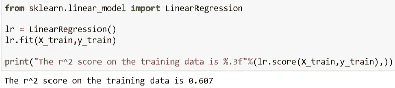

# 主要组件以及如何在 Python 中找到它们

> 原文：<https://medium.com/analytics-vidhya/principal-components-and-how-to-find-them-in-python-a810363c0489?source=collection_archive---------20----------------------->

从我的上一篇博文继续，我将讨论用 Python 计算主成分，并在各种分类模型中使用它们。

我将讨论非概率主成分分析以及如何使用主成分分析绘制特征重要性图。我在随后的文章中介绍了其他类型的 PCA，即核 PCA、概率 PCA 和稀疏 PCA。

出于本文的目的，我使用了乳腺癌数据集，您可以通过以下链接轻松下载:

[https://archive . ics . UCI . edu/ml/machine-learning-databases/breast-cancer-Wisconsin/wdbc . data](https://archive.ics.uci.edu/ml/machine-learning-databases/breast-cancer-wisconsin/wdbc.data)

## 步骤 1:导入数据

数据集由 569 行和 32 个特征列组成。虽然 PCA 是用来加速机器学习过程的，但是我还是会在这里使用它。

## 步骤 2:转换数据

标准化在 PCA 中很重要，因为它是一个方差最大化的过程。它将原始数据投射到最大化方差的方向上。新轴基于变量的标准偏差，因此通过标准化数据，所有变量将具有相同的标准偏差和相同的权重。这样就计算出了相关的轴。

## 步骤 3:训练-测试分割

我使用 *sklearn* train-test split 函数分割数据，然后一次性编码目标变量，因为我们正在处理分类变量。

## 步骤 4:应用 PCA

因此，现在我们已经分割了数据，并为模型准备做好了准备，我们继续应用 PCA。首先，我们将从 *sklearn* 库中导入函数，然后只适合使用它的训练集。

*explained_var* 按降序取所有分量的累积和，直到我们得到一个。我们可以利用这一点来了解我们需要多少主成分来解释数据中的差异，从而提高我们模型的准确性。

由此我们可以看出，最好是取 16 个分量。但是*解释了 _var[16] = 0.99177181* 并且从那以后继续增加。所以，让我们画一个图来看看发生了什么。

被解释为成分的函数的变化量是一个递增量，尽管它增加得很少。因此，现在我们只取模型中的 16–17 个组件。

为了找出前 16 个主成分，让我们通过给它分配权重来绘制一个特征重要性图。

我们现在可以在我们的线性回归算法中输入前 17 个特征(主成分)。

# 结果

## 线性回归:无 PCA

## 使用 PCA

我将前 17 个主成分存储在变量 *X_train_pca* 中，我们可以看到准确性的巨大飞跃。

## 逻辑回归:无主成分分析

## 使用 PCA

# 结论

在线性回归中使用主成分分析时，我们看到了准确性的大幅提升。虽然，我们在逻辑回归中获得了更好的准确性，但并不显著。附上，我想说，主成分分析可以有助于提高效率的算法使用，但决定最好是在数据预处理后。

在我的其他帖子中，我已经介绍了各种 PCA。请务必看一看，感谢您的阅读！