# 主成分分析

> 原文：<https://medium.com/analytics-vidhya/principle-component-analysis-a16e05003c50?source=collection_archive---------15----------------------->

主要用于特征空间的降维，在不损失信息的情况下增加可解释性，这是通过创建一个新的不相关变量来实现的，以便强调方差并从中带来强模式。PCA 甚至在 3 维或更多维的情况下工作得更好。

步骤

1.  用 x 轴和 y 轴绘制图表

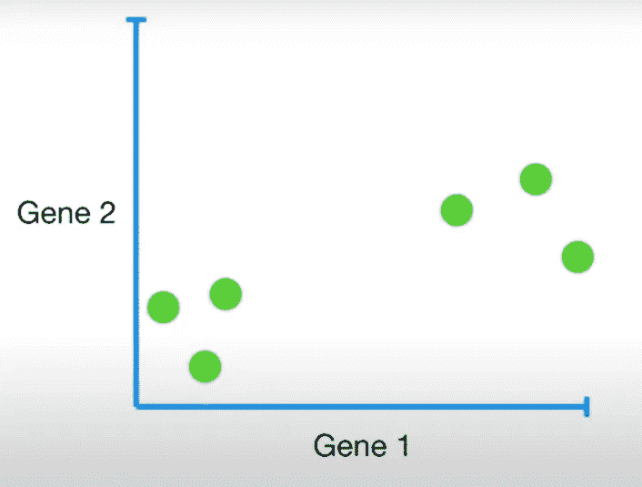

[来源](https://www.youtube.com/watch?v=FgakZw6K1QQ)

2.通过使用以下公式，找到平均值或中点，并使数据以原点为中心

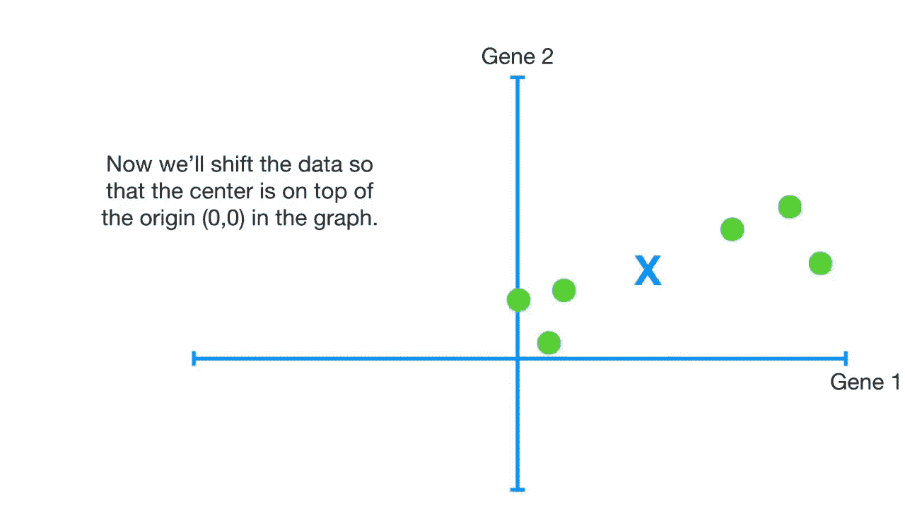

**x = x—**

其中= x 的平均值

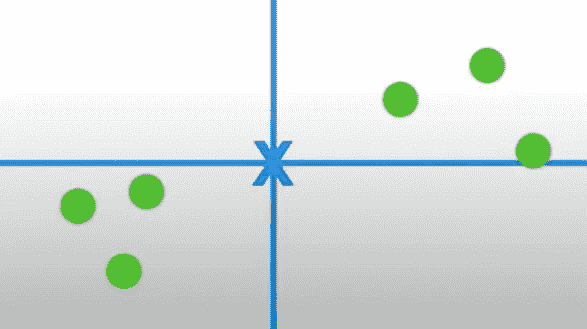

3.开始拟合一条随机穿过原点的线，并旋转这条线，直到我们得到最佳拟合数据的最佳线。

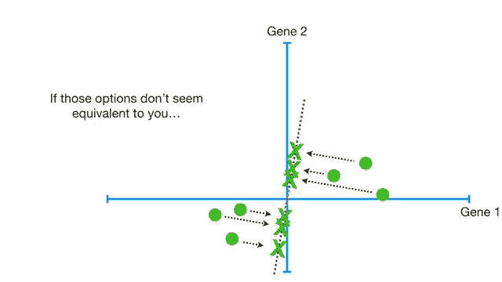

可以通过两种方式实现:

a.通过找到从投影到直线的标记到实际点的最小距离

b.通过最大化从标记投影到原点(0，0)的距离

4.距离平方和最大的最后一条线称为主成分 1。

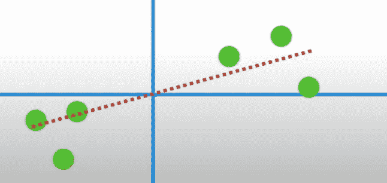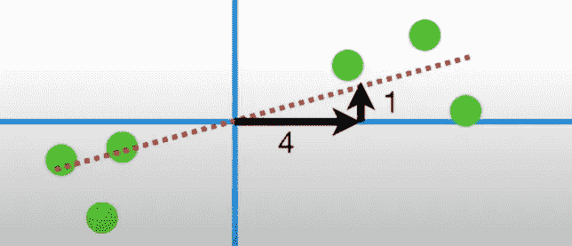

从这条线，我们可以做统计分析，比如说，x 增加 4 个单位，我们得到 y 增加 4 个单位。

5.类似地，画一条与 PC1 线垂直的线，但找到与 PC1 相似的最佳距离

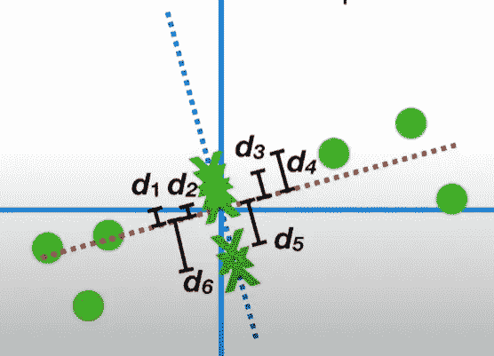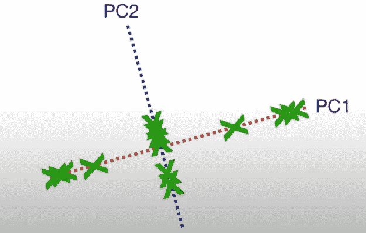

因此，最终的 PC1 和 PC2 线如下所示

6.下一步我们只需要旋转两条线

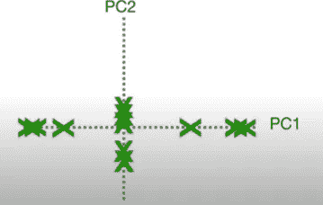

7.最后一步是从线中投影点以绘制点

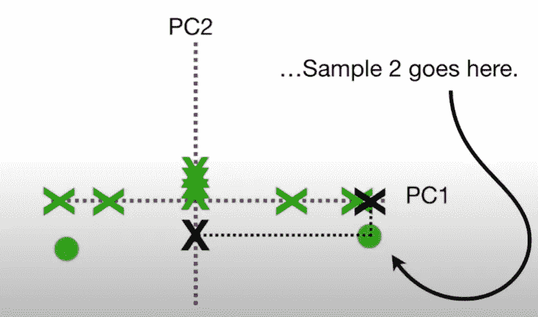

我们需要对所有样本进行同样的操作，以获得最终结果。

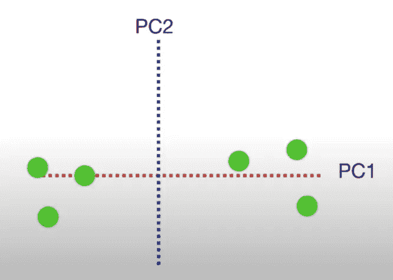

> 使用奇异值分解进行主成分分析。

> PC 的方差可通过以下方式获得:
> PC(I)的变化量= SS(σ(每个点和原点之间的距离))
> 其中 SS-平方和
> 总方差=σPC(I)
> 求变化的比例:PC(I)/总方差

对于独立变量的 N 个变量，遵循类似的步骤，以二维的观点来分析它。

一个优势

*   与其他技术相比，信息损失将非常少
*   在主成分分析的帮助下，我们可以组合 N 个特征
*   评估变得容易
*   可以将特征选择与 PCA 组件相结合
*   可以使用屏幕图来分析变化

D 是——优势

*   这个过程理解起来有点复杂
*   寻找最佳的 PC1 和 PC2 更具挑战性

一种替代方法

1.  特征消除:这是一个用来从模型中消除无关紧要的变量的过程，以使模型不那么复杂，更容易解释
2.  特征提取:这是一个过程，主要用于组合和/或选择我们希望进入特征空间的变量，使模型更容易执行。

参考文献:

*   [https://youtu.be/FgakZw6K1QQ](https://youtu.be/FgakZw6K1QQ)
*   [https://towards data science . com/getting-data-ready-for-modeling-feature-engineering-feature-selection-dimension-reduction-39 DFA 267 b95a](https://towardsdatascience.com/getting-data-ready-for-modelling-feature-engineering-feature-selection-dimension-reduction-39dfa267b95a)
*   【https://setosa.io/ev/principal-component-analysis/ 
*   [https://en.wikipedia.org/wiki/Principal_component_analysis](https://en.wikipedia.org/wiki/Principal_component_analysis)
*   [https://deepai . org/machine-learning-glossary-and-terms/Feature-extraction #:~:text = Feature % 20 extraction % 20 is % 20 the % 20 name，描述%20original%20data%20set。](https://deepai.org/machine-learning-glossary-and-terms/feature-extraction#:~:text=Feature%20extraction%20is%20the%20name,describing%20the%20original%20data%20set.)
*   [https://www . sci kit-Yb . org/en/latest/API/model _ selection/RF ecv . html #:~:text = Recursive % 20 feature % 20 elimination % 20(RFE)% 20is，number % 20of % 20features % 20is %已达到。&text = RFE % 20 需要% 20a %指定% 20 数量，多少% 20 功能% 20 有效。](https://www.scikit-yb.org/en/latest/api/model_selection/rfecv.html#:~:text=Recursive%20feature%20elimination%20(RFE)%20is,number%20of%20features%20is%20reached.&text=RFE%20requires%20a%20specified%20number,how%20many%20features%20are%20valid.)