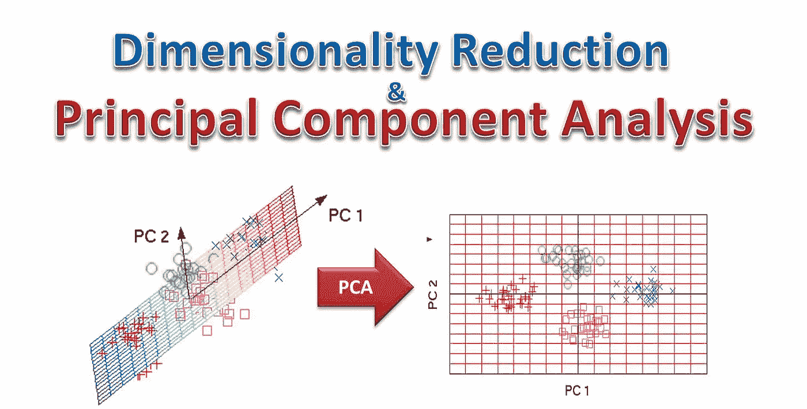
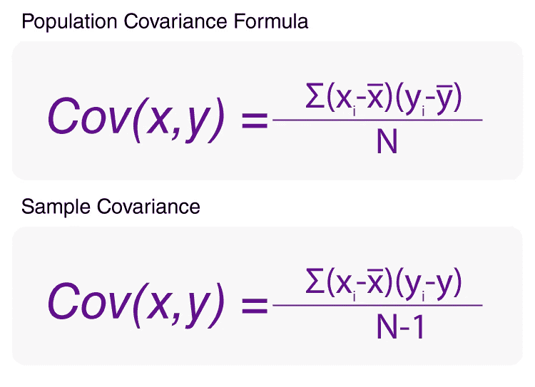
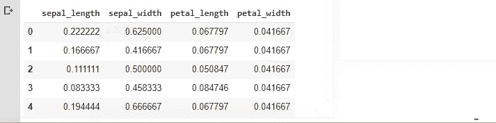
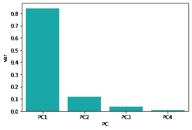
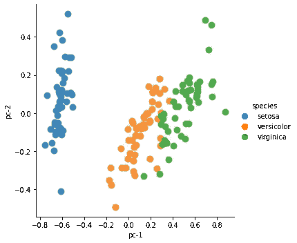

# 主成分分析:降维

> 原文：<https://medium.com/analytics-vidhya/principle-component-analysis-dimension-reduction-dea987f9d38?source=collection_archive---------16----------------------->

每个人都知道，为了进行机器学习，需要更多的数据集，但你有没有问过自己，如果数据集中的特征数量变得更多，会不会有问题？更简单地说，这种冗余特性使得从探索性数据分析的数据集提取洞察力变得非常困难。与此同时，这样的数据集使用了大量的竞争资源。

本文将讨论主成分分析和降维，这在机器学习中处理大数据集时特别有用。让我们开始吧……..



来源:[天才博客](https://kindsonthegenius.com/blog/dimensionality-reduction-and-principal-component-analysis-pca/)

> 正如我在上面已经讨论过的，当数据集的规模变大时，会发现各种冗余特征，这通常构成了过多的困境，因此为了克服这些问题，数据集的维度被降低，这被称为降维。我们必须知道哪些特征更重要，哪些不太重要。识别重要特征的方法被称为**主成分分析或 PCA。**接下来我们来看看 **PCA 的步骤。**

PCA 通常由一些重要步骤组成，如下所示:

**步骤 1:缩放数据集:**缩放是一种等同数据集的方法。因此，数据集是相对无偏的[1]。假设一个数据集包含一些人的年龄和收入数据。年龄范围通常可以从 0 到 110 岁，而收入/工资可以高达几十万卢比。所以这两个特征的范围可是大不相同的，把它们放在同一个尺度上比较是不合理的。进行缩放是为了在相同的比例上比较这些不同范围的特征。这是主成分分析的重要一步。

**第二步:协方差矩阵:**协方差矩阵来源于数据集各个变量之间的协方差[2]。更简单地说，我们可以通过协方差很容易地理解两个变量之间的关系。例如，两个随机变量 X 和 Y 之间的协方差可以通过应用以下公式(对于总体)来计算:



图 2:协方差公式。来源:[https://byjus.com/covariance-formula/](https://byjus.com/covariance-formula/)

**第三步:识别特征值和特征向量:**特征向量最简单的例子是变换，但它不改变方向。特征值通常由协方差矩阵确定。包含最多协方差的那些是保存最多信息的那些。

**第四步:主成分分析(PCA):** 确定特征向量和特征值后，我们将得到的值按降序排列。最大的特征值是最重要的，它形成了第一主成分。以这种方式，使用后续值顺序地形成下一个主分量。

**第五步:降维:**第一个主成分包含关于数据集最重要的信息，因此其他主成分逐渐包含重要信息。如果我们愿意，我们可以通过消除不太重要或根本没有作用的成分来降低维度[3]。

让我们在 Iris 数据集上动手实现主成分分析和降维。

首先，导入基本库并加载 iris 数据集。

```
**from** **sklearn** **import** datasets
**import** **matplotlib.pyplot** **as** **plt** import pandas as pd
df = [datasets.load_iris](https://scikit-learn.org/stable/modules/generated/sklearn.datasets.load_iris.html#sklearn.datasets.load_iris)()
```

设置特性和目标变量

```
features=['sepal_length','sepal_width','petal_length','petal_width']
x=df[features]
y=df.species
```

我现在要缩放数据集。看看代码。

```
from sklearn.preprocessing import MinMaxScalerscaler = MinMaxScaler()
scaler.fit(x)
scaled = pd.DataFrame(scaler.transform(x),columns=x.columns)
scaled.head()
```

缩放数据后，您将看到如图 3 所示的数据集。



图 3:缩放数据集

因为我们的数据集中有 4 个特征变量，所以这个数据集的维数也将是 4。从这个数据集中，我们最多可以得到 4 个主成分。假设我们想看到这个数据集的所有主要组成部分，

```
from sklearn.decomposition import PCA
pca = PCA(n_components=4)
principalComponents = pca.fit_transform(scaled)
principalDf = pd.DataFrame(data = principalComponents , columns = ['pc-1', 'pc-2', 'pc-3','pc-4'])
principalDf
```

现在将主成分加入目标变量。

```
finalDf = pd.concat([principalDf, df[['species']]], axis = 1)
finalDf.head()
```

这一次，我们将通过绘图来了解每个组件包含多少信息，或者它在 4 个主要组件中有多重要。

```
import seaborn as sns
dfexp = pd.DataFrame({'var':pca.explained_variance_ratio_,'PC':['PC1','PC2','PC3','PC4']})
sns.barplot(x='PC',y="var", data=dfexp, color="c");
```



图 4:每个组件的信息

从图 4 中，我们很容易理解，第一个两个分量比第三个和第四个分量重要。现在，如果我们用两个主要的主成分绘图，那么很容易理解这两个主成分如何解释数据集。让我们看看下面的代码:

```
import matplotlib.pyplot as plt
sns.lmplot( x="pc-1", y="pc-2",data=finalDf, 
fit_reg=False,  hue='species', legend=True,scatter_kws={"s": 80})
```



图 5:每个组件的信息

完整代码可以在我的知识库找到:[https://github . com/eliashossain 001/Boosting-Algorithm-/blob/master/principal _ Component _ Analysis _ Dimension _ reduction . ipynb](https://github.com/eliashossain001/Boosting-Algorithm-/blob/master/Principle_Component_Analysis_Dimension_Reduction.ipynb)

参考资料:

1.  [https://www . analyticsvidhya . com/blog/2020/04/feature-scaling-machine-learning-normalization-标准化/](https://www.analyticsvidhya.com/blog/2020/04/feature-scaling-machine-learning-normalization-standardization/)
2.  [https://corporate finance institute . com/resources/knowledge/finance/协方差/](https://corporatefinanceinstitute.com/resources/knowledge/finance/covariance/)
3.  [https://www . science direct . com/topics/computer-science/dimensionally-reduction](https://www.sciencedirect.com/topics/computer-science/dimensionality-reduction)