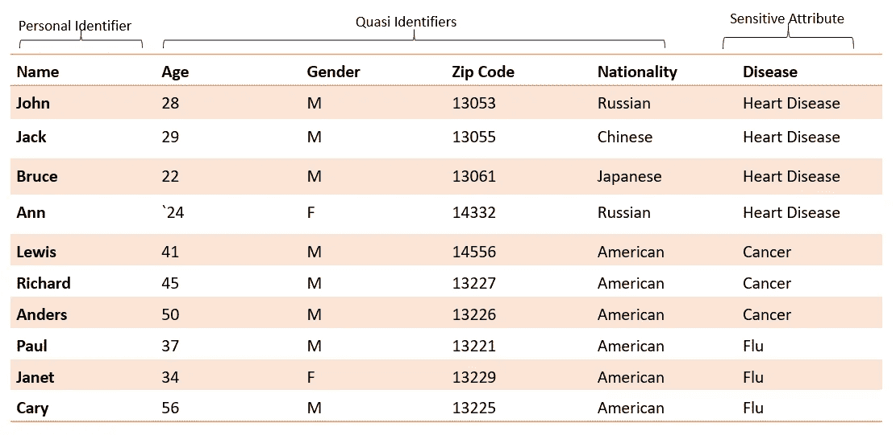
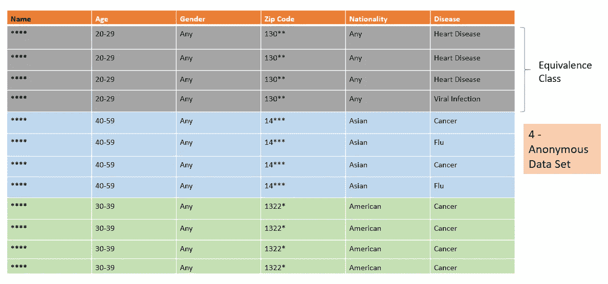
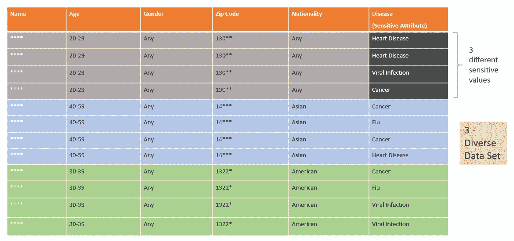

# 隐私保护数据挖掘

> 原文：<https://medium.com/analytics-vidhya/privacy-preserving-data-mining-62450c66a0d8?source=collection_archive---------20----------------------->

## 数据科学的未来需求

马库斯·温克勒在 [Unsplash](https://unsplash.com?utm_source=medium&utm_medium=referral) 上的照片

随着时间的推移，数据隐私已经成为一个朗朗上口的词，现在人们越来越多地谈论它。个人信息通过各种来源注入分析流，并用于不同的数据分析任务。社交媒体、手机、网络使用是这些来源的几个例子。这些信息可以用于获得关于个人性格的不同见解，并基于这些见解可以进行微观有针对性的虚假信息运动。对数据隐私的担忧已经影响到各国政府出台立法来保护人民的隐私权利。通用数据保护条例(GDPR)就是最近的一个例子，它侧重于保护欧洲地区人们的隐私。因此，隐私正成为一种法律责任，而不仅仅是一种社会责任。因此，很明显，隐私保护也将成为数据科学生命周期中的一个强制步骤。

我这篇文章的目的是讨论一些与隐私保护数据挖掘(PPDM)相关的概念。一旦你读完这篇文章，你就会明白，除了你已经知道的“ ***隐私*** ”之外，还有更多。

让我们从隐私保护数据挖掘的正式定义开始。

> 它是在保护隐私的同时从数据中提取知识的过程

如果你注意一下这个定义，你就会明白它有两个部分。

1.保护数据隐私(个人数据不被泄露)

2.保持数据的效用(数据仍然有用，可以产生其他有意义的见解)

所以，这个定义本身告诉我们这不是一个容易实现的目标。我们必须使用一些技术来保护个人隐私，但同时我们不能完全扭曲数据并破坏其分析价值。隐私保护和数据挖掘的成功结合被称为“隐私保护数据挖掘”，为了实现这一点，我们必须了解一些与隐私相关的基本概念。

## 隐私相关属性

你想过什么类型的数据会泄露个人隐私吗？当我被问到这个问题时，我脑海中浮现的是一些标识符，比如姓名、电子邮件地址、身份证号。但是只有这些吗？不，还有更多。因此，让我们来看看隐私相关属性的正式分类。

*   ***【PIIs】***:直接用于识别个人(Id、姓名、电子邮件)
*   ***【QIs】***:可与其他准标识符组合使用，用于识别个人(年龄、性别、职业、种族、邮政编码)
*   ***敏感属性*** :个人不愿意透露的关于自己的属性(疾病、性、薪水)
*   *非敏感属性:上述三种类型以外的属性*

*我很确定你对 pii 很确定，因为它们可以直接用来识别一个人。但是你想过准标识符吗？想想一个人，我们不知道他的任何 PII，如姓名、电子邮件或 ID，但我们知道他的一些细节，如性别、工作、年龄和邮政编码(城镇)。万一，如果那个人是她村子里唯一的 35 岁女律师，那么我们可以很容易地追踪到那个人，即使我们不认识任何 PIIs。相当危险，对吧？因此，PPDM 不仅仅是简单的匿名隐私信息，还有更多。敏感属性是一些人不想透露的关于他们自己的数据。健康状况、薪水和性取向都是例子。但这也不是直截了当的，因为什么是敏感和不敏感是一个非常主观的问题，可能因人而异。*

*以下示例演示了隐私属性分类。*

**

*健康记录*

## *匿名技术*

*现在我们已经了解了我们需要保护什么。下一个问题是我们将如何保护它们。有多种隐私保护技术可应用于上述属性，以消除对它们的识别。*

*   ****抑制*** :用类似“*”的符号替换某些属性值，表示这些属性被抑制。*
*   ****一般化*** :将属性替换为其类的一般化值*
*   ****交换*** :交换一些属性值*
*   ****剖析*** :将准标识符和敏感属性分开到不同的表中，这样它们之间的关系就会被打破*
*   ****扰动*** :用一些假值替换一些敏感属性的初始值*

*这些只是一些示例技术，但是还有更多。下图显示了前面提到的记录是如何使用上述技术进行匿名化的。*

**

*匿名健康记录*

*name 列用一个伪值完全匿名。年龄被概括为一个范围。性别和国籍被概括为表示类别的值，而邮政编码被隐藏。*

## *隐私模型*

*到目前为止，我们已经讨论了什么是隐私相关属性，以及我们如何匿名化它们。但另一个问题随之而来。即使在数据集上应用了上述匿名化技术，我们如何确定隐私得到了保护？我一开始就说过，隐私是非常主观的东西。为了解决这个问题，定义了隐私模型*。隐私模型是提出一种正式概念来衡量隐私的方法。以下是文献中一些著名的隐私模型。**

*   *****K-匿名性*** :如果每个个体的信息不能与同一数据集中的至少 k — 1 个其他个体显著区分，则称该数据集具有 K-匿名性。**

**我知道这个定义肯定很复杂。我们试着用一个例子来理解一下。**

****

**4-匿名数据集**

**在这个表中，我们看到了我们在前面的例子中讨论过的记录集，它们在应用了一些匿名化技术后被匿名化了。但是我们怎么能说在这个数据集中隐私被保留了呢？个人在这里还能妥协吗？数据集是否完全失真。当回答这些类型的问题时，隐私模型来拯救。在上面的例子中，您可以看到某些记录被涂上了相同的颜色。如果你仔细观察，你会发现匿名化后它们的类标识符值是一样的。匿名化后具有相同准标识符值的一组记录被称为“ ***等价类*** ”。上面例子中等价类的大小是 4。因此，至少我们不能区分一个人和其他三个人，因为他们的气值是相同的。像这样的数据集被称为 4-匿名的。在 4-匿名数据集中，等价类的大小应该是 4 或更多。我们可以改变 k 值来保持隐私和效用之间的平衡。**

*   *****L-多样性*** :如果表中共享相同准标识符值的每组元组至少有 L 个良好表示的敏感值，则称一个数据集满足 L-多样性性质**

**又一个复杂的定义。再用一个例子来理解一下。如果我们看看 k-匿名例子的最后一个等价类，我们可以看到每个人都有癌症。如果对手偶然发现玛丽属于最后一个等价类，那么他们肯定会知道她患有癌症，因为等价类本身没有太多的多样性。L-diversity 提供了一个解决方案。**

****

**3-不同的数据集**

**这里你可以看到，在每个等价类中，敏感属性至少有 3 个不同的值。因此，我们在上面获得了一个 3-diversity 数据集。现在，即使对手找到了玛丽的等价类，他们也不能确定她患了什么病，因为敏感属性有不同的值。**

**这是隐私模型的两个常见示例。但是围绕着隐私的形式化还有各种各样的其他模型和概念，比如 t-closure 和 differential privacy。如果你对这个主题感兴趣，阅读它们也是一个好主意。**

**总而言之，我们谈到了，**

*   **什么是 PPDM？**
*   **隐私属性是什么？**
*   **匿名化技术有哪些？**
*   **有哪些隐私模型？**

**我的目标是为任何对隐私保护数据挖掘感兴趣的人形成基本的理论基础。由于它的相对重要性与日俱增，围绕这一主题领域正在形成一个整体范式。因此，如果你感兴趣，现在就开始阅读这方面的更多内容。**