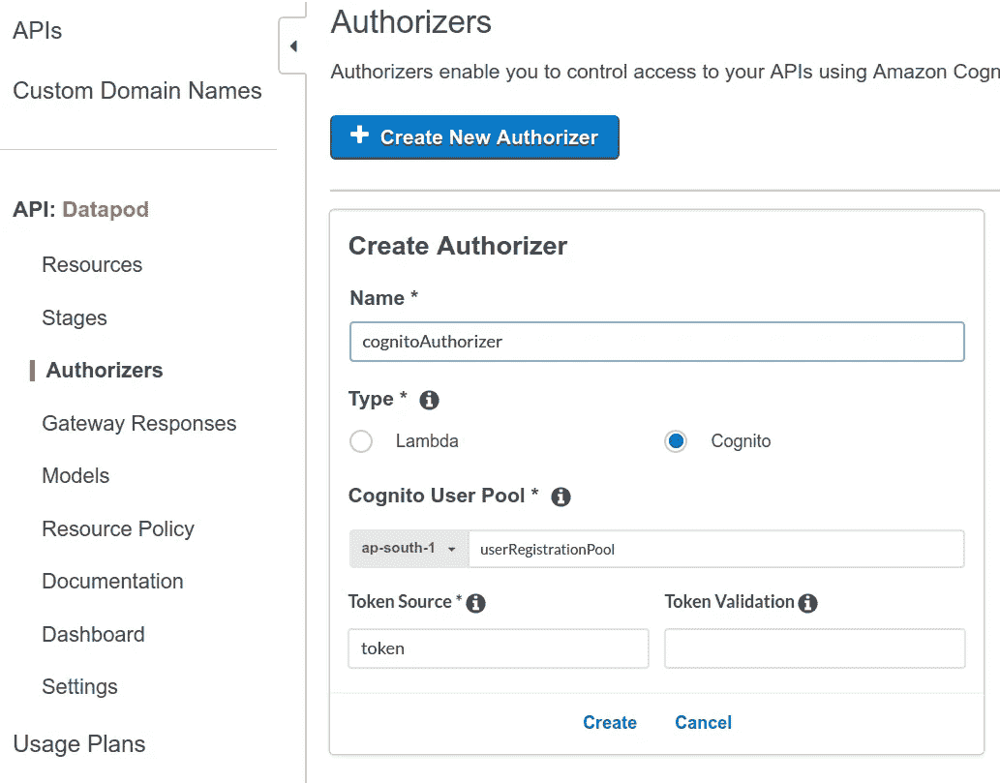
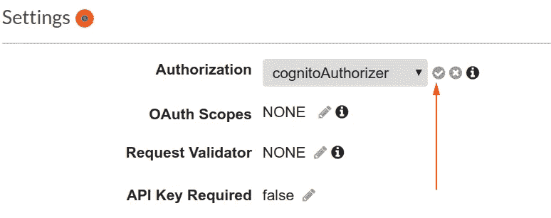

# 第 3 部分，无服务器

> 原文：<https://medium.com/analytics-vidhya/private-api-endpoints-with-api-gateway-authorizers-and-cognito-249c288b0ab8?source=collection_archive---------4----------------------->

# 带有 API 网关授权者和认知者的私有 API 端点。

如果你不知道如何使用 cognito 和 API gateway，我建议通读本教程的前两部分。

H [ere](/@houzier.saurav/aws-cognito-with-python-6a2867dd02c6) 和 H [ere](/@houzier.saurav/authentication-with-cognito-202977f8d64e)

在本教程中，我们将创建一个私有 API 端点，只有在用户向 AWS cognito 服务注册后才能访问该端点。

如果你看一下本教程的第 1 部分，我们为用户登录构建了一个 lambda 函数，并在 API 端点后运行它。

我们将使用同一个 API 端点来获取用户的 id_token，该 id _ token 将在访问私有 API 端点的请求头中发送。登录 API enpoint 的响应将如下所示:

```
{'message': "success", 
  "error": False, 
  "success": True, 
  "data": {
               "id_token": resp["AuthenticationResult"]["IdToken"],
      "refresh_token": resp["AuthenticationResult"]["RefreshToken"],
      "access_token": resp["AuthenticationResult"]["AccessToken"],
      "expires_in": resp["AuthenticationResult"]["ExpiresIn"]
      "token_type": resp["AuthenticationResult"]["TokenType"]
            }}
```

在这个响应中，我们返回三种类型的令牌

当您提供用户名和密码时，您只能获得一个刷新令牌。刷新令牌是长期有效的，id 和访问令牌仅在 1 小时内有效。刷新令牌只会为您提供新的 id 和访问令牌，而不会提供新的刷新令牌。如果您的刷新令牌过期，您需要再次进行身份验证。

为了更好地理解，我们将本教程分成几个部分:

1.  lambda 函数的 IAM 角色
2.  用于通过使用刷新令牌获取新 id_token 和 access_token 的 Lambda 函数。
3.  构建一个测试 lambda 函数，该函数从 AWS cognito 服务返回用户的私人信息，如他/她的电子邮件。
4.  将此 lambda 函数附加到 API 端点。
5.  创建新的授权人。
6.  使用私有 API 端点附加 AWS cognito 授权器。
7.  测试和结果。

**IAM 对于 lambda 函数的作用**

一个 **IAM 角色**是一个 **IAM** 实体，它定义了一组用于发出 **AWS** 服务请求的权限。 **IAM 角色**不与特定用户或组相关联。相反，可信实体承担**角色**，如 **IAM** 用户、应用程序或 **AWS** 服务，如 Lambda。

简而言之，当 AWS 服务具有带有策略的 IAM 角色时，该服务可以代表您在 AWS 帐户或其他 AWS 帐户上调用其他资源。

转到您的 AWS 帐户，然后单击“角色”。

现在，单击 create role，在新页面上选择 AWS service，然后选择 Lambda。

单击下一步:权限，并在下拉菜单中选择两个现有策略。

亚马逊河流域电力公司

[CloudWatchLogsFullAccess](https://console.aws.amazon.com/iam/home#/policies/arn%3Aaws%3Aiam%3A%3Aaws%3Apolicy%2FCloudWatchLogsFullAccess)

单击“完成”完成。现在，任何附加了该角色的 AWS 服务都可以代表您调用任何与 cognito 相关的函数和任何 cloudwatch 函数。

用于通过使用刷新令牌来获得新的 id_token 和 access_token 的 Lambda 函数。

转到 AWS 中的 lambda 控制台，创建一个新函数“refresh_access_token”。

至少将运行时选择为 python3.7。

选择上面在“权限”部分创建的 IAM 角色。

单击“创建函数”来创建此函数。现在复制下面的代码并粘贴到 lambda 函数的控制台。

```
import boto3
import botocore.exceptions
import hmac
import hashlib
import base64
import jsonUSER_POOL_ID = 'ap-south-1_AI8aBvd7q'
CLIENT_ID = ''
CLIENT_SECRET =''def error_message(msg):
    return {'message': msg, "error": True, "success": False, "data": None}def get_secret_hash(username):
    msg = username + CLIENT_ID
    dig = hmac.new(str(CLIENT_SECRET).encode('utf-8'), 
        msg = str(msg).encode('utf-8'), digestmod=hashlib.sha256).digest()
    d2 = base64.b64encode(dig).decode()
    return d2def lambda_handler(event, context):
    for field in ["username", "refresh_token"]:
        if event.get(field) is None:
            return error_message(f"Please provide {field} to renew tokens")
    client = boto3.client('cognito-idp')username = event["username"]
    refresh_token = event["refresh_token"]

    secret_hash = get_secret_hash(username)
    try:
        resp = client.initiate_auth(
           AuthParameters={
                'USERNAME': username,
                'SECRET_HASH': secret_hash,
                'REFRESH_TOKEN': refresh_token,

            },
            ClientId=CLIENT_ID,
            AuthFlow='REFRESH_TOKEN_AUTH',
            ) res = resp.get("AuthenticationResult")     except client.exceptions.NotAuthorizedException as e:

        return error_message("Invalid refresh token or username is incorrect or Refresh Token has been revoked")

    except client.exceptions.UserNotConfirmedException as e:
        return error_message("User is not confirmed")
    except Exception as e:
        return error_message(e.__str__()) if res:
           return {'message': "success", 
                    "error": False, 
                    "success": True, 
                    "data": {
            "id_token": res["IdToken"],
            "access_token": res["AccessToken"], 
            "expires_in": res["ExpiresIn"],
            "token_type": res["TokenType"]
        }} return 
```

这个函数有两个参数，用户名和刷新令牌。如果刷新令牌有效，它将为您提供有效期为 1 小时的更新 id 令牌和访问令牌。您可以继续调用这个 API 来获得更新的 access_token 和 id_token。

这个 id_token 将在 Cognito authorizer 中使用，这将在本博客的后面解释。

**构建一个测试 lambda 函数**

按照上面提到的步骤创建一个新的 lambda 函数“test_user”。复制下面的代码并粘贴。

```
import boto3
import botocore.exceptions
import json
USER_POOL_ID = 'YOUR COGNITO USERPOOL ID'def error_message(msg):
    return {'message': msg, "error": True, "success": False, "data": None}def lambda_handler(event, context):
    for field in ["username"]:
        if event.get(field) is None:
            return error_message(f"Please provide {field} to renew tokens")
    client = boto3.client('cognito-idp')
    try: $$if you want to get user from users access_token
        # response = client.get_user(
        #   AccessToken=event["access_token"])

        response = client.admin_get_user(
                UserPoolId=USER_POOL_ID,
                Username=event["username"]
            )
    except client.exceptions.UserNotFoundException as e:
        return error_message("Invalid username ")
    return {
        "error": False,
        "success": True,
        "data": response["UserAttributes"],
        'message': None,

    }
```

这个 lambda 函数只接受一个用户名，并返回存储在 cognito 上的用户信息。如果用户名无效，它将返回一个错误。

这是一份机密资料，我们想保护它不被窥探。我们将通过在一个受保护的 API 端点后面执行这个 lambda 函数来完成它。

*注意:这个函数可以是任何东西，用户的详细资料存储在 dynamoDB 等。*

**将此 lambda 函数附加到 API 端点。**

请按照本教程第 2 部分中的步骤，将 API 网关与这些 lamda 函数连接起来。创建完成后，请不要忘记通过单击 API 网关控制台右侧的 Stages 选项卡来部署这些 API。

**创建新的授权人**

在 API 网关控制台上，单击授权者选项卡。



填写详细信息，然后单击创建。这将创建一个新的 API 网关授权器，它将使用报头中的传入令牌来过滤掉可信的请求。

您也可以通过点击测试来测试该授权人。粘贴从/login API 成功登录后收到的 id_token。


**将 AWS 认知器连接到具有私有 API 端点的授权器。**

在我的例子中，两个 API 端点是(POST):

[https://ek 14 dw 8 . execute-API . AP-south-1 . amazonaws . com/v1/user/test-user](https://ek14dw5898.execute-api.ap-south-1.amazonaws.com/v1/user/test-user)

[https://ek 14 dw 8 . execute-API . AP-south-1 . amazonaws . com/v1/user/renew _ refresh _ token](https://ek14dw5898.execute-api.ap-south-1.amazonaws.com/v1/user/renew_refresh_token)

*注:v1 是阶段中的阶段*

现在，如果从您的机器 ping test_user enpoint，它将返回特定用户名的用户详细信息。

```
{'error': False,
 'success': True,
 'data': [{'Name': 'sub', 'Value': '6e8acaa9-cc0f-43f2-9e53-3299475ab6a6'},
  {'Name': 'email_verified', 'Value': 'true'},
  {'Name': 'name', 'Value': 'saurav verma'},
  {'Name': 'email', 'Value': '[houzier.saurav@gmail.com](mailto:houzier.saurav@gmail.com)'}],
 'message': None}
```

应该受到保护，不应该公开。请导航回您的 API 网关控制台，单击资源，然后单击此端点。你会看到类似这样的东西。


点击方法请求。


否。单击授权并选择认知授权者。



单击右侧按钮保存您的首选项。

现在部署他的 API 端点。

现在再次尝试访问这个 api，您将得到一个错误消息。

```
{'message': 'Unauthorized'}
```

现在，通过在头中的值“token”下发送 id_token 来尝试访问这个 api。它应该按预期工作。

在下一篇博客中，我将尝试发布通过 cognito 和联邦身份获取临时 aws 凭证的过程。

请随时给我发送关于 houzier.saurav@gmail.com 的查询。

谢谢你。