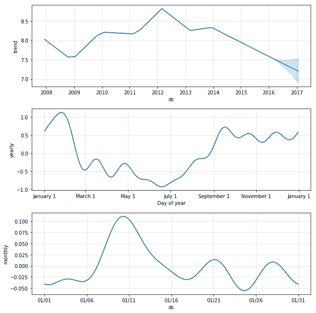
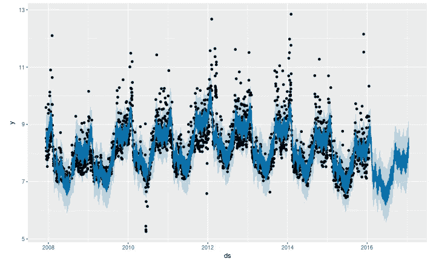

# 通过 FBProphet 预测主动扩展集群

> 原文：<https://medium.com/analytics-vidhya/proactively-scaling-cluster-with-fbprophet-forecasting-a700c904d7f9?source=collection_archive---------13----------------------->

在本文中，我将介绍我最近参与的一个有趣的项目，在这个项目中，我能够根据负载预测主动管理集群的大小。我将详细介绍可用的内置 AWS 功能，为什么我选择使用 FBProphet 以及如何将解决方案部署到生产中。

***在本文中，集群一词指的是 Amazon EC2 实例的集合。***

# **内置 AWS 功能**

AWS 提供了两个内置功能来扩展和缩小集群以管理集群大小:动态扩展和预测性扩展。让我们看看每一个都是什么意思

**动态伸缩**:动态伸缩是 AWS 提供的一种替代方案，它根据资源利用率的实时变化来管理集群大小。可以为向上扩展和向下扩展以及群集和动态扩展设置单独的阈值，确保一旦突破相应的阈值，就向上扩展或向下扩展。[1]

> H 然而，由于这种方法是反应式的，集群大小调整确实需要一些时间，因此最终会影响工作时间和后续的客户体验。

**预测缩放**:AWS 承诺的预测缩放应该利用过去 2 周的资源利用率数据，并预测未来 2 天的资源利用率。当预计负载较高时，可以使用这些预测来主动调整集群的大小，从而缓解动态扩展所面临的问题。[1]

> 然而，亚马逊预测缩放创建的预测似乎没有那么准确，导致探索其他可用于预测的库。

# 脸书预言家预测

Prophet 是脸书的一个预测库，可用于生成预测，这些预测又可用于主动扩展集群。为了正确进行预测，选择正确的指标也很重要。

AWS 通过其 CloudWatch API 公开各种指标，如平均 CPU 利用率、最大 CPU 利用率、节点数、特定时间间隔使用的内存。评估后，CPU 利用率和节点数是用于此任务的指标。

**利用脸书先知**:

先知是一个非常容易使用和有效的时间序列库，由脸书开源。先知是如何工作的超出了这篇博客的范围，但是感兴趣的人可以在[**https://peerj.com/preprints/3190.pdf**](https://peerj.com/preprints/3190.pdf)阅读

就利用 prophet API 而言，有几件主要的事情需要记住。Prophet 允许两种主要的增长模型，**线性增长模型和逻辑增长模型**(详细内容可在论文中找到)。

> 这些模型中的一部分 prophet 还允许引入每日、每周和每年的季节性，其周期和顺序可以由领域专家输入。通过这种方法，prophet 允许拥有领域专业知识的分析师轻松地利用它来训练模型。

其中一个怪癖是 Prophet 模型在 python 中工作，训练数据应该以 pandas 数据帧的形式提供，该数据帧具有两个特定的列“ds”和“y”，其中“ds”表示时间戳,“y”表示要预测的指标值。

下面是用于创建预测的示例代码。

```
from fbprophet import Prophet# Define parameters of modelprophet = ( Prophet(growth = ‘logistic’)
 .add_seasonality(name=’daily’, period= 1, fourier_order= specified_fourier_order_daily)
 .add_seasonality(name=’weekly’, period=7, fourier_order=specified_fourier_order_daily)
 )# Fit prophet model on training data prophet.fit(df)# Prepare future Dataframe for the time period to forecast, to store the forecasted values future_df = prophet.make_future_dataframe(freq='min', periods = time_period_to_forecast)# Forecast the values for the specified time frame

forecast_df = prophet.predict(future_df)
```

应当注意，forecast_df 包含训练数据的拟合值以及预测值，并且需要单独提取预测值以供进一步使用。

一旦模型经过训练，用户还可以利用 Prophet 的 plot_component 功能绘制图表，查看模型中的趋势和季节性。

```
fig2 = prophet.plot_components(forecast_df)
display(fig2)
```

这将创建一个类似于下图的图。根据数据的基本行为，实际的绘图会有所不同。



图片来源:脸书开源

还可以通过绘制预测数据框来了解 prophet 模型的拟合程度。

```
# Code to plot prophet forecast

prophet.plot(forecasted_df)
```

它会生成如下图所示的图形



图片来源:脸书开源

> 如果您在上面的图像中看到的是 2016 年之前的黑点，那么它将显示预测值。黑点代表真实值。蓝色区域表示预测值，浅蓝色的顶部和下部区域分别表示上限和下限。

**主动扩展 AWS 集群规模**

一旦我们有了预测值，设置基础架构以进行扩展就非常简单了。可以建立一个作业来预测一天所需的指标，并将其存储在 s3 位置。这可以设置为 cron 作业或使用任何其他可用的调度程序。

在单独的 EC2 实例上或通过 lambda 函数，可以设置另一个脚本来实时获取集群指标。AWS 提供 API 来收集各种指标，例如期望容量(实例)、当前容量(实例)等。

这与预测指标一起，可以通过逻辑检查来主动控制集群大小，并为用户提供更加流畅的体验。

**参考文献**

1.  [https://docs . AWS . Amazon . com/auto scaling/plans/user guide/how-it-works . html](https://docs.aws.amazon.com/autoscaling/plans/userguide/how-it-works.html)
2.  [https://docs . AWS . Amazon . com/auto scaling/ec2/API reference/API _ Operations _ list . html](https://docs.aws.amazon.com/autoscaling/ec2/APIReference/API_Operations_List.html)
3.  [**https://peerj.com/preprints/3190.pdf**](https://peerj.com/preprints/3190.pdf)