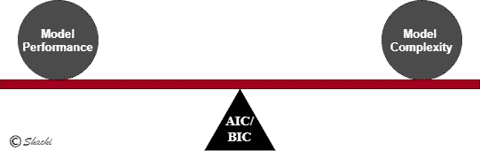
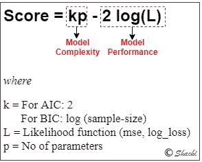
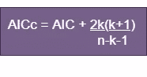
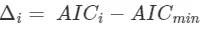
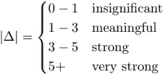
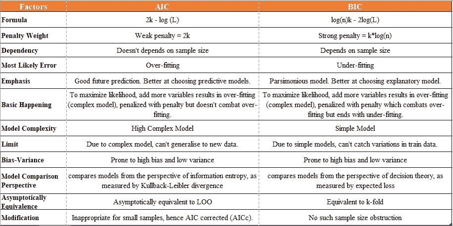

# Python 中 AIC/BIC 的概率模型选择

> 原文：<https://medium.com/analytics-vidhya/probabilistic-model-selection-with-aic-bic-in-python-f8471d6add32?source=collection_archive---------3----------------------->

# 博客里程碑

*   [**简述型号选择**](#47a2)
*   [**概率模型选择**](#f913)
    - [什么是 AIC/BIC 准则](#ee12)
    - [快速类比](#2ccc)-
    -[应用](#a343)
    - [实现](#4e28)
*   [**参考文献**](#0bd0)

亲爱的学习灵魂们..以舒适的姿势坐下，设定你的焦点，让我们开始选择你的最佳机器学习模型的困境。

对如何选择最佳模型的秘密耿耿于怀。模型选择在建立机器学习模型中起着非常重要的作用。可以有多个合格的算法模型被视为候选模型，但是只有一个具有优化参数的算法模型可以被选为性能最佳的稳健模型。从候选者中选择最好的就是我们所说的模型选择。

# **选型简介**

模型选择就像选择一个具有不同超参数的模型或不同候选模型中的最佳模型。通常情况下，任何模型的选择不应该仅仅依赖于它的性能，相反，还应该依赖于它的复杂性。

通常，我们将模型选择的技术分类如下:

*   随机训练/测试分割
*   重采样技术
*   概率模型选择技术

***本博客将只深入讨论概率模型选择，因为***[***ML/AI 中的随机 _ 训练/测试和重采样技术在用 Python***](/analytics-vidhya/model-selection-techniques-in-ml-ai-with-python-fdf308d9fa10) ***和*** [***进行 ML/AI 中的模型选择时深入解释了交叉验证***](/analytics-vidhya/deeply-explained-cross-validation-in-ml-ai-2e846a83f6ed?source=friends_link&sk=438258d3578674a242be66716ec2a0ed) ***。***

> 根据 AIC 的理论，最适合的模型是用最少的独立变量解释最大变化的模型。

# **概率模型选择**

*   在最大似然估计下，借助**对数似然概率框架选择最佳模型。**
*   统计方法的好坏可以用**信息准则** (IC)来衡量，有一定的分值。因此，它指的是基于似然函数的模型选择方法**。分数越低，模型越好。这来自统计学的信息论。**
*   考虑到**模型性能和复杂性**，而另一种重采样的模型选择技术仅检查模型性能。
*   通过评分方法选择模型，评分基于:
    - **使用**对数似然法**评估训练数据的性能**，对数似然法源于 MLE 的概念，以优化模型参数。它显示了你的模型与你的数据的吻合程度。它提供了总误差的指示。
    - **模型复杂性**使用模型中的参数数量(或自由度)进行评估。

> 对达到高拟合优度的模型进行评分奖励，如果模型变得过于复杂则进行惩罚

*   常见的概率方法有:
    ~来自*的 AIC(阿凯克信息准则)*~来自
    的 BIC(贝叶斯信息准则)*的贝叶斯概率*

让我们了解更多关于 AIC 和 BIC 的技术。

## 什么是 AIC/BIC 标准

*   这些 IC 方法来自**频率主义者和贝叶斯概率**领域。得分最低的任何选择方法意味着丢失的信息较少，因此是最好的模型。这是信息论的一个症结。
*   **使用 *Log-likelihood 计算:*** 包括*均方误差(回归)*和 log_loss 如 cross_entropy(分类)。
*   **惩罚参数以对抗过度拟合:**建议通过添加更多参数来最大化可能性，这可能会导致模型更加复杂和过度拟合。因此，AIC/BIC 增加了对附加参数的惩罚。这就是它保持平衡的方式。
    ***总结为在拟合数据(对数似然)和模型复杂度(对样本估计模型参数的惩罚)之间保持平衡。***

*   评估候选模型中模型的质量。

> 在不过度拟合的情况下，模型与数据的拟合程度如何

*   公式是惩罚似然(惩罚项+负似然)的一种形式

另外，让我们来澄清一个常见的困惑。
**适用于线性和非线性模型？**
*答:*是的，因为 AIC/BIC 是基于对数似然函数的一种模型，你可以有线性和非线性模型。

## AIC(又名赤池信息标准)

*   **AIC 的诞生**

简单回答。统计学中的信息论。

任何模型(比如线性回归)都不能展示研究的全部真相，它只是一个近似值。我们承认总会有一些信息丢失。现在怎么办？我们必须选择最接近真实情况的最佳模型，或者应该说最小化信息损失。Kullback 和 Leibler 创造了 KL 信息，这是一种衡量信息损失的方法。后来，日本统计学家 Hirotugu Akaike 提出了最大似然和 KL 信息之间的关系。他开发了 IC 来估计 KL 信息，被称为 Akaike 的信息准则(AIC)。因此，K-L 距离是两个模型之间的距离或差异方面的信息损失的度量。

*   *公式:*

k=建立模型的独立变量的数量
L=模型的最大似然估计

为了最大化似然对数(L ),更多的变量应该被添加到模型中，导致过度拟合。因此，引入了“2k”惩罚项，它并没有完全消除过拟合。因为惩罚力度不够。此外，公式不考虑观察值，而只考虑模型参数。

*   在**小样本**的情况下，大多数像 AIC 一样过度拟合的机会将最终选择许多参数。因此， **AIC 修正**被引入来解决这个问题。对于小样本量，

值越小，丢失的信息越少，模型越适合。

*   **当使用拟合模型(gi)而不是最佳模型(gmin)时，可以测量信息损失**(δI):

## BIC(又名施瓦兹信息标准)

在接受这个概念之前，我脑海中浮现出一个明显的问题。
**“BIC 为什么叫贝叶斯？”**

下面引用的大部分参考文献。
虽然“贝叶斯”包含在其名称中，但不需要先验信息。BIC 计算不需要贝叶斯知识。只有在贝叶斯理论的框架下才能推导出最大化模型的后验概率。由于它忽略了先验分布，新的 IC 方法被称为基于先验的 BIC (PBIC)。更多详情请参考[本文](http://eprints.gla.ac.uk/179725/)。

*   BIC 属于**简约模型**之下，即使参数数量最少也能解释得足够好。
*   公式:

k=建立模型的独立变量的数量
L=模型的最大似然估计值
n =样本大小(#观察值)
log-base = e(自然对数)

为了最大化似然对数(L ),更多的变量应该被添加到模型中，导致过度拟合。BIC 通过包含一个“log(n)k”的强惩罚来解决这个问题，这反而会使你陷入不适合的模型，即过于简单的模型。简单的模型无法捕捉数据的变化。

*   现在有趣的事情…
    从[论文](http://www.cs.toronto.edu/~mbrubake/teaching/C11/Handouts/BIC.pdf)中，在模型选择过程中，我们可以看到悬浮的候选模型与最佳选择的模型相差多少。
    *∈= BIC(M1 | D)——BIC(M2 | D)*
    如果∏为正，那么 M2 比 M1 好但是好多少呢？

[来源](http://www.cs.toronto.edu/~mbrubake/teaching/C11/Handouts/BIC.pdf)

## **快速类比**

这里是 AIC/BIC 的快速浏览学习，而不是懒惰的阅读内容。

沙池

## 应用程序

*   **特征选择**:将添加/删除特征的模型与分数进行比较
*   **正则化参数** : AIC/BIC 在山脊/套索模型中选择该参数

## 履行

AIC 和 BIC 技术可以通过以下方式实现:

*   **statsmodel 库**:在 Python 这个统计库里面，**stats models . formula . API**提供了一个直接计算 aic/bic 的方法。
*   **scikit-learn** : Sklearn 库还提供了 AIC/BIC 分数的 LassoLarsIC 估计量，该估计量仅限制线性模型。因此，当涉及到非线性模型时，它没有多大用处。
*   **手动计算**:最好通过直接执行公式来计算这些分数。

让我们切换到用 Python 实现 AIC/BIC 的[代码来动手操作。](https://medium.com/p/47b336b6ca58/edit)

# 参考

*   http://www.cef-cfr.ca/uploads/reference/mazerolle_2006.pdf[AIC 相关解释:](http://www.cef-cfr.ca/uploads/reference/mazerolle_2006.pdf)
*   信息论:[https://arxiv.org/pdf/1511.00860.pdf](https://arxiv.org/pdf/1511.00860.pdf)
*   强烈推荐
    [http://www . cs . Toronto . edu/~ mbru bake/teaching/C11/讲义/BIC.pd](http://www.cs.toronto.edu/~mbrubake/teaching/C11/Handouts/BIC.pdf)
*   [https://peerj.com/preprints/1103.pdf](https://peerj.com/preprints/1103.pdf)

如果你喜欢这个博客，你可以自由关注这个作者，因为这个作者保证会带来更多有趣的人工智能技术。
感谢，
阅读愉快！:)

***可以通过***[***LinkedIn***](https://www.linkedin.com/in/kaul-shachi)***取得联系。***