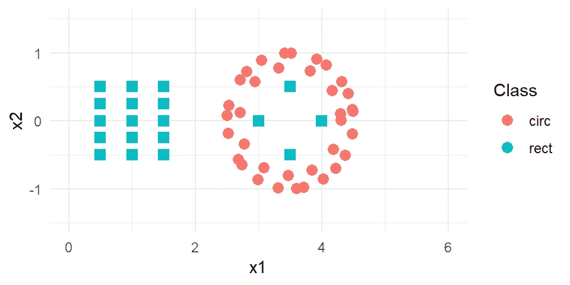
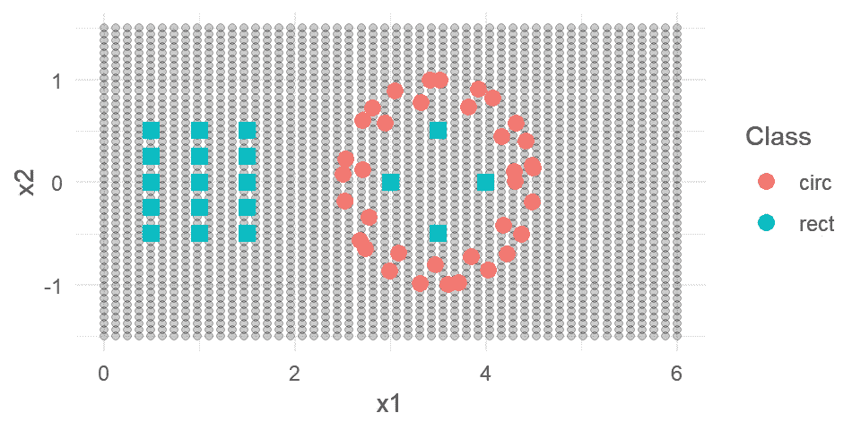
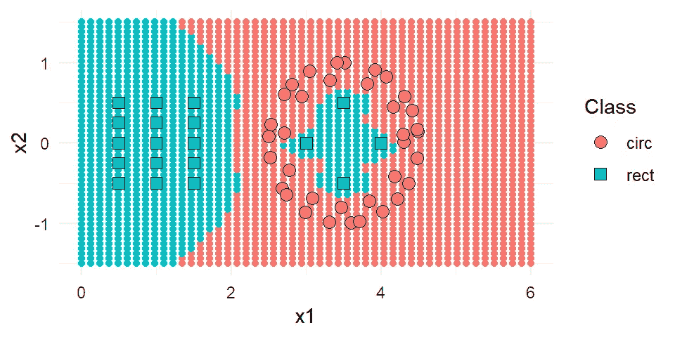

# 概率神经网络和竞争概率神经网络

> 原文：<https://medium.com/analytics-vidhya/probabilistic-neural-network-and-competitive-probabilistic-neural-network-4581be53b290?source=collection_archive---------11----------------------->

大家早上好。今天，我想就概率神经网络(PNN)和竞争概率神经网络(CPNN)做一个简短的介绍。本帖参考 Zeinali 和故事文章:

Zeinali，Yasha & Story，Brett。(2017).竞争概率神经网络。综合计算机辅助工程。24.1–14.10.3233/ICA-170540。

在那里，PNN 作为一种先行算法被研究。这里我将使用 R 作为编程工具。其实已经有一个名为“pnn”的 R 库了。该库执行 PNN 功能，使用简单。然而，我认为我必须编写自己的 R 脚本来执行 CPNN 过程，作为 PNN 的扩展。这是因为我仍然找不到 R 的仓库下的 CPNN 库。在下面的脚本中，我也将提供我自己的 PNN 函数。先说距离平方函数的定义。顺便说一下，请注意，我使用的变量名与论文中指定的相似。我也用“dplyr”和“ggplot2”库，先加载吧。

```
suppressMessages(suppressWarnings(**library**(dplyr)))
suppressMessages(suppressWarnings(**library**(ggplot2)))

squared.distance <- **function**(input1, input2) input1 %>% rbind(input2) %>% dist %>% '^'(2)
```

然后我定义了 omega.ij 函数。请阅读这篇论文，以便你至少有一个初步的理解。比如这个 omega.ij 描述了什么。不过，如果你对后面发生的事情不感兴趣，也没关系。只需复制脚本的每一部分，并将函数应用于数据集(我将在本文末尾向您展示如何操作)。

```
omega.ij <- **function**(x.new, x.c.ij, sigma.input) {
  argument <- -squared.distance(x.new, x.c.ij) %>% '/'(2 * (sigma.input^2)) %>% exp
  **return**(argument / (
      ((2 * pi)^(length(x.new) / 2)) * (sigma.input^length(x.new))
    )
  )
}
```

然后我定义 p.x.new.ci 函数如下。

```
p.x.new.ci <- **function**(x.new, data.input, sigma.input, gamma.input = NULL) {
  **if**(!is.null(gamma.input) & is.numeric(gamma.input)) {
    omega.sum <- data.input %>% nrow %>% '*'(gamma.input) %>% round
    omega <- apply(data.input, 1, **function**(input1) 
      omega.ij(x.new, input1, sigma.input)) %>% sort %>% rev
    **return**(omega[1:omega.sum] %>% mean(na.rm = TRUE))
  } **else** {
    apply(data.input, 1, **function**(input1) 
      omega.ij(x.new, input1, sigma.input)) %>% mean(na.rm = TRUE) 
  }
}
```

下面是 PNN 的定义和 CPNN 的主要功能。两种算法共享相同的功能。为了区分它是 PNN 还是 CPNN，对于 PNN,“γ输入”的自变量必须填充为空，对于 CPNN 必须填充范围从 0 到 1 的实数。我将默认值 NULL 赋予了“gamma.input”参数，因此这意味着对函数的默认调用执行 PNN 算法。

```
c.pnn <- **function**(x.new, data.input, class.input, sigma.input, gamma.input = NULL) {
  class.index <- tapply(1:length(class.input), class.input, **function**(input1) **return**(input1))
  p.x.new.result <- sapply(
    class.index, **function**(input1) {
      p.x.new.ci(x.new, data.input[input1, ], sigma.input, gamma.input)
    }
  )
  p.x.new.result <- (p.x.new.result / sum(p.x.new.result)) %>% round(3)
  output <- data.frame(
    class.output = (class.input %>% as.factor %>% levels)[p.x.new.result %>% which.max],
    probability = p.x.new.result[p.x.new.result %>% which.max]
  )
  rownames(output) <- NULL
  **return**(output)
}
```

现在我们来试试算法。作者举例说明了一个非线性分离的数据(在他们的论文中显示为图表)。观测值的类别属性为矩形和圆形。

```
data.input <- expand.grid(x1 = seq(0.5, 1.5, length.out = 3), x2 = seq(-0.5, 0.5, length.out = 5))
angle.1 <- seq(0, 2*pi, length.out = 24) + runif(24, 0, .2)
angle.2 <- seq(0, 2*pi, length.out = 12) + runif(12, 0, .2)
data.input <- rbind(
  data.input, cbind(
    x1 = c(cos(angle.1) + 3.5, (cos(angle.2) * 0.8) + 3.5),
    x2 = c(sin(angle.1), sin(angle.2) * 0.8)
  )
)
data.input <- rbind(
  data.input, cbind(x1 = c(3, 3.5, 3.5, 4), x2 = c(0, -0.5, 0.5, 0))
)
data.input$Class <- c(
  rep('rect', 15), rep('circ', 36), rep('rect', 4)
)
```

让我们来看看数据

```
print(data.input)##          x1           x2 Class
## 1  0.500000 -0.500000000  rect
## 2  1.000000 -0.500000000  rect
## 3  1.500000 -0.500000000  rect
## 4  0.500000 -0.250000000  rect
## 5  1.000000 -0.250000000  rect
## 6  1.500000 -0.250000000  rect## 50 4.180493 -0.420629481  circ
## 51 4.292294  0.110774459  circ
## 52 3.000000  0.000000000  rect
## 53 3.500000 -0.500000000  rect
## 54 3.500000  0.500000000  rect
## 55 4.000000  0.000000000  rect
```

还有身材。

```
ggplot(data.input, aes(x1, x2)) +
  geom_point(
    aes(color = Class), size = 3, shape = ifelse(data.input$Class == 'rect', 15, 16)
  ) + scale_x_continuous(limits = c(0, 6)) + scale_y_continuous(limits = c(-1.5, 1.5)) +
  theme_minimal()
```



训练数据集。

好了，现在让我们创建测试数据。这里的场景是，我想决定数据维空间的任何地方是矩形还是圆形。第一步是在空间内创造一个扩展的价值观。

```
data.test <- expand.grid(x1 = seq(0, 6, length.out = 50), x2 = seq(-1.5, 1.5, length.out = 50))
```

一些顶级的 data.test 看起来像这样:

```
head(data.test)##          x1   x2
## 1 0.0000000 -1.5
## 2 0.1224490 -1.5
## 3 0.2448980 -1.5
## 4 0.3673469 -1.5
## 5 0.4897959 -1.5
## 6 0.6122449 -1.5
```

现在让我们看看它们在数据空间中的位置。

```
ggplot(data.input, aes(x1, x2)) +
  geom_point(mapping = aes(x1, x2), data = data.test, color = gray(0, 0.2)) +
  geom_point(
    aes(color = Class), size = 3, shape = ifelse(data.input$Class == 'rect', 15, 16)
  ) +
  theme_minimal()
```



数据维度空间中的测试数据。

需要记住的一点是，我们必须调整 data.input 和 data.test 的值。这个过程不会改变位置。只有值相对于参考数据成比例地改变。在这里，data.input 是我们的引用数据集。因此它被缩放到自身，而 data.test 被缩放到 data.input 值。

```
data.input.scaled <- scale(data.input[,1:2])
data.test.scaled <- scale(data.test, 
                          center = attr(data.input.scaled, 'scaled:center'), 
                          scale = attr(data.input.scaled, 'scaled:scale'))
```

让我们看一下，数据仍然相对于彼此位于相同的地层，但是相对于维度空间位于不同的位置。

```
ggplot(data.input.scaled %>% as.data.frame, aes(x1, x2)) +
  geom_point(mapping = aes(x1, x2), data = data.test.scaled %>% as.data.frame, color = gray(0, 0.2)) +
  geom_point(
    aes(color = data.input$Class), size = 3, shape = ifelse(data.input$Class == 'rect', 15, 16)
  ) + 
  labs(color = 'Class') +
  theme_minimal()
```


训练和测试数据的缩放版本。

现在我们准备好识别数据的类别。使用 PNN 和/或 CPNN 进行测试。这需要一些时间，因为我们的测试数据集有 2500 个观察值。

```
data.test.result <- apply(data.test.scaled, 1, **function**(input) {
  c.pnn(x.new = input, data.input = data.input.scaled, class.input = data.input$Class, sigma.input = 0.1,
        gamma.input = 0.5)
})
```

让我们看看最上面的输出。

```
head(data.test.result)## [[1]]
##   class.output probability
## 1         rect           1
## 
## [[2]]
##   class.output probability
## 1         rect           1
## 
## [[3]]
##   class.output probability
## 1         rect           1
## 
## [[4]]
##   class.output probability
## 1         rect           1
## 
## [[5]]
##   class.output probability
## 1         rect           1
## 
## [[6]]
##   class.output probability
## 1         rect           1
```

c.pnn 函数提供了具有两个元素的向量，即类输出和概率。第一个元素是算法决定的类。第二个元素是数据集中可用类中所选类的概率值。因此，变量 data.test.result 是一个有 2500 个元素的列表，每个元素由一个有两个元素的向量组成。

现在，我们根据模型已经分类的类，通过对测试数据集着色来绘制我们的结果。为此，首先我们必须提取每个列表元素中的 class.output 元素。

```
test.class <- sapply(data.test.result, **function**(input) input$class.output)combined.data <- data.frame(
  rbind(data.input, cbind(data.test, Class = test.class)),
  origin = c(rep('train', nrow(data.input)), rep('test', nrow(data.test)))
) 

ggplot(combined.data %>% filter(origin == 'test'), aes(x1, x2)) +
  geom_point(aes(color = Class)) +
  geom_point(aes(x1, x2, fill = Class, shape = Class), data.input, inherit.aes = FALSE, size = 3) +
  scale_shape_manual(values = c(21, 22)) + 
  theme_minimal()
```



CPNN 输出。

从上图中，我们可以得出结论，我们的 CPNN 脚本一直在工作。它能够区分圆形和矩形的非线性可分区域。我认为是时候让读者去尝试另一种算法了:PNN。只需将参数“gamma.input”设置为空即可。从这个 PNN/CPNN 脚本中，我们仍然可以调整很多东西，例如，执行时间的改进。另一个是改变 sigma 和/或 gamma 输入的灵敏度响应。此外，混合分类和数字特征。我还想附上一份免责声明，我不承担任何关于上述脚本的使用责任。这是我的个人作品，没有任何保证。