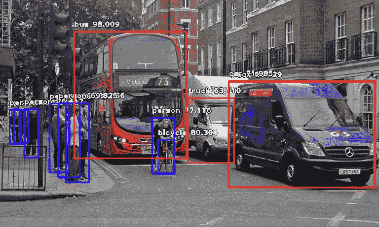

# 计算机视觉中的概率目标检测

> 原文：<https://medium.com/analytics-vidhya/probabilistic-object-detection-in-computer-vision-1ba3ddc6c23f?source=collection_archive---------24----------------------->

(https://towardsdatascience.com)

计算机视觉中的概率目标检测有助于定位和识别视频或图像中的目标。它广泛用于计算机视觉任务，如人脸识别、人脸检测、自动驾驶汽车等。本文旨在演示使用单镜头多盒检测器(SSD)和你只看一次(YOLO)的对象检测。文章简要介绍了这两种目标检测算法及其精度和性能。为了了解哪种算法更快、更准确，我们对这两种算法进行了比较。

**1。简介**

*图像分类*涉及预测图像中一个物体的类别。*物体定位*指识别一个或多个物体在图像中的位置，并围绕其范围绘制丰富的方框。*目标检测*将这两项任务结合起来，对图像中的一个或多个目标进行定位和分类。

2.**相关工作**

目标检测是计算机视觉中的一项基本任务，其目的是使用边界框来定位图像中某些目标类的每个实例。来自对象检测系统的典型输出是一组具有类别标签分数的边界框。自从构造神经网络(CNN)出现以来，物体检测在准确性和速度方面经历了令人印象深刻的进步。引入的概率目标检测任务要求目标检测器估计其检测的空间和语义不确定性。

3.**实施**

1.  **数据集:**用于训练模型的数据集是微软通用对象上下文(MS COCO)。COCO 数据集是一个优秀的对象检测数据集，有 80 个不同的类，80，000 个训练图像和 40，000 个验证图像可用。

**2。算法:**

**A)约洛夫 3:**

你只看一次(YOLO)是一个目标为实时处理的对象检测系统。YOLO 将输入图像分成一个 **S** × **S** 网格。每个网格单元预测一个对象。YOLOv3 比 SSD 快得多，同时达到相当的精度。让我们看看 YOLO 是如何检测给定图像中的物体的。

对于每个边界框，网络还预测边界框实际包围对象的置信度，以及被包围的对象是特定类别的概率。

(来源-[https://towards data science . com/implementing-yolo-on-a-custom-dataset-2010 14 73 ce 53](https://towardsdatascience.com/implementing-yolo-on-a-custom-dataset-20101473ce53))

这些边界框中的大多数被消除，因为它们的置信度低，或者因为它们包围了与另一个具有非常高的置信度得分的边界框相同的对象。这种技术被称为非最大抑制

B) **固态硬盘:**

SSD 是为实时对象检测而设计的。SSD 比更快的 R-CNN 更快，这是由于一些改进，包括多尺度功能和默认框。SSD 使用低分辨率图像，这有助于进一步提高速度。

(src-[https://lambda labs . com/blog/how-to-implementation-SSD-object-detection-in-tensor flow/](https://lambdalabs.com/blog/how-to-implement-ssd-object-detection-in-tensorflow/))

SSD 对象检测由两个组件组成:

1.提取特征地图

2.检测物体的卷积滤波器

SSD 用 VGG16 提取特征图。类别和位置都是使用 SSD 中的小卷积滤波器来计算的。提取特征图后，SSD 对每个细胞应用 3 × 3 卷积滤波器进行预测。

用于检测的多尺度特征图

SSD 采用多层(多尺度特征图)独立检测物体。当 CNN 降低空间维度时，特征图的分辨率也降低。SSD 使用低分辨率层来检测大尺寸物体。SSD 在 VGG16 之后增加了更多的辅助卷积层(六层)。在这六个中，增加了五个用于对象检测。我们从三层中做出 6 个预测，而不是 4 个。SSD 使用六层进行大约 8732 次预测。多比例要素地图显著提高了精度。

**3。** **实验结果**

使用 yolov3 和 SSD 获得的结果如下所示:

对于我们的测试图像，YOLOv3 的结果优于 SSD。用 YOLOv3 得到的图像中物体的确定性更高。在速度方面，YOLOv3 的表现也优于固态硬盘。在下图中，我们用了不到 12 秒的时间探测到了 12 个物体。

对于固态硬盘:

对于 Yolo:

结果:

**3** 。**结论**

已经开发了一种高效且精确的物体检测系统，其实现了与现有的最先进的系统相当的措施。这个项目是利用深度学习和计算机视觉领域的最新技术开发的。评价是一致的。这在实时应用中是有用的，这些实时应用需要检测对象以便在它们的流水线中进行预处理。我们将需要机器人的物体探测系统(它将探索一些人类没有看到的区域)，它将用于查看海洋或其他行星的深度区域。

(github 链接:[https://github . com/faiz an 43/Object-Detection-in-Computer-Vision-master](https://github.com/Faizan43/Object-Detection-in-Computer-Vision-master))

合著者:

[尼拉姆·索迈](https://medium.com/u/4ceed32f9585?source=post_page-----1ba3ddc6c23f--------------------------------)、[杰梅特·梅塔](https://medium.com/u/e8ce444562ad?source=post_page-----1ba3ddc6c23f--------------------------------)、@sireesha.k