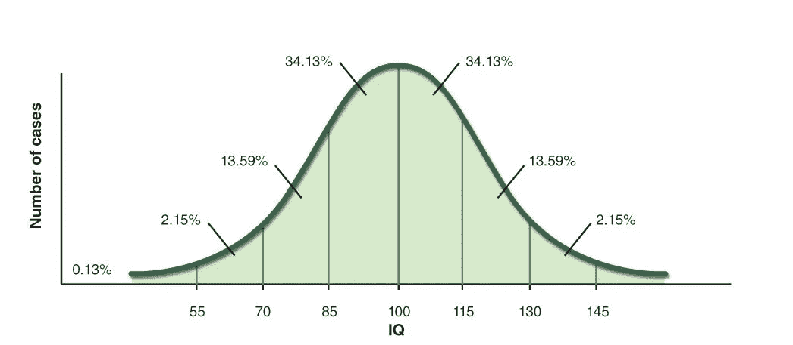

# 机器学习中的概率|第二部分:

> 原文：<https://medium.com/analytics-vidhya/probabilities-in-machine-learning-part-2-fae986728e6d?source=collection_archive---------23----------------------->


# 简介:

本系列的第 1 部分讨论了朴素贝叶斯分类器，它将离散的分类数据按概率进行分类，以进行预测。在第 2 部分中，我将更多地讨论高斯朴素贝叶斯分类器，这种分类器适用于具有数值和离散特征的数据集。

# 什么是高斯朴素贝叶斯分类器？

高斯朴素贝叶斯(Gaussian Naive Bayes)是一种算法，它通过使用高斯分布(等同于正态分布)以及基于高斯分布的贝叶斯来外推数据，从而对数据进行分类。

# 朴素贝叶斯分类的优点:

高斯朴素贝叶斯的优点与我写的文章[朴素贝叶斯分类器](/@victorwtsim/probabilities-in-machine-learning-bf9344e93b9)非常相似。但是对于新读者，我将概述朴素贝叶斯分类器的优点和缺点。

*   处理小型数据集

与传统的神经网络不同，在传统的神经网络中，每个神经元与其他每个神经元直接相连，概率被认为是独立的。

*   计算不密集

与驱动神经网络的权重不同，朴素贝叶斯分类的参数不会在每次迭代中改变。这使得该算法的计算量大大降低。

# 朴素贝叶斯分类的缺点:

*   不擅长学习大数据

当数据足以优化所有参数时，神经网络的复杂映射胜过朴素贝叶斯算法的简单结构。

# 在 Python 中实现高斯朴素贝叶斯分类；

尽管这两种贝叶斯分类器可能有相似的优点和缺点，但它们的实现却非常不同。我在这里用的例子是根据一个人每天吃多少花椰菜来预测他是否喜欢吃花椰菜。

## 步骤 1|先决条件:

```
from scipy import stats
import numpy as npvalues = [12,15,17,18,11,10,19]hate_brocoli = {
    'brocoli_consumed' : [20,0,0,0,10,100,0,0]
}love_brocoli = {
    'brocoli_consumed' : [100,500,900,1000,2000,300]
}
```

计算高斯分布需要科学，操作数组需要数字。为了灵活起见，我设置的数据是字典形式的:字典允许为它们各自的类轻松访问许多特性。

**步骤 2|转换成高斯分布:**

```
def calculate_prereq(values):
    std = np.std(values)
    mean = np.mean(values)
    return std,meandef calculate_distribution(mean,std):
    norm = scipy.stats.norm(mean, std)
    return normdef values_to_norm(dicts):
    for dictionary in dicts:
        for term in dictionary:
            std,mean = calculate_prerequisites(dictionary[term])
            norm = calculate_distribution(mean,std)
            dictionary[term] = norm
    return dicts
```

“calculate_prereq”函数有助于计算标准偏差和平均值:这是创建高斯分布所需的两个要素。

我会让函数从头开始创建高斯分布，但 scipy 的函数已经过高度优化，因此可以更好地处理包含更多要素的数据集。



智商钟形曲线。

我认为简单介绍一下高斯分布是有用的。高斯分布是一般概率数据的近似值。以智商测试谱为例。大多数人的平均智商为 100。因此，高斯分布的峰值将在 100 处。在光谱的两端，随着分数变得越来越极端，获得极低和极高分数的人数减少。有了高斯分布，人们可以推断出一个人获得某个值的概率，从而获得对它的洞察力。

## 第三步|比较可能性:

```
def compare_possibilities(dicts,x):
    probabilities = []
    for i in range(len(x)):
        value = x[i]
        for dictionary in dicts:
            dict_probs = []
            for term in dictionary:
                dict_probs.append(extrapolate(dictionary[term],value))
            probabilities.append(np.prod(dict_probs))
    return probabilities.index(max(probabilities))
```

这个函数简单地运行字典(不同的类),并计算在这种情况下，给定每天吃的西兰花数量，喜欢西兰花的概率。然后，它返回词典列表中的一个索引，即贝叶斯分类器计算出具有最高概率的类。

请记住，虽然这里只使用了一个特性，但是这个函数仍然可以用于多个特性。

## 第 4 步|运行程序:

```
X = [1000]
dicts = [hate_brocoli,love_brocoli]
dicts = values_to_norm(dicts)
compare_possibilities(dicts,X)
```

x 是分类器的输入数据，例如，如果一个人吃了 1000 单位的花椰菜，哪一个更有可能:他讨厌花椰菜，还是喜欢花椰菜？