# 概率和可能性

> 原文：<https://medium.com/analytics-vidhya/probability-and-likelihood-b62f015b65ce?source=collection_archive---------6----------------------->

照片由 [Mads Schmidt Rasmussen](https://unsplash.com/@mvds?utm_source=medium&utm_medium=referral) 在 [Unsplash](https://unsplash.com?utm_source=medium&utm_medium=referral) 上拍摄

概率是某些事件的确切结果。你可能知道一个事件发生的结果是什么。然而，很可能你对结果并不确定。这里的结果取决于各种因素。比如说，在一场比赛中，两个队之间发生掷硬币的事件；现在，掷硬币的结果不是正面就是反面。假设一个队选择了头，他赢得了掷硬币，那么获胜队选择击球的概率将是 0.5 或。这里我们知道确切的结果。现在，可能性并没有给出直接的答案，我们知道选择为获胜队击球的概率是 0.5。但是我们确定或者肯定赢的队会先击球吗？可能性来了；他们首先击球的队的可能性有多大？这取决于很多因素:比如球场的条件；无论是干燥还是潮湿，天气状况，哪个球员在对面的队里？有弱点，有力量，还有许多其他的东西。

如果这些条件不利于获胜队，他们会选择先放弃击球，或者我们可以说他们选择先击球的可能性会非常非常小，如果上述条件对他们有利，那么他们先击球的可能性会更大。因此，正如概率给你直接的答案一样，可能性取决于各种条件和参数。概率值的范围从 0 到 1，但可能性的结果没有确定性。可能性告诉我们一个事件发生的可能性有多大。

让我们通过[二项式分布](https://en.wikipedia.org/wiki/Binomial_distribution)来理解这种可能性:

[二项式分布](https://en.wikipedia.org/wiki/Binomial_distribution)是离散概率分布。当满足以下条件时，称随机变量 X 服从二项分布:

1)随机变量只有两种结果。

*成败(结果的结果)*

*头还是尾(扔硬币)*

*欺诈索赔或真实索赔(欺诈保险索赔)*

*违约或不违约(贷款还款违约)*

2)目标是找出 n 次试验中 x 次成功的概率。

3)成功的概率为 p，失败的概率为(1-p)。

4)概率 p 是常数，不随试验而变化。

二项分布的概率质量函数(PMF )( n 次试验中成功次数恰好为 x 的概率)由下式给出:

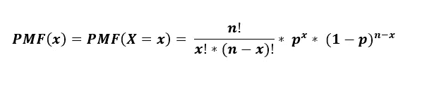

二项式分布的累积分布函数(CDF )( n 次试验中成功次数为 x 或小于 x 的概率)由下式给出:

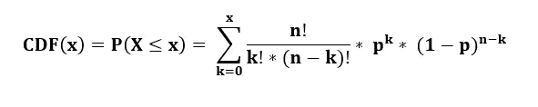

现在，回到我们的案例。可能性是条件概率。我们知道抛硬币的结果要么是正面，要么是反面，各有 0.5 的概率。如果我们把同一个硬币抛 10 次，比方说，10 次中有 7 次是正面，3 次是反面。从二项分布，我们可以计算可能性；

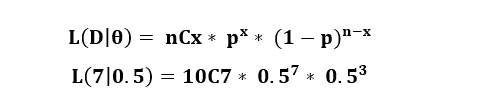

如果结果是头出现的概率为 0.5，头出现 7 次的可能性。

d 是观察数据集，θ是似然函数的参数。

可能性是已经发生的事件会产生特定结果的可能性。然而，概率是指将来会发生的事件。如果硬币被抛了一定的次数，并且是一枚公平的硬币，那么每次硬币落地时会出现正面朝上的概率是多少。概率用于描述给定固定参数的结果函数。这里的函数是每次硬币落地时产生的，给定一个固定的参数，硬币是公平的。

然而，可能性恰恰相反。可能性是描述给定固定结果的参数函数。如果硬币被抛了一定次数，每次落地都是正面朝上，那么硬币是公平的概率是多少？这里的固定参数是抛硬币的结果，函数是硬币是否公平？

*你也可以阅读我在 Medium 上的其他文章:*

 [## 偏差-方差权衡

### 有监督的学习可以在偏差-方差权衡的帮助下得到最好的理解。任何模型的主要目的来…

medium.com](/analytics-vidhya/bias-variance-trade-off-2f3146700f5a)  [## 线性回归和对数据进行直线拟合

### 线性回归是预测连续值输出的监督机器学习算法。在线性…

medium.com](/analytics-vidhya/linear-regression-and-fitting-a-line-to-a-data-6dfd027a0fe2)  [## 时间序列分析导论

### 通过这篇文章，我们将了解:

medium.com](/analytics-vidhya/an-introduction-to-time-series-analysis-2a12d3702299) 

B**ayesian 或 frequent ist**

[*这个视频帮助我很好的理解了这个概念:*](https://www.youtube.com/watch?v=GEFxFVESQXc)

这可能会让你有点困惑，但是耐心点，一切都会好的。我们很多人一定听说过量子物理中的 [***薛定谔的猫实验***](https://en.wikipedia.org/wiki/Schr%C3%B6dinger's_cat) 。如果没有，我来解释一下:把一只猫放在一个封闭的盒子里，盒子里有一点点放射性物质。当放射性物质衰变时，它会变成一种毒药或一次小爆炸，导致猫死于此。但是，这里有一个问题:由于猫和放射性物质被封闭在一个密封的盒子里，我们不知道猫是死是活，直到我们打开盒子。

现在，回到硬币的问题:如果我们把硬币扔出去，拿在手里，或者闭上眼睛，看不到硬币落地的结果；那么硬币落地的概率是多少？现在，有两种情况:

***情况一*** —我们可以说，人头拿到的概率会是 0.5。

***案例二—*** 我们可以说，当我们还没看到结果或硬币落地，事件已经发生。得到正面的概率要么是 100%，要么是零，以防我们得到反面(就像我们可以说的薛定谔的硬币)。

案例一，这里是 [**贝叶斯统计**](https://en.wikipedia.org/wiki/Bayesian_statistics) 。如果我们遵循贝叶斯统计；我们可能有自己的观点。得到人头的可能性是 50%。

案例二，这是常客。我们的观点是不是并不重要；我们在这里遵循事实，事实是硬币已经落地，我们说什么都不重要，结果已经写好了。如果是正面，那么概率将是 100 %,如果是反面，概率将是零。

***记得到现在，我们还没有看到结果。它是隐藏的。贝叶斯会说，得到正面的概率是 50 %,而 Frequentist 会说，硬币已经落地了，所以我们说什么都不重要；事实是——如果是正面，那么概率将是 100 %,否则为零。***

我们已经看到贝叶斯和频率主义者。现在的问题是，哪一个是对的，哪一个是错的，我们应该遵循哪一个？这里的重点不是哪种方法是对的或错的；从他们自己的角度来看，他们都同样正确。

贝叶斯遵从他们的意见；他们不寻求真理。对他们来说，总有一个事件的结果。他们永远不会错。

但是常客追求结果的质量。结果的真正价值。如果该事件发生多次，则发生 100%结果的可能性会大于 0 %,反之亦然。

如果我们想根据我们的观点进行实验，看看实验进行的如何，我们可以选择贝叶斯。如果，在对结果的无知和我们实验的质量总是正确的情况下，那么我们就走频率主义的道路。如果我们的实验是正确的，那就没问题，但如果我们失败了，我们可以根据我们的证据改变场景和我们之前采取的行动。我们来看看实验的质量。

贝叶斯统计是似然的条件概率，概率模型是指频数。

P**参数估计 **

StatQuest 帮助我很好地理解了它。

[*你也可以跟着这篇论文去了解更多细节。*](https://home.aero.polimi.it/lovera/ea/1_3.pdf)

参数估计的必要性是什么？估计器有助于估计数据集中独立特征的参数值，以了解独立特征和响应(目标变量)之间的关系，并最小化成本函数以提高模型的准确性。

有许多类型的估计量。在这里，我将讨论最大似然估计和贝叶斯估计。

**最大似然估计**

最大似然估计(MLE)是通过最大化似然函数来寻找最可能的观测数据，从而估计概率函数参数的估计方法。我们在数据的正态分布(高斯分布)中使用 MLE，以均值和方差为参数，取高斯函数的导数，通过最大化得到计算均值和方差的函数。最大似然估计使用数据的概率模型。

***二项分布的最大似然***

比方说，我们随机选择一组人，问他们，他们更喜欢漫威漫画还是 DC 扩展宇宙漫画。很少有人选择漫威，其余的人选择 DC 扩展宇宙。

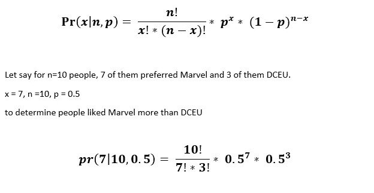

p= 0.5 的可能性有多大？

p(选择漫威的概率)的可能性，给定 n=10(被问人数)，x=7(选择漫威的人数)。

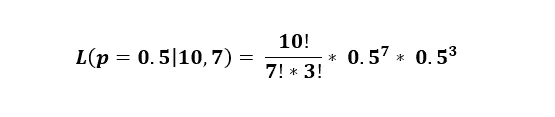

***求导求最大似然。***

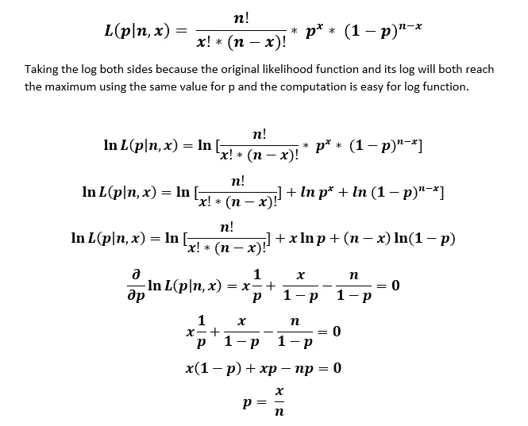

p 的最大似然估计是平均值。

***正态分布的最大似然***

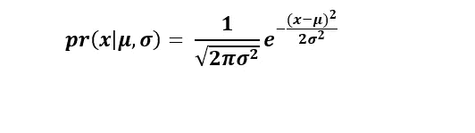

关于μ(平均值)的对数似然函数:

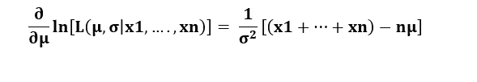

关于 sigma(标准偏差)的对数似然函数:

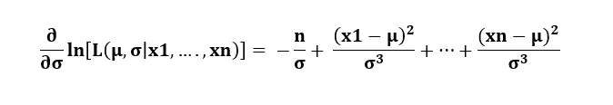

高斯分布中心位置的最大似然估计:

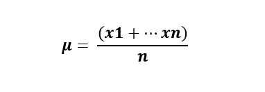

高斯曲线宽度的最大似然估计:

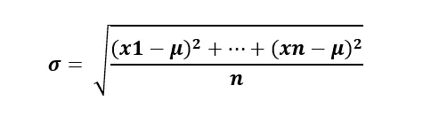

***贝叶斯估计:***

贝叶斯估计或最大后验概率(MAP)估计最小化损失函数的后验期望值。它作用于后验分布，而不仅仅是可能性。我们可以将后验概率作为似然函数和先验函数的乘积。贝叶斯定理基于已知先验函数的概念。当两个事件发生时(事件 A 和 B)，一个事件发生的概率基于另一个已经发生的事件。

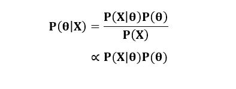

对于贝叶斯估计的推导部分，我们可以按照 [***维基***](https://en.wikipedia.org/wiki/Bayes_estimator) 来理解，因为它不太复杂。我们也可以按照*[***这篇文章***](https://wiseodd.github.io/techblog/2017/01/01/mle-vs-map/) 对它进行详细的解释。这里有 [***另一个***](https://www.ics.uci.edu/~smyth/courses/cs274/readings/bayesian_regression_overview.pdf) 帮助我更好地理解，但这需要时间来消化。*

*如果这里写错了什么或者想补充什么，请在这里帮我改正。因为我也是一个初学者，这只是我学到的。关于这个话题还有很多要学的。如果你知道更多简单的贝叶斯统计方法，请告诉我。积极的批评是非常鼓励的。*