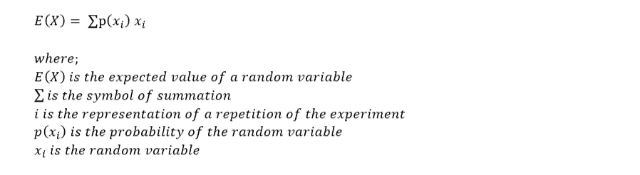
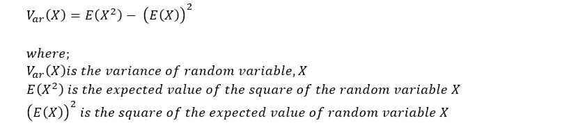
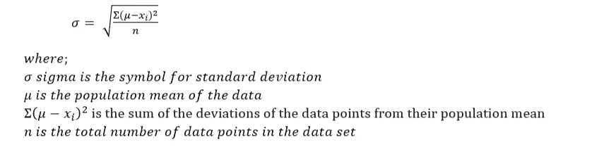
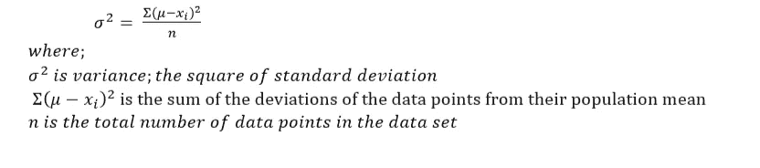
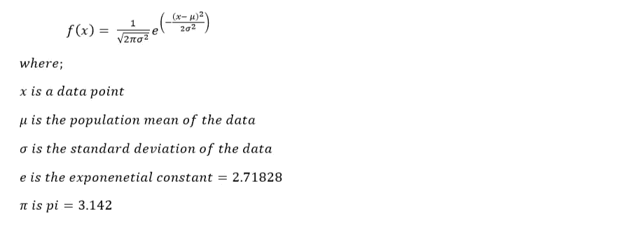

# 数据科学的概率和统计概念

> 原文：<https://medium.com/analytics-vidhya/probability-and-statistics-concepts-for-data-science-91556dcbba1c?source=collection_archive---------21----------------------->

在数据科学领域，概率和统计是重要的先决条件。对基本概念的良好理解非常重要，有助于数据科学家对定量和定性数据进行数学分析。

在这篇文章中，我将定义一些数据科学中概率和统计的基础知识来帮助你开始。

***概率。***

照片由 [Riho Kroll](https://unsplash.com/@rihok?utm_source=medium&utm_medium=referral) 在 [Unsplash](https://unsplash.com?utm_source=medium&utm_medium=referral) 上拍摄

***什么是概率？***

概率描述一个事件或事件发生的可能性。

概率是对事件发生的可能性的计算。一个事件发生的可能性越大，其概率就越高。

不确定性与世界上的随机性直接相关，它可以用于确定特定事件发生的几率。

在数据科学中，数据的概率分布用于分析、预测和开发模型，这些模型可以有效地帮助以数据为中心的决策。

***这里有一些可以让你入门的顶级概率论定义:***

1.一个**实验**是一个可重复的测试，可以有不同的结果。

2.**样本空间**是实验的所有基本结果的集合。

*基本结果*是实验的结果，它不能被分解成更小的结果。

3.一个**事件**是包含许多基本结果的样本空间的子集。

4.一个**不可能发生的事件**是一个永远不可能发生的事件，它的概率是 0。

5.某个**确定事件**是肯定会发生的事件，其概率等于 1。

6.**互斥事件**是在同一个实验中不能同时发生的事件。

7.**独立事件**是指一个事件的发生不影响另一个事件发生的概率。

8.**随机变量**是取一个在实验进行之前无法预测的随机值的变量。

9.**随机变量的概率分布**是一个包含所有随机变量的可能值及其出现概率的表格。

10.随机变量的**期望值是随机变量在多次重复实验后趋向的数值，计算为随机变量所有值的总和乘以它们的概率:**

期望值公式:

11.**随机变量的方差**是随机变量值的离差的度量，可使用以下公式计算:

12.**二项式实验**是有两种可能结果的实验；一次成功，一次失败。

***统计***

照片由 [Isaac Smith](https://unsplash.com/@isaacmsmith?utm_source=medium&utm_medium=referral) 在 [Unsplash](https://unsplash.com?utm_source=medium&utm_medium=referral) 上拍摄

***什么是统计？***

统计学是对数据的收集、组织、分析和解释的研究。

在数据科学中，核心统计概念是各种编程库中算法的基础。

***下面是一些常用的统计学概念:***

1.**分类**

分类是将类别分配给数据集，以便进行更准确的分析和预测。

一种主要的分类技术是*逻辑回归。*

2.**线性回归**

线性回归是一种统计方法，通过寻找变量线性关系的最佳拟合线来预测目标变量。

3.**重采样方法**

重采样是从原始数据集中重复提取样本的过程。这些样本用于计算原始数据的预期概率值。

## 结合概率论的描述性统计在做出数据驱动的决策时非常关键。

**这里有一些描述性统计的理论定义，可以帮助你入门**

1.**定量**(数值型)变量取数值。

2.**定性**(分类)变量采用非数值。

3.**连续变量**是一个定量变量，可以取某个范围内的任何数值(如 0 到 1 之间的任何值)

4.**离散变量**是在任何范围内都不连续的任何变量(如取 0 到 100 的整数值的变量)

5.**频率密度**等于柱状图高度的值，柱状图的面积反映了连续变量的相对频率。

6.**的意思是**

平均值描述了数据位置的代数度量。

平均值用表示，通过寻找所有数据点的平均值来计算。

**7。** **中位数**

中位数描述了数据位置的结构度量。

中位数是通过找出所有按升序排列的数据点的中间值来计算的。

8.**标准差**描述了数据如何从平均值“扩散”的度量。

标准差是总体平均值的平方差的平均值的平方根。

低标准偏差表明这些值更接近数据的平均值，而高标准偏差表明这些值分布在很宽的范围内。

标准差公式为:

9.**方差**描述了总体均值的方差平均值。

方差是标准差的平方，可互换地，标准差是方差的平方根。

差异公式为:

到目前为止，我们已经定义了一些在数据科学中真正重要的概率和统计的基本原理。

我们来看看*概率分布*。

***概率分布***

照片由[卢克·切瑟](https://unsplash.com/@lukechesser?utm_source=medium&utm_medium=referral)在 [Unsplash](https://unsplash.com?utm_source=medium&utm_medium=referral) 上拍摄

概率分布表示随机变量取特定值 x 的可能性。

概率分布描述了随机变量概率值的离散程度。

有两种类型的概率分布:

I .离散变量的离散概率分布

二。连续变量的概率密度函数

着眼于概率密度函数，一个众所周知的概率密度函数是**高斯分布**，也称为**正态分布**。

正态分布具有“钟形曲线”的象征性特征。

正态分布的密度取决于两个参数:平均值*和标准差*。

高斯分布也作为**一个中心极限定理(CLT)** 出现，其中许多独立的随机变量加在一起，给出一个正态分布。

正态分布函数公式为:

这是迈向数据科学的概率和统计概念的第一步。实践和额外的信息会让你经历你的学习曲线。

快乐学习！！！