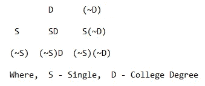
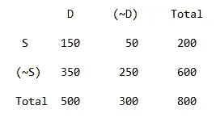

# 布尔逻辑的概率概念

> 原文：<https://medium.com/analytics-vidhya/probability-concept-by-boolean-logic-fc4297c1fbf4?source=collection_archive---------18----------------------->

我第一次学概率是在 10 年级，从那以后在大学里，再到大学里，我遇到过很多次概率问题。但是我不擅长寻找概率。我经常随机猜测答案。有时，我会参考任何数学书籍和一些有趣的在线课程，然后尝试自己解决概率问题，但不幸的是，我很难得到正确的答案。现在，由于我几乎每天都在处理*数据科学*的问题，我不得不多次计算概率，所以我决定彻底学习它。

最近，我学习了一种通过布尔逻辑寻找概率的新方法，这是我遇到过的最简单的方法。现在我可以很快地计算任何问题，所以我觉得很多不会解决概率问题的人可以从这篇文章中很容易地获得下次准确的概率结果。

# 定义

> P 一个事件的概率 A 定义为两个数 A 和 b 的比值为，P(A) = a/b，其中 A 为有利于 A 发生的方式的个数，b 为该事件结果的总数。

简单来说，概率是指某一特定事件发生的几率或可能性。

# 术语

***事件:*** 事件是一个实验的结果。

***实验:*** 实验是为了理解和观察所有可能的结果而进行的过程。

***样本集:*** 样本集是一个实验所有结果的集合。

# 计算概率的加法规则

> 互斥事件的添加规则:
> 
> P(A ∪ B) = P(A) + P(B)。
> 
> 非互斥事件的加法规则:
> 
> P(A∪B)= P(A)+P(B)-P(A∪*B)。*

# 布尔方式概率

假设有两个事件 **A** 和 **B** 不互斥，那么加法规则是，

> P(A∪B)= P(A)+P(B)-P(A∪*B)。— — — (1)*

现在，通过使用布尔理论，可以证明这两个方程是相同的。

当事件 B 存在***【A B】***和事件 B 不存在***【A(~ B)】***时，事件 A 被视为事件 A 的相加，如下所示:

> A = A B + A (~B)
> 
> ∴ A (~B) = A - A B

同样的，

> B = B A + B (~A)
> 
> ∴ B (~A) = B - B A

现在，

> A 或 B = A B + A (~B) + B (~A)

将 A (~B)和 B (~A)的值分别放入上式中，

A 或 B = A B + A - A B + B - B A，其中 A B 被抵消，

因此，剩下的部分是 A 或 B = A + B - A B

∴ P(A 或 B) = P(A) + P(B) - P(A 和 b)

> ∴p(a∪b)= p(a)+p(b)-p(a∪b)它等于第一个方程。

# 例子

> 从一副洗得很好的牌中，随机抽取一张牌，那么所选的牌是国王或钻石的概率是多少？

国王(K)或钻石(D) = K D + K (~D) + D (~K) = 1 + 3 + 12 = 16

概率=有利实例/总实例= 16 / 52

## 注意:

例如，对于一副牌中的国王，有两种方法可以考虑。

1.  频率法是 K + (~K) = 52(因为总卡数是 52)。
2.  比例法是指 K + (~K) = 1 或 100 %。

> 一家公司的员工接受了教育背景(是否有学位)和婚姻状况(单身或已婚)的调查。
> 
> 在 800 名员工中，500 人拥有大学学位，200 人单身，150 人是单身大学毕业生。公司员工单身或有大学学历的概率为:

描述四种不同条件的布尔表。

这里，S 指的是单身员工，而(~S)指的是已婚员工。同样，D 指的是拥有大学学位，而(~D)指的是没有大学毕业。

现在，当我们输入问题中的值时，我们得到下表。

## 上表的解释

首先，我们有 500 名*大学毕业生，所以总人数为 500。其中 ***的 150 个*** 都是单个的，所以【S D】单元格是用 150 填满的。所以，[(~S) D]单元格会自动成为 500 - 150 = ***350*** 。因此，第一列被填满。*

*现在，有 200 名单身员工，所以总人数是 200。在总共 200 名单身员工中，有 150 人拥有大学学位，因此非大学毕业生的单身员工人数[S (~D)]单元格应为 200 - 150 = ***50*** 。最后，既不是单身也没有任何大学学历的员工总数为 800-[150+50+350]=***250***。*

*问题是找出单身或有大学学位的雇员的概率，*

> *S 或 D = S D+(~ S)D+S(~ D)= 150+350+50 = 550*
> 
> *概率(S ∪ D) =有利实例/总实例= 550 / 800 = 11 / 16*

*因此，这就是你如何通过创建一个 2 x 2 的表来计算任何概率问题，然后将**有利事件**除以**总事件**。*

*谢谢你走到最后。我希望通过这种技巧，你能在将来熟练地解决任何困难的概率问题。如果你想了解更多，请在这个故事中深入了解。如果有任何不清楚的地方，或者我在上面犯了什么错误，请随意发表评论。如果你喜欢，请鼓掌鼓励我。快乐学习！:)*

## *💙**我们来连线**💙*

*[推特](https://twitter.com/i_mvyas)|[LinkedIn](https://www.linkedin.com/in/mvyas22/)|[Tableau](https://public.tableau.com/profile/maulik.vyas#!/)*