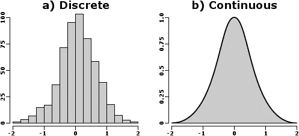
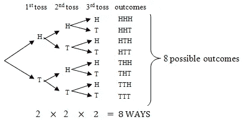
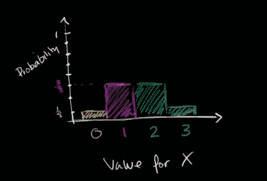
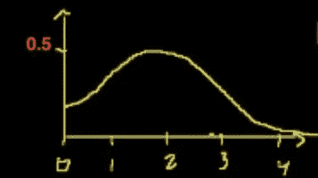
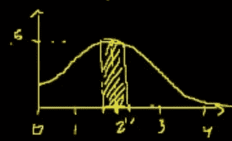

# 概率分布

> 原文：<https://medium.com/analytics-vidhya/probability-distributions-444e7babf2e1?source=collection_archive---------3----------------------->

## 构建随机变量的概率分布

离散与连续

为了理解概率分布，需要理解什么是随机变量以及随机变量的类型。如果你不熟悉这些——请访问[随机变量](/@dharmanathpatil/random-variables-47fcf1898470)和[随机变量类型](/@dharmanathpatil/types-of-random-variables-1f7e17a4e3c7)。假设你有关于这些主题的先验知识，让我们试着理解离散随机变量和连续随机变量的概率分布。

## 1.离散随机变量的概率分布

假设我们将一个随机变量 **X** 定义为*在掷 3 次公平硬币*后我们得到的正面数。我们想画出这个 p(X)的分布图。我们将列出该实验中所有可能的结果:

抛 3 次硬币后所有可能的结果

*   得到 0 人头的概率:P(X=0) = 1/8
*   得到 1 人头的概率:P(X=1) = 3/8
*   得到 2 个头的概率:P(X=2) = 3/8
*   得到 3 个头的概率:P(X=3) = 1/8

从上面我们可以画出分布图如下:

离散概率分布

上图显示了掷 3 次硬币后，我们得到的人头数的概率分布。x 轴始终保存我们想要绘制分布图的**实验结果**，y 轴可以是我们观察结果的**概率或实验数量**。

## 2.连续随机变量的概率分布

假设我们将随机变量 **Y** 定义为明天可能的确切降雨量。我们想画出这个 p(Y)的分布图。

比方说，我们不知道实际的概率分布函数，但是让我们(随机地)画一个，并尝试解释。让我们假设它看起来像下面这样:

概率密度曲线

从上图来看，如果我们试图将明天可能降雨的确切数量的概率解释为等于 2，即 p(Y=2 ),那么我们可能会误判为 0.5，这是不正确的。我们可以把它和一个单位正方形的面积联系起来。单位正方形的面积是 1，而单位正方形中任一点的面积是 0。类似地，连续概率分布中所有结果的**概率总和加起来正好是 1** ，连续随机分布中任何确切事件的**概率是 0** 。在上面的密度曲线中，曲线下的面积加起来正好是 1。

并且 p(Y=2)=0

这有点令人困惑，不是吗？让我们简单一点。观察离散概率分布图。在该图中，每个结果占据 x 轴上的单位空间，y 轴上的高度取决于所有可能结果中该结果被观察到的次数。

> 因此，任何事件发生的概率等于(x 轴上的震级* y 轴上的震级)。

在离散概率分布中，由于每个结果占据 x 轴上的单位空间，任何事件发生的概率等于(y 轴上的 1 *量级),也就是 y 轴上的**量级。**

在连续变量分布中，我们有几乎无限的结果，因此每个结果在 x 轴上占据显著的零单位。如果我们在等式中替换 x 的大小(x 上的大小* y 上的大小),我们将得到概率等于 0。因此，在连续变量分布中，发生任何确切事件的**概率等于 0，因为 x 轴上结果的大小接近 0。**

**那么连续变量分布是如何使用的呢？**在连续分布中我们总能找到一个事件在界限之间的概率。例如 p(1.9 < Y < 2.1)。我们需要做的就是找到 1.9 和 2.1 之间的面积，如下所示:

1.9 和 2.1 之间的区域

使用密度函数的积分，您可以找到 1.9 和 2.1 之间的区域，该区域代表明天可能在 1.9 英寸和 2.1 英寸之间降雨的概率。

**结论**

我们看到了如何分别绘制离散随机变量和连续随机变量的概率分布和密度曲线。我们还看到了离散随机分布中的事件概率如何不同于连续随机分布。

找到下一个帖子[二项式随机变量](/@dharmanathpatil/binomial-variable-9a924a1570a9)