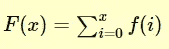
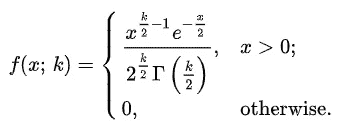

# 数据科学和机器学习中特征工程的概率分布。

> 原文：<https://medium.com/analytics-vidhya/probability-distributions-for-feature-engineering-in-data-science-and-machine-learning-1d7d00155d46?source=collection_archive---------6----------------------->

我假设，你已经对排列组合和概率有了一些基本的了解(比如条件概率/贝叶斯定理)。我将把重点放在特征工程中使用的概率领域。在任何发行版中，我都不会深入研究数学；但是，如果你有兴趣知道，请随时通过评论让我知道。如果你对概率没有一个基本的概念，那么这篇文章不适合你；我将在另一篇文章中讨论基本概率。

**离散**:一个 R.V .(随机变量)X 被称为是离散的 R.V .如果它是一组可能的结果，样本空间 S 是可数的(有限的或无限的序列，其元素与整数一样多)。

离散变量

**连续**:称一个 R.V. X 为连续 R.V .如果 S 包含无穷多个等于一条线段上点数的数。

连续变量

## **概率密度函数(PDF):**

概率密度函数考虑了连续的随机变量。因此，他们给出一个值，例如 P(2 <x which="" is="" of="" course="" done="" via="" integration="" except="" for="" normal="" or="" log-normal="" distributions="" where="" the="" class="ku">z 表更容易，通常使用。</x>

便携文档格式

## **概率质量函数(PMF):**

概率质量函数只考虑离散随机变量。因此，它们给出了 P 的值(X=x)。换句话说，离散变量情况下的 PDF 称为 PMF。

可能最大洪水

## **累积分布函数(CDF):**

累积分布函数(CDF)是变量取值小于或等于 X 的概率，即{F(x)=Pr[X≤x]=α}。

对于连续分布，这可以用数学方法表示为

对于离散分布，CDF 可以表示为

下面是正态累积分布函数的曲线图。

连续函数的 CDF

*   **离散概率分布:**二项式分布、泊松分布、几何分布、负二项式分布、超几何分布、多项式分布、多元超几何分布。
*   **连续概率分布:**均匀(矩形)分布、正态分布、伽玛分布、指数分布、x(卡方)分布、贝塔分布、二元分布、t 分布、f 分布。

# B

一个**二项式分布**可以简单地认为是一个重复多次的实验或调查中成功或失败结果的概率。二项式是一种分布类型，它有**两种可能的结果**(前缀“bi”表示两个或两次)。例如，掷硬币只有两种可能的结果:正面或反面，而参加测试可能有两种可能的结果:通过或失败。

# **泊松分布:**

泊松分布是给定时间段内发生的事件数量的离散概率分布，给定该时间段内事件发生的平均次数。

使用泊松分布的条件是:

*   一个事件在一段时间内可以发生任意多次。
*   事件独立发生。换句话说，如果一个事件发生了，并不影响同一时间段内另一个事件发生的概率。
*   发生率是恒定的；也就是说，速率不随时间变化。
*   事件发生的概率与时间段的长度成正比。例如，事件在 2 小时内发生的可能性应该是事件在 1 小时内发生的可能性的两倍。

要详细阅读泊松分布，请参考[这篇](https://towardsdatascience.com/the-poisson-distribution-and-poisson-process-explained-4e2cb17d459)文章。

泊松分布的概率质量函数由下式给出:

泊松分布的 PMF

泊松分布的 PMF 图。(图片来源:维基百科)

# 几何分布:

几何分布，直观地说，是一个人在使用一个加权硬币的第一个头部之前必须翻转的尾部数量的概率分布。对于需要知道成功需要多少次尝试的情况，它非常有用，因此可应用于人口建模、计量经济学、研究的投资回报率(ROI)等。

(x-1)次失败后获得成功的概率为:

几何分布的三个假设是:

*   每次试验都有两种可能的结果(成功或失败)。
*   这些试验是独立的。
*   每次试验的成功概率是一样的。

几何分布的 PMF(图片来源:维基百科)

# 超几何分布；

超几何分布用于计算无替换采样时的概率。

请注意，它不同于二项式分布，因为二项式实验要求每次试验的成功概率保持不变。但是在超几何分布中，每次试验的成功概率都是变化的。

例如:假设你有一个装有 10 颗弹珠的瓮，其中 5 颗红色，5 颗绿色。你随机选择 2 个没有替换的弹珠，并计算你选择的红色弹珠的数量。一开始，选择红色弹珠的概率是 5/10。如果你在第一次试验中选择了一颗红色的弹珠，那么在第二次试验中选择红色弹珠的概率是 4/9。如果你在第一次试验中选择了绿色的弹珠，那么在第二次试验中选择红色弹珠的概率是 5/9。

请进一步注意，如果您选择了替换弹珠，成功的概率不会改变。每次审判都是 5/10。那么，这将是一个二项式实验。

(图片来源:维基百科)

# 多项式分布:

**多项分布**是多项实验结果的概率分布。

**多项式实验**是一个统计实验，具有以下特性:

*   这个实验由 *n* 次重复试验组成。
*   每个试验都有一些不连续的可能结果。
*   在任何给定的试验中，特定结果发生的概率是恒定的。
*   审判是独立的；也就是说，一项试验的结果不会影响其他试验的结果。

例子:考虑下面的统计实验。你投掷两个骰子三次，记录每次投掷的结果。这是一个多项式实验，因为:

*   这个实验由反复试验组成。我们掷三次骰子。
*   每一次试验都会产生不同数量的结果:2 到 12 个。
*   任何结果的概率都是不变的；从一次投掷到下一次投掷，它不会改变。
*   审判是独立的；也就是说，在一次试验中获得特定的结果不会影响其他试验的结果。

**注:**二项式实验是多项式实验的特例。这是主要的区别。在二项式实验中，每次试验都有两种——而且只有两种——可能的结果。对于多项式实验，每个试验可以有两个*或更多*种可能的结果。

# 均匀(矩形)分布:

所有结果可能性相等的概率分布；每个变量都有相同的概率成为结果。

均匀分布的 PDF 由下式给出:

(图片来源:维基百科)

# 正态分布(或**高斯**或**高斯**或**拉普拉斯–高斯**):

正态分布的特征:

*   对称钟形
*   均值和中位数相等；两者都位于分布的中心
*   ≈68%的数据落在平均值的 1 个标准偏差内
*   ≈95%的数据落在平均值的 2 个标准偏差内
*   ≈99.7%的数据落在平均值的 3 个标准偏差内

正态分布的 PDF 由下式给出:

(图片来源:维基百科)

# 伽马分布:

**伽马函数:**伽马函数，用γ(x)表示，是阶乘函数对实数(和复数)的扩展。具体来说，如果 n∈{1，2，3，…}，那么

更一般地，对于任何正实数α，γ(α)被定义为

**伽马分布:**
一个连续的随机变量 X 据说有一个参数为α > 0 和λ > 0 的*伽马*分布，表示为 X∞伽马(α，λ)如果它的 PDF 由下式给出

# 指数分布:

(伽玛分布的特殊情况和几何分布的连续模拟)

如果连续随机变量 X 的 PDF 由下式给出，则称其具有参数为λ > 0 的*指数*分布，表示为 X∞指数(λ):

# x(卡方)分布:

(伽马分布的特例)

假设我们从正态总体中选择一个大小为 *n* 的随机样本，其标准差等于σ。我们发现样本中的标准偏差等于 *s* 。给定这些数据，我们可以使用以下等式定义一个统计量，称为**卡方**:

卡方统计量的分布称为卡方分布。**卡方分布**由以下概率密度函数定义:

# 贝塔分布:

这种分布代表一系列概率，是用百分比或比例表示结果的一种通用方法。比如坎耶·韦斯特赢得下届总统大选的可能性有多大？你可能认为概率是 0.2。你朋友可能会觉得是 0.15。贝塔分布给了你一个描述这个的方法。

Beta 分布的 PDF 由下式给出:

# 二元分布:

一个**二元分布**，简单来说就是当你的场景中有两个独立的随机变量时，某个事件发生的概率。例如，有两个碗，每个碗都装有两种不同类型的糖果，从每个碗中取出一种糖果会给你两个独立的随机变量，即两种不同的糖果。因为你同时从每个碗里拿出一颗糖果，所以在计算你得到特定种类糖果的概率时，你有一个二元分布。

[这里的](https://cran.r-project.org/web/packages/bivariate/vignettes/bivariate.pdf)是一篇很好的阐述二元分布的文章。

# t 分布:

它是连续概率分布家族中的一员，在样本量较小且总体标准差未知的情况下，当估计正态分布总体的均值时会出现。

t 分布的 PDF 由下式给出:

何时使用 t 分布:

t 分布可用于任何具有钟形分布(即近似正态)的统计数据。如果满足以下任何条件，统计数据的抽样分布应该是钟形的。

*   人口分布呈正态分布。
*   总体分布是对称的，单峰的，没有异常值，样本量至少为 30。
*   总体分布呈中度偏态，单峰，无异常值，样本量至少为 40。
*   样本量大于 40，无异常值。

t 分布应该*而不是*用于来自非近似正态总体的小样本。

*感谢您的阅读，如果您有任何问题或建议，欢迎在评论区发表。此外，我花了很多精力来写这个，所以我希望你觉得这是有用的。*