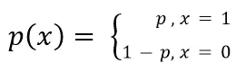
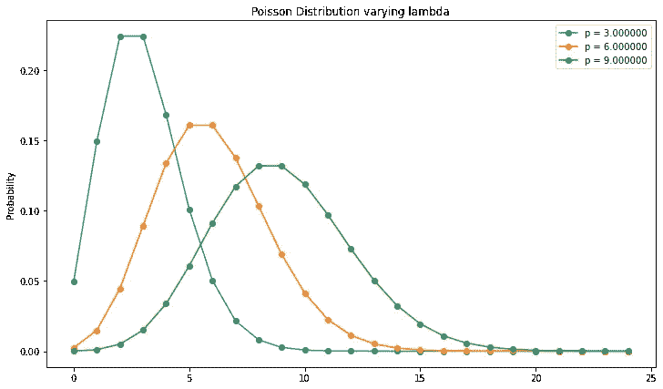

# 数据科学和机器学习中的概率分布|第 1 部分

> 原文：<https://medium.com/analytics-vidhya/probability-distributions-in-data-science-and-machine-learning-part-1-577f4e0581fb?source=collection_archive---------4----------------------->

analyticsindiamag.com

> 对于一个渴望成为数据科学家的人来说，统计学是一门必修课。它可以处理现实世界中复杂而具有挑战性的问题，以便数据科学家可以挖掘有用的趋势、变化和数据行为，以适应适当的模型，从而产生最佳结果。每当我们获得一个新的数据集，我们必须了解数据模式和潜在的概率分布，以便在探索性数据分析(EDA)期间进行进一步的优化和处理。在 EDA 过程中，我们尝试使用不同的概率分布来找出数据的行为。如果数据满足任何一个问题或与之相似，我们会进一步处理它们以获得更好的结果。

D ata 科学家处理多种数据，如分类、数字、文本、图像、声音等等。他们每个人都有自己的分析和表达方式。在这里，我们将考虑数字数据进行进一步的分析。数字数据有两种类型。

1.  ***离散*** —它只能取特定的值。数据的结果是固定的。例如，一家公司的员工人数，当您掷骰子时的结果可能在[1，6]之间
2.  ***连续*** —可以取任意值。例如，一个人的身高或体重可以是任何值，如 45.6、87.9

我们可以绘制这些数字数据，根据它的模式、行为和它所遵循的概率分布的类型进行可视化并得出结论。*在深入之前，我们先熟悉一些术语。*

***问:什么是概率分布？***

*Ans:* *概率分布是描述一个随机变量在一个范围内可以取的所有可能的结果和可能性的函数。*

***问:什么是随机变量？***

*Ans:与某种偶然性有关的变量，经过测量，叫做随机变量。随机变量的值是未知的，结果可以通过实验获得。它可以是离散的(当事件有特定结果时)或连续的(当事件在特定范围内产生时)。*

***问:什么是概率质量函数(PMF)？***

*Ans:离散随机变量的分布称为概率质量函数(PMF)。离散随机变量 x 的 pmf 定义为，*

***问:什么是概率密度函数(PMF)？***

*Ans:连续随机变量的分布称为概率密度函数(PDF)。变量(设 x)的值在一个数字区间(设 a & b)上的 pdf 定义为，*

# ***离散概率分布:***

在统计学和数据科学中，有几种常用的离散概率分布。比如，

1.  *伯努利*
2.  *二项式*
3.  *制服*
4.  *泊松*
5.  *几何等。*

# 伯努利分布:

伯努利试验的伯努利分布只有两种可能的结果成功或失败。例如，抛硬币只能产生两种结果正面或反面。

设成功概率为***p***；于是，一个失败的将会是***【1-p】***。所以这个函数可以定义为，

因为有均等的机会获得结果，所以单次无偏掷硬币获得正面的概率将是 0.5。那么***(1-p)****= 0.5。所以，*

***P(x = 1)= P(1)= P = 1/2***

***分配剧情:***

一次成功的概率=0.3，失败的概率=0.7

# 二项式分布:

正如我们所见，伯努利分布是基于单个实验的结果。假设一枚无偏的硬币被投掷 10 次。那么，在这种情况下， ***得到至少 7 倍人头的概率会是多少？*** *现在二项分布出现了。*

一个 ***二项分布*** 可以简单地认为是一个实验或调查中多次重复的*成功*或*失败*结果的概率。

***Q .二项分布在什么条件下可以是伯努利分布？***

1.  *试验次数(n)应为 1。*

## 假设:

*   对于任意数量的试验，在相同的条件下进行实验。例如，如果一个问题。成功的几率( ***p*** *)是 0.5，它将在整个试验中为 0.5。*
*   对于每个试验，只有两种可能的结果。成败
*   概率的总和总是 1。
*   每个试验都是相互独立的。

## 定义:

如果随机变量 ***x*** 采用非负整数值，则称其遵循二项式概率分布。概率质量函数由概率定律给出，如下所示。

*现在得到至少 7 个头的概率会是，*

***参数:***

**n =独立试验的数量**

***分布图:***

对于不同的成功概率

***属性:***

*   *二项分布是偏斜的，除非* ***p=q=1/2。***
*   *均值****NP =λ****为常数，为正的实值。*
*   *独立二项变量之和不是二项变量。*

***Q .二项分布在什么条件下可以是正态分布？***

1.  *独立试验的次数应该无限大，n → ∞。*
2.  *p 和 q 都不应该小。*

# 均匀分布:

离散随机变量的均匀分布是一种对称的概率分布，其中有限数量的值被相等地观察到。例如，当我们掷骰子或掷一枚无偏的硬币时，得到这些结果的概率是相等的。

对于一个随机变量 ***x*** ，均匀分布函数可以定义为，

*例如，通过滚动一个无偏的骰子，我们得到 6 个可能的值:{1，2，3，4，5，6}。所以同样有可能得到其中任何一个值。*

*所以，****f(X = = X)= 1/6****(prob，of getting a value)*

***参数:***

均匀分布的均值和方差

***分配剧情:***

# 泊松分布:

泊松分布是一种离散分布，是由数学家丹尼什·泊松 推导出来的。他在 1830 年发明了这种方法来描述一个赌徒在大量尝试中赢得一场难得的机会游戏的次数。

基本上，它显示了一个事件在一段特定的时间内发生的频率。由于随机变量是离散的，它只能被测量为发生或不发生。

## **定义:**

当随机变量 *x* 仅采用非负值且其概率函数由下式给出时，称其遵循泊松分布:

**λ =泊松参数**

这是一个单参数单变量分布。这也是二项分布的一个极限情况。

***问:二项分布在什么条件下可以形成泊松分布？***

1.  *试验次数* ***(n)*** *应该是巨大的，说* ***∞。***
2.  *每次试验的恒定成功概率应该最小* ***p→0***
3.  *的平均值应该等于* *的泊松参数。* ***np= λ***

## 示例:

作为数据科学家，我们遇到的许多真实数据集都遵循泊松分布。比如，

1.  特定银行一个月内发生的交易欺诈数量。
2.  *Quora 上每天发布的不真诚问题数量*
3.  *因服务问题致电公司服务中心的客户数量*

了解我们的数据集遵循何种分布非常重要。这样就可以得出关于数据建模的一定结论。

***参数:***

**对于泊松分布，均值和方差都相同，这就是泊松参数。**

***分布图:***

# 几何分布:

假设我们在民意测验后调查一位独立候选人，他/她获得了多少选票。所以在投票站外面，我们开始询问人们他们投了什么票，每次我们都会得到其他候选人的名字。最后，有一个人说他/她投了那个独立候选人的票。这里 ***几何分布*** 将由我们在找到为我们的候选人投票的人之前必须投票的人数来表示。

基本上，它代表了我们在一系列伯努利试验(总是有两种结果)中成功之前的失败次数。

我们可以将函数定义为，

## 假设:

*   每次试验都有两种可能的结果(成功或失败)。
*   这些试验是相互独立的。
*   每次试验的成功概率是相同的。

**参数:参数:**

***分配剧情:***

> 注意:离散概率分布有很多种呈现方式。如多项式、负二项式、超几何等。这些类型的分布对统计学也有很大的影响，从数据科学的角度来看有一个想法是很好的。但是我将在这里用上述 5 个分布完成离散部分。

所以我要结束这个博客的第一部分***。 ***第二部*** ，在这里找到链接[。](https://abhishek-barai.medium.com/probability-distributions-in-data-science-and-machine-learning-part-2-a907d84d3211)***

*请在这里* *找到代码* [*。*](https://github.com/MaverickMonk/Machine-Learning-Methods/blob/main/probability_distributions.ipynb)

## 参考资料:

 [## 数据科学中的概率分布

### 拥有扎实的统计背景对数据科学家的日常生活大有裨益。每次我们…

www.kdnuggets.com](https://www.kdnuggets.com/2020/02/probability-distributions-data-science.html)  [## 统计学如何:我们其余人的基本统计学！

### 寻找初级统计帮助？你来对地方了。统计怎么有 1000 多条…

www.statisticshowto.com](https://www.statisticshowto.com/)