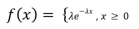

# 数据科学和机器学习中的概率分布|第二部分

> 原文：<https://medium.com/analytics-vidhya/probability-distributions-in-data-science-and-machine-learning-part-2-a907d84d3211?source=collection_archive---------7----------------------->

> 注意:这个博客是“数据科学和机器学习中的概率分布|第一部分”的连续体。以防你还没看，这里是[链接](https://abhishek-barai.medium.com/probability-distributions-in-data-science-and-machine-learning-part-1-577f4e0581fb)。

这里我将讨论各种类型的连续概率分布及其在机器学习中的应用。

# 连续概率分布:

一些标准的连续概率分布是

1.  *正常/高斯*
2.  *学生的 t 分布*
3.  *指数型*
4.  *对数正态*
5.  *幂律和帕累托分布*

# *正态/高斯分布:*

正态分布是统计学和数据科学的支柱。许多机器学习模型能够很好地处理遵循正态分布的数据。如；

1.  *高斯朴素贝叶斯分类器*
2.  *逻辑、线性回归和基于最小平方的回归模型*
3.  *线性判别分析(LDA)和二次判别分析(QDA)*

在数据呈正态分布的情况下，Sigmoid 函数往往工作得很好。一些数据也可能呈现另一种分布，这种分布可以在以后使用对数和平方根转换成正态分布。

## 数学定义:

一个连续的随机变量“x”被称为遵循一个参数为μ(均值)和σ(标准差)的正态分布，如果它的概率密度函数由下式给出，

也称为**正常变量。**

## 标准正态变量:

如果“x”是具有平均值(μ)和标准差(σ)的正态变量，

**z =标准正态变量**

## 标准正态分布:

正态分布的最简单情况称为标准正态分布，其预期值为μ(均值)0 和σ(标准差)1，由以下概率密度函数描述:

***其中— ∞ < z < ∞***

## 分布曲线特征:

1.  *总* ***面积下*******法线曲线*** *等于 1。**
2.  **这是一个连续的分布。**
3.  **关于均值对称。分布的每一半都是另一半的镜像。**
4.  **对横轴渐近。**
5.  **是单峰的。**

****参数:****

*对于标准的正态分布，*

**

****配送:****

**

***标准偏差变化的正态分布***

**这里我们可以看到，随机变量概率随着标准差的变化而变化，导致峰度的变化。**

> *想了解更多关于正态分布的知识，请点击链接[这里](/analytics-vidhya/normal-distribution-and-machine-learning-ec9d3ca05070)。*

# **学生的 t 分布:**

*学生的 t 分布是统计学上最大的突破之一。它允许通过未知总体方差的小样本进行推断。这种设定可以应用于我们今天面临的大部分统计问题。它有助于使用小样本确定大群体的参数。这也有助于确定假设检验的显著性水平。*

*从视觉上看，学生的 t 分布看起来很像正态分布，但通常有较宽的尾部。较厚的尾部允许变量有更大的分散，因为有更多的不确定性。 ***t 统计量*** 与 ***学生的 t 分布*** 相关，因此 ***Z 统计量*** 与 ***标准正态分布*** 相关。*

*允许计算 t 统计量的公式是:*

**

*x̅，s =样本平均值和标准差*

*自由度为(n-1)且显著性水平为α的 t 等于样本 mean(x̅)减去总体均值(μ)除以样本的标准误差。*

*正如我们所见，它非常类似于标准正态变量或 z 统计量。毕竟这是正态分布的近似值。*

*这种分布可以只用一个参数来描述，称为 ***自由度(v)。****

*通常，对于 n 个样本，我们有(n-1) ***个自由度(v)*** 。所以对于 20 个分布样本，我们有 19 个自由度。换句话说，我们可以说自由度的数量描述了用于描述人口数量的信息片段的数量。*

****分配:****

**

***具有不同自由度的学生 t 分布***

**在这里我们可以看到，自由度的增加导致了正态分布。此外，尾部越来越接近 x 轴。**

# **指数分布:**

*指数分布，也称为逆泊松分布，用于模拟两个事件之间经过的时间。例如，从现在开始地震发生的时间遵循指数分布。假设在 t 时刻地震开始，在(t+1)结束。如果我们画出时间 t 和(t+1)之间的分布，它将遵循指数分布。*

**指数分布中的随机变量，大值较少，小值较多。例如，超市中商品的购物细节。人们一般批量购买少量的物品，但也有少数人购买大量的物品。这是总的趋势。**

****问:它是泊松分布的逆情形吗？****

*我们来看下面两个案例。*

1.  **一小时内通过收费站的车辆数量**
2.  **车辆到达之间的小时数**

*在上面的例子中，我们看到条件 1 要求每小时的汽车数量。它正在处理汽车数量。但是在条件 2 中，我们指定了汽车到达的时间间隔。如果条件 1 遵循泊松分布，那么条件 2 将遵循指数分布。*

**Eample2，一分钟内到达一家酒吧的潮人数量，以及新到达同一家酒吧的间隔分钟数。一种遵循泊松分布，而另一种遵循指数分布。**

****假设:****

1.  **事件必须以恒定的速率发生**
2.  **事件必须相互独立**

## *配方:*

*据说随机变量“x”遵循具有概率密度函数的指数分布，*

**

***λ > 0，称为指数参数***

**假设我们测量一部手机的寿命。那么λ在这里被称为移动电话在时间 t(比如说)的故障率，假设它已经存活了时间 t。**

****参数:****

**

****分配:****

**

# ***对数正态分布:***

*对数正态分布是对数呈正态分布的随机变量的连续概率分布。如果一个随机变量(X)是对数正态分布，那么 f(X)= ln(X)，其中 f(X)将遵循正态分布。类似地，如果 f(X)遵循正态分布，那么 X = e^(f(X)将遵循对数正态分布。*

*对数正态分布的随机变量只取正的实数值。*

**

****分配:****

**

*在现实生活中，许多自然现象都遵循对数正态分布。比如，*

1.  **互联网论坛上发表的评论长度遵循对数正态分布**
2.  **用户在网络文章(笑话、新闻)上的停留时间遵循对数正态分布。**
3.  **在经济学中，有证据表明 97%–99%的人口的收入呈对数正态分布**

# **幂律和帕累托分布:**

*在统计学中，幂定律表明一个量的相对变化会导致另一个量的显著变化。例如，当正方形的长度/边增加两个单位时，面积增加四个单位。*

*幂律分布具有以下形式:*

**

***(x，y)感兴趣的变量，“a”法律指数，“k”常数***

*幂律可以用来描述一种现象，其中少量项目聚集在分布的顶部(或底部)，占用 95%的资源。换句话说，这意味着少量发生是常见的，而大量发生是罕见的。*

*遵循幂律的一种特殊分布叫做帕累托分布。帕累托原理指出，80%的结果来自 20%的原因。例如，世界上 80%的财富由 20%的人获得。*我们可以看到，在文本预处理过程中，一个文本语料库中 80%的词只形成了 20%的独特词。**

## *帕累托分布:*

*帕累托分布是高度偏斜的，并且具有缓慢衰减的尾部。它有两个参数。 ***【形状参数(α)【尾部索引】******【尺度参数(x_m)*** 。当分布被用来对财富分布建模时，参数 *α* 被称为帕累托指数。*

*所以帕累托分布的概率密度函数是，*

**

*当绘制在线性轴上时，分布呈现熟悉的 J 形曲线，该曲线渐近地接近每个正交轴。曲线的所有部分都是自相似的(受制于适当的比例因子)。当绘制在**双对数图**中时，分布用直线表示。*

****举例:****

1.  **对具有特定保修期的制造产品的寿命进行建模。**
2.  **陨石的大小。**
3.  *个别股票的标准化价格回报。*

****分配:****

**

> *统计中还有许多其他的连续分布。但是在这里，我只介绍了上面的发行版。请在这里找到代码。*

## *参考资料:*

* [## 数据科学中的概率分布

### 拥有扎实的统计背景对数据科学家的日常生活大有裨益。每次我们…

www.kdnuggets.com](https://www.kdnuggets.com/2020/02/probability-distributions-data-science.html)  [## 统计学如何:我们其余人的基本统计学！

### 寻找初级统计帮助？你来对地方了。统计怎么有 1000 多条…

www.statisticshowto.com](https://www.statisticshowto.com/)*