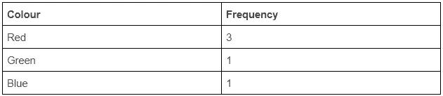
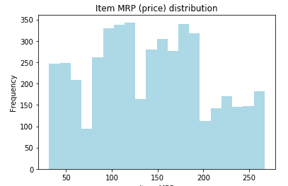
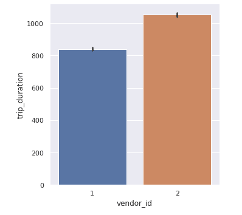
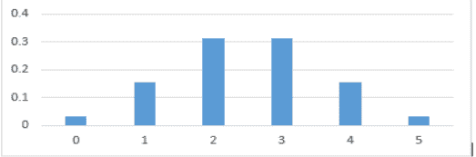
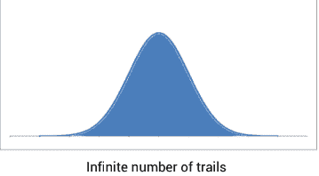
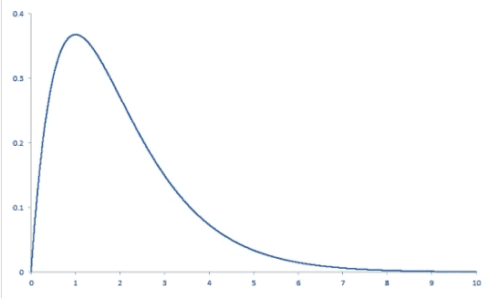
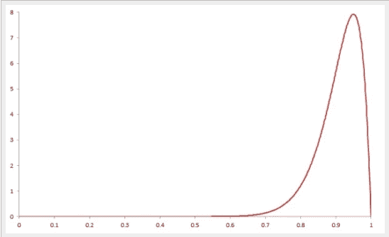
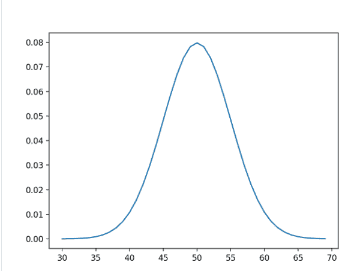
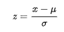
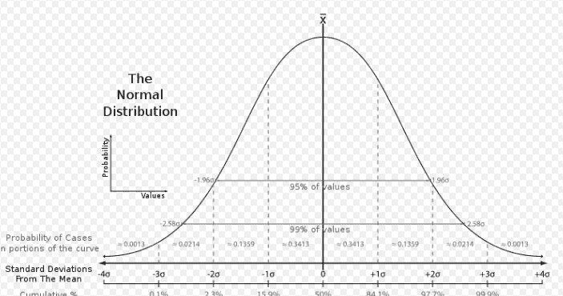

# 数据科学的概率

> 原文：<https://medium.com/analytics-vidhya/probability-for-data-science-4217e187fc3f?source=collection_archive---------10----------------------->

# 简介:

概率是数据科学中非常重要的数学概念，用于验证假设、贝叶斯定理和解释机器学习等的输出。我们将在这个博客中讨论一些概率的基本概念。我们开始吧。

# 频率表:

这是一种表示分布中类别数量的方法。让我们考虑 5 种颜色球的分布:红色、红色、绿色、蓝色、红色。相同的频率表将为:

# 直方图和条形图:

直方图用于描述连续变量的分布。维基百科将直方图描述为对连续变量的概率分布的估计。我们将在本文后面看到什么是连续变量和概率分布。下面是一个直方图的例子，我们正在绘制商店中商品的频率 mrp。

参考:[https://bit.ly/2v53J8Y](https://courses.analyticsvidhya.com/courses/applied-machine-learning-beginner-to-professional)

同样，柱状图也可以用来绘制分类变量，下面是柱状图的一个例子。例如，画出每个出租车供应商的平均行程时间。

参考:【https://bit.ly/2v53J8Y 

# 概率:

让我们先来看看与概率有关的一些术语:

**实验**:这是一个试验，有一组明确的输出

结果:这是一个实验的可能结果

**事件**:实验结果的集合

概率可以定义为事件发生的可能性。这个概率值介于 0 和 1 之间。

实验中所有可能事件发生的概率之和等于 1。

概率的公式是:

概率(事件)=期望结果的数量/总结果的数量。

例如:在一个投掷公平硬币的实验中，集合:{正面，反面}将是结果。有两种可能，一种是正面，另一种是反面。因为硬币是公平的，不像肖莱使用的硬币(所有宝莱坞迷都知道😝)，得到正面和反面的概率相等，即 0.5。

让期望的结果是正面。因此，在这种情况下，期望结果的数量是 1。有两种可能的结果:正面和反面。使用上述公式

p(人头)=。

得到尾部的概率可以用类似的方式计算。

# 伯努利试验:

伯努利试验是只有两种结果的实验。例如:

1.  抛一枚公平的硬币，结果可能是正面或反面。
2.  体育比赛的结果，赢或输。
3.  测试结果:学生通过或未通过考试。

# 二项式分布:

二项式分布用于决定 n 次伯努利试验的成功次数。设 p 是伯努利试验成功的概率，q 是失败的概率。设 x 是试验中成功的次数。故障总数将为 n-x，概率分布公式可为:

**P(X) = nCx * px * (q)n — x**

现在我们知道失败的概率= 1——成功的概率。因此，我们也可以把 q 写成 1-p。

**P(X) = nCx * px * (1 — p)n — x**

我们可以将这个二项分布的值绘制成概率质量函数。

# 概率质量函数:

维基百科将概率质量函数定义为给出离散随机变量恰好等于某个值的概率的函数。离散随机变量是不能等于十进制值的变量。

投掷 5 次公平硬币的概率质量函数如下所示:

参考:【https://bit.ly/2v53J8Y 

对于大量的试验，让我们假设这个数字接近无穷大，概率质量函数将变成一个连续的正态函数(我们将在本文后面看到更多关于正态函数的内容)，它被称为概率分布函数，下面是一个例子。

参考:[https://bit.ly/2v53J8Y](https://courses.analyticsvidhya.com/courses/applied-machine-learning-beginner-to-professional)

# 连续随机变量:

连续随机变量是在给定范围内取任意值的变量。例如壶中的水量，可以具有从 0 到壶的容量之间的任何值，包括十进制值。一个连续的随机变量可以用图形绘制成一个概率分布函数，我们前面已经看到过。

# 分布的偏斜度:

数据可以以各种方式分发。我们可以使用直方图或密度曲线来检查分布的偏斜度，如下所示。你总是可以通过绘图来检查分布的偏斜度。

1.  右偏分布:

具有朝向图形右侧的较长尾部的分布是右偏分布。对于右偏分布模式< Median < Mean. Below is what a Right-skewed curve looks like.

Reference: [https://bit.ly/2vU9rLa](https://probabilityandstats.wordpress.com/2015/05/09/the-skewness-of-a-probability-distribution/)

2.左偏分布:

具有朝向图形左侧的较长尾部的分布是左偏斜分布。对于左偏态分布模式>中位数>平均值。下面是左偏曲线的样子:

参考:[https://bit.ly/2vU9rLa](https://probabilityandstats.wordpress.com/2015/05/09/the-skewness-of-a-probability-distribution/)

3.正态分布:

具有对称结构的分布是正态分布，即它既不向右倾斜也不向左倾斜。它也称为钟形曲线，因为它有一个钟形。对于正态分布，众数=中位数=平均值。下面是正态分布图。

参考:【https://bit.ly/2PiGqj8 

对于正态分布，需要记住的一些要点是:

1.  它围绕平均值对称
2.  正态分布的经验法则是 68%的值落在平均值的 1 个标准偏差内，95 %的值落在平均值的 2 个标准偏差内。我们考虑两个方向的平均值
3.  当我们用概率代替频率时，我们将正态分布转换为标准正态分布。标准正态分布的均值= 0，标准差= 1，曲线下面积为 1。

# 中心极限定理；

考虑到我们有一个大型数据集。我们现在将从该数据集中选择多个样本，并绘制样本的平均值。如果样本数达到无穷大，则分布达到正态分布。根据这个定理，从总体中抽取的任何样本的平均值将近似等于总体的平均值。

# z 分数:

Z-score 定义为标准偏差的数量，即观察值远离平均值。

z 分数公式

在哪里

正态分布中的某个值

μ:正态分布的平均值

σ:正态分布的标准偏差

Z 得分的分布如下所示:

参考:【https://bit.ly/32i17kl 

正 Z 值表示观察值是平均值右侧的 Z 标准偏差。负 Z 值表示该值位于平均值的左侧。大约 99%的 z 值位于-3 到 3 之间，任何超出此范围的值都被认为是极不寻常的。z 分数广泛用于统计假设检验。

# 结论:

我们已经看到了概率相关概念的简要概述。希望你们都喜欢。你也可以在这里阅读我关于描述性统计[的文章。下次见](/analytics-vidhya/descriptive-statistics-for-data-science-1120807e15f4)