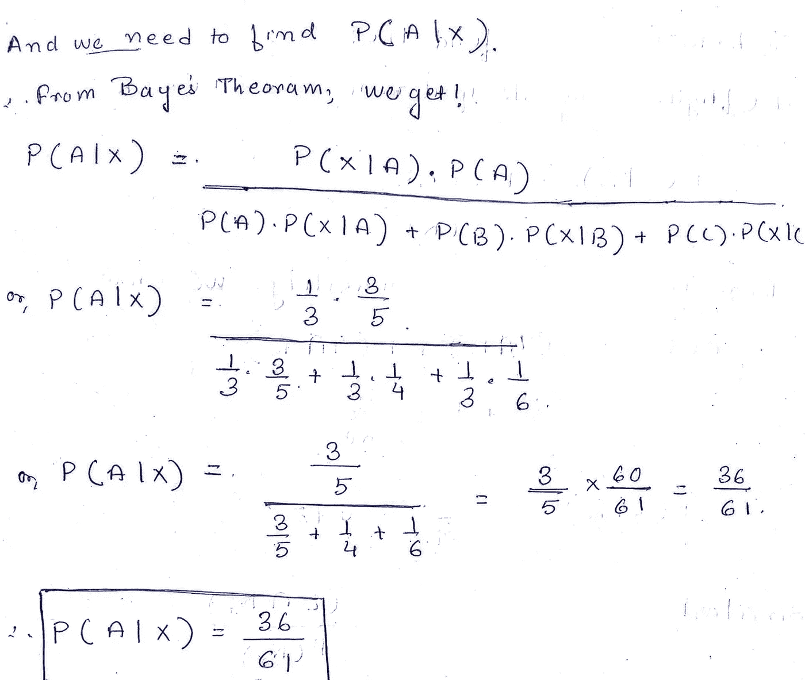

# 机器学习的概率#2(基础部分 2)

> 原文：<https://medium.com/analytics-vidhya/probability-for-machine-learning-2-basics-part-2-5cab5160f0aa?source=collection_archive---------14----------------------->

# 简介:

如前所述，每周日都会有一个与概率相关的新话题，也是关于其他 ML 和数据科学相关的话题。这是概率基础的第二部分，我们将主要讨论条件独立性和贝叶斯规则，最后还有一个很酷的问题。

# 放弃

我真的认为这里的读者知道概率的基本知识，也知道一些其他的基本概念，如条件概率或独立性等。**如果没有，那么请你看看我以前的教程关于** [**【概率基础(第一部分)】**，](https://cismography.medium.com/probability-for-machine-learning-1-basics-part-1-e9ed1b3e26b7)没有任何进一步的原因，让我们开始陈述，这将是非常有趣的。

# 内容

**→条件概率(扩展)
→全概率定律
→贝叶斯法则与定理
→基于贝叶斯定理的一道例题解答
→附录 pdf
→参考文献**

# 条件概率(扩展)

在上一个教程中，我已经解释了什么是条件概率，以及它是如何实现的。对于包含 a₂}.{a₁两个事件的样本空间

图一

现在，如果我们谈论一个包含三个事件的样本空间，因为我们都属于 n 个事件集，我们可以看到以下结果。请注意，附录 pdf 中提供了证据。

图 2

因此，对于包含 n 个事件的样本空间的一般情况，公式变得有点像这样:

图 3

如果你想知道这个方程的形式，请参考附录 pdf。

# **全概率定律**

到目前为止，我们已经看到了条件概率，以及无条件概率。全概率法则非常简单，**我们知道大气中有几个因素可以导致降雨，因此计算某一天是否会有降雨取决于几个因素，有相关性的地方就有交集和条件概率。但是尽管有几个因素，但是如果我们真的想知道某一天降雨的概率，那么就有了全概率定律的概念。**

图 4

例如，有 n 组相关事件，其中任意事件为 Aᵢ，主要事件为 S (let)。
**因此，全概率法则基本上允许我们将所有条件概率汇集在一起(即 P(S|Aᵢ)，用个体对它们进行加权(即
P(A)×P(S|Aᵢ)来计算感兴趣的总概率。**

数学表示如下所示

图 5

# 贝叶斯定理

基本的贝叶斯规则非常简单，即我们知道 P(A|B) ≠ P(B|A ),但是我们可以将 P(A|B)转换为 P(B|A ),这种转换中使用的基本方法是贝叶斯规则，下图显示了贝叶斯规则:

所以图 6

## **那么什么是广义贝叶斯定理呢？**

让我们假设:据说如果事件集 [**互斥**](https://drive.google.com/file/d/18vUwwsR42koL89x8g9LfRovK2D7yNC2H/view?usp=sharing) **和** [**穷举**](https://en.wikipedia.org/wiki/Collectively_exhaustive_events#:~:text=In%20probability%20theory%20and%20logic,of%20the%20events%20must%20occur.&text=The%20events%201%20and%206,exhaustive%20but%20not%20mutually%20exclusive.) 中的一个事件{A₁、A₂、…，那么事件 x 就会发生。，Aₙ}出现了。
还让我们假设无条件概率:
P(A₁)，P(A₂),…,P(Aₙ)
和条件概率 P(X|A₁)，P(X|A₂)，…。，P(X|Aₙ)发生时，那么:

图 7

现在让我们解决一个问题，以便更详细地理解贝叶斯定理:

**假设有三个骨灰盒 A、B、C，使得骨灰盒 A 包含
{6 个红色、4 个白色}球，骨灰盒 B 包含{2 个红色、6 个白色}球，骨灰盒 C 包含{1 个红色、5 个白色}球。那么随机选择一个红球时，选择的骨灰盒是 A 的概率是多少呢？**

该问题的解决基于上述定理，如下所示:

图 8

到这里为止，我们算出了随机选择任何骨灰盒的概率，现在我们想算出红球的不同条件概率，如下所示:

图 9

现在所有的材料都准备好了，是时候做主配方了，也就是借助贝叶斯定理求 P(A|X)。解决这个问题的最终步骤如下所示:

图 10

就这样，恭喜你🎉🎉🎉🥳😀为今天的概率微内容。在这之后，你可以计算:

**→条件概率
→全概率定律
→贝叶斯定理
→应用贝叶斯定理**

我将上传一篇包含一个问题的小文章，这个问题将贯穿这里讨论到这里的所有概念，很快…

# 附录(所有带样张的图片都在这里)

[请通过此链接查看校样，并获取笔记作为小抄……](https://drive.google.com/file/d/190AtFmcExNPzHiVEK2lJmG-mtuTlLtXQ/view?usp=sharing)😁

# 参考资料:

→数学 S . N . dey
→[数据科学概率统计(PDF)](https://cims.nyu.edu/~cfgranda/pages/stuff/probability_stats_for_DS.pdf)