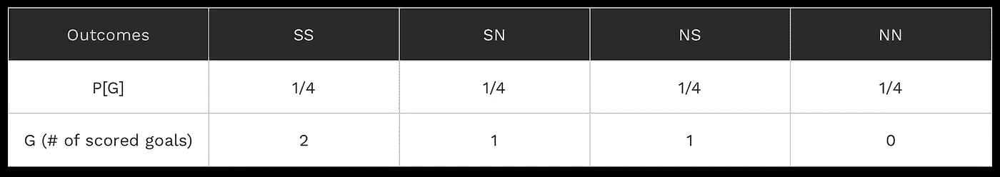
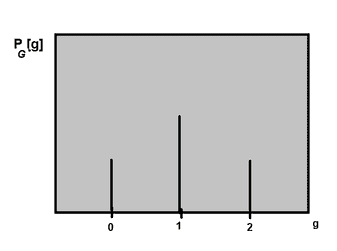
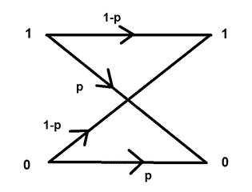
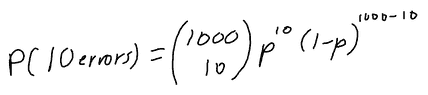

# 概率模型及其在现实生活中的数据应用

> 原文：<https://medium.com/analytics-vidhya/probability-models-and-its-real-life-applications-with-data-c12158a56c08?source=collection_archive---------10----------------------->

> 合理的概率是唯一的确定性。— 豪

描述术语“*概率*的最佳方式是，它结合了非常有趣的概念和许多需要记住的东西(比如一个变量的独立性，两个变量之间的模式/联系..等等。) .我觉得概率一直是与众不同的数学。在某种意义上，有如此多的现实世界的应用程序可以用来可视化字面上的任何问题！

# 概率模型和 PMF

所以每当我们在考虑某个事件发生的概率时，我们也在考虑可能结果的总数。我们如何规划特定情况下的可能结果(例如将一枚公平的硬币抛 n 次，或者在 t 次试验中找到 k 次成功的次数)与某些值相关联，例如数字“1”代表正面出现的概率，数字“0”代表反面出现的概率？？(是的，这是世界上最长的问题了，哈哈)。

为了回答这个问题，我们需要了解一下**概率密度函数**，又名 PMF。PMF 基本上将某些值映射到实验或情况的概率(结果)。但是那些“确定的价值观”是什么呢？这些被称为随机变量，或**离散随机变量**。随机变量是给实验的某个结果赋值的变量。我们用一个大写字母来代表实验的随机变量。

例如，假设实验要测试 10 个不同的电路，看看它们是否工作(成功，记为 s)或需要改进(错误，记为 e)。在这种情况下，每个观察值都是由 10 个不同的字母(s 或 e)组成的序列。所以样本空间或可能结果(序列)的总数是 1024 (2 ⁰).这种情况下的随机变量，比如说 K，可以是一个序列中成功电路的数量。所以对于某个结果，随机变量 K = # of successes = 6。由于序列是一组 10 个字母，K 的范围必须是从 0 到 10。K 是一个离散的随机变量，因为 K 的范围是可以列出的。(即使它无限长)。

# 进球问题

好，让我们看看另一个例子，关于 pmf 和随机变量(RV)的东西。假设你正在踢足球，有两个任意球。任意球可以导致两种可能性:得分(在球门中，表示为 S)或没有得分(N)。随机变量 G 的 PMF 是什么，任意球得分的次数？

我们可以制作一个表格来突出某一结果得分的概率及其与随机变量 G 的关系！由于我们假设每种结果的可能性相等，因此第一次尝试中获得目标而第二次尝试中没有获得目标的概率正好= 1/2*1/2。其他结果也是如此。

由于随机变量 G 有三个可能值{0，1，2}，这三个可能值的概率为:P[X=0] = 1/4，P[X=1] = 1/4 + 1/4 = 1/2，P[X=2] = 1/4。表示 PMF 的一种方式是通过绘图或图表:

**注**:PMF/概率用 P 表示，然后是随机变量的下标，然后是括号中随机变量的小写版本，因为符号表示这是“随机变量 G 等于某个值 G(在结果集中)的概率”。所以 G 是一个实数，在随机变量 G 的范围内。

# 二元对称信道

好的，这是一个更棘手的问题，我真正喜欢这个问题的是，它与电气工程有着如此紧密的联系。

因此，我们将 1000 位发送到某个数据通道，出现位错误的概率(该位是接收到的错误位，例如 1 是 0 或 0 是 1) = P[error] = 0.02。所以 1-P[错误] =成功。所以问题是，有 10 个错误的概率是多少？

首先，我们需要考虑，如果发送到信道的 1000 位中有 10 个错误，有多少种可能的组合。为了计算出可能性的总数，我们做 1000 次选择 10 次(组合公式)。然后，我们将使用二项式分布(因为只有 2 个可能的值，1 或 0)来找到 PMF:

如果我们把 P 代入 0.02，得到的大约是 P[10 个错误] ~~ 0.0055，这是一个比较低的概率！

*最初发表于*[T5【https://rushiblogs.weebly.com】](https://rushiblogs.weebly.com/math/probability-models-and-its-real-life-applications-with-data)*。*