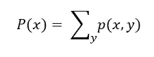
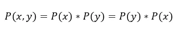
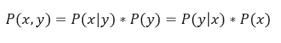
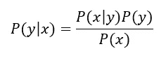
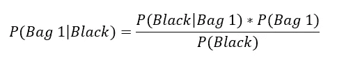
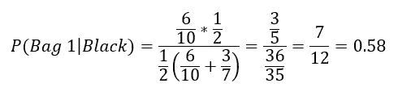
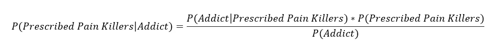
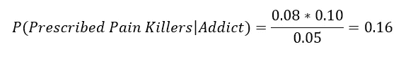
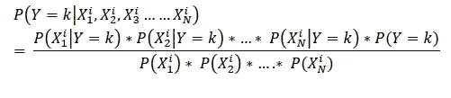
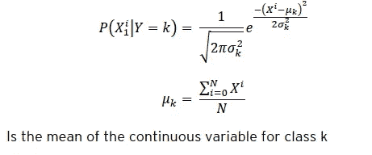

# 概率论——机器学习的重要组成部分

> 原文：<https://medium.com/analytics-vidhya/probability-theory-an-essential-ingredient-for-machine-learning-3399cf97c5bd?source=collection_archive---------8----------------------->

本文将描述理解机器学习所需的概率论的重要概念。

**什么是概率？**

概率是对一个事件发生的可能性或一个命题为真的可能性的数字描述。概率是介于 0 和 1 之间的数字。

让我们举一个基本的例子。

当抛硬币时，有两种可能的结果:

*   正面(H)或
*   尾部(T)

我们说硬币落地的概率 **H** 是

硬币落地的概率 **T** 是

掷出单个骰子，有六种可能的结果: **1，2，3，4，5，6** 。

其中任何一个的概率都是 1/6

**边际概率**

几个互斥事件中任何一个发生的概率等于这些事件各自概率的总和。它也被称为*求和规则*。

随机变量的边际概率由下式给出

**产品规则**

两个(或更多)独立事件同时发生的概率可以通过将事件的单个概率相乘来计算。例如，如果你掷一次六面骰子，你有 1/6 的机会得到 6。如果你一次掷两个骰子，你得到两个六的机会是:(骰子 1 上有六的概率)x(骰子 2 上有六的概率)= (1/6) x (1/6) = 1/36

也可以写成

从上面的等式中，我们得到*P(y | x)*

亦称**或 ***贝叶斯定理*** 。**

**P (y|x)是后验概率，即基于给定证据的
结果的概率。P (y)是先验概率。
P (x)是证据的概率。**

****例题****

****例 1: *袋子 I 包含 4 个白球和 6 个黑球，而另一个袋子 II 包含 4 个白球和 3 个黑球。从一个袋子中随机抽出一个球，发现它是黑色的。找出从袋子 I* 中抽取的概率。****

**上面的问题说明了 ***给定的*** 球是一个 ***黑色*** 球。**

**同时，它要求我们找出球从袋子 1 中抽出的概率。**

**根据贝叶斯定理公式，**

****

**p(袋子 1)= 1/2————( 1)**

**P(黑色)= P(随机选择的一个袋子)**和**【P(从袋子 1 中抽取的黑色)】或 P(从袋子 2 中抽取的黑色)】**

**上面的等式解释了我们有两个独立的事件。首先，我可以从两个包中任意选择一个。其次，从我已经选择的包中，我现在将随机选择一个将显示为黑色的球。**

**因此，**

**p(黑色)= 1/2 x(6/10+3/7)————( 2)**

**p(黑色|袋子 1)= 6/10—————( 3)**

**将贝叶斯定理条件概率公式中的(1)、(2)和(3)代入，**

****

****例 2: *在某个特定的诊所，10%的患者被开了麻醉止痛药。总体而言，该诊所 5%的患者对麻醉剂上瘾(包括止痛药和非法药物)。在所有开止痛药的人中，8%是瘾君子。如果病人是瘾君子，给他们开止痛药的概率有多大？*****

**从上面的问题来看，**T5 给出的** 条件是，患者是一个 ***瘾君子。*****

**基本上，问题要求我们找出他被开 ***止痛药*** 的概率。**

**所以贝叶斯定理方程变成了，**

****

**p(处方止痛药)或患者服用止痛药的概率= 10% = 0.10**

**p(成瘾者)或患者成为成瘾者的概率= 5% = 0.05**

**p(成瘾|开出的止痛药)或给患者开出止痛药后患者成瘾的概率= 8% = 0.08**

**将上述数据代入贝叶斯定理条件概率公式，**

****

**贝叶斯定理条件概率分布是一个重要的概念，专门用于朴素贝叶斯回归或分类问题。在朴素贝叶斯分类问题中，数据集中有多个自变量，通过与截止概率值进行比较，对因变量进行预测或分类。如果结果大于临界值，因变量的值变为 1，否则为 0。**

**典型的条件概率分布看起来像，**

****

**其中 Y 是因变量，k 是训练数据集中的值 0 或 1。**

**X1，X2…… XN 是独立的离散变量。**

**在一些独立变量是连续的情况下，证据可能性的概率由概率密度函数给出，**

****