# 概率与可能性

> 原文：<https://medium.com/analytics-vidhya/probability-vs-likelihood-873dcfe15df8?source=collection_archive---------1----------------------->

## 用一个实例清楚地解释概率和似然性之间的区别

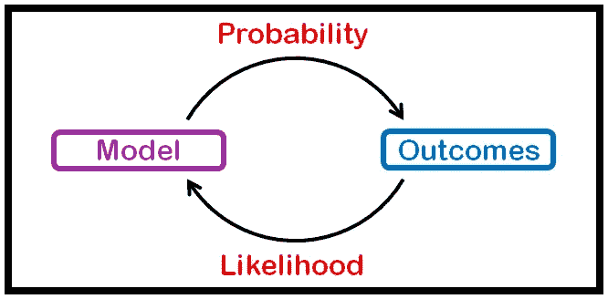

在字典中，你可能会发现“概率”和“可能性”通常是同义词，有时可以互换使用，但从统计学的角度来看，它们隐含地指不同的事物。概率讲的是结果(数据)/假设，而可能性讲的是模型/证据。在这篇文章中，我们将展示概率与似然性的不同之处，并展示一些例子。

## 可能性

谈论数据/假设。它是指在给定数据分布或某些条件/证据的情况下，寻找特定事件发生的机会。概率是一个事件将发生的百分比，它谈到了未来，它被写成 P(假设 **|** 证据)。

在概率函数中，模型参数是已知的，必须找到数据/结果。例如，在二项分布中，你知道试验的次数和每次试验成功的概率，以此为基础，你可以求出特定事件发生的概率。

说得更清楚一点，假设你有一枚公平的硬币，那么你知道成功的概率‘p’是 0.5，你要掷三次。现在你想知道你得到的概率(正面，正面，反面)。

假设成功是正面，失败是反面，P(H)=0.5，P(T) = 1 - P(H) = 0.5

现在，你想计算 P(HHT **|** p=0.5)。

**注:**这里假设是‘HHT’，证据是(p=0.5)。

## 可能性

谈论模型/证据。简单地说，我们试图使数据符合一种分布。它谈论过去，因为事情已经发生了。可以写成 P(证据 **|** 假设)。

在似然函数中，数据/结果是已知的，必须找到模型参数。例如，在二项式分布中，您知道成功和失败的次数，并且想知道成功的概率。

更清楚地说，假设你的朋友告诉你，他/她抛了一枚硬币三次，得到了(HTH)，并让你猜猜这是不是一枚公平的硬币。

这里你在尝试计算 P(p=0.5 **|** HTH)。

**这里，**假设为(p=0.5)，证据为‘HTH’。

**注意:**您也可以尝试不同的“p”值，以找到最佳可能性，因为“p”可以取 0 到 1 之间的任何值。

现在我们来看一个实际的例子，让事情更清楚。

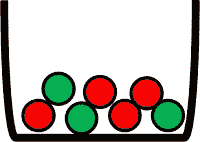

假设你有一个盒子，里面有七个球，其中四个是红色的，另外三个是绿色的。你随机选了三个球，没有替换。**“无替换”**表示一旦你选择了一个球，在选择一个新球之前，不要把它放回盒子里。没有替换的选择使得抽牌依赖，因为每个被选择的球的颜色会影响后面的抽牌。

想象一下，这是一个游戏，如果你第一次抽中了红色，第二次抽中了绿色，第三次抽中了红色，你就赢了。你想知道你得到正确序列并赢得游戏的概率。

所以你要计算 P(RGR **|** R=4，G=3)。

**(1)** 开奖前，盒子里有七个球:

*   p(红色)= 4/7
*   p(绿色)= 3/7

—第一个抽到的球是红色的概率= **4/7**

现在盒子里有六个球

*   p(红色)= 3/6
*   p(绿色)= 3/6

—第二个球是绿色的概率= **3/6**

现在盒子里有五个球

*   p(红色)= 3/5
*   p(绿色)= 2/5

—第三个球是红色的概率= **3/5**

**(4)** 最后， **P(RGR| R=4，G = 3)=(4/7)*(3/6)*(3/5)= 0.17**

这意味着有**17%**的概率你得到正确的序列并赢得游戏。

在上面的例子中，我们知道条件/模型的参数是球的数量，我们计算了结果的概率。

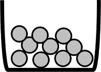

现在再次假设我们有一个装有十个球的盒子。这些球有红色、绿色和蓝色，但是我们不知道有多少红色、绿色和蓝色。我们随机挑了三个球，没有替换，第一个是绿色，第二个是红色，第三个是绿色。

现在我们想知道有多少个红色、绿色和蓝色的球。当然我们不能 100%有把握地猜测，我们只能对模型(框)做出“可能性”的判断。

**一些事实:**

*   红色、绿色和蓝色的球有 66 种不同的可能组合，总共有 10 种。"*如果你有兴趣知道我们是怎么得到 66 的，看这里的***"**
*   *并非所有 66 种组合都有效。*
*   *至少有一个红球，因为我们已经有了一个红球。*
*   *至少有两个绿球，因为我们的抽签中有两个绿球。*
*   *P(GRG) = (G/10) *( R/9) * ((G-1)/8)*

*为了使计算简单明了，我将使用一个简单的 python 代码来帮助我计算这些可能性。*

*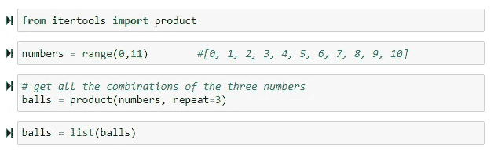*

**【balls】*包含三个一组的数字的所有组合，有 1331 种不同的组合(11*11*11)，看起来是这样的:*

*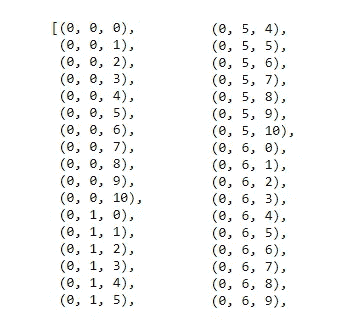*

*总组合的样本。*

*现在我们应该过滤这些组合，因为它们并不都是有效的。如你所见，有些情况下球的和不是 10。*

*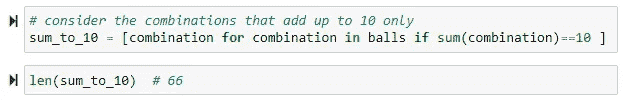*

*过滤球列表，只保留总数达到 10 的球。*

*现在我们得到了下面的列表*

*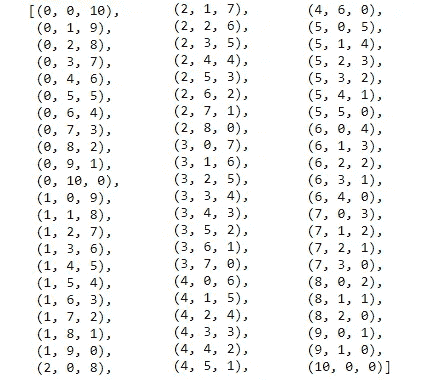*

*加起来等于 10 的组合*

*同样，不是所有的都有效，我们知道至少有一个红色的球和两个绿色的球。*

**

*现在有效的组合是:*

*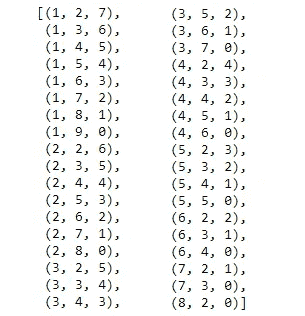*

*有效的组合。*

*最后，计算每个组合的“GRG”概率:*

*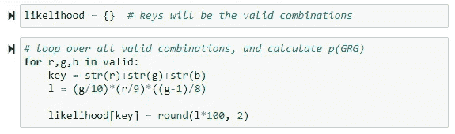*

*可能性是:*

*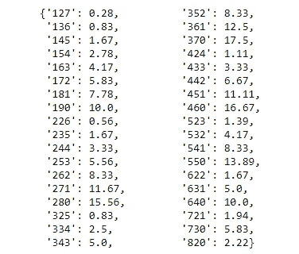*

*不考虑蓝球的可能性。*

*现在我们有了模型的可能性。例如，如果盒子里有 2 个**红色球、7 个绿色球和 1 个蓝色球，那么当我们随机选取三个球时，有 11.67%的概率得到(GRG)。***

*到目前为止，我们所做的是试图让模型符合我们的数据。也就是说，我们强迫盒子里至少有一个红色的球和两个绿色的球，以保证我们有机会选择一个红色的球和两个绿色的球。*

*现在，如果我们想更进一步，做出最好的预测，我们将选择最大可能性来代表我们的模型(方框)。*

*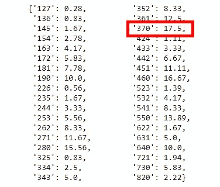*

*考虑到没有蓝球的最大可能性。*

*这意味着我们 17.5%确定盒子里有三个红球，七个绿球，没有蓝球。请注意，当盒子里没有蓝色球时，可能性最大。*

*但是如果我们确定盒子里至少有一个蓝球，那么我们应该排除那些没有蓝球的组合。*

*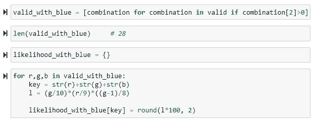*

*现在可能性是:*

*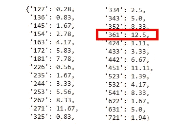*

*考虑蓝球的最大可能性。*

*现在最大的可能性是 12.5%。*

***最大似然***

*指在给定一些结果/数据的情况下，找到模型参数的最佳值。*

*这意味着通过改变数据分布/模型的特征/参数来增加特定事件发生的机会。*

## *摘要*

*   *概率是给定模型参数的数据的可能值的函数。*
*   *可能性是给定数据的模型参数的可能值的函数。*
*   *概率是用来寻找某一特定情况发生的几率。*
*   *可能性通常用于最大化特定情况发生的机会。*

*希望这篇文章能帮助你理解概率和可能性的区别。如果有什么不清楚的地方，请告诉我。在以后的文章中，我们将讨论不同分布的最大似然性。*

***了解更多:***

*   *点击查看一些关于概率与可能性[的精彩答案。](https://stats.stackexchange.com/questions/2641/what-is-the-difference-between-likelihood-and-probability)*
*   *查看 Quora 上的这个答案可以找到一个很好的例子。*
*   *更多关于可能性函数的维基百科[在这里](https://en.wikipedia.org/wiki/Likelihood_function)。*
*   *这里有更多关于最大似然估计[的信息](https://online.stat.psu.edu/stat504/node/28/)。*