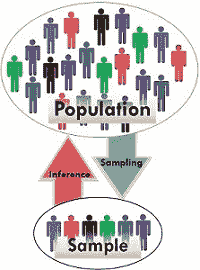
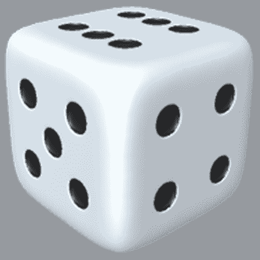

# 概率论—计数— I

> 原文：<https://medium.com/analytics-vidhya/probablity-theory-counting-i-7a04b8c6c4f4?source=collection_archive---------22----------------------->

## **概率论—定义**

一般来说，当进行调查时，它是针对小样本而不是全部人口进行的。最近的相关例子是新冠肺炎疫苗。它需要为整个人口接种，但不能针对整个人口测试疫苗的安全性。因此，选择一个小样本的人口和效率进行测试。

现在我们需要计算这个样本实验对整个群体有效的概率。因此计数是非常必要的，现在我们如何计算计数。

假设你有一个 6 面骰子，想知道骰子输出的机会有多大。可以是 1 || 2 || 3 || 4 || 5 || 6。

计数是简单的仪式

如果你需要从一副 52 张牌中挑选 4 张牌，这 4 张牌有多少机会是 a 呢？在心里计算所有可能的组合是不可能的。我们需要一些计算方法或原理来做这件事。

我们可以从简单的开始理解计数。1 和 100 之间的数字是多少？很容易算出总数是 100。如果你需要一个规则。

***规则 1****:1 和 N 之间的数字个数为 N*

如果数字不是从 1 开始呢

假设问题是找出 12 到 100 之间的数字。我们都知道它是

100–11 = 89

那么我们如何表达它的公式呢

n = 100(结束数)

k = 12(起始数)

总数量= n-k+1

哪个是

100 -12 + 1 = 89

***规则二****:n 和 k 之间的数的个数是(n- k + 1)*

*让我们把它变得更复杂一些*

如果我们需要能被 9 整除的 12 到 100 之间的数字呢

我们只需要 12 到 100 之间的特定数字。

严格来说，他们是 18，27…99

因此，如果它们是连续的数字，即 1，2，3，我们可以应用规则 2。我们如何将 18，27，…99 变为 1，2，3

用 9 除它们

它变成了 2，3，…11

现在应用 n-k +1 的规则 2

也就是 11–2+1 = 10

*让我们把它变得更加& &更加复杂*

这些数字的顺序是 14，17，20…95，98

它们没有顺序，不能被任何数整除…但是它们有一个共同的区别。增加 3。所以我可以加上或去掉一个数，使它能被 3 整除。

我可以加 1，这样就变成了

15,18,21…96,99

现在除以 3

5,6,7..32,33

n = 33

k = 5

应用规则 2 = n-k+1 = 33–5+1 = 29