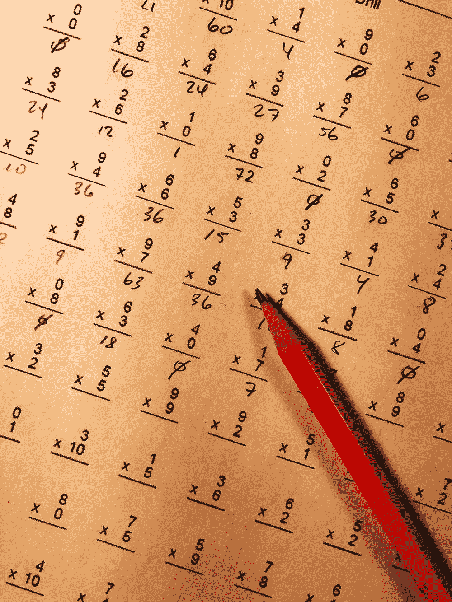
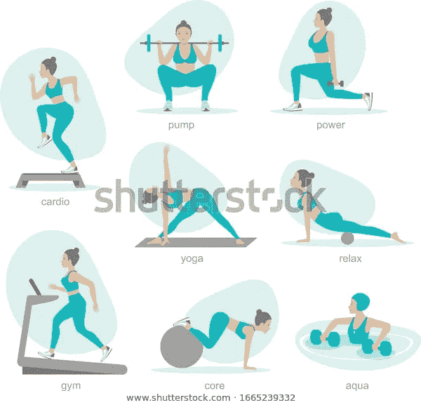

# 概率论—计数— II

> 原文：<https://medium.com/analytics-vidhya/probablity-theory-counting-ii-ad40a0fddad4?source=collection_archive---------23----------------------->

**乘法原理**

第 1 部分可以在[这里找到](/@padmanaabhah/probablity-theory-counting-i-7a04b8c6c4f4)

以下是为学生提供的科目。

**语言** —英语、法语、梵语

**主** —数学、物理、化学

**选修课**-小说、电影制作

如果每个学生只能从每个类别中选择一个，那么从以上 3 个组合中，每个学生可以选择多少个组合

所以会是 **3** (语文)* **3** (主课)* **2** (选修)= **18** 的组合

****重复乘法原理****

****

**健身中心有 8 种不同类型的锻炼，即力量、瑜伽、拳击等。**

**成员们可以在 7 天内做任何他们选择的锻炼，锻炼可以重复进行。所以问题是在一周内，一个成员可以进行多少锻炼:**

**所以选择可以是**

**周日-8 训练**

**周一至 8 日锻炼**

**星期二- 8 次锻炼**

**星期三- 8 次锻炼**

**周四至 8 日训练**

**周五- 8 训练**

**周六 8 训练**

**总计= 8 * 8 * 8 * 8 * 8 * 8*8 = 8⁷**

****

******无重复乘法原理******

****让我们稍微改变一下上面的问题。一个会员有 8 个锻炼项目，但一周内不允许重复****

****比如说，如果周日做瑜伽，周一会员可以做瑜伽以外的锻炼。这就像每天可用的锻炼是****

****周日-8 训练****

****周一至 7 日的锻炼(不包括周日的锻炼)****

****周二至周六的训练(不包括周日和周一的训练)****

****周三-5 锻炼****

****周四-4 锻炼****

****星期五-3 锻炼****

****周六-2 锻炼****

****所以在一周内，总数= 8 * 7 * 6 * 5 * 4 * 3 * 2 =40320****

*******规则 5*** *:由给定的 n 个对象组成的使得序列中没有对象可以重复的 k 个对象的个数为 n(n-1)(n-2)……(n-k+1)*****

****上述规则可以表述为 n！/(n-k)！****

******无重复有限制的乘法原理******

****我们需要一个框架，一个 5 个字母的单词，没有重复任何字母，有一个 1 元音****

****我们知道元音字母有 a，e，I，o，u****

****所以我们可以应用下面的规则****

*******规则 6*** *:如果问题指定了一个约束或限制，那么总是先从解决限制开始*****

****现在，根据 5 个字母的规则，让我们在最后一个字母应用约束，即元音 be 在第 5 个字母****

****因此****

****第 5 个字母— 5 个字母****

****第 4 个字母-25 个字母****

****第 3 个字母-24 个字母****

****第二个字母-23 个字母****

****第一个字母-22 个字母****

****22 * 23 * 24 *25 * 5 = 1518000****

******n 和 k 相同，没有重复******

****如果我们有 4 个人坐在一个房间的 4 个座位上。****

****第一人-提供 4 个座位****

****第二个人-提供 3 个座位****

****第三人-提供两个座位****

****第四人-提供一个座位****

****可用座位总数为****

****4 * 3 * 2 * 1 = 4!****

****结论是如果 n 和 k 相同，那么它就是 n！****

*******规则 7:*** *使用 n 个对象可以形成的长度为 n 的序列，使得序列中没有对象重复的个数是 n！*****