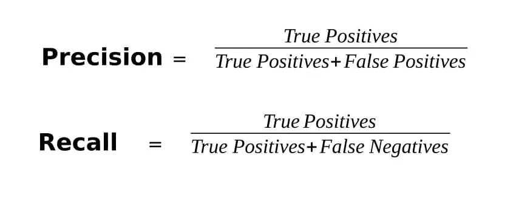

# 精确度和召回率的问题。

> 原文：<https://medium.com/analytics-vidhya/problems-with-precision-and-recall-3e10bae11c6d?source=collection_archive---------4----------------------->

蒂姆·高在 [Unsplash](https://unsplash.com?utm_source=medium&utm_medium=referral) 上拍摄的照片

如果你一直在学习数据科学或者已经在这个领域工作了一段时间。您可能已经构建了大量的分类模型，并使用不同的指标检查了模型的性能。

## 四大指标:
***精度
*召回
*准确度
* F1——得分**

我们知道，当我们有 [**不平衡的数据**](/analytics-vidhya/handling-imbalanced-classes-3057a88e2a19) 时，准确性不是我们应该关注的指标，因为它可能会产生误导，相反，当我们的数据集不平衡时，我们应该考虑 F1 分数。

> 但是 F1 真的会有帮助吗？

> ROC 曲线是比较模型优劣的最佳方法之一。

## 让我们复习一下基础知识。

> 另外，查看我的文章 [***计算一个 ML 模型的精确度。***](/analytics-vidhya/calculating-accuracy-of-an-ml-model-8ae7894802e)

*   这 4 个常用指标是根据混淆矩阵计算出来的。

> 混淆矩阵(又名误差矩阵)是一种总结分类模型结果性能的方法。显示正确和错误预测的数量。

> 精度= TP/(TP+FP)
> 
> 灵敏度(回忆)=TP/(TP+FN)
> 
> 准确度=(TP+TN)/(TP+TN+FP+FN)

在哪里，

*   ***真阳性(TP)* :** 观察阳性，预测阳性。
*   ***【假阴性(FN)* :** 观察为阳性，但预测为阴性。
*   ***真阴性(TN* )** :观察为阴性，预测为阴性。
*   ***【FP】*:**观察为阴性，但预测为阳性。

## **假设:**

*   我们建立了一个区分“猫”和“狗”的图像分类器。
*   其中猫是正类，狗是负类。
    *我们得到的混淆矩阵如下图所示。*

*   从混淆矩阵中，我们可以看到我们的数据是不平衡的，有 2431 张‘猫’图像和 443 张‘狗’图像。
*   然而，我们的模型显示，我们有 2320 个“猫”(TP+FP)图像和 554 个“狗”(TN+FN)图像。

> **精度**=(1984+107)/(1984+107+336+447)= 72.76%
> **精度**=(1984)/(1984+336)= 85.51%
> **回忆** = (1984)/(1984 + 447) = 81.61%

**指标显示该模型相当不错，但真的是这样吗？**

照片由[布鲁斯·马尔斯](https://unsplash.com/@brucemars?utm_source=medium&utm_medium=referral)在 [Unsplash](https://unsplash.com?utm_source=medium&utm_medium=referral) 上拍摄

如果我们，把**狗**作为**正**类，把**猫**作为**负**类。

然而，精度保持不变:

> **精度**=(107+1984)/(107+1984+447+336)= 72.76%
> **精度**=(107)/(107+447)= 19.31%
> **回忆** = (107)/(107 + 336) = 24.15%

## 同型号的分数大幅下降。

# 精确度和召回率的问题。

如果我们看一下精确率和召回率的公式，我们可以看到这两个指标都是根据正类来计算的。

我们知道:

*   **精度**是**正确正预测**与**正预测**类的**总数**之比**。**
*   现在，我们使用**精度**来检查**上的所有数据有多少实际上是正类**。
    简单来说，在我们的‘猫’和‘狗’的数据中，实际上有多少是‘猫’。
*   **回忆**是**正确正预测**与**正类**总数**之比**。****
*   ****回忆**用于检查所有的阳性类，**将多少个模型标注为阳性类。****

> **这里就能看出问题了！衡量标准大多偏向于正面类。**

**我们希望我们的模型能够正确地在类之间进行分类。但是我们如何检查它是否在做呢？**

# **先进的衡量标准助您一臂之力！**

## ****马修斯相关系数** ( **MCC)****

*   ****马修斯相关系数** (MCC)或 **phi 系数**在机器学习中用作二元分类中模型质量的度量。**
*   **MCC 的定义与[皮尔逊的 phi 系数](https://en.wikipedia.org/wiki/Phi_coefficient)相同。**
*   **该系数考虑了真阳性和假阳性以及阴性，并且通常被认为是一种平衡的度量，即使类的大小非常不同也可以使用。**
*   **它的范围从-1 到 1。**
*   **一个 **+1** 的**系数**代表一个**完美预测**，
    **0** 不比**随机预测**，
    **——1**好，表明这个模型还不足以将它全部分类。**
*   **MCC 对混淆矩阵的所有值赋予**重要性，而不考虑数据的类别不平衡。****

****

**以“猫”和“狗”为例:**

****

**MCC =(1984 * 107)-(336 * 447)/{(1984+336)*(447+107)*(1984+447)*(336+107)} ^ 1/2
= =>~ 0**

**这表明我们的模型有随机预测。**

**即使我们举另一个例子:**

****

**MCC =(107 * 1984)-(447 * 336)/{(107+447)*(336+1984)*(107+336)*(447+1984)} ^ 1/2
= =>~ 0**

> **在这两种情况下，MCC 给出了相同的结果，表明我们的模型不足以正确区分不同的类**

# ****结论:****

*   **通常采用的度量标准可能会产生误导。但是，根据不同的用例，您可能需要使用它们。**
*   **为了找到模型的性能，马修斯相关系数(MCC)是最好的度量标准。**

# **快乐学习！！！**

**喜欢我的文章？请为我鼓掌并分享它，因为这将增强我的信心。此外，请查看我的另一篇文章，并保持联系，以获取关于数据科学和机器学习基础系列的未来文章。**

**另外，请务必在 [LinkedIn](http://www.linkedin.com/in/abhigyan-singh-b13651121) 上联系我。**

****

**由 [Markus Spiske](https://unsplash.com/@markusspiske?utm_source=medium&utm_medium=referral) 在 [Unsplash](https://unsplash.com?utm_source=medium&utm_medium=referral) 上拍摄的照片**