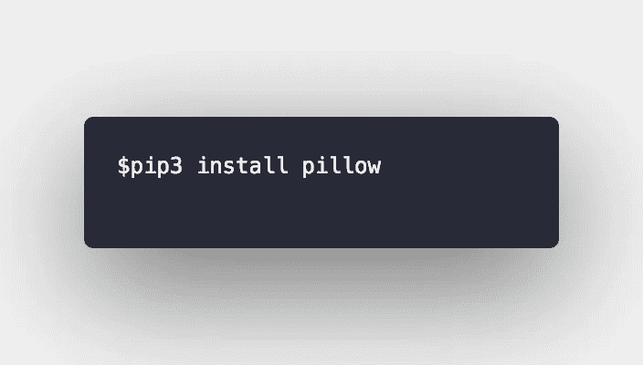
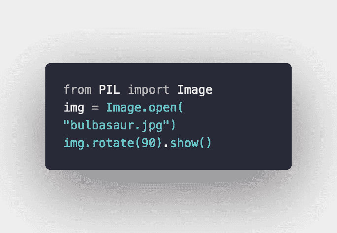
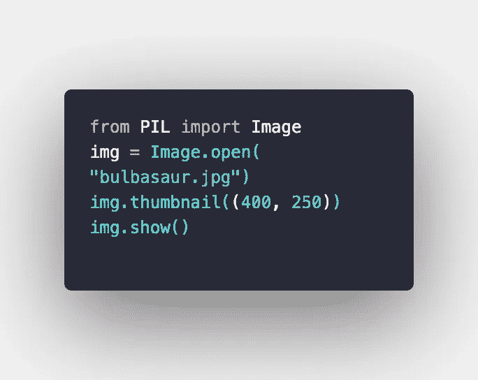
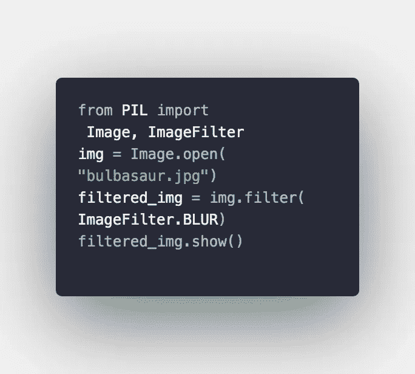
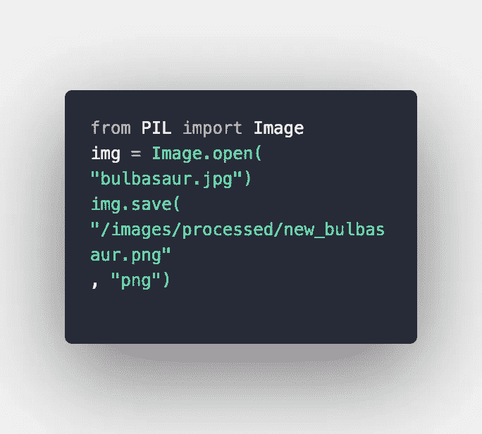
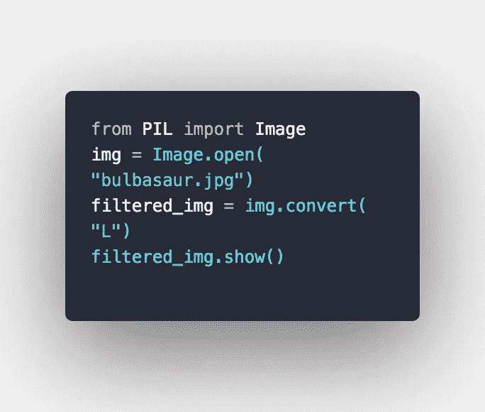
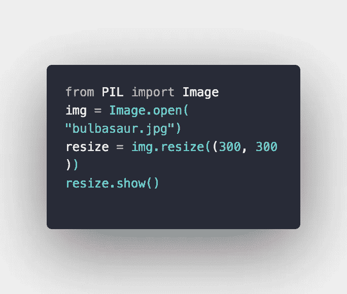
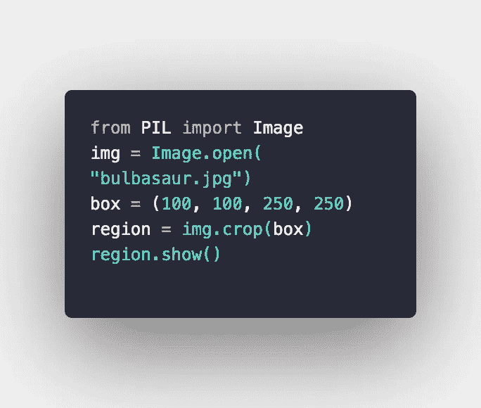
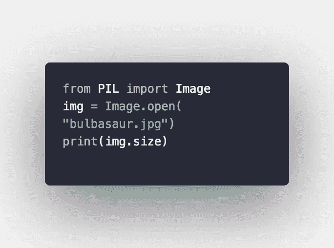

# 使用 Python PIL 处理图像

> 原文：<https://medium.com/analytics-vidhya/process-images-with-python-pil-584d5c74e3fb?source=collection_archive---------19----------------------->

谢尔盖·佐尔金在 [Unsplash](https://unsplash.com?utm_source=medium&utm_medium=referral) 上拍摄的照片

你有没有试过在 Photoshop 或 Illustrator 等设计工具的帮助下，对图像进行转换、调整大小和应用滤镜时遇到困难？使用 Python，我们只需用我们最喜欢的代码编辑器或 ide 编写基本脚本就可以实现这一点。

Python 是最受欢迎的编程语言之一，在尝试学习第一语言的初学者中很受欢迎。Python 为图像处理提供了很多库，但我们将注意力集中在 Python 图像库(PIL)上。PIL 帮助执行图像的基本操作，如调整大小，旋转，创建缩略图，不同文件格式之间的转换等。

在本教程中，我们将假设您对 Python 及其语法有基本的了解。在我们开始安装 PIL 之前，请确保您的系统 python3 上安装了最新的 Python。

# 装置

使用图像处理的第一步是安装所需的库 Pillow。我们可以使用 pip 来安装所需的库。

在 Windows 的终端或命令行中

就是这样。现在我们可以开始了。

# 打开、旋转、显示和成像

以下脚本加载图像，将其旋转 90 度，并在默认的系统图像查看器上显示图像。

# 创建缩略图

thumbnail 方法 thumbnail()有助于保持图像的纵横比，尤其是当您希望按比例缩小/放大图像时。在这两种方法之间，输入所需的尺寸。

您应该注意的是，thumbnail 方法不会返回新图像，它只是修改当前图像。

# 对图像应用滤镜。

在这里，我们将根据自己的喜好对图像进行锐化、模糊和平滑处理。在这个过程中，我们必须将另一个模块 ImageFilter 导入到预先存在的用于表示 PIL 图像的图像模块中。

用“锐化”和“平滑”替换“模糊”属性，以查看处理后图像的变化。

# 转换并保存

我们可以将图像的格式从一种形式转换成另一种形式。

您可以创建一个新文件夹，也可以将图像保存在要应用 save()方法的同一文件夹中。

# 将图像转换为灰度

我们将使用 convert()方法将图像从原来的彩色图像更改为灰色。

“L”代表“发光”

# 调整图像大小

使用这个方法 resize()，您可以使用下面的脚本来调整图像的大小。

# 作物图像

crop()方法从裁剪后的图像中返回一个矩形区域。这个框是一个裁剪矩形的元组，它接受四个输入作为坐标，(左、上、右、下)，用图形表示。

# 阅读图像

您可以通过图像的各种属性(如模式、大小和格式)来读取图像。我们可以使用 Python Print()函数。

将“大小”属性替换为“过滤器”和“模式”属性。

资源

[PIL 图像效果(Python 图像库)](https://pillow.readthedocs.io/en/stable/reference/ImageFilter.html)

我这边就这样了！请记住，通过阅读 Pillow 文档，您可以做更多令人兴奋的事情，我们仅仅触及了使用这个 Python 库可以实现的无限可能性的表面。

如果这对你有所帮助，请在下面留下反馈或评论。