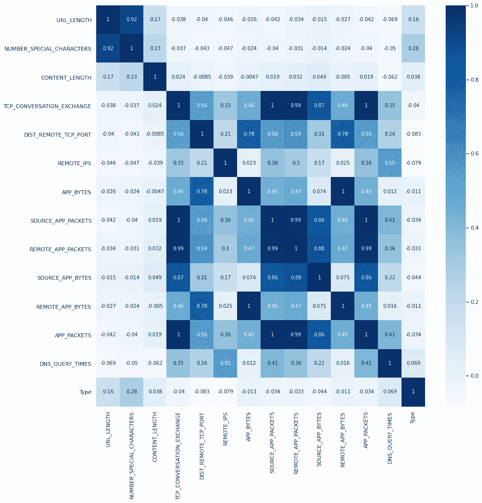
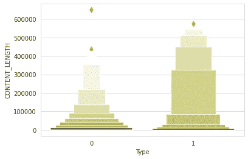
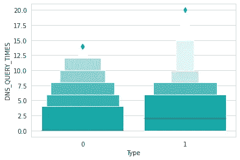
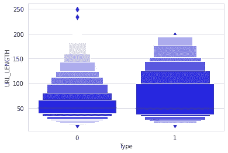
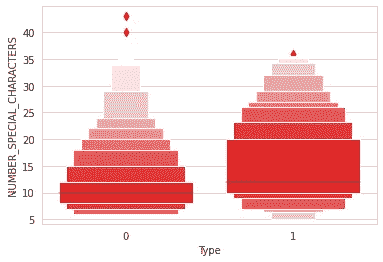
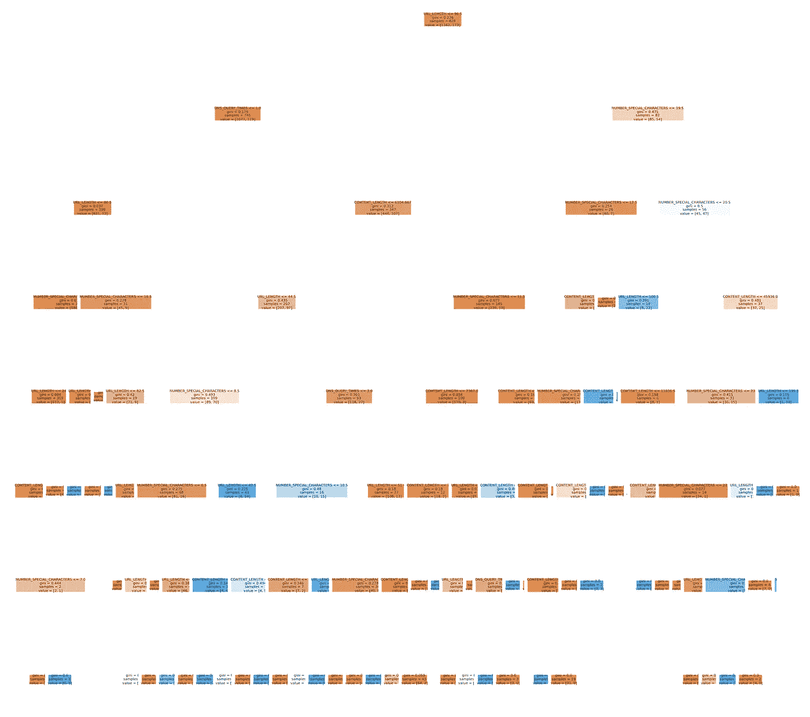

# 对恶意和良性网站进行分类的过程

> 原文：<https://medium.com/analytics-vidhya/process-of-classifying-malicious-and-benign-websites-815cc2b42435?source=collection_archive---------18----------------------->

## 机器学习

在这个快速计算和人工智能的时代，人们每天都会访问数百个网站。因此，他们可能会遇到恶意网站，这些网站会对他们的系统产生负面影响。

因此，在访问之前，了解哪个网站是安全的非常重要。在这里，我们使用机器学习来确定网站的特征。

# 第 1 部分:导言

我想让你知道我解决这个问题的一步一步的方法。我在 Kaggle 找到了一个数据集，你可以点击[这里](https://www.kaggle.com/xwolf12/malicious-and-benign-websites/download)下载。此外，您可以自己构建一个数据集，或者从不同的来源收集数据集。

让我们进入数据科学过程阶段，并与我的项目……
1。业务理解
在上面的章节中已经简单讨论过了，但是我想让你思考一下这些业务问题…

*首要问题:
(1)网站所在国家是否在恶意发挥作用？
(2)数据如何相互关联？
(3)哪些是在预测网站行为中起巨大作用的主要因素？*

2.数据理解
3。数据准备
4。造型
5。结果
此外，部署阶段是在设备或系统上部署模型，这取决于个人。

# 第 2 部分:数据理解

这是整个过程的重要部分。因为在这里我们会知道我们的数据…
-是结构化的，半结构化的，还是非结构化的？
-其中是否有缺失值？
-是不是噪音数据？

不过，它可以扩展到更多的问题。我将说明我理解数据的过程，

●数据集的大小是多少？
●数据中各列的数据类型是什么？
●是否有缺失值？

# 第 3 部分:数据准备

通过了解数据，我发现我的数据集有一些问题，它有一些噪音。

例如，CHARSET 列中的所有值都是大写的，但是有些值是小写的，所以我必须全部大写。utf，ISO-8859–1->ISO-8859–1。

同样，WHOIS_COUNTRY 列也具有与上面相同的模式。所以我必须用一种通用的方式来转换这些值。比如*美国- >美国，
英国- >英国。*

除此之外，我的数据集有缺失值，所以我必须正确地对其进行插值。

有了适当的数据后，必须回答这个问题…

> 哪些具有因变量的列有助于预测目标值？

为此，我用 Seaborn library 提供的 pair plot 可视化了数据。我在名为 URL_LENGTH、CONTENT_LENGTH、NUMBER_SPECIAL_CHARACTERS 和 DNS_QUERY_TIMES 的四列中发现了峰值。

为了进一步研究，我取出了这些列中每一列的相关矩阵和目标变量( *Type* )。并绘制了它的热图。这是它的样子，

关联的热图

这里可以看到 URL_LENGTH、CONTENT_LENGTH、NUMBER_SPECIAL_CHARACTERS、DNS_QUERY_TIMES 与 Type 列的相关性较高。

为了更加清楚，我在每个列和类型列之间绘制了单独的关系盒图。

箱线图

因此，我有信心用这么多数据来训练我的模型。因为它满足了我关于相关性和预测网站行为的业务问题，我想进一步发展。

> 也可阅读:[推荐引擎系列(第二部分)](/@prashantjadiya/recommendation-engines-a-to-z-part-2-a099ca021121)

# 第 4 部分:建模和结果

我已经为我的分类器尝试了多种方法。事实上，每个数据科学家都试图将他们的数据拟合到多个模型中。在这里，我考虑了分类、逻辑回归、SVM、K 近邻和随机森林的经典算法。

对于每个模型，我使用 roc_score 和 accuracy_score 指标。

我将用 roc_score 以递增的方式登记算法及其准确性。

逻辑回归—准确率 _ 得分:89%—roc _ 得分:0.5
SVM —准确率 _ 得分:89.46%—roc _ 得分:0.5
KNN (k=35) —准确率 _ 得分:91.48%—roc _ 得分:0.6802
随机森林—准确率 _ 得分:95.29%—roc _ 得分:0.7953

在下一部分中，我们将看到为什么随机森林比其他森林做得更好。

# 第五部分:为什么是随机森林？

有一些令人信服的理由说明为什么它更好…下面是其中的一些。

●首先，我们的数据集具有分类值和数量值，因此随机森林更适合平稳处理。
● RF 基于树，因此不需要特征缩放。任何单调变换都很容易被树捕获。
●采用随机子空间方法和装袋防止过拟合。此外，它还是一个很好的估计器，可以处理缺失值。
●可以处理大维度的空间，也可以处理大量的例子。
●我已经画出了第一个，它的性能最引人注目的因素。在这里，

随机森林的第一棵树

这里你可以看到，它在第一棵树中以根节点作为 URL_LENGTH。它可能在更多的树中被改变。

所以，这些就是 RF 性能优于其他产品的原因。

如果你喜欢我的博客，点击“鼓掌”按钮，在 LinkedIn 上与我联系。