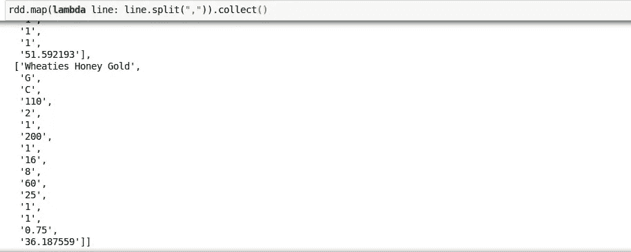
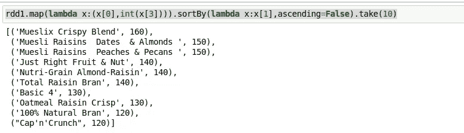
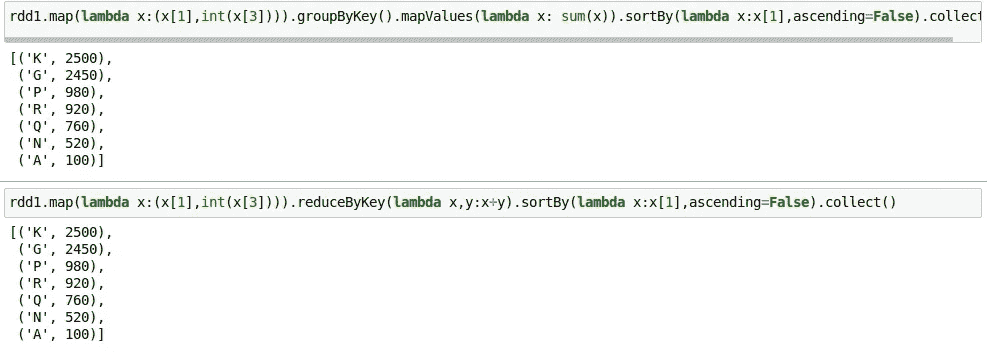
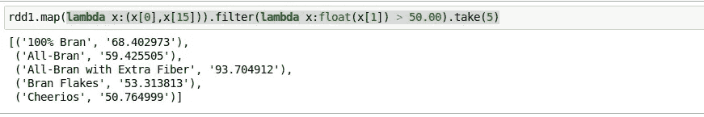

# 用 Pyspark 的 spark 核处理数据

> 原文：<https://medium.com/analytics-vidhya/processing-data-with-spark-core-using-pyspark-4b9106ca355d?source=collection_archive---------7----------------------->

spark-核心处理样本数据，以便更熟悉 spark。


嘿伙计们，

再一次带着一篇文章回来，这篇文章会让你更好地理解所有的 spark 函数。因此，对于那些认为 spark-core 无法使用的人来说，学习如何使用 spark 函数进行数据转换和聚合会让你受益匪浅。所以让我们开始吧。

在这篇文章中，我使用 kaggle 的谷物数据作为例子。你可以从下面的链接下载数据。

[https://www.kaggle.com/crawford/80-cereals#cereal.csv](https://www.kaggle.com/crawford/80-cereals#cereal.csv)

因此，让我们从创建 sparkcontext 开始，并读取 csv 文件。

```
from pyspark import SparkContext
import os
os.environ[‘PYSPARK_PYTHON’] = ‘/usr/bin/python3.6’ 
sc = SparkContext("local","spark-processing")
rdd = sc.textFile("cereal.csv")
rdd.map(lambda line: line.split(",")).collect()
```



用于收集的输出

```
 rdd.count()
79
```

Spark 在 RDD(弹性分布式数据集)上工作，该数据集是为并行计算而构建的，不像 pandas dataframe。它实际上工作和地图和减少概念。所以每一个单独的函数都必须一行一行地映射，这与应用在熊猫数据帧中非常相似。这将返回带有值列表的 rdd，使其可以按元素方式访问。

这些数据是关于不同品牌的谷物的。所以我们来整理一下，看看热量最多的 10 大品牌。

```
rdd1.map(lambda x:(x[0],int(x[3]))).sortBy(lambda x:x[1],ascending=False).take(10)
```



按降序排序

在上面的部分中，我们使用 map 函数来选择我们需要显示的列。可以显示全部排序后的数据。但是为了便于理解，我使用 map 只选取了这两列。SortBy 函数与 SortByKey 不同，sort by key 只允许对键进行排序。在这里您可以选择您自己选择的列进行排序，并选择前 10 个。

**分组和求和**

groupby 可以通过 reduceby 和 aggregateby 函数来执行，这样会更快更有效。由于 aggregateBy 是一个高级概念，我将在下一篇博客中介绍它。

```
rdd1.map(lambda x:(x[1],int(x[3]))).groupByKey().mapValues(lambda x: sum(x)).sortBy(lambda x:x[1],ascending=False).collect()rdd1.map(lambda x:(x[1],int(x[3]))).reduceByKey(lambda x,y:x+y).sortBy(lambda x:x[1],ascending=False).collect()
```



groupbykey 函数

groupbykey 函数按键对数据进行分组，然后使用 mapvalues 和 sum 对每个组的值应用 sum。最后，您将根据合计值对其进行升序排序。

reducebykey 也做同样的动作，这里它更像是 cumulative sum，(accum，n)，其中 accum 用 0 初始化，并为每个键添加一个元素。例如

第一步累积(' k '，[x1，…xn])

第二步缩减(' k '，sum(x1，，，xn))

**过滤**

```
lambda x:(x[0],x[15])).filter(lambda x:float(x[1]) > 50.00).take(5)
```



过滤器

这就是这个职位的所有人。我将提出 spark-core 本身的高级功能。所以剩下的就是未完待续…..

希望你们都喜欢阅读。

谢了。