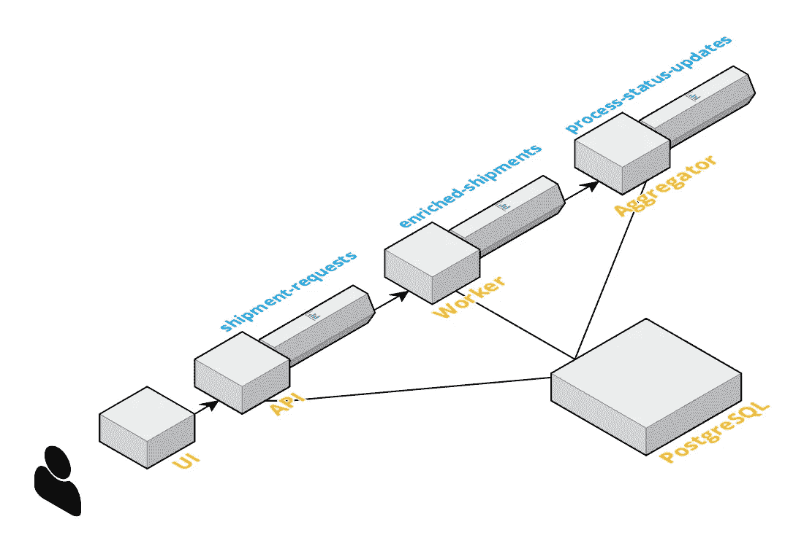
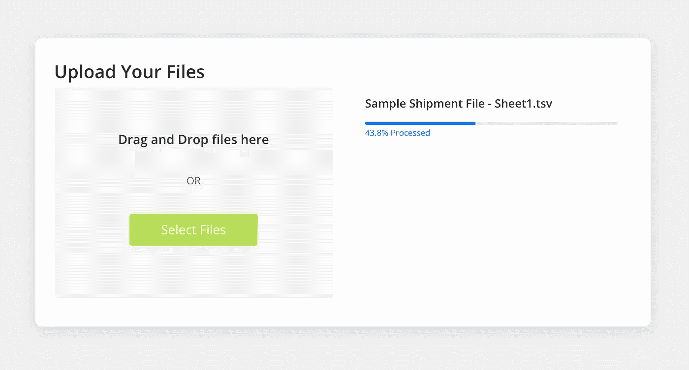

# 在流处理管道中处理文件

> 原文：<https://medium.com/analytics-vidhya/processing-files-in-a-stream-processing-pipeline-2cc6e70e3439?source=collection_archive---------4----------------------->

在[的](https://www.pexels.com/photo/aerial-view-of-road-in-the-middle-of-trees-1173777/)上 [Deva Darshan](https://www.pexels.com/@darshan394) 拍摄的照片。

由于其灵活性和水平可伸缩性，流处理是目前流行的数据处理设计模式。流处理的基本要求是将我们的数据分割成单独的片段或事件，以便可以单独处理它们。每个事件也可以想象成关系数据库中的一行或一个元组。

这种模式对于某些类型的事件非常有效，例如 UI 事件、数据库更新事件，因为它们通常是由单个事件产生的。然而，在实际应用中，我们经常需要使用某种类型的文件格式来支持批量数据上传。通常，我们会编写批处理代码来处理文件内容。但是，如果我们想重用相同的流处理管道来支持批量上传呢？

在下面的示例应用程序中，我们将会这样做。基本思想是将文件内容分割成单独的记录，或者可以通过流处理管道发送的事件，从而重用同一管道进行批量上传。

# 作为流的文件

大多数类型的文件可以被视为记录/事件流，或者以某种方式进行流处理。在某些情况下，当我们在整个文件或文件中的记录组级别上处理逻辑时，可能需要更多的技巧，但仍然是可行的。这里，我们将看到一个简单的例子，我们可以将文件内容分割成单独的记录，并独立地处理它们。

使用流处理模式处理文件的一个很好的效果是，我们可以在管道的后端聚集处理状态。假设我们为每个输入事件发出某种输出事件，我们可以对这些输出事件进行计数，按照文件上传请求 ID 进行分组，并生成我们可以用来报告中间进度的二级流。这就是我们在这个简单的例子中要做的。我们将使用 Apache Kafka，这是一个流行的流处理平台。然而，该技术非常适用于其他流处理平台。

# 流水线架构

这是我们将要建立的管道的整体架构。我们将在接下来的章节中讨论图中的每个模块。

流处理流水线

# 文件上传 API

为了支持文件上传，首先我们需要一个简单的服务器端 REST API。我们将使用名为 [Micronaut](https://micronaut.io/) 的微服务框架。流行的 [Spring Boot](https://spring.io/projects/spring-boot) 框架的用户应该熟悉这种编码风格。

API 将执行几件事情:

1.  为跟踪目的生成唯一的 requestId。
2.  计算整个文件中的行数。
3.  逐行拆分文件，并转换成发送到目标 Kafka 主题的事件。
4.  当步骤#3 完成时，将 requestId 返回给 UI 客户机。

FileController.kt

# 事件处理微服务

这将是在 Kafka 主题中咀嚼数据的实际数据处理逻辑。为了简单起见，我们将只执行一个简单的数据库查找，将查找结果附加到输入记录，并将丰富的记录输出到输出主题。在现实生活中，这种处理逻辑可以像您的需求所要求的那样复杂。

ShipmentEnrichmentWorker.kt

注意，将原始的 requestId 传递给输出事件也非常重要，这样接下来的步骤就可以使用它进行聚合。

# 流程状态聚合器微服务

我们将使用 Kafka Stream API 构建一个简单的输出事件计数，该计数按 requestId 分组。发出聚合结果的频率可以通过设置 Kafka Streams 配置“commit.interval.ms”来调整。

默认情况下，它被设置为 30 秒，为了更精确，我们将它更改为 1.5 秒。目标是找到一个合理的大时间窗口以提高效率，同时能够定期获得更新。

最后，汇总的状态更新将被保存到数据库表中，以供流程状态 API 查询。

ProcessStatusAggregator.kt

或者，Kafka 流 API 提供了一个表结构，您可以使用它来存储 requestId 的状态结果。这个 API 将数据存储在运行聚合器流程的相同主机上。这是一种保存数据的便捷方式，不需要外部数据库。然而，它确实需要处理节点中的数据存储，并为查询提供额外的 API。使用传统数据库可能更容易操作。

# 流程状态 API

对于检索处理状态的 UI，我们需要在服务器端提供一个 REST API。这是一个非常简单的 API，它基本上是通过 clientId 查询数据库，以获取从同一客户端上传的所有文件的状态。这里的 clientId 是每当 UI 初始化时生成的随机 UUID。

UI 将以一定的时间间隔轮询 API，直到所有上传都完成处理。然后，返回的结果会呈现在 UI 上。

ProcessStatusController.kt

或者，我们可以通过使用 web socket 来提供基于推送的状态更新 API。它将需要更多的移动部件来正确实现。这里，为了简单起见，我们选择实现传统的基于拉的 API。

# 最后，用户界面

对于 UI，我们将使用 React 框架进行编码。然而，这里可以使用任何 Web UI 框架，因为逻辑非常简单。最终产品看起来会像这样:

文件上传界面截图

当用户选择要上传的文件时，UI 调用 upload API 并将文件传递给服务器进行处理。

将选定文件上传到服务器的功能。

然后，UI 将调用 refresh()函数来获取所有当前正在处理的和最近完成的上传。有一个自动刷新机制来定期轮询服务器的处理状态。只有当至少有一个文件处于处理状态时，自动刷新机制才会打开。

获取和更新处理状态的自动刷新机制。

# 截屏

这是一切正常运行时的样子。

# 源代码

该示例的完整源代码可以在[这里](https://gitlab.com/yongtze/file-stream-sample)找到。

# 摘要

在我们上面看到的例子中，很有可能获取用户上传的文件，分割内容，通过流处理管道传递分割事件，并以中间进度更新 UI。

通过利用 Kafka 这样的流媒体平台，我们可以通过横向扩展我们的微服务来处理大量数据。同时，我们已经看到很有可能聚合输出流以在 UI 中提供中间进度更新，这非常酷。