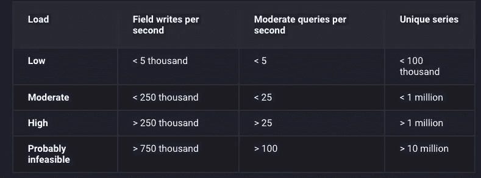

# 使用 InfluxDB 和结构化流实时处理时间序列数据

> 原文：<https://medium.com/analytics-vidhya/processing-time-series-data-in-real-time-with-influxdb-and-structured-streaming-d1864154cf8b?source=collection_archive---------0----------------------->

## 本文重点介绍如何利用流行的开源数据库“Influxdb”以及 spark 结构化流来实时处理、存储和可视化数据。在这里，我们将详细介绍如何设置 Influxdb 的单个节点实例，如何扩展 SPARK 的 Foreach 编写器以使用它来写入 Influxdb，以及在设计 Influxdb 数据库时需要注意的事项。


在数据世界中，人们希望看到的一个主要趋势是指标如何随着时间的推移而发展。这使得管理和处理时间序列数据(简单地说，数据值依赖于时间)成为数据科学家生活中非常重要的一个方面。

围绕这种高效处理时间序列数据的思想，已经开发了许多工具和数据库。在我最近的项目中，我探索了一个非常受欢迎的开源数据库，名为**“Influxdb”**，这篇文章是关于如何用 influx db 和 Spark 处理实时数据的。

# Influxdb

从定义的角度来看

> InfluxDB 用作任何涉及大量时间戳数据的用例的数据存储，包括 DevOps 监控、日志数据、应用程序指标、物联网传感器数据和实时分析。

从这篇文章的范围来看，我将不详细讨论数据库是如何工作的以及它所使用的算法，这些细节可以在 [**这里**](https://docs.influxdata.com/influxdb/v1.7/) 找到

在这篇文章中，我将主要关注安装，写作和阅读能力，写作通过火花和行为的涌入与数据量。

## 装置

Influxdb 作为解决方案有两个版本，一个是只能安装在单个实例上的开源版本，另一个是付费的企业版，可以安装在集群上。

在很多情况下，开源版本非常有用，满足了需求。Influxdb 的单实例安装非常简单。我遵循的步骤与文档中提到的不同(我发现安装起来有点棘手)，如下所示:

1.  下载 influxdb 的 rpm 文件
2.  如果没有安装“sudo apt-get install alien ”,请安装 alien 软件包
3.  用“alien name.rpm”从 rpm 获取一个. deb 文件
4.  用“sudo dpkg -i name.deb”安装潮人
5.  用“sudo influxd”或“sudo 服务流入启动”启动流入服务器

## 硬件规模指南

Influxdb 非常慷慨地为我们提供了硬件规模指南。单个实例节点的情况如下。



这些指导原则在中有详细介绍

[](https://docs.influxdata.com/influxdb/v1.7/guides/hardware_sizing/) [## 流入数据文件

### InfluxDB、Telegraf、Chronograf、Kapacitor 和 Flux 的文档

docs.influxdata.com](https://docs.influxdata.com/influxdb/v1.7/guides/hardware_sizing/) 

**InfluxDB 基本概念**

这里有一些重要的 Influxdb 概念需要理解

> **1。度量**:度量大致相当于关系数据库中的表的概念。数据存储在测量中，一个数据库可以有多个测量。度量主要由三种类型的列组成:输入法、标签和字段
> 
> 2.**时间**:时间不过是一个跟踪时间戳的列，用来更好地执行时间序列操作。缺省值是 Influxdb 时间，单位是纳秒，但是可以用事件时间替换。
> 
> 3.标签:标签类似于关系数据库中的索引列。**需要记住的重要一点是，只有当列被标记为标签时，才能对其执行 WHERE、GROUP BY 等关系操作**
> 
> 4.**字段**:字段是可以进行**求和、均值、非负导数等数学运算的列。**但是，在最近的版本中，字符串值也可以存储为字段。
> 
> 5.**系列**:系列是 Influxdb 最重要的概念。**系列是标签、测量和保留策略的组合(Influxdb 的默认值)。**influx db 数据库的性能高度依赖于它所包含的唯一序列的数量，**这又是标签的基数 x 测量数量 x 保留策略**

必须明智地决定将哪些值存储为标签，哪些值存储为字段，因为它们对于确定可以执行的操作类型和数据库本身的性能是必要的。

**从 Spark 写入数据**

Spark 是目前大数据处理领域最流行、最高效的开源工具。目前有两个 InfluxDb sink 的开源实现可用于通过结构化流写入数据， [**编年史**](https://github.com/fsanaulla/chronicler-spark) 和 [**反应流入**](https://github.com/pygmalios/reactiveinflux) 。

这两种方法都很有效，chronicler 的唯一问题是**通过 chronicler 写入数据，必须首先将流入数据点转换/创建为 influxdb 线路协议，这有时会变得很棘手，需要处理大量的字段和字符串值**。仅仅因为这个原因，我更喜欢反应式流入。

要在 **sbt** 项目中包含反应性流入，只需

```
libraryDependencies ++= Seq(
"com.pygmalios" % "reactiveinflux-spark_2.11" % "1.4.0.10.0.5.1",
"com.typesafe.netty" % "netty-http-pipelining" % "1.1.4"
)
```

在 application.conf 中创建一个条目

```
reactiveinflux {
  url = "localhost[:8086/](http://96.112.246.169:8086/)"
  spark {
    batchSize = 1000 // No of records to be send in each batch
  }
}
```

要使 spark 流查询能够写入 Influxdb，需要扩展 Spark 结构化流中可用的 Foreach 编写器。下面给出了它的伪代码

```
import com.pygmalios.reactiveinflux._
import com.pygmalios.reactiveinflux.spark._
import org.apache.spark.SparkConf
import org.apache.spark.rdd.RDD
import org.apache.spark.streaming.dstream.DStream
import org.apache.spark.streaming.{Seconds, StreamingContext}
import org.joda.time.DateTime
import com.pygmalios.reactiveinflux.{ReactiveInfluxConfig, ReactiveInfluxDbName}
import com.pygmalios.reactiveinflux.sync.{SyncReactiveInflux, SyncReactiveInfluxDb}
import scala.concurrent.duration._class influxDBSink(dbName: String) extends org.apache.spark.sql.ForeachWriter[org.apache.spark.sql.Row] {

        var  db:SyncReactiveInfluxDb = _
        implicit val awaitAtMost = 1.second // Define the database connection here
**def open(partitionId: Long, version: Long): Boolean** = {
            val syncReactiveInflux =
SyncReactiveInflux(ReactiveInfluxConfig(None))
            db = syncReactiveInflux.database(dbName);
            db.create() // create the database 

            true
        }// Write the process logic, and database commit code here
**def process(value: org.apache.spark.sql.Row): Unit** = { val point = Point(
                           time = time,  // system or event time 
                           measurement = "measurement1",
                           tags = Map(
                                      "t1" -> "A", 
                                      "t2" -> "B"
                                     ),
                           fields = Map(
                                   "f1" -> 10.3, // BigDecimal field
                                   "f2" -> "x",  // String field
                                   "f3" -> -1,   // Long field
                                   "f4" -> true) // Boolean field
                                  )

            db.write(point)
        }// Close connection here
 **def close(errorOrNull: Throwable): Unit** = {}
    }
```

然后将它包含在 writer 中，如下所示

```
val influxWriter = new influxDBSink("dbName")val influxQuery = ifIndicatorData
                     .writeStream
                     .foreach(influxWriter)
                     .outputMode("append")
                     .start()
```

## **可视化**

一旦数据被存储，使用各种工具，如 Grafana，计时等可视化可以绘制。一个可视化示例应该是这样的。


influxdata.com

在 Medium 和其他平台上也有许多关于可视化的文章，因此我不会详细讨论。

## 结论

总之，我发现 Influxdb 在数据存储方面非常高效，而且非常容易使用。Influxdb 的压缩算法非常强大，可以将数据压缩到几乎一半。在我的数据本身中，我看到压缩导致从大约 67GB 减少到 35GB。

然而，究竟是什么决定了压缩的规模和效果，这超出了本文的范围。