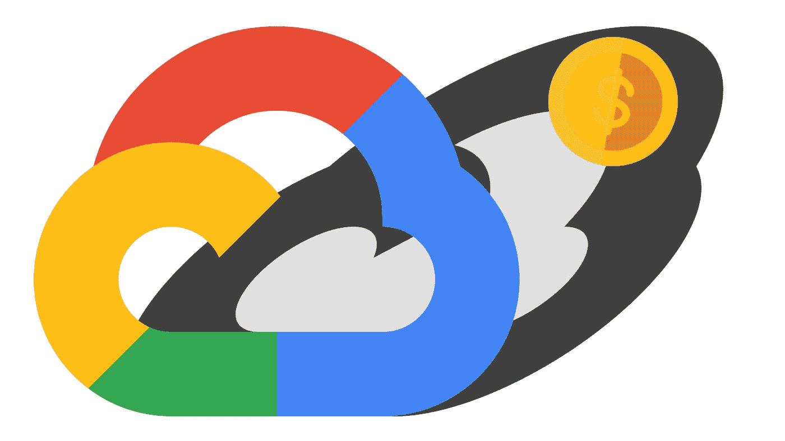
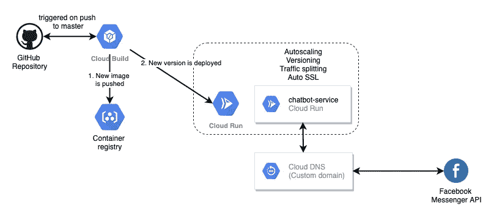

# 不到一美元就能在 GCP 生产的聊天机器人

> 原文：<https://medium.com/analytics-vidhya/production-ready-chatbot-in-gcp-for-less-than-a-dollar-a8349283a09b?source=collection_archive---------25----------------------->

可持续生产就绪部署几乎永远免费？

我们都有过这样的经历——有一个关于黑客马拉松、爱好或兼职项目的好主意，并且有尽快开始编码的强烈愿望。现在有多少可能性(Heroku，Glitch 和其他)来引导你的应用程序并立即部署它。但正如一些歌手所说:

> **到了最后**，**就是没感觉到**，**不对劲**。

有时，在过于复杂的结构和没有安全性的过于简单的解决方案之间找到平衡是一项极具挑战性的任务。我认为现代谷歌云平台生态系统为解决这个问题提供了一个很好的工具集，而没有厂商的束缚(几乎没有)😏当然，我们将使用一些特定的服务，但它们很容易迁移)。

作为一个应用程序的例子，我将使用聊天机器人应用程序。它是开源的，托管在 [GitHub](https://github.com/Gaikanomer9/mentor-chatbot) 中。

## 快速演示

有什么比现场演示更好的？**可点播的现场演示！前往聊天机器人的脸书页面[并添加几行文字。请注意第一个响应是如何花费一些时间的，之后的响应是平稳而快速的。(当然，如果有人在过去 15 分钟内使用该应用程序，就没有预热时间了)。](https://www.facebook.com/Raido-Mentor-Bot-109235004160923)**

这里刚刚发生了什么？Facebook Messenger 平台将你的消息发送到应用程序页面，并点击聊天机器人后端的 webhook。我们应用程序中负责后端的云运行服务用我们的应用程序启动了 Docker 容器的一个新实例，并处理了请求。

# 架构概述

让我们来看看 GCP 的整体应用架构，然后浏览一下部署流程。

App 架构(GitHub + GCP +脸书 API)

## 应用架构

机器人本身使用 Python 框架 Flask 来处理请求。对于存储，使用 NoSQL Firestore，因为它非常适合少量的并发请求，并且没有复杂的关系查询。

## 基础设施

代码被打包在 Docker 映像中，Docker 映像由云构建服务构建，并被推送到 GCP 容器注册中心。云运行服务基本上是 Kubernetes 的轻量级版本。它管理面向世界的服务、自动伸缩、版本控制和 SSL 密钥轮换。部署到云运行的每个已部署服务都会获得一个启用了 HTTPS 的服务域名，但是您也可以使用自定义域名并启用 SSL 加密。

云运行服务负责处理传入的请求。Docker 容器中的应用可以是你需要的任何东西(就语言、库或其他内部依赖而言)。你必须记住的唯一一件事是，Cloud Run 中的应用应该是无状态的。要附加卷，您需要使用常见的 Kubernetes 或其他服务。在这种情况下，使用托管 SQL 或 NoSQL 服务可以方便地存储数据。

## 部署管道

部署是通过推送到主分支自动触发的。之后，云构建程序获取源代码，构建新的映像，并将其存储在 GCR 中。后来的云构建在云运行中创建了服务的新版本，并将流量切换到它。您还可以在这里配置一个部分交换机，用于实现逐步部署，并在为每个用户提供服务之前检测异常。

# 怎么用？

在本文中，我们将通过派生 chatbot 应用程序来完成设置类似解决方案的过程。我们将对其进行分支和清理，以便您可以快速开始，但是如果您需要更复杂的示例，请随时返回原始存储库进行参考。

1.  将[库](https://github.com/Gaikanomer9/mentor-chatbot)与聊天机器人应用程序分支，因为它包含所有必要的文件。
2.  在 GCP 启用 Firestore、云构建和云运行 API。
3.  在 https://console.cloud.google.com/cloud-build GCP 创建一个新项目，然后去
4.  连接分叉的存储库。
5.  为该存储库创建一个新的触发器，并指定以下**替换变量:** _SERVICE_NAME(用于云运行中的服务名称)
    _REGION(用于部署服务的区域)
    _IMAGE_NAME(用于存储在 GCR 的映像名称)
6.  克隆分叉的存储库
7.  进入存储库文件夹，删除特定于聊天机器人的文件:
    **RM config . py FB . py GCP . py logging _ handler . py skills . JSON**
8.  用以下要点替换 app.py 文件的内容:

我们为应用程序的持续交付准备了存储库。现在，当您提交更改并将它们推送到分叉的存储库时，云构建服务将构建和部署新的应用程序。

1.  提交所有更改，并将其推送到远程分叉存储库。
2.  转到[https://console.cloud.google.com/run](https://console.cloud.google.com/run)并检索服务的 URL。检查它是否正常工作，我们是否收到“Hello Cloud Run”消息。
3.  前往[https://console.cloud.google.com/cloud-build](https://console.cloud.google.com/cloud-build)查看关于构建的信息或出现的任何问题。

现在让我们来看看这里最有趣的文件:

*   **cloudbuild.yaml** 包含了所有的构建和部署步骤。我们指定用于每个构建步骤的 docker 映像，并为其提供参数。最后一步是用一个新的 Docker 映像创建一个新的版本，并完成部署。
*   **Dockerfile** 包含关于容器如何被执行的信息。在这个例子中，我们使用 gunicorn webserver 并为我们的 Flask 应用程序提供服务。

# 账单和费用

除了 Secrets Manager 之外，本演示中的每个服务都有一个自由层。云运行不是 24/7 全天候运行，而是仅在需要时启动容器实例。这使我们能够节省大量资源，让我们能够更好地控制应用程序(这不是一个无服务器的功能或类似的解决方案)，并授予自动缩放功能。

在低负载下运行这个项目的总成本(它是一个简单的聊天机器人，并不总是与用户交互)是秘密管理器服务中 2 个秘密的成本，每月 0.12 美元。自由层覆盖了所有其他内容。当然，这只适用于应用程序没有用户激增的情况，但即使在这种情况下，它也可以自动扩大和缩小规模，而无需我们的干预。

# 何必呢？

构建有趣的小型应用程序、附带项目或作为黑客马拉松的参赛作品总是一项棘手的任务。我们可能根本没有设置，应用程序甚至永远不会有与用户沟通的变化。我们可能会有一个极其昂贵的设置，依靠来自 GCP 或其他提供商的试用资金生活，一旦没有更多的信用额度，该设置就会被关闭。我们也可以将其部署为无服务器应用程序或使用 PaaS 提供商，但这意味着我们将失去对应用程序的主要控制，如果我们希望在未来进行迁移，这将需要一些时间。

本文中的系统架构试图使小项目在更长的时间内可用，同时使它们更加安全，并为潜在的增长做好准备。