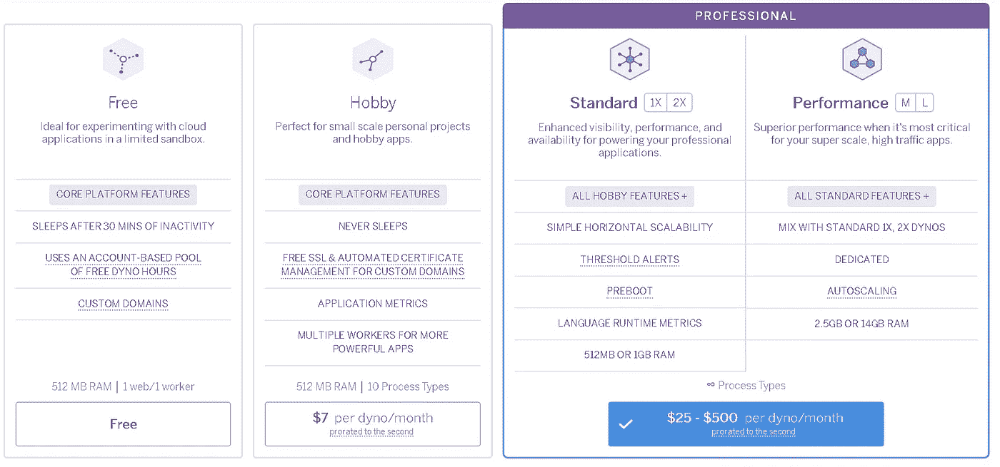

# 将您的机器学习(Python)应用程序生产化

> 原文：<https://medium.com/analytics-vidhya/productionlize-your-machine-learning-python-application-e1989dd82f24?source=collection_archive---------12----------------------->

## 使用 Flask、Heroku 和多线程

当我们创建我们的机器学习应用程序时，我们大多数人都在试图学习算法，理解它们如何工作，与 sklearn pandas 和各种其他库一起玩。但是，将我们的知识付诸使用才是这些算法的真正价值，这就是你必须将机器学习应用程序与可能提供见解、建议、预测统计数据等的产品集成并公开的时候。

当第一次尝试机器学习时，人们通常不关心或不考虑的事情是 CPU 大小、RAM、用户体验和响应时间、对外部 API 的依赖等。但如果我们的机器学习应用程序必须提供任何真正的好处，这些就变得非常关键。

本文中的内容是我在部署我最近的应用程序时学到的——shared watch，这是一个基于文本分析和在线聚类的电影推荐系统。本文不是关于核心应用程序中使用的算法或方法，而是部署应用程序时面临的问题。

我将一个接一个地讲述所面临的每一个障碍，以及它们是如何被补救的。

1.  **公羊**

该应用程序将被托管在 Heroku 提供的免费层上。考虑到它是免费的，它有固有的局限性。对应用程序大小、内核数量和 RAM 容量的限制

[H](https://www.heroku.com/pricing) eroku 定价

正如你在上面看到的，heroku free tier 只提供了 512 MB RAM，这对于机器学习应用来说太有限了。

当我第一次部署这个应用程序时，我马上就遇到了这个问题，这个应用程序被 Heroku 强制崩溃了，因为它超过了内存使用量的 200%!！

发生这种情况是因为在幕后我使用了 [Spacy](https://spacy.io/) ，他们非常基本的可用模型在磁盘上的大小是 90MB，当加载到内存中时，会爆炸到大约 200MB。仅仅通过加载模型，大部分内存就被消耗掉了。

现在这似乎是一个很难解决的问题。你要么寻找更小的可用型号，要么就付钱给 Heroku 升级你的机器。一如既往地缺乏资金，我选择了第一个选项。但是我花了一段时间才偶然发现——py Magnitude——现在这些家伙已经做了一项巨大的工作，他们采用了从 Spacy 到 NLTK 到处使用的相同基础模型，并将它们转换成一种叫做“Magnitude”的格式，这种格式只占用大约 10 MB 的 RAM！！！显着减少，显然成本是处理时间，但至少这个看似不可能解决的问题有了一个前进的方向。所以我用 PyMagnitude 代替 Spacy。

**第三课**——在你决定投入更多硬件之前，试着优化你的代码，寻找有效的依赖。

2 **。CPU 和响应时间**

对应用程序非常关键的第二个问题是响应时间。由于我们在幕后使用在线处理和集群，所以我们必须非常高效，这样应用程序的最终用户就不会经历很长的等待时间。

批评的另一个原因是 Heroku 对 web 请求的硬性限制。响应时间必须低于 30 秒(对于 web 应用程序来说，这是一个合理的上限，但对于机器学习应用程序来说呢？).一旦达到极限，Heroku 就会杀死工人，请求就会终止。

如果超过 30 秒，请求返回 503

从 UX 的角度来看

我们决定做的第一件事是改善用户体验。该应用程序做两件事——允许用户探索电影中的主题并找到相似的电影。*“主题”*功能会在 3 秒钟内返回响应，而*“电影”*功能则需要很长时间。所以我们决定让用户登陆主题选项卡，这将允许他们立即开始探索主题和这些主题的电影。但是我们禁用了电影标签，并显示了一个加载符号，不管将来它会变得多快，我们都希望它会比主题慢，所以它有点意义。

**B .让事情变得更快——线程**

我们被压扁的另一个原因是网络电话。我们进行了大量的 API 调用(通过缓存),平均需要 1-2 秒，由于我们进行了大量的调用，应用程序就爆炸了。

处理这种情况的自然方法是使用并行处理。

现在，并行处理可以通过多重处理或多线程来完成。两者都有不同的用例。

**一般的经验法则是**

如果你的代码有大量的 I/O 或网络使用:

*   **多线程**是你的最佳选择，因为它的开销很低

如果你有图形用户界面

*   多线程，这样你的 UI 线程就不会被锁定

如果你的代码被 **CPU 绑定**:

*   你应该使用**多重处理**(如果你的机器有多个内核)

因此，我们自然决定使用线程。Python 提供了一个非常简单的线程库接口。

引用官方文档“`[**multiprocessing.dummy**](https://docs.python.org/2/library/multiprocessing.html#module-multiprocessing.dummy)`复制了`[**multiprocessing**](https://docs.python.org/2/library/multiprocessing.html#module-multiprocessing)`的 API，但只不过是`[**threading**](https://docs.python.org/2/library/threading.html#module-threading)`模块的包装器。”

现在，您可以并行运行，而不是使用串行循环！

在上面的代码片段中

[118 行]我们首先进行外部 api 调用，以获取与特定关键字相关的电影，如“浪漫”、“戏剧”或“德里”，然后[120 行]，并行地，获取每部电影的所有关键字。

这导致整体时间的显著下降，因为程序现在并行运行每个外部请求，并且在等待它们返回的同时可以做其他有用的事情！

这就是这篇文章的全部内容，如果有不清楚的地方或任何建议，请随时发表评论。

这篇文章的后续或者更像是一个先驱— ***将应用程序部署到 Heroku*** 将在另一篇文章中讨论。