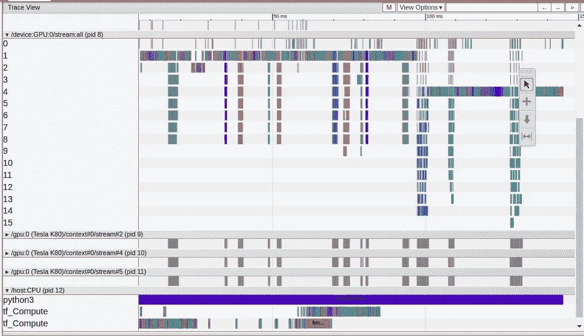
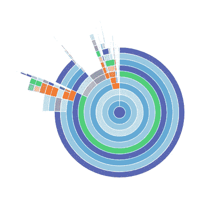
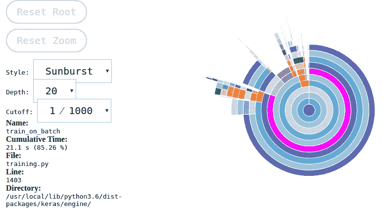

# 使用 TFprofile 和 CProfile 分析 Keras 模型

> 原文：<https://medium.com/analytics-vidhya/profiling-keras-model-using-tfprofile-and-cprofile-d598b4be82ab?source=collection_archive---------5----------------------->

在探索机器学习中的一些挑战时，我偶然发现了斯坦福大学的一个挑战，称为黎明基准。这一挑战是以最少的培训时间和成本获得 94%的测试准确率。这个问题有三个挑战:获得正确的模型(**精确**，在创纪录的时间内(**快速**，以及有限的成本(**高效**)。在这里，我将展示如何变得更快的方法。为此，您首先需要了解网络消耗时间的地方，然后进行必要的更改以减少时间。
因此，为了给代码加时间戳，我将使用 **TFProfile** 和 **CProfile** 。

## **使用的型号…**

用于分析代码的模型。

# **使用 TFProfile 进行分析**

使用 TF Profile 分析模型。

Tensorflow 提供了自己的名为 TFProfile 的分析模块。该模块允许轻松记录每次操作的时间。可视化可以使用 tensorboard 来完成。

**了解 tf.keras.callback.TensorBoard 参数**

这里，我们使用了两个参数，即:log_dir 和 profile_batch。log_dir 提供记录目录的位置，profile_batch 选择要分析的批次，默认情况下是第二批，因为第一批由于各种初始化而比其余批次花费更多时间。
有各种其他参数可以根据需要添加到函数调用中。有关该函数及其参数的更多详细信息，请查看:-[https://www . tensor flow . org/API _ docs/python/TF/keras/callbacks/tensor board](https://www.tensorflow.org/api_docs/python/tf/keras/callbacks/TensorBoard)

由于 Colab 目前不运行 tensorboard，因此为了可视化它，日志文件必须被压缩、下载并在本地机器上运行。要压缩文件，使用命令:- `tar -zxvf logs.tar.gz`

这将在 colab 的文件部分创建一个 log.tar.gz。下载文件并在本地系统中解压缩。转到包含解压后的日志文件夹的目录，运行:- `tensorboard --logdir=logs/ --port=6006`来可视化概要文件。

## **理解观想**

批处理通过 GPU 和 CPU 消耗的时间

通过这些可视化，我们可以了解:批量标准化的时间、relu、加载数据所需的时间、MAC 操作的时间等。因此，我们可以对模型进行必要的更改，如使用预取来加载数据、优化使用丢弃和批量规范化等。

要了解更多关于 Tensorboard 中的分析，请查看链接:[https://www . tensor flow . org/tensor board/R2/tensor board _ profiling _ keras](https://www.tensorflow.org/tensorboard/r2/tensorboard_profiling_keras)

# **使用 CProfile 进行剖析**

c 配置文件代码

导入库并分析 train_model 函数，以了解系统消耗时间的地方。

c 配置文件输出]

CProfiling 之后的输出是**难看的，**并且很难理解，所以最好的解释方式是通过可视化输出。有各种免费的开源工具可以解决这个问题，比如 snakeviz。

**Snakeviz**

安装 Snakeviz 并运行命令**snake viz<filename>**，它将可视化 CProfile 的输出。

通过 snakewiz 可视化 Cprofile 输出

阅读个人时间

一旦绘制，花费更多时间的过程在图上占据更多空间。并行运行的处理也通过悬停在图上来识别。如果它们并行运行，那么多个进程将被突出显示。因此，人们可以确定并行处理可以发生的地方，并可以减少程序的时间。