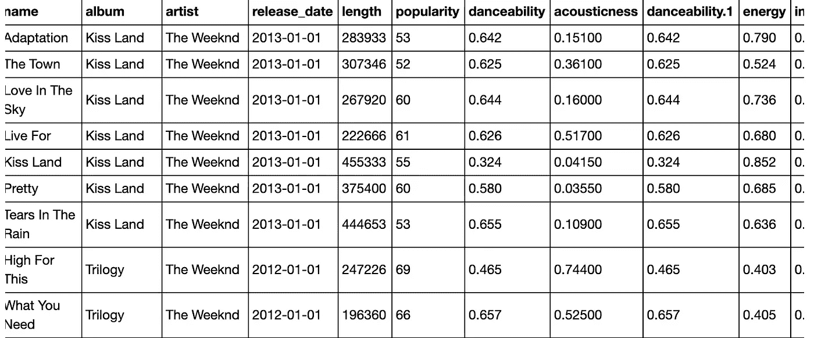
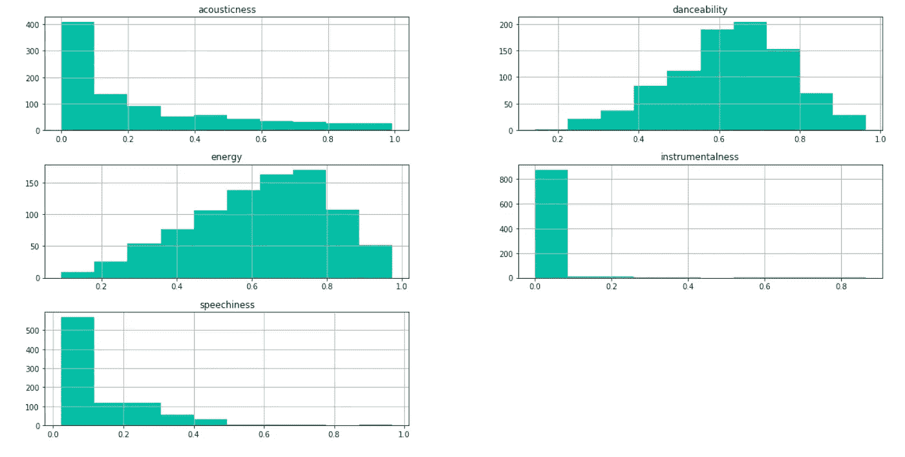
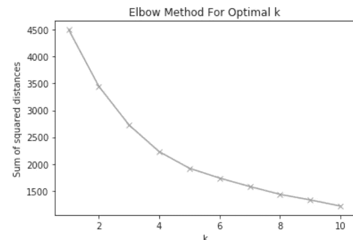
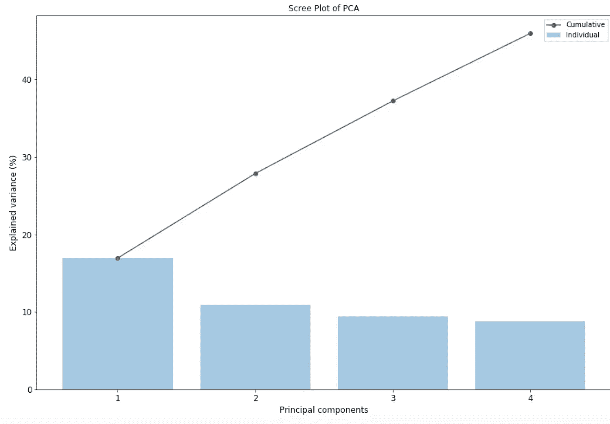
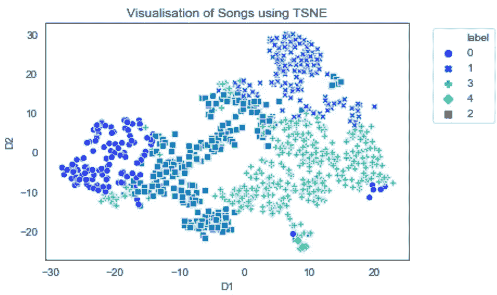
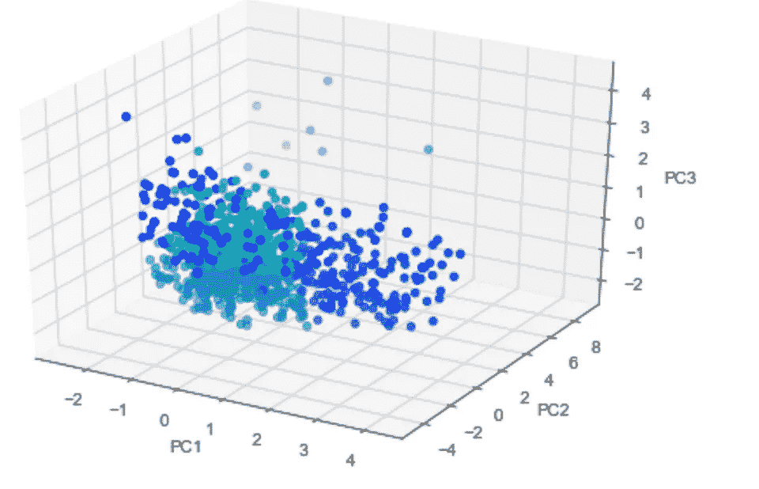
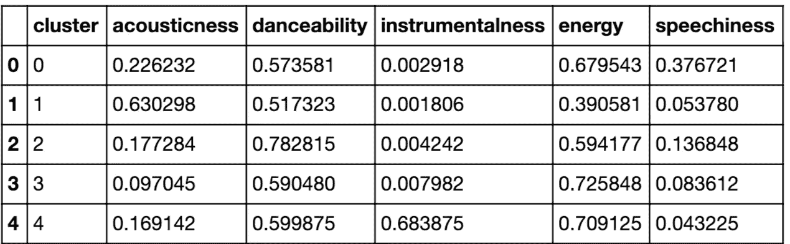
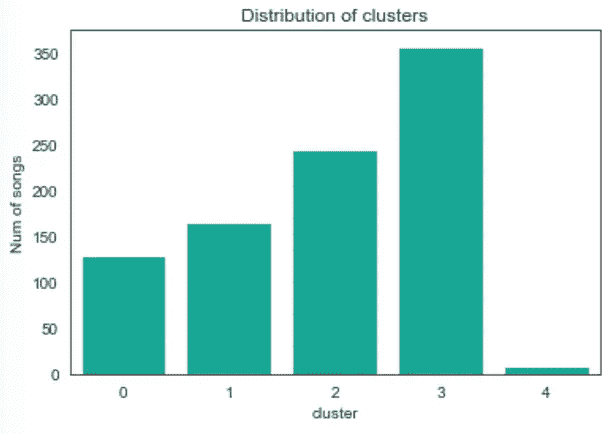
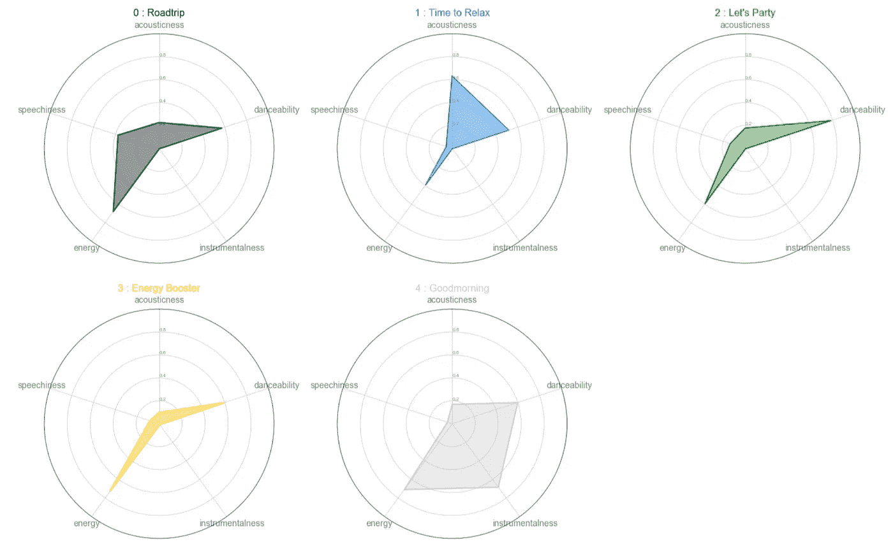

# 使用聚类分析分析 Spotify 上的歌曲

> 原文：<https://medium.com/analytics-vidhya/profiling-songs-on-spotify-using-cluster-analysis-185535598ebd?source=collection_archive---------8----------------------->

[十年十大流媒体艺人](https://newsroom.spotify.com/2019-12-03/the-top-songs-artists-playlists-and-podcasts-of-2019-and-the-last-decade/)


[来源](https://www.google.com/imgres?imgurl=http%3A%2F%2Fwww.letrascanciones.org%2Fwp-content%2Fuploads%2F2017%2F02%2FListening-to-Music-650x363.jpeg&imgrefurl=http%3A%2F%2Fwww.letrascanciones.org%2F4-reasons-listening-music-helpful-healthful%2F&docid=F6HrX2Mnz79RZM&tbnid=FOAYKOR5z2Qm1M%3A&vet=10ahUKEwipjqn214TnAhUDneAKHXWhCMoQMwiPASgLMAs..i&w=650&h=363&bih=903&biw=998&q=listening%20to%20music&ved=0ahUKEwipjqn214TnAhUDneAKHXWhCMoQMwiPASgLMAs&iact=mrc&uact=8)

众所周知，音乐是我们的通用语言。无论你是在门廊上放松，还是出去慢跑，音乐都可以让我们的心情为任何类型的任务做好准备。

虽然有许多不同类型的情绪或冒险的播放列表，但我感兴趣的是哪些元素可以用来将这些歌曲归类到不同的情绪中。在阅读了 [John Kohs 的](https://towardsdatascience.com/profiling-my-favorite-songs-on-spotify-through-clustering-33fee591783d)文章后，我受到启发，在我的项目中使用了一个无监督模型。使用 Spotify API，我能够从最近选择的十年前 10 名流媒体艺术家(德雷克、阿姆、威肯、艾德·希兰、波斯特马龙、Sia、碧昂斯、蕾哈娜、泰勒斯威夫特和爱莉安娜·格兰德)中提取歌曲，并根据他们的音频特征将他们的歌曲进行分组。

**让我们开始吧！**

# **提取数据程序:**

**设置 Spotify API**

*   [https://developer.spotify.com/](https://developer.spotify.com/)
*   登录/注册
*   转到仪表板->创建客户端 ID ->创建应用程序

**使用 Python 从播放列表中提取曲目**

*   导入库

```
**import** **spotipy**
**from** **spotipy.oauth2** **import** SpotifyClientCredentials
**import** **pandas** **as** **pd**
**import** **time**
```

*   输入凭证:客户端 id 和客户端秘密

```
spotify_client_id = ''
spotify_client_secret  = ''
client_credentials_manager = SpotifyClientCredentials(client_id=spotify_client_id, client_secret=spotify_client_secret)
sp = spotipy.Spotify(client_credentials_manager=client_credentials_manager)
```

*   从播放列表中检索每个曲目

```
**def** getPlaylistTrackIDs(user, playlist_id):
        ids = []
        playlist = sp.user_playlist(user, playlist_id)
        **for** item **in** playlist['tracks']['items']:
            track = item['track']
            ids.append(track['id'])
        **return** ids
ids = getPlaylistTrackIDs('playlist name', 'playlist id')
```

*   检索每个音轨的附加信息和特征

```
**def** getTrackFeatures(id):
    meta = sp.track(id)
    features = sp.audio_features(id)
    name = meta['name']
    album = meta['album']['name']
    artist = meta['album']['artists'][0]['name']
    release_date = meta['album']['release_date']
    length = meta['duration_ms']
    popularity = meta['popularity']
    acousticness = features[0]['acousticness']
    danceability = features[0]['danceability']
    energy = features[0]['energy']
    instrumentalness = features[0]['instrumentalness']
    liveness = features[0]['liveness']
    loudness = features[0]['loudness']
    speechiness = features[0]['speechiness']
    tempo = features[0]['tempo']
    time_signature = features[0]['time_signature']
    track = [name, album, artist, release_date, length, popularity, danceability, acousticness, danceability, energy, instrumentalness, liveness, loudness, speechiness, tempo, time_signature]
    **return** track
```

*   将轨迹导入数据集

```
*# loop over track ids to create dataset*
tracks = []
**for** i **in** range(0, len(ids)):
    time.sleep(.5)
    track = getTrackFeatures(ids[i])
    tracks.append(track)

df = pd.DataFrame(tracks, columns = ['name', 'album', 'artist', 'release_date', 'length', 'popularity', 'danceability', 'acousticness', 'danceability', 'energy', 'instrumentalness', 'liveness', 'loudness', 'speechiness', 'tempo', 'time_signature'])
df.to_csv("artist1.csv", sep = ',')
```

*   以下是数据集的示例:



[**音频功能描述**](https://developer.spotify.com/documentation/web-api/reference/tracks/get-audio-features/) **:**

*   声音:一种置信度，从 0.0 到 1.0，表示音轨是否是声音的。1.0 表示音轨是声学的高置信度。
*   可跳舞性:可跳舞性描述了一个曲目在音乐元素组合的基础上适合跳舞的程度，包括速度、节奏稳定性、节拍强度和整体规律性。
*   乐器:预测音轨是否不包含人声。
*   能量:从 0.0 到 1.0 的度量，代表强度和活动的感知度量。通常，高能轨道感觉起来很快，很响，很嘈杂。例如，死亡金属具有高能量，而巴赫前奏曲在音阶上得分较低。
*   语音:检测音轨中是否存在语音。越是类似语音的录音(例如脱口秀、有声读物、诗歌)，属性值就越接近 1.0。高于 0.66 的值描述可能完全由口语单词组成的轨道。

音频特征的分布:



每首歌也属于哪一类？

挑战:执行 [K-means 聚类](https://www.analyticsvidhya.com/blog/2019/08/comprehensive-guide-k-means-clustering/)分析，根据歌曲共享的音频特征对歌曲进行分类。目标是使同一聚类中的点彼此非常接近。

程序:

*   集群/类别的数量= 5
*   肘方法:确定使用多少个集群的替代技术



4 个集群

*   可视化我们的集群



*   使用 t 分布随机邻居嵌入(t-SNE)来可视化聚类。



*   每个集群的分布



**标记集群**

*   [十年十大流媒体艺人播放列表](https://open.spotify.com/playlist/6eUTFqDbpQkO51ilsKkVg8?si=SYI_0zLvQ_WJcsEWSWkbOQ)
*   集群 1: [公路旅行播放列表](https://open.spotify.com/playlist/0iFXC0s8nqMKvBGXCsLpR5?si=0zVyAD7dR_qpxayB8iUdVA):高度可舞性、活力和语速(抒情)
*   第二组:[放松时间](https://open.spotify.com/playlist/472Rwu3iNXCN41yUTi9efG?si=8qgr-5H2SS6NHQ-RXfLWrw):听觉、舞蹈和能量都很高
*   第三组:[让我们狂欢吧](https://open.spotify.com/playlist/3Uq0IGWpDSO5YLtYEvDVk2?si=0tBUPOWmTOSkZS10Bcpd8Q):跳舞和活力都很高
*   集群 4: [能量加速器](https://open.spotify.com/playlist/170hEWj2iCX8PdCSUXlez3?si=Gg0jy78sTAeNhZxI2VMBaw):能量最高
*   第五组:[早安](https://open.spotify.com/playlist/0bLwx8AshIUjm0ysyk7MRo?si=FU4CkgxrR8eUnF0ysjJLgw):唤醒你并让你有动力的好歌(高度的乐器感和活力)



**结论:**

[源代码](https://github.com/drucilal/Spotify2019-Dashboard)；[画面仪表盘](https://public.tableau.com/profile/drucila#!/vizhome/TopStreamedArtistsoftheDecadePlaylist_Inworks/playlist)

使用 Spotify API，我们提取了必要的数据来执行我们的分析，根据音乐共享的功能对它们进行分类。进行聚类分析。之后，我们可视化了每个集群中歌曲的分布和数量，并根据它们最流行的音频特征创建了标签。我们能够深入了解如何将这些歌曲分成不同类型的情绪和任务。