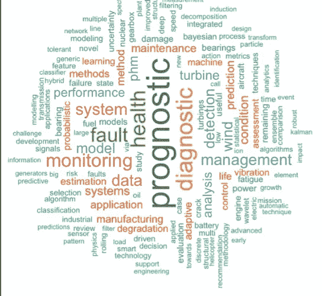
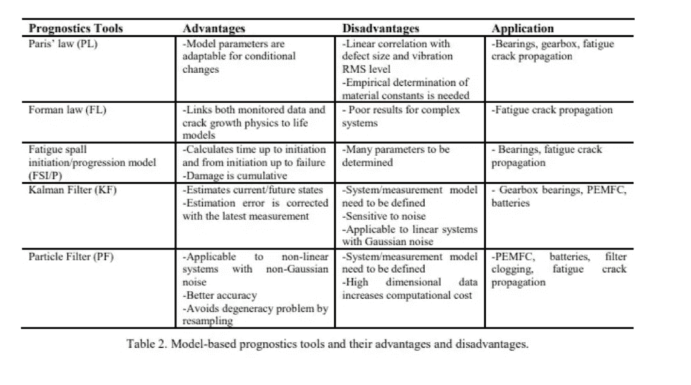
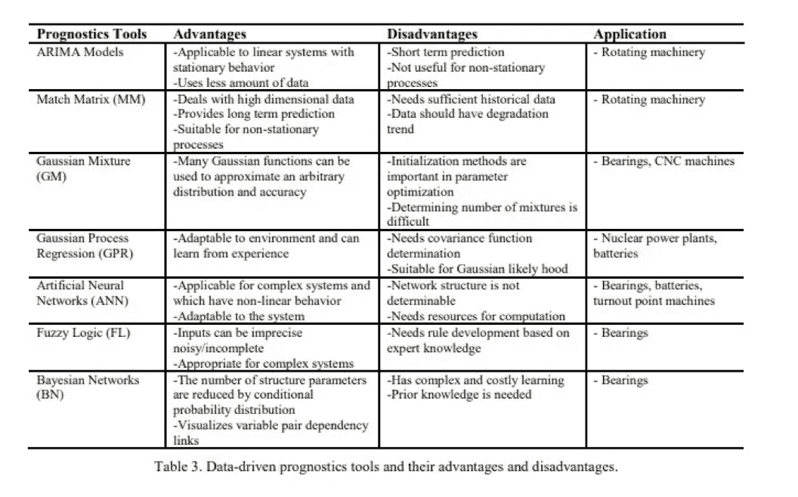
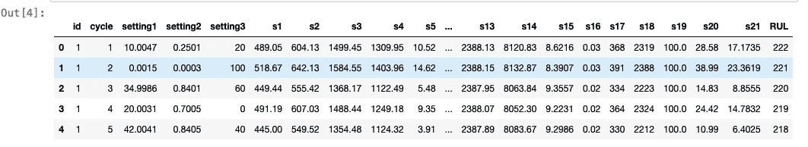
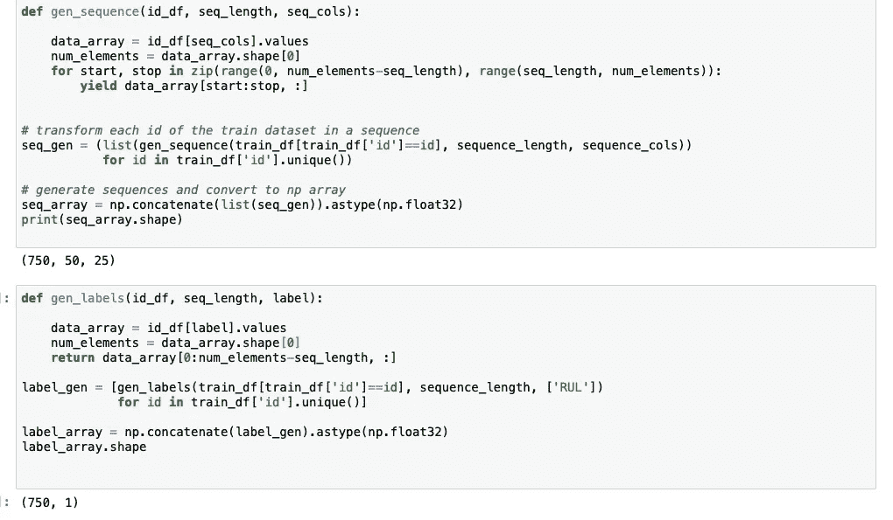
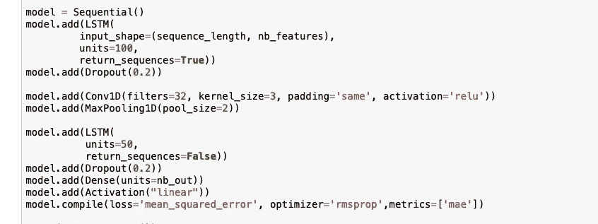
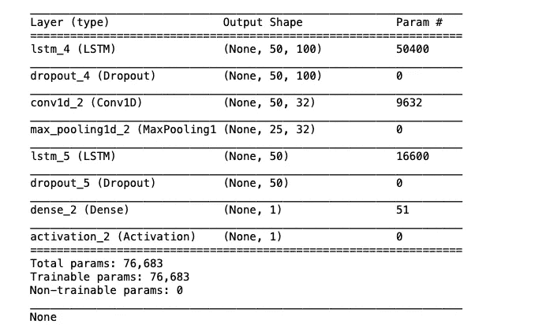
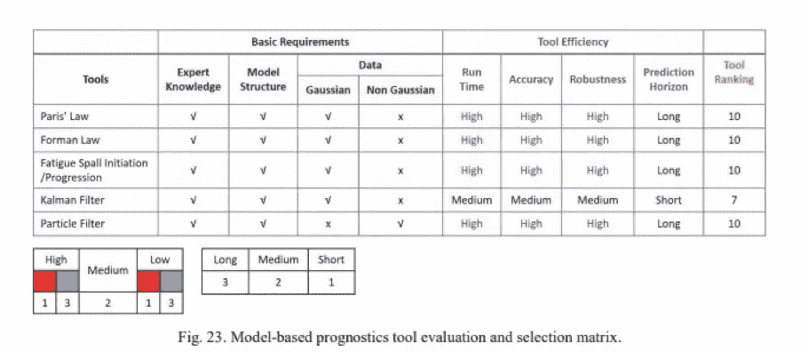
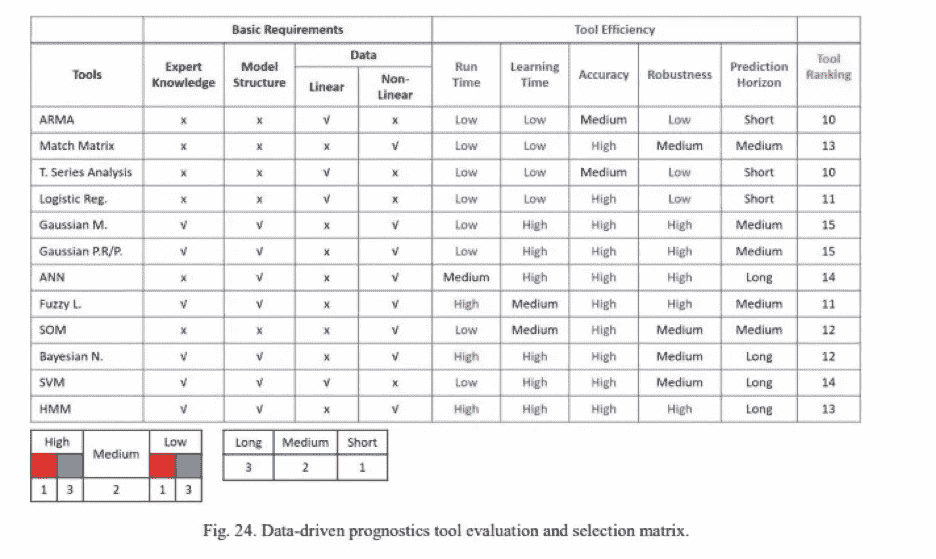

# 使用神经网络的机器预测和健康管理(PHM)

> 原文：<https://medium.com/analytics-vidhya/prognostics-and-health-management-phm-of-machines-using-neural-networks-2ddf93ba80ef?source=collection_archive---------10----------------------->

预测和健康管理(PHM)学科提供了对机器或复杂系统整体健康状态的观察，并有助于对机器维护做出正确决策。

构建健壮的 PHM 时，需要考虑三个主要问题:

*   对当前健康状态的估计，
*   预测未来状态以及故障时间，以及
*   确定故障对系统性能的影响

> 预测和诊断之间的区别在于，虽然**预测**是对**治疗**结果的猜测，但**诊断**实际上是识别问题并给它命名，如抑郁症或强迫症。

## **PHM 主要任务**

主要任务是*数据采集、数据预处理、检测、预测和决策。*

**数据采集**

数据采集是 PHM 的初始和基本步骤，PHM 被称为从被研究的物理组件/系统收集和存储数据的过程，用于进一步的诊断和预测目的。

**数据预处理**

数据预处理包括清理传感数据和从反映被监控系统健康状态的时间序列中提取特征。

**检测**

健康状态检测是从条件维护数据中检测和识别早期故障和/或异常的过程。

**预测**

预测被定义为预测组件不再执行特定功能的时间(RUL)的过程。

**决策制定**

决策是一个在几个备选方案中选择合理和/或正确的维护措施的过程。

> 如今的维护方法已经从“系统故障时修复”等传统方法转变为“基于状态的维护(CBM)”。

# **预测技术**

> 预测是指根据机器部件的当前和先前状态，评估和预测机器部件的工作状态，主要目标是准确预测机器或其部件的剩余使用寿命(RUL)。

## **基于模型的方法**

在基于模型的预测方法中，导致故障的系统/部件退化过程的行为由从物理系统中导出的数学模型和/或方程来描述。

## **数据驱动方法**

数据驱动方法试图使用通过安装的传感器收集的条件维护数据来建立退化模型，并预测未来的健康状态，而不是建立物理模型。

卷积神经网络(CNN)在从原始数据中提取位置不变或显著特征时往往优于其他模型，而递归神经网络在对序列中的单元建模方面具有主要优势。

在这里，我们将 CNN 与长短期记忆网络(LSTM，一种特殊类型的 RNN)相结合，以准确预测给定退化系统的剩余使用寿命(RUL)。

用于训练目的的数据集包含相同发动机的数据。该数据是不同传感器的自然时间序列数据，并且这些数据是从系统健康时到任何故障发生时记录的。不同的传感器，包括加速度、振动等。用于监控系统。

在预处理中，原始数据(输入特征向量)被归一化，然后作为输入馈送到 CNN，用于以 m×n 的批量进行特征提取，其中 m 是发动机的行数/寿命周期，n 是对应于不同操作设置的列数/传感器数据。

> 在提交给 LSTM 网络公司之前，这种预处理可以应用于任何 csv 文件。

将 csv 数据交给 LSTM 前的预处理

用于估计 RUL 的神经网络是

神经网络代码

使用 CNN，可以更有效地识别局部模式，因为 CNN 模型的主要假设是局部模式在任何地方都是相关的。

然后应用池层从每个特征地图中提取最重要的和固定长度的特征。然后，来自 CNN 的输出被馈送到 LSTM 层。

网络结构

该数据集的估计 RUL 的平均绝对误差为 125.79。

要查看网络中每层的中间输出，可以使用以下代码

> 将 keras.backend 作为 K 导入
> 
> lstm _ out = k . function([model . inputs[0]，
> K.learning_phase()]，
> [model.layers[5])。输出])

CNN 擅长信息编码。此外，CNN 能够压缩序列的长度，这增加了后续 LSTM 捕捉时间信息的能力。

> 一种常见的方法是离线验证物理模型，然后使用数据驱动技术进行预测，并更新参数以提高预测的准确度。

## 两种型号的选择矩阵

## **PHM 面临的挑战**

*   系统参数的不确定性。
*   系统退化模型中的不确定性。
*   故障阈值的不确定性

# 结论

我们已经看到了 PHM 中涉及的主要任务和预测中涉及的两种主要技术。通过整合 CNN 和 LSTM，我们估计了机器的 RUL。本文中的图片取自参考文献。本文使用的数据和代码可以从这里的[访问](https://github.com/maheshsai252/rul-estimation)。

感谢阅读:)

# 参考

[https://www . researchgate . net/publication/328814902 _ Deep _ Learning-Based _ Remaining _ used _ Life _ Estimation _ of _ Bearings _ Using _ Multi-Scale _ Feature _ Extraction](https://www.researchgate.net/publication/328814902_Deep_Learning-Based_Remaining_Useful_Life_Estimation_of_Bearings_Using_Multi-Scale_Feature_Extraction)

 [## 你明白预后和诊断的区别吗？

### 预后一词指的是对心理健康治疗的预期结果做出有根据的猜测，以及对心理健康治疗结果的判断。

www.verywellmind.com](https://www.verywellmind.com/prognosis-defined-2610393) 

[https://www . researchgate . net/publication/321747601 _ 预测 _ 和 _ 健康 _ 管理 _ 维护 _ 从业者-审查 _ 实施 _ 和 _ 工具 _ 评估](https://www.researchgate.net/publication/321747601_Prognostics_and_Health_Management_for_Maintenance_Practitioners-Review_Implementation_and_Tools_Evaluation)